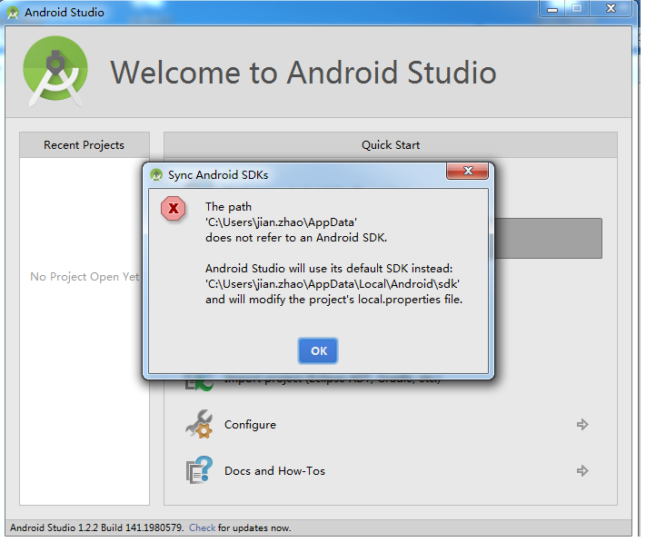
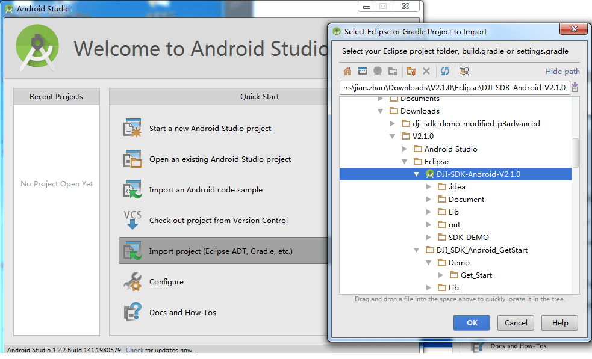
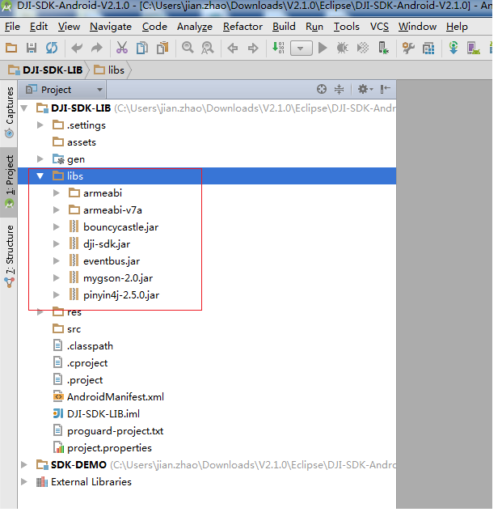
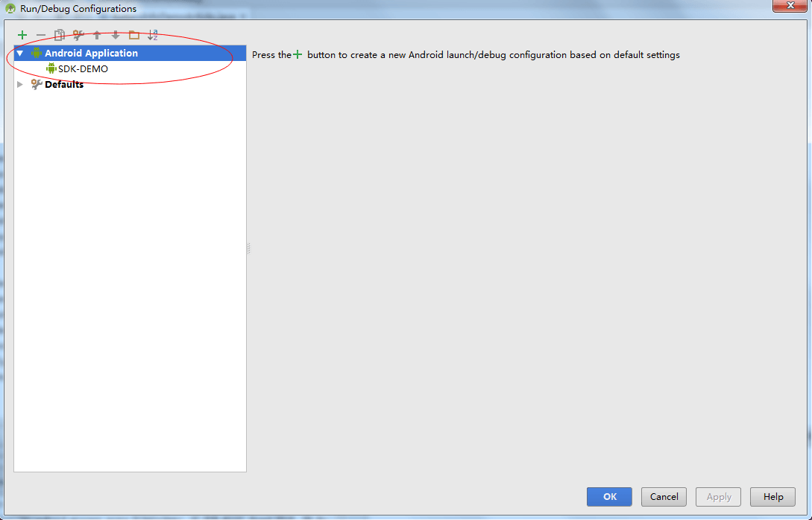
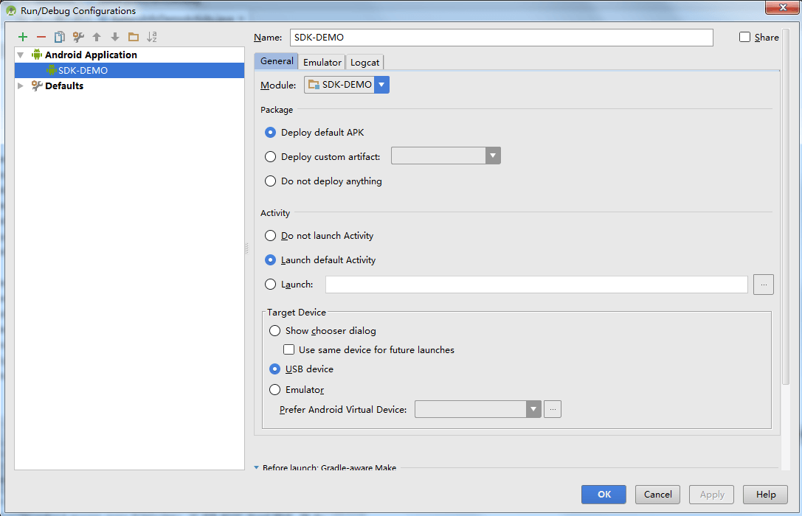

# How to Import DJI SDK Demo to Android Studio

<!-- toc -->

There are two methods we can use to import the DJI SDK Demo library into Android Studio. The first is to import the Android Studio version of the DJI SDK Demo Library to Android Studio; the second is to import the Eclipse version of the DJI SDK Demo into Android Studio.

## Importing the Android Studio Version

### 1. Downloading the DJI Android SDK
Please download DJI Android SDK: <dev.dji.com/en/products/sdk/mobile-sdk/downloads>

Unzip the downloaded package. Find the **Android Studio** folder under the path "./V2.1.0/Android Studio".

### 2. Importing the Project

There are two projects in the **Android Studio** folder: **DJI_SDK_Android_GetStart** and **DJI-SDK-Android-V2.1.0**. We will be using the **DJI-SDK-Android-V2.1.0** project.

Open Android Studio and select **Open an existing Android Studio project**. A dialog window will pop-up, asking you to select the path of the project folder. Locate **./V2.1.0/Android Studio/DJI-SDK-Android-V2.1.0** and select it to import.

 **Note:** If there is a pop-up window that reads "The path 'xxx' does not refer to an Android SDK. Android Studio will use its default SDK instead:'xxx' and will modify the project's local.properties file", please click "OK" and continue. This happens because the Android SDK path setting in the file **local.properties** needs to be revised to the path of Android SDK on your computer.
 

## Importing the Eclipse version

### 1. Downloading DJI Android SDK
Please download DJI Android SDK: <dev.dji.com/en/products/sdk/mobile-sdk/downloads>

Unzip the downloaded package. Find the **Eclipse** folder under the path "./V2.1.0/Eclipse". 

### 2. Importing the project

Open Android Studio, select **Import project(Eclipse ADT, Gradle,etc.)**. A dialog window will pop-up asking you to select the project path. Select the path "./V2.1.0/Eclipse/DJI-SDK-Android-V2.1.0" to import the DJI SDK Demo.

Click "Next" for all the remaining dialogue boxes, the default values will be fine. After you click "Finish" on the last window, you will receive a pop-up window asking you to add dependency libraries. Just click "OK".

Please confirm that in your project's DJI-SDK-LIB's folder "libs", there are the following .so libs or jars:

If the "run" icon is grayed out, you will need your edit configurations. Click "Run->Edit Configurations...", then click the plus sign "+" and select Android Application. In the settings, change the "Target Device" to "USB device" and click "OK".

Your run icon should now be green. Click it to compile and install the demo on your Android device.

