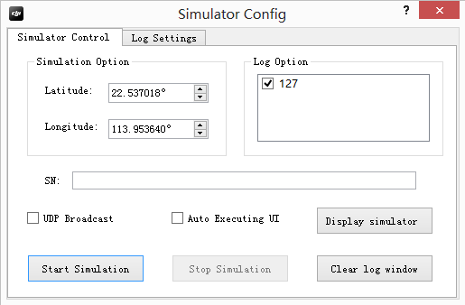
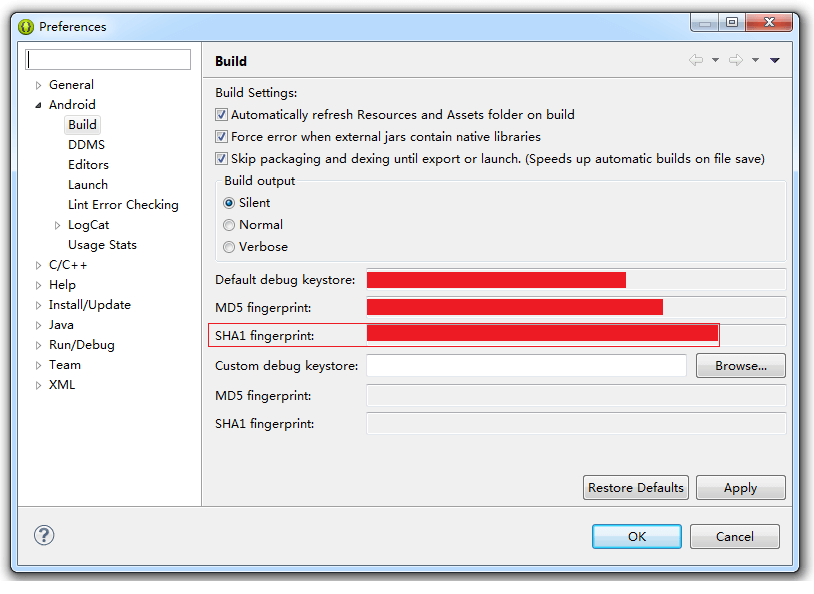
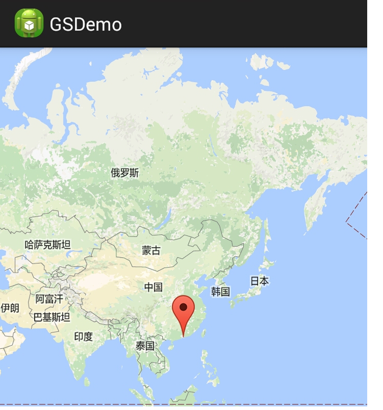
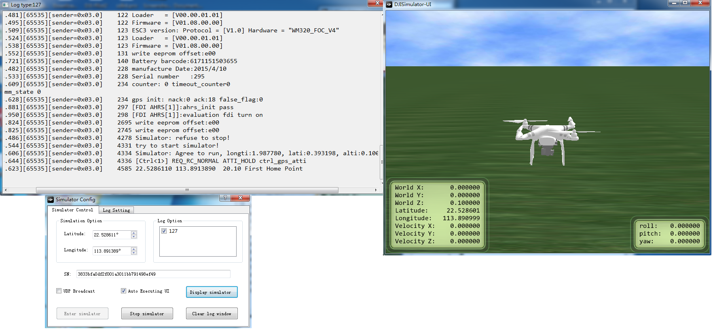
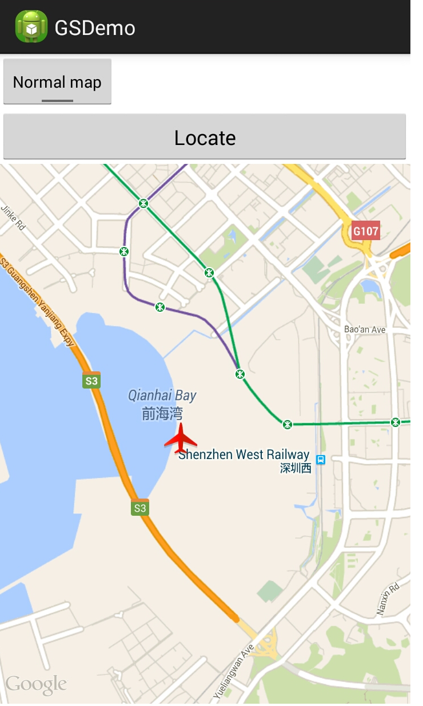
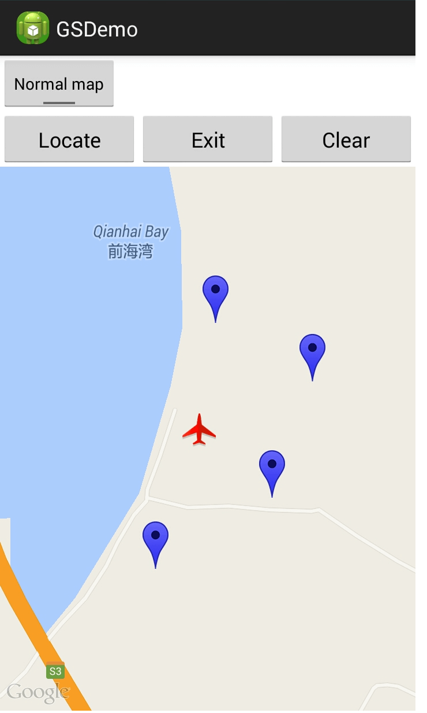
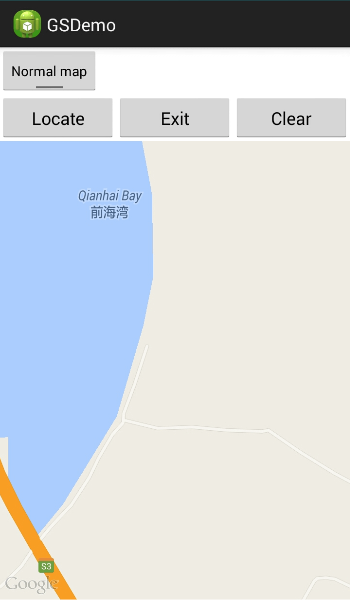

# How to create a MapView and Waypoint Application - Part 1/2

<!-- toc -->

In this tutorial, you will learn how to setup the DJI PC Simulator, update the firmware of Inspire 1, Phantom 3 Professional and Phantom 3 to its beta version, and how to test the GroundStation API with DJI PC Simulator. Also, you will get in touch with the basic process of using DJI GroundStation's Waypoint feature. So let's get started!

You can download the demo project for this tutorial from: <https://github.com/DJI-Mobile-SDK/Android-GSDemo-Part1-GoogleMap.git>

## Using the DJI PC Simulator

### 1. Introduction

The DJI PC Simulator is a flight simulator dedicated for SDK developers. The simulator creates a virtual 3D environment and transfer the flight data to the PC via the UDP protocol for data analysis purpose.

**Supported Operating Systems**: Windows 7, Windows 8 and Windows 8.1

**Supported DJI Platforms**: Matrice 100, Inspire 1, Phantom 3 Professional and Advanced

### 2. Install and setup DJI PC Simulator

Download the DJI PC Simulator installation files and WIN Driver from : <http://dev.dji.com/en/products/sdk/onboard-sdk/downloads>
- DJI PC Simulator Installer & User Manual V1.0
- WIN Driver Installer

You must install the WIN driver before installing the simulator. For Mac users, it is recommended to run the simulator in a virtual environment(e.g. VMWare or Parallels Desktop). Double click the DJI_WIN_Driver_Installer.exe  to install the windows driver. If the window prompts the following message **"Please power on MC and connect it to PC via USB!"** , ignore it and click "YES" to follow the on-screen instruction and complete the installation.

Finally, double click the **DJISimulator-Installer.exe** file and follow the on-screen instruction to complete the installation. 

### 3. How to use DJI PC Simulator
**1.** The Simulator Config window will display upon the launching of the DJI PC Simulator. Set appropriate  Latitude and Longitude values as the home point. The "SN" denotes the connected aircraft's serial number.



---
**Note**: 

- Ensure the home point is set outside of the No Fly Zone.

- Select "Show Log Window" under the "Log Settings" tag to show the flight lot as shown below:

 

---

**2**. Connect the aircraft to your PC via a Micro USB cable, and then power on the aircraft and the
remote controller. Click Display Simulator. You can see the screenshot as below:

 

---
**Note**: 

- DO NOT launch the DJI Pilot app when the DJI PC Simulator is running.

- Remove the propeller from the aircraft when using the DJI PC Simulator. 

---

**3**. Start using the simulator by clicking Start Simulation button. You can use the remote controller to change the course of the aircraft or bring it back with the Return-to-Home function. Enable API Control to allow control from a mobile or onboard device. World X, Y, Z represents the North-South, East- West, and Up-Down axes (take the North, East and Up directions as positive). 

**4**. Left-click, hold on and drag to change the view angle. Scroll to zoom in and zoom out.

 
 
 

**5**. Click Stop Simulation to stop the simulation. Close the simulator, and power off the aircraft and the remote controller after use. 

**Important**: If you want to stop midway through the GroundStation Waypoint Mission, you should click **Stop Simulation** firstly, otherwise the simulator may run the previous groundstation mission when you start it again, it may be confused.

For more info about DJI PC Simulator, please check the **DJI PC Simulator user manual.pdf** file, which you download along with the simulator.---
**Note**: 

## Upgrade the Aircraft's Firmware

Download and update the aircraft's firmware to its beta version before attempting to use the DJI Mobile SDK API.

Choose and download one of the following firmware from : <http://dev.dji.com/en/products/sdk/onboard-sdk/downloads> :

- Phantom 3 Professional Firmware (P3X_FW_V01.01.1003.bin)
- Inspire 1 Firmware (WM610_FW_V01.02.01.02.bin)

It is not required to update Remote Controller's firmware. Place the **bin** file in the SD card and insert it to the Micro USB port on the camera, and restart the aircraft and then the update process will start automatically. It may take 10 ~ 30 minutes to finish.

Verify the result via the beeping pattern from the gimbals or the blinking pattern of the camera status indicator. Refer to the table below for the beeping pattern:

- Upgrading: B B B B...
- Upgrade Success: B BB...
- Upgrade Failed: B...
- Critical Error: D D D...

Also, you can check the firmware upgrade status by checking the **txt** file generated during the upgrade process. For Phantom 3 Professional, the txt file is named as **"P3X_FW_RESULT_AB.txt"**, For Inspire 1, it's named as **"WM610_FW_RESULT_AB.txt"**, here are the example contents:

  
  
  
  
  
## Setup the Map View

### 1. Create a map view

Use map view to display waypoints and show the flight route of the aircraft when the flight task is being executed. We take Google map for an example.

Follow the setup guides in Google's official documentation <https://developers.google.com/maps/documentation/android/config>. to add a Google map in your Android application. 

(1) Install the Android SDK. 

Installed the Android SDK through the **Android SDK Manager**. Enter the **Android SDK Manager** by clicking "Window" from the menu, then clicking "Android SDK Manager".

(2) Install and set up the Google Play services SDK by referring to the setup guide presented in: <https://developers.google.com/android/guides/setup>

**The Google Maps Android API** is included in the Google Play services SDK. Install the Google Play services SDK  by **Android SDK Manager**


After the Google Play services SDK is installed, locate the library project under the ADT path "xxx/\<android-sdk>/extras/google/google_play_services/libproject/google-play-services_lib". Copy the library project to the location where you store your Android app projects.

Import the library project into your Eclipse workspace. Click **File>Import**, then select **Android>Existing Android Code into Workspace**, and access the copy of the library project to import it.

Add Google Play services library reference to your project by right clicking **Package Explorer**, then Click **Properties>Android**. Click **Add...** to add **google-play-services_lib**.

 

After Google Play services library is added as a dependency for your project. Open **manifest** file for your app and add the following tag as a child of the ** \<application>** element:

```xml
	<meta-data android:name="com.google.android.gms.version"
		android:value="@integer/google_play_services_version" />
```

You can now start using the Google Play services APIs to develop your project.

(3) Obtain API key by referring to : <https://developers.google.com/maps/documentation/android/signup>

1.Obtain App Certificate.

Obtain the **SHA-1 fingerprint** of the debug certificate or release certificate by using the command **keytool**.  Use the **SHA-1 fingerprint** for the debug certificate. When using Eclipse with ADT, you can obtain the **SHA-1 fingerprint** by selecting **Window>Preferences>Android>Build**. 



2.Register a project in the Google Developers Console and add the Google Maps Android API v2 as a service for the project.

Login the Google Developer console <https://console.developers.google.com>. Select existing or create a project. Expand **APIs & auth** on the sidebar. Then select **APIs**. Select **Enabled APIs** link in the API section to browse all of the enabled APIs. Ensure the Android API is among the list of enabled APIs. If you have not enabled it, select the API from the list of APIs, then select the Enable API button to enable the Android API. The only API you need is the **Google Maps Android API**.

3.Create an Android API key

Click the project. In the sidebar on the left, select **Credentials**. If your project doesn't already have a **Key for Android applications**, create an API key by clicking **Create New Key** and then **Android key**. In the resulting dialog, enter your app's SHA-1 fingerprint, then a semicolon(;) then your app's package name. The Google Developers Console displays a section titled **Key for Android applications** followed by your API key.


4.Add the API key to your application

In AndroidManifest.xml, add the following element as a child of \<application> element, 

```xml
	<meta-data
		android:name="com.google.android.geo.API_KEY"
		android:value="API_KEY" />
```
 
Substitute your API key for API_KEY in the value attribute. 

(4) Add the required settings to your application's manifest.

1.Specify Android permissions: specify the permissions your application needs, by adding **\<uses-permission>** elements as children of the \<manifest> element in **AndroidManifest.xml**. 

```xml
	<uses-permission android:name="android.permission.INTERNET"/>
	<uses-permission android:name="android.permission.ACCESS_NETWORK_STATE"/>
	<uses-permission android:name="android.permission.WRITE_EXTERNAL_STORAGE"/>
	<uses-permission android:name="android.permission.ACCESS_COARSE_LOCATION"/>
	<uses-permission android:name="android.permission.ACCESS_FINE_LOCATION"/>
```

For the details of description on the permissions, refer to <https://developers.google.com/maps/documentation/android/config>.

2. Requirement for OpenGL ES version 2

```xml
	<uses-feature android:glEsVersion="0x00020000" android:required="true" />
```

After the above configurations are done, now you can use the following codes to load Google map.

First, add the following xml codes in the app's layout where you want to load the map(In our demo, it is **activity_gsdemo.xml**):

```xml
	...
	<fragment
		android:id="@+id/map"
		android:layout_width="match_parent"
		android:layout_height="match_parent"
		class="com.google.android.gms.maps.SupportMapFragment" />
	...
```
 
Second, add the following codes in your Activity.

```java
	import android.os.Bundle;
	import android.support.v4.app.FragmentActivity;
	import com.google.android.gms.maps.CameraUpdateFactory;
	import com.google.android.gms.maps.GoogleMap;
	import com.google.android.gms.maps.OnMapReadyCallback;
	import com.google.android.gms.maps.SupportMapFragment;
	import com.google.android.gms.maps.model.LatLng;
	import com.google.android.gms.maps.model.MarkerOptions;
	
	...
	
	public class GSDemoActivity extends FragmentActivity implements OnMapClickListener, OnMapReadyCallback{
		private GoogleMap aMap;
		
		...
		
		@Override
		protected void onCreate(Bundle savedInstanceState){
			super.onCreate(savedInstanceState);
			setContentView(R.layout.activity_gsdemo);
			SupportMapFragment mapFragment=(SupportMapFragment) getSupportFragmentManager().findFragmentById(R.id.map);
			mapFragment.getMapAsync(this);
		
		...
		
		}
		
		...
		
		@Override
		public void onMapReady(GoogleMap googleMap){
			if(aMap == null){
				aMap = googleMap;
				...
			}
			
			LatLng Shenzhen = new LatLng(22.5500, 114.1000);
			googleMap.addMarker(new MarkerOptions().position(Shenzhen).title("Marker in Shenzhen"));
			googleMap.moveCamera(CameraUpdateFactory.newLatLng(Shenzhen));
		}
		
		...
		
	}
```

**Note:** As class can only extend one parent class, hence, GSDemoActivity can not extend DemoBaseActivity as it has already extended FragmentActivity. Here we add **ServiceManager.getInstance().pauseService(false);** in GSDemoActivity's callback **onResume**, and add **ServiceManager.getInstance().pauseService(true);** in GSDemoActivity's callback **onPause**.

```java
	 @Override
    protected void onResume(){
        super.onResume();
        DJIDrone.getDjiMC().startUpdateTimer(1000); // Start the update timer for MC to update info
        ServiceManager.getInstance().pauseService(false);
    }
    
    @Override
    protected void onPause(){
        super.onPause();
        DJIDrone.getDjiMC().stopUpdateTimer(); // Stop the update timer for MC to update info
        ServiceManager.getInstance().pauseService(true);
    }
```

Now you can see your app loading a Google map by following the instructions to enable developer options on your Android device, connect your device to the computer through USB cable, build and run your app. The loading of the Google map will require your Android device having installed the Google Play service.



 
### 2. Locate the Aircraft

When Google map is successfully loaded. You can then use a marker on the map to show the loacation of the aircraft based on the coordinates provided by **droneLocationLatitude**, **droneLocationLongitude** in **DJIMainControllerSystemState**. Implement **private void updateDroneLocation()** function to update the location of the aircraft.

Implement **public interface DJIMcuUpdateStateCallBack** interface to obtain the location of the aircraft.
We set up this interface in MainController module of DJI SDK using **public void setMcuUpdateStateCallBack(DJIMcuUpdateStateCallBack mCallBack)**. Then we update the marker that shows the aircraft's location on the map. 
Code example are listed as below:

```java
	// Update the drone location based on states from MCU.
    private void updateDroneLocation(){
        // Set the McuUpdateSateCallBack
        mMcuUpdateStateCallBack = new DJIMcuUpdateStateCallBack(){

            @Override
            public void onResult(DJIMainControllerSystemState state) {
                droneLocationLat = state.droneLocationLatitude;
                droneLocationLng = state.droneLocationLongitude;
                Log.e(TAG, "drone lat "+state.droneLocationLatitude);
                Log.e(TAG, "drone lat "+state.homeLocationLatitude);
                Log.e(TAG, "drone lat "+state.droneLocationLongitude);
                Log.e(TAG, "drone lat "+state.homeLocationLongitude);
            }     
        };
        Log.e(TAG,"setMcuUpdateState");
        DJIDrone.getDjiMC().setMcuUpdateStateCallBack(mMcuUpdateStateCallBack);
        
        // The following codes show the aircraft location on the map using a marker
        LatLng pos = new LatLng(droneLocationLat, droneLocationLng);
        //Create MarkerOptions object
        final MarkerOptions markerOptions = new MarkerOptions();
        markerOptions.position(pos);
        markerOptions.icon(BitmapDescriptorFactory.fromResource(R.drawable.aircraft));
        
        runOnUiThread(new Runnable() {
            @Override
            public void run() {
                if (droneMarker != null) {
                    droneMarker.remove();
                }
             
                droneMarker = aMap.addMarker(markerOptions);
            }
          });
    } 
```

We will call this function after initiating the SDK APIs and calling **DJIDrone.connectToDrone()**. Please note that when calling the SDK APIs for the aircraft's modules are only possible after the activation is completed. We call the above function after the **checkPermission** returns 0:

```java
	new Thread(){
            public void run() {
                try {
                    DJIDrone.checkPermission(getApplicationContext(), new DJIGerneralListener() {
                        
                        @Override
                        public void onGetPermissionResult(int result) {
                            // TODO Auto-generated method stub
                            if (result == 0) {
                                handler.sendMessage(handler.obtainMessage(SHOWDIALOG, DJIError.getCheckPermissionErrorDescription(result)));
                                updateDroneLocation(); // Obtain the drone's lat and lng from MCU.
                            } else {
                                handler.sendMessage(handler.obtainMessage(SHOWDIALOG, getString(R.string.demo_activation_error)+DJIError.getCheckPermissionErrorDescription(result)+"\n"+getString(R.string.demo_activation_error_code)+result));
                        
                            }
                        }
                    });
                } catch (Exception e) {
                    e.printStackTrace();
                }
            }
        }.start();
```

To update the Main Controller system state, we still need to call the **public boolean startUpdateTimer(int interval)** in the callback **onResume**. We can pause timer for updating by calling **public boolean stopUpdateTimer()** in the callback **onPause**.

```java
    @Override
    protected void onResume(){
        super.onResume();
        DJIDrone.getDjiMC().startUpdateTimer(1000); // Start the update timer for MC to update info
        ServiceManager.getInstance().pauseService(false);
    }
    
    @Override
    protected void onPause(){
        super.onPause();
        DJIDrone.getDjiMC().stopUpdateTimer(); // Stop the update timer for MC to update info
        ServiceManager.getInstance().pauseService(true);
    }
```

When we open the app, the function **updateDroneLocation()** will be called after the key activation.

Meanwhile, we implement a button "Locate" on UI. When users click the button, the function **updateDroneLocation()** will be called again.

To implement the button "Locate", first, add a Button view in the **activity_gsdemo.xml** 

```xml

	...
	
	<LinearLayout
		android:layout_width="match_parent"
		android:layout_height="wrap_content"
		android:orientation="horizontal">
		
		<Button
			android:id="@+id/locate"
			android:layout_width="match_parent"
			android:layout_height="wrap_content"
			android:text="Locate"
			android:layout_weight="1"/>
	
	...
	
	</LinearLayout>
	
	...
	
``` 
Second, add **OnClickListener** Interface in the activity(**GSDemoActivity** in the demo example). The activity implements the interface **public class GSDemoActivity extends ... implements OnClickListener ...**, and implements the code for the method **public void onClick(View v)**,

```
	@Override
	public void onClick(View v) {
		switch(v.getId()){
			case R.id.locate:{
				updateDroneLocation();
				cameraUpdate(); //
				break;
			}
			...
			default:
				break; 
		}	
		
	}	
	
```

Third, register the "Locate" button in the activity

```java
	private Button locate;
	
	...
	
	@Override
	protected void onCreate(Bundle savedInstanceState){
		...
		locate = (Button) findViewById(R.id.locate);
		...
		locate.setOnClickListener(this);
		... 
	}
```

Build and run the app to check the location function. Connect to aircraft to the computer through a USB cable and Launch the DJI PC simulator:



Click the "locate" button, the following GUI prompt to show the location of the aircraft in the map.



### 3. Add and clear the waypoints

It is critical to enable user to add waypoints in Ground Station intuitively. We will then demonstrate how to add waypoints on the map. Place a "Add" button. Whenever we click button "add", a switch variable "isAdd" will turn into "true", and the text of the button shown as "Exit". We have now entered waypoints adding mode: Click and add the desirable location in the map as a waypoint. A marker will be displayed on the map to shows that a new waypoint has been added. Click "Exit" button to exit waypoint adding mode when you have placed all the desirable waypoints in the map. The listener for clicking map is shown as follows:

```java
	 @Override
    public void onMapClick(LatLng point) {
    	if (isAdd == true){
    		markWaypoint(point);
    		DJIGroundStationWaypoint mDJIGroundStationWaypoint = new DJIGroundStationWaypoint(point.latitude, point.longitude);
    		mGroundStationTask.addWaypoint(mDJIGroundStationWaypoint);
    		//Add waypoints to Waypoint arraylist;
    	}else{
    		// Do not add waypoint;
    	}
    		
    }
```

When we click on the map, the codes within the **public void onMapClick(LatLng point)** will be executed. an instance of **DJIGroundStationWaypoint** will be created and added to **mGroundStationTask**.



We add the "clear" button to clear all the added waypoints. All the markers on the map will be erased and all waypoints will be removed from **mGroundStationTask**.

```java
	 @Override
    public void onClick(View v) {
        // TODO Auto-generated method stub
        switch (v.getId()) {
			  
			  ...
            
            case R.id.clear:{
                runOnUiThread(new Runnable(){
                    @Override
                    public void run() {
                        aMap.clear();
                    }
                    
                });            
                mGroundStationTask.RemoveAllWaypoint(); // Remove all the waypoints added to the task
                break;
            }
			  
			  ...
			  
        }
    }

```




## Summary

You have mastered how to setup and use the DJI PC Simulator to test your Ground Station app, how to upgrade your  firmware to the developer version, and how to use the DJI Mobile SDK to create a simple MapView, modify annotations of map view, checking the aircraft on the map view by simulate the GPS data from DJI PC Simulator, etc. That covers much of the ground.

In the next tutorial, we will implement the basic functions of Waypoints in GroundStation. Your aircraft will fly automatically on the map view based on the waypoints you set. Please follow our part 2 of this tutorial, hope you will enjoy it!
