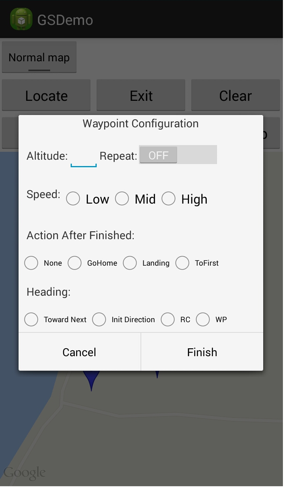

#  How to create a simple GroundStation App

## Part 2/2

In this tutorial, you will learn how to implement the basic processes of using Waypoints in the GroundStation.  Waypoint is a complicated feature and commonly used in GroundStation. If you haven't read Part 1 of this tutorial, please take a look at it here before moving forward. Let's get started!

You can download the demo project for this tutorial from here: <https://github.com/DJI-Mobile-SDK/Android-GSDemo-Part2-GoogleMap.git>

### 1. Configure the added waypoints and the DJIGroundStationTask

In Part 1 of this tutorial, the project's code structure was simple and not robust. In order to develop it further in this tutorial, it will need to be re-factored and we will need to add more UI elements. 

Here, as a simple example, we just show how to configure the waypoints. Users can developer their own codes to set up the waypoint sequentially. 

We first add a new button "Config". When users click the button, a new configuration dialog will be popped up. 



We use a dialog to load the configuration setting view. The settings include the altitude of waypoints, whether to repeat the task, the horizontal speed of the aircraft during the task, the action after the task finished, the heading of the aircraft during the task (altitude and speed is a field of class **DJIGroundStationWaypoint**. Here we set all the waypoints' altitude or speed the same as a simple example. Users can also set different values for different waypoints' altitude or speed). We do not show the codes for the dialog here. When users click "Finish" after inputting a value or selecting an option for each item, the following function will be called to set the fields of **DJIGroundStationTask** and **DJIGroundStationWaypoint**:

```java
	    private void configGroundStationTask(){
        mGroundStationTask.isLoop = repeatGSTask;
        mGroundStationTask.finishAction=actionAfterFinishTask;
        mGroundStationTask.movingMode = heading;
        for (int i=0; i<mGroundStationTask.wayPointCount; i++){
            mGroundStationTask.getWaypointAtIndex(i).speed = speedGSTask;
            mGroundStationTask.getWaypointAtIndex(i).altitude = altitude;
        }
    }
```

### 2. Upload the task to the aircraft

We have configured the **DJIGroundStationTask**. However, the task is currently stored on the mobile device. We need to upload the task to the aircraft before imitate the task. Click "Upload" button to upload the task to aircraft. The following function will be executed when "Upload" button is clicked:

```java
	   private void uploadGroundStationTask(){
        DJIDrone.getDjiGroundStation().openGroundStation(new DJIGroundStationExecuteCallBack(){

            @Override
            public void onResult(GroundStationResult result) {
                // TODO Auto-generated method stub
                String ResultsString = "return code =" + result.toString();
                handler.sendMessage(handler.obtainMessage(SHOWTOAST, ResultsString));
                
                if (result == GroundStationResult.GS_Result_Successed) {
                    DJIDrone.getDjiGroundStation().uploadGroundStationTask(mGroundStationTask, new DJIGroundStationExecuteCallBack(){
    
                        @Override
                        public void onResult(GroundStationResult result) {
                            // TODO Auto-generated method stub
                            String ResultsString = "return code =" + result.toString();
                            handler.sendMessage(handler.obtainMessage(SHOWTOAST, ResultsString));
                        }
                        
                    });
                }
            }
            
        });
    }
```

We first need to call **public void openGroundStation(final DJIGroundStationExecuteCallBack mCallBack)** to initialized the Ground Station function, and when the Ground Station function is initialized successfully (the callback returns **GroundStationResult.GS_Result_Successed**), then the function **public void uploadGroundStationTask(final DJIGroundStationTask task, final DJIGroundStationExecuteCallBack mCallBack)** will be executed.


**Important:** It is possible that you will come across **GroundStationResult.GS_Result_Rc_Control_Mode_Error** when using the Ground Station. The root cause is that the flight mode switch on the remote contorller is not set to the "F" position. You will then need to toggle the switch to "F" position and upload the waypoints agin before using the Ground Station.  

If the flight mode switch is at "F" position when the aircraft is powered on, the user must toggle back and forth between F and another position and then have an uploading of waypoints.


When all waypoints are uploaded successfully , the DJI PC Simulator log will prompt "received mission length xx from app". 


### 3. Start and stop the DJIGroundStationTask

After uploading the task to the aircraft, execute the **DJIGroundStationTask**. When the  "Start" button is clicked, the following codes will be executed, in which the function **public void startGroundStationTask(final DJIGroundStationTakeOffCallBack mCallBack)** will be called.

```java
	    private void startGroundStationTask(){
        DJIDrone.getDjiGroundStation().startGroundStationTask(new DJIGroundStationTakeOffCallBack(){

            @Override
            public void onResult(GroundStationTakeOffResult result) {
                // TODO Auto-generated method stub
                String ResultsString = "return code =" + result.toString();
                handler.sendMessage(handler.obtainMessage(SHOWTOAST, ResultsString));
            }
        });
    }
```


The DJIGroundStationTask can be stopped during execution by calling function **public void pauseGroundStationTask(final DJIGroundStationHoverCallBack mCallBack)** to pause the task, after the pausing the task, use **public void closeGroundStation(final DJIGroundStationExecuteCallBack mCallBack)** to close the Ground Station function.

```java
	    private void stopGroundStationTask(){
        DJIDrone.getDjiGroundStation().pauseGroundStationTask(new DJIGroundStationHoverCallBack(){

            @Override
            public void onResult(GroundStationHoverResult result) {
                // TODO Auto-generated method stub
                String ResultsString = "return code =" + result.toString();
                handler.sendMessage(handler.obtainMessage(SHOWTOAST, ResultsString));
                
                DJIDrone.getDjiGroundStation().closeGroundStation(new DJIGroundStationExecuteCallBack(){

                    @Override
                    public void onResult(GroundStationResult result) {
                        // TODO Auto-generated method stub
                        String ResultsString = "return code =" + result.toString();
                        handler.sendMessage(handler.obtainMessage(SHOWTOAST, ResultsString));
                    }

                });
            }
        });
        mGroundStationTask.RemoveAllWaypoint();
    }
``` 

### 4. Where To Go From Here?

In this tutorial, you have learned how to configure both **DJIGroundStationWaypoint** and **DJIGroundStationTask**. Moreover, you have now mastered how to manipulate waypoints and task by using **DJIGroundStationTask** and **DJIInspireGroundStation**.

Congratulations! Now that you have finished the demo project, you can build on what you've learned and start to build your own ground station application. You can improve the way waypoints that are added(such as drawing a line on the map and generating waypoints automatically), play around with the properties of a waypoint (such as heading, horizontal speed, etc.), and adding more functionality. In order to make a cool ground station application, you still have a long way to go. Good luck and hope you that enjoy this tutorial.
