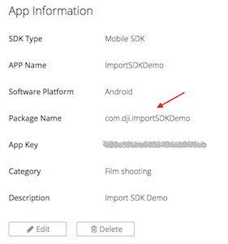
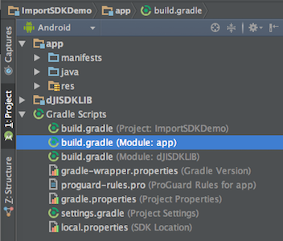
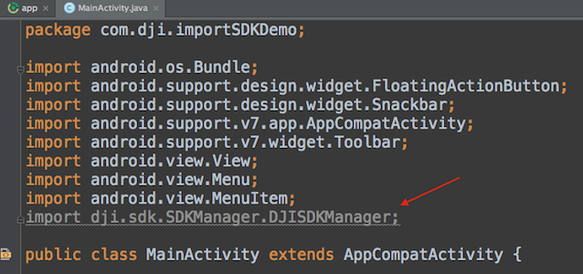
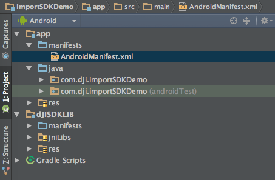
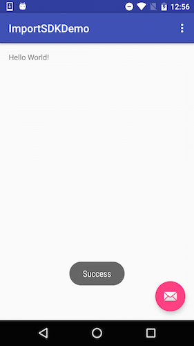

# Importing and Activating DJI SDK in Android Studio Project

*If you come across any mistakes or bugs in this tutorial, please let us know using a Github issue, a post on the DJI forum. Please feel free to send us Github pull request and help us fix any issues. However, all pull requests related to document must follow the [document style](https://github.com/dji-sdk/Mobile-SDK-Tutorial/issues/19)*

---

In this tutorial, we will use the Android Studio's HelloWorld template project to show you how to import DJI Android SDK and register the application.

## Creating an Android Studio Project

 Open Android Studio and select **Start a new Android Studio project** to create a new project.

   
 Then enter the **Application name** as "ImportSDKDemo". Next enter the **Company Domain** and **Package Name** you want and select the **Project location** path to store the project.

  Here we use "com.dji.importSDKDemo" for both Company Domain and Package name.
  

> **Important:** The **Package Name** you enter here should be the same as the "Package Name" of the App Information you apply in DJI Developer Website. 
> 
> 
> 
> For more details of applying for an DJI App, please check this link for details: <https://developer.dji.com/mobile-sdk/get-started/Register-Download/>
 
  Press "Next" button to continue and set the mimimum SDK version as `API 19: Android 4.4 (KitKat)` for "Phone and Tablet" and press Next. 
  

  Then select "Blank Activity" and press Next. Lastly, leave the **Activity Name** as "MainActivity", the **Layout Name** as "activity_main", the **Title** as "MainActivity", and the **Menu Resource Name** as "menu_main". Press "Finish" to create the project.
  
## Downloading and Importing Module to the Project

  You can download DJI Android SDK from [DJI Developer Website](https://developer.dji.com/mobile-sdk/downloads), 

  Unzip the Android SDK package, go to **File -> New -> Import Module** on the top bar of Android Studio. Then enter the "API Library" folder location of the downloaded Android SDK package in the **Source directory** field. A "dJISDKLib" name will show in the "Module name" field. Press Next and finish button to finish the settings.
 
 

## Configurating the Gradle File

Double click on the "build.gradle(Module: app)" in the project navigator to open it:

Then replace the content with the following:

~~~xml
apply plugin: 'com.android.application'

android {
    compileSdkVersion 23
    buildToolsVersion "23.0.2"

    defaultConfig {
        applicationId "com.dji.importSDKDemo"
        minSdkVersion 19
        targetSdkVersion 22  // 1 <------------
        versionCode 1
        versionName "1.0"
    }
    buildTypes {
        release {
            minifyEnabled false
            proguardFiles getDefaultProguardFile('proguard-android.txt'), 'proguard-rules.pro'
        }
    }
}

dependencies {
    compile fileTree(dir: 'libs', include: ['*.jar'])
    testCompile 'junit:junit:4.12'
    compile 'com.android.support:appcompat-v7:23.3.0'
    compile project(':dJISDKLIB')  // 2 <------------
}
~~~

Here we modify two things:

1. In order to run our SDK on a Marshmallow device (6.0 and API 23), we need to set the compile and target SDK version to 23 and since we are not able to get the SDK based app(s) to consistently work on API 23 device, let us stay with API 22 and lower.

2. Add `compile project(':dJISDKLIB')` at the end of "dependencies" part. This is where we configure the Android Studio Project dependencies.

Then, select the **Tools -> Android -> Sync Project with Gradle Files** on the top bar of Android Studio and wait for Gradle project sync finish.

Lastly, right click on the "app" module in the project navigator and click "Open Module Settings" to open the Project Struture window. 

Select "app" Modules and navigate to the "Dependencies" tab, you should find the "dJISDKLIB" appear in the list. Your SDK environmental setup should be ready now!

## Trying to use Android SDK in the Project

Now, let's double click to open the MainActivity.java file in the `com.dji.importSDKDemo` package from the project navigator area.

Then add `import dji.sdk.SDKManager.DJISDKManager;` at the bottom of the import classes section as shown below:
 
~~~java
package com.dji.importSDKDemo;

import android.os.Bundle;
import android.support.design.widget.FloatingActionButton;
import android.support.design.widget.Snackbar;
import android.support.v7.app.AppCompatActivity;
import android.support.v7.widget.Toolbar;
import android.view.View;
import android.view.Menu;
import android.view.MenuItem;
import dji.sdk.SDKManager.DJISDKManager;
~~~

  Wait for a few seconds and check if the `import dji.sdk.SDKManager.DJISDKManager;` line turn red, if it remains gray color, it means that you import DJI Android SDK to your Android Studio project successfully. Here is the status you should see if everything goes well:
  

  Congratulations, now you should be able to use DJI Android SDK in your Android Studio Project!
  
### Registering the Application

After you finish the above steps, let's register our application with the **App Key** you apply from DJI Developer Website. If you are not familiar with the App Key, please check [Creating an DJI App Tutorial](http://developer.dji.com/mobile-sdk/get-started/Register-Download).

#### Configurating the AndroidManifest.xml

Let's double click the AndroidManifest.xml file in the project navigator to open it:

Then add the following elements code on top of the "application" element:

~~~xml
<!-- Permissions and features -->
<uses-sdk
        android:minSdkVersion="19"
        android:targetSdkVersion="21" />

    <uses-permission android:name="android.permission.VIBRATE" />
    <uses-permission android:name="android.permission.INTERNET" />
    <uses-permission android:name="android.permission.ACCESS_WIFI_STATE" />
    <uses-permission android:name="android.permission.WAKE_LOCK" />
    <uses-permission android:name="android.permission.ACCESS_COARSE_LOCATION" />
    <uses-permission android:name="android.permission.ACCESS_NETWORK_STATE" />
    <uses-permission android:name="android.permission.ACCESS_FINE_LOCATION" />
    <uses-permission android:name="android.permission.CHANGE_WIFI_STATE" />
    <uses-permission android:name="android.permission.MOUNT_UNMOUNT_FILESYSTEMS" />
    <uses-permission android:name="android.permission.WRITE_EXTERNAL_STORAGE" />
    <uses-permission android:name="android.permission.READ_EXTERNAL_STORAGE" />
    <uses-permission android:name="android.permission.SYSTEM_ALERT_WINDOW" />
    <uses-permission android:name="android.permission.READ_PHONE_STATE" />

    <uses-feature android:name="android.hardware.camera" />
    <uses-feature android:name="android.hardware.camera.autofocus" />
    <uses-feature
        android:name="android.hardware.usb.host"
        android:required="false" />
    <uses-feature
        android:name="android.hardware.usb.accessory"
        android:required="true" />
<!-- Permissions and features -->
~~~

Here, we request permissions that the application must be granted in order for it to register DJI SDK correctly. Also we declare the camera and usb hardwares which is used by the application.

Moreover, let's add the following elements as childs of **<application>** element as shown below:

~~~xml
<!-- DJI SDK -->
        <uses-library android:name="com.android.future.usb.accessory" />
        <meta-data
            android:name="com.dji.sdk.API_KEY"
            android:value="Please enter your App Key here." />
        <activity
            android:name="dji.sdk.SDKManager.DJIAoaControllerActivity"
            android:theme="@android:style/Theme.Translucent" >
            <intent-filter>
                <action android:name="android.hardware.usb.action.USB_ACCESSORY_ATTACHED" />
            </intent-filter>
            <meta-data
                android:name="android.hardware.usb.action.USB_ACCESSORY_ATTACHED"
                android:resource="@xml/accessory_filter" />
        </activity>
        <service android:name="dji.sdk.SDKManager.DJIGlobalService" >
        </service>
<!-- DJI SDK -->
~~~

In the code above, you should substitude your **App Key** of the application for "Please enter your App Key here." in the **value** attribute under the `android:name="com.dji.sdk.API_KEY"` attribute. 

Finally, once you finish all the configurations for AndroidManifest.xml file, you should see the following content:

~~~xml
<?xml version="1.0" encoding="utf-8"?>
<manifest xmlns:android="http://schemas.android.com/apk/res/android"
    package="com.dji.importSDKDemo">

    <!-- Permissions and features -->
    <uses-sdk
        android:minSdkVersion="19"
        android:targetSdkVersion="21" />

    <uses-permission android:name="android.permission.VIBRATE" />
    <uses-permission android:name="android.permission.INTERNET" />
    <uses-permission android:name="android.permission.ACCESS_WIFI_STATE" />
    <uses-permission android:name="android.permission.WAKE_LOCK" />
    <uses-permission android:name="android.permission.ACCESS_COARSE_LOCATION" />
    <uses-permission android:name="android.permission.ACCESS_NETWORK_STATE" />
    <uses-permission android:name="android.permission.ACCESS_FINE_LOCATION" />
    <uses-permission android:name="android.permission.CHANGE_WIFI_STATE" />
    <uses-permission android:name="android.permission.MOUNT_UNMOUNT_FILESYSTEMS" />
    <uses-permission android:name="android.permission.WRITE_EXTERNAL_STORAGE" />
    <uses-permission android:name="android.permission.READ_EXTERNAL_STORAGE" />
    <uses-permission android:name="android.permission.SYSTEM_ALERT_WINDOW" />
    <uses-permission android:name="android.permission.READ_PHONE_STATE" />

    <uses-feature android:name="android.hardware.camera" />
    <uses-feature android:name="android.hardware.camera.autofocus" />
    <uses-feature
        android:name="android.hardware.usb.host"
        android:required="false" />
    <uses-feature
        android:name="android.hardware.usb.accessory"
        android:required="true" />

    <!-- Permissions and features -->

    <application
        android:allowBackup="true"
        android:icon="@mipmap/ic_launcher"
        android:label="@string/app_name"
        android:supportsRtl="true"
        android:theme="@style/AppTheme">

        <!-- DJI SDK -->
        <uses-library android:name="com.android.future.usb.accessory" />
        <meta-data
            android:name="com.dji.sdk.API_KEY"
            android:value="Please enter your App Key here." />
        <activity
            android:name="dji.sdk.SDKManager.DJIAoaControllerActivity"
            android:theme="@android:style/Theme.Translucent" >
            <intent-filter>
                <action android:name="android.hardware.usb.action.USB_ACCESSORY_ATTACHED" />
            </intent-filter>
            <meta-data
                android:name="android.hardware.usb.action.USB_ACCESSORY_ATTACHED"
                android:resource="@xml/accessory_filter" />
        </activity>
        <service android:name="dji.sdk.SDKManager.DJIGlobalService" >
        </service>
        <!-- DJI SDK -->
        
        <activity
            android:name=".MainActivity"
            android:label="@string/app_name"
            android:theme="@style/AppTheme.NoActionBar">
            <intent-filter>
                <action android:name="android.intent.action.MAIN" />

                <category android:name="android.intent.category.LAUNCHER" />
            </intent-filter>
        </activity>
    </application>

</manifest>
~~~

#### Implementing Application Registration

After you finish the steps above, open the **MainActivity.java** file and replace the code with the following content:

~~~java
package com.dji.importSDKDemo;

import android.content.Intent;
import android.os.Bundle;
import android.os.Handler;
import android.os.Looper;
import android.support.design.widget.FloatingActionButton;
import android.support.design.widget.Snackbar;
import android.support.v7.app.AppCompatActivity;
import android.support.v7.widget.Toolbar;
import android.util.Log;
import android.view.View;
import android.view.Menu;
import android.view.MenuItem;
import android.widget.Toast;

import dji.sdk.SDKManager.DJISDKManager;
import dji.sdk.base.DJIBaseComponent;
import dji.sdk.base.DJIBaseProduct;
import dji.sdk.base.DJIError;
import dji.sdk.base.DJISDKError;

public class MainActivity extends AppCompatActivity {

    private static final String TAG = MainActivity.class.getName();

    public static final String FLAG_CONNECTION_CHANGE = "dji_sdk_connection_change";

    private static DJIBaseProduct mProduct;

    private Handler mHandler;

    @Override
    protected void onCreate(Bundle savedInstanceState) {
        super.onCreate(savedInstanceState);
        setContentView(R.layout.activity_main);
        Toolbar toolbar = (Toolbar) findViewById(R.id.toolbar);
        setSupportActionBar(toolbar);

        FloatingActionButton fab = (FloatingActionButton) findViewById(R.id.fab);
        fab.setOnClickListener(new View.OnClickListener() {
            @Override
            public void onClick(View view) {
                Snackbar.make(view, "Replace with your own action", Snackbar.LENGTH_LONG)
                        .setAction("Action", null).show();
            }
        });

        //Initialize DJI SDK Manager
        mHandler = new Handler(Looper.getMainLooper());
        DJISDKManager.getInstance().initSDKManager(this, mDJISDKManagerCallback);
    }

    /*
     *  Implement DJISDKManager Callback methods
     */
    private DJISDKManager.DJISDKManagerCallback mDJISDKManagerCallback = new DJISDKManager.DJISDKManagerCallback() {

        @Override
        public void onGetRegisteredResult(DJIError error) {
            Log.d(TAG, error == null ? "success" : error.getDescription());
            if(error == DJISDKError.REGISTRATION_SUCCESS) {
                DJISDKManager.getInstance().startConnectionToProduct();
                Handler handler = new Handler(Looper.getMainLooper());
                handler.post(new Runnable() {

                    @Override
                    public void run() {
                        Toast.makeText(getApplicationContext(), "Success", Toast.LENGTH_LONG).show();
                    }
                });
            } else {
                Handler handler = new Handler(Looper.getMainLooper());
                handler.post(new Runnable() {

                    @Override
                    public void run() {
                        Toast.makeText(getApplicationContext(), "register sdk fails, check if network is available", Toast.LENGTH_LONG).show();
                    }
                });

            }
            Log.e("TAG", error.toString());
        }

        @Override
        public void onProductChanged(DJIBaseProduct oldProduct, DJIBaseProduct newProduct) {

            mProduct = newProduct;
            if(mProduct != null) {
                mProduct.setDJIBaseProductListener(mDJIBaseProductListener);
            }

            notifyStatusChange();
        }
    };

    /*
     *  Implement DJIBaseProductListener methods
     */
    private DJIBaseProduct.DJIBaseProductListener mDJIBaseProductListener = new DJIBaseProduct.DJIBaseProductListener() {

        @Override
        public void onComponentChange(DJIBaseProduct.DJIComponentKey key, DJIBaseComponent oldComponent, DJIBaseComponent newComponent) {
            if(newComponent != null) {
                newComponent.setDJIComponentListener(mDJIComponentListener);
            }
            notifyStatusChange();
        }

        @Override
        public void onProductConnectivityChanged(boolean isConnected) {
            notifyStatusChange();
        }

    };

    private DJIBaseComponent.DJIComponentListener mDJIComponentListener = new DJIBaseComponent.DJIComponentListener() {

        @Override
        public void onComponentConnectivityChanged(boolean isConnected) {
            notifyStatusChange();
        }

    };

    private void notifyStatusChange() {
        mHandler.removeCallbacks(updateRunnable);
        mHandler.postDelayed(updateRunnable, 500);
    }

    private Runnable updateRunnable = new Runnable() {

        @Override
        public void run() {
            Intent intent = new Intent(FLAG_CONNECTION_CHANGE);
            sendBroadcast(intent);
        }
    };

    @Override
    public boolean onCreateOptionsMenu(Menu menu) {
        // Inflate the menu; this adds items to the action bar if it is present.
        getMenuInflater().inflate(R.menu.menu_main, menu);
        return true;
    }

    @Override
    public boolean onOptionsItemSelected(MenuItem item) {
        // Handle action bar item clicks here. The action bar will
        // automatically handle clicks on the Home/Up button, so long
        // as you specify a parent activity in AndroidManifest.xml.
        int id = item.getItemId();

        //noinspection SimplifiableIfStatement
        if (id == R.id.action_settings) {
            return true;
        }

        return super.onOptionsItemSelected(item);
    }

}
~~~

  Here, we implement several features:
  
1. We initialize the DJISDKManager and Handler in the `onCreate()` method.
2. Implement the two interface methods of DJISDKManagerCallback. We can use the `onGetRegisteredResult()` method to check the Application registration status and show text message here. Using the `onProductChanged()` method, we can check the product connection status and invoke the `notifyStatusChange()` method to notify status changes.
3. Implement the two interface methods of DJIBaseProductListener. We can use the `onComponentChange()` method to check if a component object changes. Using the `onProductConnectivityChanged()` method to check the connectivity status changes for the base product.

Now let's build and run the project and install it to your Android device. If everything goes well, you should see the "success" textView like the following screenshot when you register the app successfully.

> **Important:** Please check if the "armeabi-v7a" lib folder has been added to your jnLibs folder in **dJISDKLib** successfully before testing resgistering the app. 
> 
> 
  
## Where to go from here?
  
  If you want to learn how to use DJI Android SDK to create a simple app, please check this tutorial: [**Creating a Camera Application**](https://github.com/DJI-Mobile-SDK/Android-FPVDemo). It’s our introductory tutorial, which guides you through connecting to your aircraft's camera to displaying a live video feed in your app, through which you can take photos and videos.