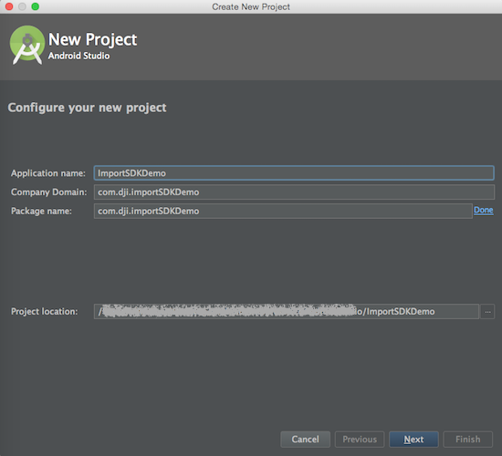
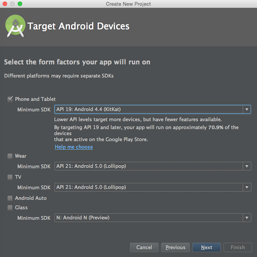
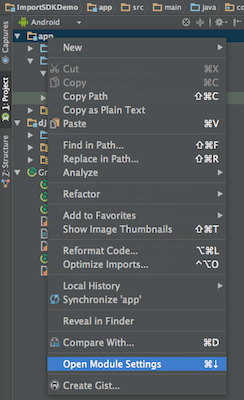

# Importing DJI SDK to Android Studio Project

<!-- toc -->

*If you come across any mistakes or bugs in this tutorial, please let us know using a Github issue, a post on the DJI forum. Please feel free to send us Github pull request and help us fix any issues. However, all pull requests related to document must follow the [document style](https://github.com/dji-sdk/Mobile-SDK-Tutorial/issues/19)*

---

   You can download the demo project from this [Github Page](https://github.com/DJI-Mobile-SDK/Android-ImportSDKToAndroidStudio).

## Creating an Android Studio Project

 Open Android Studio and select **Start a new Android Studio project** to create a new project.

   
 Then enter the **Application name** as "ImportSDKDemo". Next enter the **Company Domain** and **Package Name** you want and select the **Project location** path to store the project.

  Here we use "com.dji.importSDKDemo" for both Company Domain and Package name.
  

> **Important:** The **Package Name** you enter here should be the same as the "Package Name" of the App Information you apply in DJI Developer Website. 
> 
> 
> 
> For more details of applying for an DJI App, please check this link for details: <https://developer.dji.com/mobile-sdk/get-started/Register-Download/>
 
  Press "Next" button to continue and set the mimimum SDK version as `API 19: Android 4.4 (KitKat)` for "Phone and Tablet" and press Next. 
  

  Then select "Empty Activity" and press Next. Lastly, leave the **Activity Name** as "MainActivity", and the **Layout Name** as "activity_main". Press "Finish" to create the project.
  
## Downloading and Importing Module to the Project

  You can download DJI Android SDK from [DJI Developer Website](https://developer.dji.com/mobile-sdk/downloads), 

  Unzip the Android SDK package, go to **File -> New -> Import Module** on the top bar of Android Studio. Then enter the "API Library" folder location of the downloaded Android SDK package in the **Source directory** field. A "dJISDKLib" name will show in the "Module name" field. Press Next and finish button to finish the settings.
 
 

## Configurating the Gradle File

Double click on the "build.gradle(Module: app)" in the project navigator to open it:

Then replace the content with the following:

~~~xml
apply plugin: 'com.android.application'

android {
    compileSdkVersion 23
    buildToolsVersion "23.0.2"

    defaultConfig {
        applicationId "com.dji.importSDKDemo"
        minSdkVersion 19
        targetSdkVersion 22  // 1
        versionCode 1
        versionName "1.0"
    }
    buildTypes {
        release {
            minifyEnabled false
            proguardFiles getDefaultProguardFile('proguard-android.txt'), 'proguard-rules.pro'
        }
    }
}

dependencies {
    compile fileTree(dir: 'libs', include: ['*.jar'])
    testCompile 'junit:junit:4.12'
    compile 'com.android.support:appcompat-v7:23.3.0'
    compile project(':dJISDKLIB')  // 2
}
~~~

Here we modify two things:

1. Modify the "targetSdkVersion" to **22**, if you want to use the SDK in Android 6.0 Marshmallow, you must set this "targetSdkVersion" to **22** or lower.

2. Add `compile project(':dJISDKLIB')` at the end of "dependencies" part. This is where we configure the Android Studio Project dependencies.

Then, select the **Tools -> Android -> Sync Project with Gradle Files** on the top bar of Android Studio and wait for Gradle project sync finish.

Lastly, right click on the "app" module in the project navigator and click "Open Module Settings" to open the Project Struture window. 

Select "app" Modules and navigate to the "Dependencies" tab, you should find the "dJISDKLIB" appear in the list. Your SDK environmental setup should be ready now!

## Trying to use Android SDK in the Project

Now, let's double click to open the MainActivity.java file in the `com.dji.importSDKDemo` package from the project navigator area.

Then add `import dji.sdk.SDKManager.DJISDKManager;` at the bottom of the import classes section as shown below:
 
~~~java
package com.dji.importSDKDemo;

import android.support.v7.app.AppCompatActivity;
import android.os.Bundle;
import dji.sdk.SDKManager.DJISDKManager;
~~~

  Wait for a few seconds and check if the `import dji.sdk.SDKManager.DJISDKManager;` line turn red, if it remains gray color, it means that you import DJI Android SDK to your Android Studio project successfully. Here is the status you should see if everything goes well:
  

  Congratulations, now you should be able to use DJI Android SDK in your Android Studio Project!
  
## Where to go from here?
  
  If you want to learn how to use DJI Android SDK to create a simple app, please check this tutorial: [**Creating a Camera Application**](https://github.com/DJI-Mobile-SDK/Android-FPVDemo). It’s our introductory tutorial, which guides you through connecting to your aircraft's camera to displaying a live video feed in your app, through which you can take photos and videos.