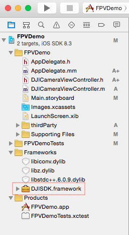
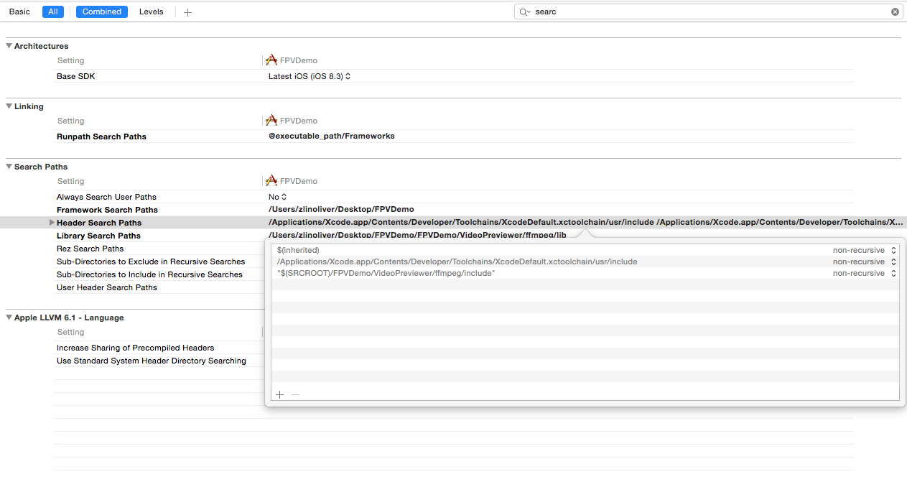

# Creating a Camera Application

<!-- toc -->

*If you come across any mistakes or bugs in this tutorial, please let us know using a Github issue, a post on the DJI forum, or commenting in the Gitbook. Please feel free to send us Github pull request and help us fix any issues. However, all pull requests related to document must follow the [document style](https://github.com/dji-sdk/Mobile-SDK-Tutorial/issues/19)*

---

This tutorial is designed for you to gain a basic understanding of the DJI Mobile SDK. It will implement the FPV view and two basic camera functionalities: **Take Photo** and **Record video**.

   You can download the entire project for this tutorial from this [Github Page](https://github.com/DJI-Mobile-SDK/iOS-FPVDemo).
   
   We use Phantom 3 Professional as an example to make this demo.
   
## Download the SDK

You can download the latest iOS SDK from here: <https://developer.dji.com/mobile-sdk/downloads/>

The development package includes:

- SDK demo project (This includes implementation of main features such as camera, flightController, gimbal control, etc)
- Documentations
- Framework

Minimum Requirement: iOS 8.0 or above

## Import the SDK framework

**1**. Copy the framework **DJISDK.framework** from the **Lib** folder and copy the file to your Xcode project folder, then drag the framework to the Frameworks folder in Xcode’s project navigator as shown below:

   
   
**2**. Select the project target, in this case **FPVDemo**, and go to **Build Phases -> Link Binary With Libraries**. Click the "+" button at the bottom and add two libraries to your project: libstdc++.6.0.9.tbd and libz.tbd. These two libraries are necessay to compile the SDK framework.

**3**. **Important**: If you want to enable your app to connect to the MFI remote controller, like Inspire 1, Phantom 3 Professional, etc. MFI communications support is required.

   Go to project's info.plist file in **Supporting Files** folder, add the MFI protocol names as shown below:
  
   
   
**4**. Since in iOS 9, App Transport Security has blocked a cleartext HTTP (http://) resource load since it is insecure. You must add **App Transport Security Settings** items in the info.plist file as shown below:

   

## Implement the First Person View

 **1**. We use the FFMPEG decoding library (found at http://ffmpeg.org) to decode the video stream. You can find the **VideoPreviewer** folder in the downloaded SDK. Copy the entire **VideoPreviewer** folder to your Xcode project's folder and then add it to the Xcode project navigator, as shown below:
  
 
 
 **2**. Go to **XCode -> Project -> Build Phases -> Link Binary With Libraries** and add the **libiconv.tbd** library. Then, set the **Header Search Paths** in **Build Settings** to the path for the **~/include** folder in the **FFMPEG** folder. Then, set the **Library Search Paths** to the path for the **~/lib** folder in the **FFMPEG** folder, as shown below:
 
  
  
  
  
 **3**. In **Main.storyboard**, add a new View Controller and call it **DJICameraViewController**. Set **DJICameraViewController** as the root View Controller for the new View Controller you just added in **Main.storyboard**:
  
  
  
Add a UIView inside the View Controller and set it as an IBOutlet called "**fpvPreviewView**". Then, add two UIButtons and one UISegmentedControl at the bottom of the View Control and set their IBOutlets and IBActions, as shown below:
  
  
  
  Go to **DJICameraViewController.m** file and import the **DJISDK** and **VideoPreviewer** header files. Then implement two delegate protocols as shown below:
  
~~~objc
#import <DJISDK/DJISDK.h>
#import "VideoPreviewer.h"

@interface DJICameraViewController ()<DJICameraDelegate, DJISDKManagerDelegate>

~~~
 **4**. In the **viewDidAppear** method, set **fpvPreviewView** instance as a view of **VideoPreviewer** to show the Video Stream and reset it to nil in the **viewWillDisappear** method:
 
~~~objc
- (void)viewDidAppear:(BOOL)animated
{
    [super viewWillAppear:animated];
    [[VideoPreviewer instance] setView:self.fpvPreviewView];
}

- (void)viewWillDisappear:(BOOL)animated
{
    [super viewWillDisappear:animated];
    [[VideoPreviewer instance] setView:nil];   
}
~~~

  Moreover, implement the **DJISDKManagerDelegate** method to fetch a camera object and set its delegate as shown below:
  
~~~objc

- (DJICamera*) fetchCamera {

    if (![DJISDKManager product]) {
        return nil;
    }
    
    if ([[DJISDKManager product] isKindOfClass:[DJIAircraft class]]) {
        return ((DJIAircraft*)[DJISDKManager product]).camera;
    }

    return nil;
}

-(void) sdkManagerProductDidChangeFrom:(DJIBaseProduct* _Nullable) oldProduct to:(DJIBaseProduct* _Nullable) newProduct
{
    __weak DJICamera* camera = [self fetchCamera];
    if (camera) {
        [camera setDelegate:self];
    }
}
~~~

  Firstly, we create the `- (DJICamera*) fetchCamera` method to fetch the latest camera object. Since the camera component of the aircraft may be changed or disconnected, we need to fetch the camera object everytime we want to use it to ensure we get the correct camera object. 
  
  Next, the delegate method will be called when the DJISDKManager's "product" property changed. We need to check if the newProduct object is kind of **DJIAircraft** class. Then set the camera object's delegate.
        
  Lastly, implement the **DJICameraDelegate** methods, as shown below:
  
~~~objc

#pragma mark - DJICameraDelegate
-(void)camera:(DJICamera *)camera didReceiveVideoData:(uint8_t *)videoBuffer length:(size_t)size
{
    uint8_t* pBuffer = (uint8_t*)malloc(size);
    memcpy(pBuffer, videoBuffer, size);
    [[VideoPreviewer instance].dataQueue push:pBuffer length:(int)size];
}

-(void) camera:(DJICamera*)camera didUpdateSystemState:(DJICameraSystemState*)systemState
{
    
}

~~~
   -(void)camera:(DJICamera *)camera didReceiveVideoData:(uint8_t *)videoBuffer length:(size_t)size method is used to send the video stream to **VideoPreviewer** to decode.
   
   -(void) camera:(DJICamera*)camera didUpdateSystemState:(DJICameraSystemState*)systemState method is used to get the camera state from the camera on your aircraft. It will be called frequently, so you can update your user interface or camera settings accordingly here.
 
## Activate the SDK

Let's create a new method named **registerApp** and invoke it in the viewDidAppear method as shown below:

~~~objc
- (void)registerApp
{
    NSString *appKey = @"Enter Your App Key Here";
    [DJISDKManager registerApp:appKey withDelegate:self];
}

- (void)viewDidAppear:(BOOL)animated
{
    [super viewWillAppear:animated];
    [[VideoPreviewer instance] setView:self.fpvPreviewView];
    [self registerApp];
}
~~~
---
**Note**: In the code above, you will need to obtain an App Key from the DJI Developer website **(<http://developer.dji.com/en/user/apps>)** and you can learn how to create an App from [here](http://developer.dji.com/mobile-sdk/get-started/Register-Download).

The **App Key** we generate for you is associated with the Xcode project **Bundle Identifier**, so you will not be able to use the same App Key in a different Xcode project. Each project must be submitted individually and will receive a unique App Key.

---

If you register the app failed, you can check the **error** variable in the following delegate method to figure out the problem. For more details, please check the DJISDKRegistrationError in "NSError+DJISDK.h" file. Now let's implement the delegate method:

~~~objc

- (void)showAlertViewWithTitle:(NSString *)title withMessage:(NSString *)message
{
    UIAlertController *alert = [UIAlertController alertControllerWithTitle:title message:message preferredStyle:UIAlertControllerStyleAlert];
    UIAlertAction *okAction = [UIAlertAction actionWithTitle:@"OK" style:UIAlertActionStyleDefault handler:nil];
    [alert addAction:okAction];
    [self presentViewController:alert animated:YES completion:nil];
}

- (void)sdkManagerDidRegisterAppWithError:(NSError *)error
{
    NSString* message = @"Register App Successed!";
    if (error) {
        message = @"Register App Failed! Please enter your App Key and check the network.";
    }else
    {
        NSLog(@"registerAppSuccess");
    
        [DJISDKManager startConnectionToProduct];
        [[VideoPreviewer instance] start];
    }
    
    [self showAlertViewWithTitle:@"Register App" withMessage:message];
}
~~~

In the code above, we invoke the **startConnectionToProduct** method of DJISDKManager to start connecting to the aircraft and call the **start** method of **VideoPreviewer**'s instance to start the video decode when we register the app successfully. Finally, we create a UIAlertView to inform the register app state to the user.

**3**. Build and Run the project in Xcode. If everything is OK, you will see a "Register App Successed!" alert once the application loads. 
  
  

## Connect the Aircraft
After you finish the steps above, you can now connect your mobile device to your DJI Aircraft to use the application, like checking the FPV View. Here are the guidelines:

* In order to connect to a DJI Inspire 1, Phantom 3 Professional or Phantom 3 Advanced:

  **1**. First, turn on your remote controller.
  
  **2**. Then, turn on the power of the DJI aircraft.
  
  **3**. Connect your iOS device to the remote controller using the lightning cable.
  
  **4**. Trust the device if an alert asking “Do you trust this device” comes up.
  
  **5**. Now you will be able to view the live video stream from your aircraft's camera based on what we've finished of the application so far!
  
## Enjoy the First Person View

If you can see the live video stream in the application, congratulations! Let's move forward.

  

## Implement the Capture function

Add the following codes to the **captureAction** IBAction method:

~~~objc
- (IBAction)captureAction:(id)sender {
    
    __weak DJICameraViewController *weakSelf = self;
    __weak DJICamera* camera = [self fetchCamera];
    if (camera) {
        [camera startShootPhoto:DJICameraShootPhotoModeSingle withCompletion:^(NSError * _Nullable error) {
            if (error) {
                [weakSelf showAlertViewWithTitle:@"Take Photo Error" withMessage:error.description];
            }
        }];
    }

}
~~~
   Just call the following method of **DJICamera**:
   
`- (void)startShootPhoto:(DJICameraShootPhotoMode)shootMode withCompletion:(DJICompletionBlock)block;`
   
  There are 6 types of **DJICameraShootPhotoMode**: 
  
~~~objc
/**
 *  Camera work mode ShootPhoto itself can have several modes. The default value is DJICameraShootPhotoModeSingle.
 */
typedef NS_ENUM (NSUInteger, DJICameraShootPhotoMode){
    /**
     *  Sets the camera to take a single photo.
     */
    DJICameraShootPhotoModeSingle,
    /**
     *  Sets the camera to take a HDR photo.
     *  Currently, X5 does not support HDR mode.
     */
    DJICameraShootPhotoModeHDR,
    /**
     *  Set the camera to take multiple photos at once.
     */
    DJICameraShootPhotoModeBurst,
    /**
     *  Automatic Exposure Bracketing (AEB) capture. In this mode you can
     *  quickly take multiple shots (the default is 3) at different exposures
     *  without having to manually change any settings between frames.
     */
    DJICameraShootPhotoModeAEB,
    /**
     *  Sets the camera to take a picture (or multiple pictures) continuously at a set time interval.
     *  The minimum interval for JPEG format of any quality is 2s.
     *  The minimum interval for Raw or Raw+JPEG format is 10s.
     */
    DJICameraShootPhotoModeInterval,
    /**
     *  Sets the camera to take a picture (or multiple pictures) continuously at a set time interval.
     *  The camera will merge the photo sequence and the output is a video.
     *  The minimum interval for Video only format is 1 s.
     *  The minimum interval for Video+Photo format is 2 s.
     *  Supported only by OSMO camera.
     */
    DJICameraShootPhotoModeTimeLapse
};
~~~
  
  These enum values give you mutiple ways to shoot photos, **DJICameraShootPhotoModeSingle** is easy to use because you do not need to set any param before calling **startShootPhoto** method. 
  
  For more infos, please check the **DJICamera.h** and **DJICameraSettingsDef.h** files.

  Here we set the shootMode to **DJICameraShootPhotoModeSingle**. You can check the shoot photo result from the **NSError** instance in the completion block.
  
  Build and run your project and then try the capture function. If the screen flash after your press the **capture** button, your capture fuction should work.
  
  
## Implement the Record function
  
### 1. Switching Camera Mode
   Before we implementing the record function, we need to switch the camera work mode firstly.
   
   Let's check the **DJICameraSettingsDef.h** file.
   
~~~objc
/**
 *  Camera work modes.
 */
typedef NS_ENUM (NSUInteger, DJICameraMode){
    /**
     *  Capture mode. In this mode, the user can capture pictures.
     */
    DJICameraModeShootPhoto = 0x00,
    /**
     *  Record mode. In this mode, the user can record videos.
     */
    DJICameraModeRecordVideo = 0x01,
    /**
     *  Playback mode. In this mode, the user can preview photos and videos, and
     *  they can delete files.
     *
     *  Not supported by OSMO, Phantom 3 Standard.
     */
    DJICameraModePlayback = 0x02,
    /**
     *  In this mode, user can download media to Mobile Device.
     *
     *  Supported by Phantom 3 Professional, Phantom 3 Advanced, Phantom 3 Standard, X3.
     */
    DJICameraModeMediaDownload = 0x03,
    
    /**
     *  The camera work mode is unknown.
     */
    DJICameraModeUnknown = 0xFF
};
~~~

   You can see from above that there are 5 types of **DJICameraMode**. Here we use the first two types.
   
   Now, open the **Main.storyboard** and add an IBOutlet for the UISegmented Control called "changeWorkModeSegmentControl". 
   
   We can update the state of the segmented control when switching between **CameraWorkModeCapture** and **CameraWorkModeRecord** using the previous delegate method like this:
   
~~~objc
-(void) camera:(DJICamera*)camera didUpdateSystemState:(DJICameraSystemState*)systemState
{        

    //Update UISegmented Control's state
    if (systemState.mode == DJICameraModeShootPhoto) {
        [self.changeWorkModeSegmentControl setSelectedSegmentIndex:0];
    }else if (systemState.mode == DJICameraModeRecordVideo){
        [self.changeWorkModeSegmentControl setSelectedSegmentIndex:1];
    } 
}

~~~
 Now we can implement the **changeWorkModeAction** method as follows:
 
~~~objc

- (IBAction)changeWorkModeAction:(id)sender {
    
    __weak DJICameraViewController *weakSelf = self;
    UISegmentedControl *segmentControl = (UISegmentedControl *)sender;
    
    __weak DJICamera* camera = [self fetchCamera];
    
    if (camera) {
        
        if (segmentControl.selectedSegmentIndex == 0) { //Take photo
            
            [camera setCameraMode:DJICameraModeShootPhoto withCompletion:^(NSError * _Nullable error) {
                if (error) {
                    [weakSelf showAlertViewWithTitle:@"Set DJICameraModeShootPhoto Failed" withMessage:error.description];
                }
                
            }];
            
        }else if (segmentControl.selectedSegmentIndex == 1){ //Record video
            
            [camera setCameraMode:DJICameraModeRecordVideo withCompletion:^(NSError * _Nullable error) {
                if (error) {
                    [weakSelf showAlertViewWithTitle:@"Set DJICameraModeRecordVideo Failed" withMessage:error.description];
                }
                
            }];
            
        }
    }
    
}

~~~
 Here we add two UIAlertViews to get a warning when the user set CameraWorkMode failed.
 
### 2. Add Record Action

  Firstly, we need a BOOL variable to save the status of the record action and a UILabel to show the current record time. So let's go to **Main.storyboard** and drag a UILabel on top of the screen, set up the Autolayout for it and create an IBOutlet named "**currentRecordTimeLabel**" to the **DJICameraViewController.m** file. Moreover, create an IBOutlet called "**recordBtn**" for the Record Button.
  
  Then add a BOOL variable **isRecording** in the class extension of **DJICameraViewController**. Be sure to hide **currentRecordTimeLabel** in the **viewDidLoad** method.

~~~objc
- (void)viewDidLoad {
    [super viewDidLoad];
    [self.currentRecordTimeLabel setHidden:YES];
}
~~~  
  
We can update the text values for **isRecording** and **currentRecordTimeLabel**'s text value in the following delegate method.
   
~~~objc

-(void) camera:(DJICamera*)camera didUpdateSystemState:(DJICameraSystemState*)systemState
{
    self.isRecording = systemState.isRecording;
    
    [self.currentRecordTimeLabel setHidden:!self.isRecording];
    [self.currentRecordTimeLabel setText:[self formattingSeconds:systemState.currentVideoRecordingTimeInSeconds]];
    
    if (self.isRecording) {
        [self.recordBtn setTitle:@"Stop Record" forState:UIControlStateNormal];
    }else
    {
        [self.recordBtn setTitle:@"Start Record" forState:UIControlStateNormal];
    }
    
    //Update UISegmented Control's state
    if (systemState.mode == DJICameraModeShootPhoto) {
        [self.changeWorkModeSegmentControl setSelectedSegmentIndex:0];
    }else if (systemState.mode == DJICameraModeRecordVideo){
        [self.changeWorkModeSegmentControl setSelectedSegmentIndex:1];
    }   
}
   
~~~
   
   Because the value of **currentRecordingTime** is counted in seconds, so we need to convert it to "mm:ss" format like this:
   
~~~objc
- (NSString *)formattingSeconds:(int)seconds
{
    NSDate *date = [NSDate dateWithTimeIntervalSince1970:seconds];
    NSDateFormatter *formatter = [[NSDateFormatter alloc] init];
    [formatter setDateFormat:@"mm:ss"];
    [formatter setTimeZone:[NSTimeZone timeZoneForSecondsFromGMT:0]];
    
    NSString *formattedTimeString = [formatter stringFromDate:date];
    return formattedTimeString;
}
~~~
   
   Next, add the following codes to the **recordAction** IBAction method as follows:
   
~~~objc
- (IBAction)recordAction:(id)sender {
    
   __weak DJICameraViewController *weakSelf = self;
    
    __weak DJICamera* camera = [self fetchCamera];
    if (camera) {
    
        if (self.isRecording) {
            
            [camera stopRecordVideoWithCompletion:^(NSError * _Nullable error) {
                if (error) {
                    [weakSelf showAlertViewWithTitle:@"Stop Record Video Error" withMessage:error.description];
                }
            }];
            
        }else
        {
            [camera startRecordVideoWithCompletion:^(NSError * _Nullable error) {
                if (error) {
                    [weakSelf showAlertViewWithTitle:@"Start Record Video Error" withMessage:error.description];
                }
            }];
        }
  
    }

}
~~~

   In the code above, we implement the **startRecordVideoWithCompletion** and **stopRecordVideoWithCompletion** methods of the **DJICamera** class based on the **isRecording** property value. And show an alertView when an error occurs.
   
   Now, we can build and run the project and check the functions. You can try to play with the **Record** and **Switch Camera WorkMode** functions, if everything is going well, you should see the screenshot like this:
   
   
   
   Congratulations! Your Aerial FPV iOS app is complete, you can now use this app to control the camera of your Phantom 3 Professional. 

## Summary
   
   In this tutorial: you’ve learned how to use DJI Mobile SDK to show the FPV View from the aircraft's camera and control the camera of DJI's Aircraft. These are the most basic and common features in a typical drone mobile app: **Capture** and **Record**. However, if you want to create a drone app which is more fancy, you still have a long way to go. More advanced features should be implemented, including previewing the photo and video in the SD Card, showing the OSD data of the aircraft and so on. Hope you enjoy this tutorial, and stay tuned for our next one!
   
   
   