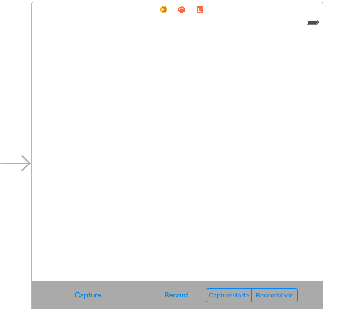
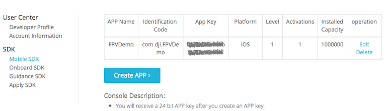

# Creating a Camera Application

<!-- toc -->

*If you come across any mistakes or bugs in this tutorial, please let us know using a Github issue, a post on the DJI forum, or commenting in the Gitbook. Please feel free to send us Github pull request and help us fix any issues.*

*Note: The code in this tutorial has been written to be run on the iPad. Please make sure you run this code on an iPad or an iPad simulator.*

---

This tutorial is designed for you to gain a basic understanding of the DJI Mobile SDK. It will implement the FPV view and two basic camera functionalities: **Take Photo** and **Record video**.

   You can download the entire project for this tutorial here: <https://github.com/DJI-Mobile-SDK/iOS-FPVDemo.git>

## Download the SDK

You can download the latest iOS SDK from here: <https://developer.dji.com/mobile-sdk/downloads/>

The development package includes:

- SDK demo project (This includes implementation of main features such as camera, gimbal control, Ground Station and Joystick)
- Documentations
- Framework

Minimum Requirement: iOS 6.1 or above

## Import the SDK framework

**1**. Copy the framework **DJISDK.framework** from the **Lib** folder and copy the file to your Xcode project folder, then drag the framework to the Frameworks folder in Xcode’s project navigator as shown below:

   
   
**2**. Select the project target, in this case **FPVDemo**, and go to **Build Phases -> Link Binary With Libraries**. Click the "+" button at the bottom and add two libraries to your project: libstdc++.6.0.9.dylib and libz.dylib. These two libraries are necessay to compile the SDK framework.

**3**. Since some of the code in the SDK framework uses C++, you need to change the extension of one of the project's implementation files to "**.mm**". We use "**AppDelegate.m**" file as an example and change its name to "**AppDelegate.mm**".

**4**. **Important**: If you want to develop apps for Inspire 1 or Phantom 3 series using the SDK, MFI communications support is required.

   Let's go the project's plist file in Supporting Files folder, add the MFI protocol names as shown below:
  
   

## Implement the First Person View
  **1**. We use the FFMPEG decoding library (found at http://ffmpeg.org) to decode the video stream. You can find the **VideoPreviewer** folder in the downloaded SDK. Copy the entire **VideoPreviewer** folder to your Xcode project's folder and then add it to the Xcode project navigator, as shown below:
  
 
 
 **2**. Go to **XCode -> Project -> Build Phases -> Link Binary With Libraries** and add the **libiconv.dylib** library. Then, set the **Header Search Paths** in **Build Settings** to the path for the **~/include** folder in the **FFMPEG** folder. Then, set the **Library Search Paths** to the path for the **~/lib** folder in the **FFMPEG** folder, as shown below:
 
  
  
  
  
  **3**. In **Main.storyboard**, add a new View Controller and call it **DJICameraViewController**. Set **DJICameraViewController** as the root View Controller for the new View Controller you just added in **Main.storyboard**:
  
  
  
Add a UIView inside the View Controller and set it as an IBOutlet called "**fpvPreviewView**". Then, add two UIButtons and one UISegmentedControl at the bottom of the View Control and set their IBOutlets and IBActions, as shown below:
  
  
  
  Go to **DJICameraViewController.m** file and import the **DJISDK** and **VideoPreviewer** header files. Then create **DJIDrone** and **DJICamera** instance variables and implement their delegate protocols as below:
  
~~~objc
#import <DJISDK/DJISDK.h>
#import "VideoPreviewer.h"

@interface DJICameraViewController ()<DJICameraDelegate, DJIDroneDelegate>
{
    DJIDrone *_drone;
    DJICamera* _camera;
}

~~~
**4**. Initialize the **DJIDrone** instance and set its type as **DJIDrone_Inspire** (you can change this type based on the UAV you have). Set the **_drone** and **_camera** instances' delegate to **self** as shown below:
  
~~~objc
- (void)viewDidLoad {
    [super viewDidLoad];
    
    _drone = [[DJIDrone alloc] initWithType:DJIDrone_Inspire];
    _drone.delegate = self;
    _camera = _drone.camera;
    _camera.delegate = self;
        
}
~~~
  
 Moreover, in the **viewWillAppear** method, set **fpvPreviewView** instance as a View of **VideoPreviewer** to show the Video Stream and reset it to nil in the **viewWillDisappear** method:
 
~~~objc
- (void)viewWillAppear:(BOOL)animated
{
    [super viewWillAppear:animated];
    [[VideoPreviewer instance] setView:self.fpvPreviewView];
    
}

- (void)viewWillDisappear:(BOOL)animated
{
    
    [super viewWillDisappear:animated];
    [_camera stopCameraSystemStateUpdates];
    [_drone disconnectToDrone];
    [_drone destroy];
    [[VideoPreviewer instance] setView:nil];
    
}
~~~
  
  Lastly, implement the **DJICameraDelegate** methods, as shown below:
  
~~~objc
#pragma mark - DJICameraDelegate

-(void) camera:(DJICamera*)camera didReceivedVideoData:(uint8_t*)videoBuffer length:(int)length
{
    uint8_t* pBuffer = (uint8_t*)malloc(length);
    memcpy(pBuffer, videoBuffer, length);
    [[VideoPreviewer instance].dataQueue push:pBuffer length:length];
}

-(void) camera:(DJICamera*)camera didUpdateSystemState:(DJICameraSystemState*)systemState
{
    if (!systemState.isTimeSynced) { //Only for Phantom 2 Vision/Phantom 2 Vision+ to check camera time
        [_camera syncTime:nil];
    }
    if (systemState.isUSBMode) { //Only for Phantom 2 Vision/Phantom 2 Vision+ to keep cameraMode when systemState is under USBMode
        [_camera setCamerMode:CameraCameraMode withResultBlock:Nil];
    }
    
}

-(void) droneOnConnectionStatusChanged:(DJIConnectionStatus)status
{
    if (status == ConnectionSuccessed) {
        NSLog(@"Connection Successed");
    }
    else if(status == ConnectionStartConnect)
    {
        NSLog(@"Start Reconnect");
    }
    else if(status == ConnectionBroken)
    {
        NSLog(@"Connection Broken");
    }
    else if (status == ConnectionFailed)
    {
        NSLog(@"Connection Failed");
    }
}

~~~
   -(void) camera:(DJICamera*)camera didReceivedVideoData:(uint8_t*)videoBuffer length:(int)length method is used to send the video stream to **VideoPreviewer** to decode.
   
   -(void) camera:(DJICamera*)camera didUpdateSystemState:(DJICameraSystemState*)systemState method is used to get the camera state from the camera on your aircraft. It will be called frequently, so you can update your user interface or camera settings accordingly here.
   
   -(void) droneOnConnectionStatusChanged:(DJIConnectionStatus)status method is used to check the drone's connection.
 
## Activate the SDK

**1**. Implement the **DJIAppManagerDelegate** protocol method in the DJICameraViewController.m file's extension part:

~~~objc
@interface DJICameraViewController ()<DJICameraDelegate, DJIDroneDelegate,DJIAppManagerDelegate>
{
    DJIDrone *_drone;
    DJICamera* _camera;
}
~~~

Then create a new method named **registerApp** and invoke it in the viewDidLoad method as shown below:

~~~objc
- (void)registerApp
{
    NSString *appKey = @"Enter Your App Key Here";
    [DJIAppManager registerApp:appKey withDelegate:self];
}

- (void)viewDidLoad {
    [super viewDidLoad];
    
    _drone = [[DJIDrone alloc] initWithType:DJIDrone_Inspire];
    _drone.delegate = self;
    _camera = _drone.camera;
    _camera.delegate = self;
    
    [self registerApp];    
}
~~~
---
**Note**: In the code above, you will need to obtain an App Key from the DJI Developer website **(<https://developer.dji.com/user/mobile-sdk>)** and enter it where it says **Enter Your App Key**. You receive an App Key by clicking **Create APP** and filling out the necessary information. Please note that **Identification Code** stands for **Bundle Identifier**. Once you do that, an App Key is generated for you. The **App Key** we generate for you is associated with the Xcode project **Bundle Identifier**, so you will not be able to use the same App Key in a different Xcode project. Each project must be submiteed individually and will receive a unique App Key. This is what you should see once you submit the information:

---

If you register app failed, you can check the **error** variable's value in the following delegate method to figure out the problem:

~~~objc
-(void)appManagerDidRegisterWithError:(int)error;
~~~

 The error code for the APP KEY activation is shown as below:
 
 result  	  | Description 
------------- | -------------
0   | Check permission successful
-1  | Cannot connect to Internet
-2  | Invalid app key
-3  | Get permission data timeout
-4  | Device uuid not match
-5  | Project package name does not match the app 	   key's identification code
-6  | App key is forbidden
-7  | Activated device number is up to the maximum 		available one
-8  | App key's platform is not correct
-9  | App key does not exist
-10 | App key has no permission
-11 | Server parser failed
-12 | Error in server obtaining uuid
-13 | Server app package name abnormal
-14 | Server parsing activation data failed
-15 | AES 256 encryption unsupported
-16 | AES 256 encryption failed
-17 | Get device uuid failed
-18 | Empty app key
-1000 | Server error 

**2**. Next, let's implement the DJIAppManagerDelegate method as shown below:

~~~objc
#pragma mark DJIAppManagerDelegate Method
-(void)appManagerDidRegisterWithError:(int)error
{
    NSString* message = @"Register App Successed!";
    if (error != RegisterSuccess) {
        message = @"Register App Failed! Please enter your App Key and check the network.";
    }else
    {
        NSLog(@"registerAppSuccess");
        [_drone connectToDrone];
        [_camera startCameraSystemStateUpdates];
        [[VideoPreviewer instance] start];

    }
    UIAlertView* alertView = [[UIAlertView alloc] initWithTitle:@"Register App" message:message delegate:nil cancelButtonTitle:@"OK" otherButtonTitles:nil];
    [alertView show];
}
~~~

In the code above, we call the **connectToDrone** method of DJIDrone to start connection with the drone, and invoke the **startCameraSystemStateUpdates** method of DJICamera to update the camera system state. Moreover we call the **start** method of **VideoPreviewer**'s instance when register app success to start the video decode. Finally, we create a UIAlertView to inform the register app state to the user.

**3**. Build and Run the project in Xcode. If everything is OK, you will see a "Register App Successed!" alert once the application loads. Also, if you see the following screenshot as below, then you can start connect to your aircraft and enjoy the video stream from its camera!
  
  

## Connect the Aircraft
After you finish the steps above, you can now connect your mobile device to your DJI Aircraft to use the application, like checking the FPV View. Here are the guidelines:

* In order to connect to a DJI Inspire 1, Phantom 3 Professional or Phantom 3 Advanced:

  **1**. First, turn on your remote controller.
  
  **2**. Then, turn on the power of the DJI aircraft.
  
  **3**. Connect your iOS device to the remote controller using the lightning cable.
  
  **4**. Trust the device if an alert asking “Do you trust this device” comes up.
  
  **5**. Now you will be able to view the live video stream from your aircraft's camera based on what we've finished of the application so far!

* In order to connect to a DJI Phantom 2 Vision+ or Phantom 2 Vision:

  **1**. First, turn on your remote controller.
  
  **2**. Then, turn on the power of the DJI aircraft.
  
  **3**. Turn on the Wi-Fi range extender.
  
  **4**. Turn on the Wi-Fi on your mobile device and connect to the network named Phantom-xxxxxx (where xxxxxx is your range extender’s SSID number).
  
  **5**. Now, you will able to view the live video stream from your aircraft's camera based on what we've finished of the application so far!
  
  
## Enjoy the First Person View

If you can see the live video stream in the application, congratulations! Let's move forward.

  

## Implement the Capture function

Add the following codes to the **captureAction** IBAction method:

~~~objc
- (IBAction)captureAction:(id)sender {
    
    [_camera startTakePhoto:CameraSingleCapture withResult:^(DJIError *error) {
        if (error.errorCode != ERR_Successed) {
            NSLog(@"Take Photo Error : %@", error.errorDescription);
        }
    }];
}
~~~
   Just call the following method of **DJICamera**:
   
   -(void) startTakePhoto:(CameraCaptureMode)captureMode withResult:(DJIExecuteResultBlock)block;
   
  There are 4 types of **CameraCaptureMode**: 
  
~~~objc
  /**
 *  Camera capture mode
 */
    typedef NS_ENUM(uint8_t, CameraCaptureMode){
    /**
     *  Single capture
     */
    CameraSingleCapture,
    /**
     *  Multiple capture
     */
    CameraMultiCapture,
    /**
     *  Continuous capture
     */
    CameraContinousCapture,
    /**
     *  AEB capture. Support in Inspire 1/Phantom3 professional/Phantom3 Advanced
     */
    CameraAEBCapture,
};
~~~
  
  These enum values give you mutiple ways to capture photos, **CameraSingleCapture** is easy to use because you do not need to set any param before calling **startTakePhoto** method, unlike the other modes. For **CameraMultiCapture**, you need to use the
  **-(void) setMultiCaptureCount:(CameraMultiCaptureCount)count withResultBlock:(DJIExecuteResultBlock)block;** method in **DJICamera.h** header file to set the **captureCount** param and check if the take photo action succeed in the block before calling **startTakePhoto** method.
  
  For more infos, you can check **DJICamera.h** and **DJICameraSettingsDef.h** files.
    
---
##### Note: Since DJICamera has several subclasses: DJIInspireCamera, DJIPhantom3AdvancedCamera, DJIPhantomCamera, etc, you should find the corresponding methods when you want to set the params. For example, CameraAEBCapture mode is supported in Inspire 1, so you should find the AEB setting method in DJIInspireCamera.h file rather than in DJICamera.h file.

---

  Here we set the capture mode to **CameraSingleCapture**. You can check the capture result from the **DJIError** instance in the block.
  
  Build and run your project and then try the capture function. If the screen flash after your press the **capture** button, your capture fuction should be working.
  
  
## Implement the Record function
  
### 1. Switching Camera Mode
   Before we implementing the record function, we need to switch the camera work mode firstly.
   
   Let's check the **DJICameraSettingsDef.h** file.
   
~~~objc
   /**
 *  Camera work mode. Used in Inspire/Phantom3 professional/Phantom3 Advanced
 */
    typedef NS_ENUM(uint8_t, CameraWorkMode){
    /**
     *  Capture mode. In this mode, user could do capture action only.
     */
    CameraWorkModeCapture                   = 0x00,
    /**
     *  Record mode. In this mode, user could do record action only.
     */
    CameraWorkModeRecord                    = 0x01,
    /**
     *  Playback mode. In this mode, user could preview photos or videos and delete the file.
     */
    CameraWorkModePlayback                  = 0x02,
    /**
     *  Download mode. In this mode, user could download the selected file from SD card
     */
    CameraWorkModeDownload                  = 0x03,
    /**
     *  Unknown
     */
    CameraWorkModeUnknown                   = 0xFF
};
~~~
   You can see above that there are 5 types of **CameraWorkMode**. Since we are using the Inspire 1 as an example, **CameraWorkModeCapture** and **CameraWorkModeRecord** are used as follows:
   
   -(void) setCameraWorkMode:(CameraWorkMode)mode withResult:(DJIExecuteResultBlock)block; method inside **DJIInspireCamera.h** file to switch camera work mode.
   
   Open **Main.storyboard** and add an IBOutlet for the UISegmented Control called "changeWorkModeSegmentControl". Remember the delegate method of DJICameraDelegate in **Tutorial Part 1**?
   
   -(void) camera:(DJICamera*)camera didUpdateSystemState:(DJICameraSystemState*)systemState;
   
   We can update the state of the segmented control when switching between **CameraWorkModeCapture** and **CameraWorkModeRecord** using the above delegate method.
   
~~~objc
-(void) camera:(DJICamera*)camera didUpdateSystemState:(DJICameraSystemState*)systemState
{
    if (_drone.droneType == DJIDrone_Inspire) {
        
        //Update UISegmented Control's state        
        if (systemState.workMode == CameraWorkModeCapture) {
            [self.changeWorkModeSegmentControl setSelectedSegmentIndex:0];
        }else if (systemState.workMode == CameraWorkModeRecord){
            [self.changeWorkModeSegmentControl setSelectedSegmentIndex:1];
        }
    }
}

~~~
 Now we can implement the **changeWorkModeAction** method as follows:
 
~~~objc
- (IBAction)changeWorkModeAction:(id)sender {
    
    DJIInspireCamera* inspireCamera = (DJIInspireCamera*)_camera;
    __weak DJICameraViewController *weakSelf = self;

    UISegmentedControl *segmentControl = (UISegmentedControl *)sender;
    if (segmentControl.selectedSegmentIndex == 0) { //CaptureMode
        
        [inspireCamera setCameraWorkMode:CameraWorkModeCapture withResult:^(DJIError *error) {
            
            if (error.errorCode != ERR_Successed) {
                UIAlertView *errorAlert = [[UIAlertView alloc] initWithTitle:@"Set CameraWorkModeCapture Failed" message:error.errorDescription delegate:weakSelf cancelButtonTitle:@"OK" otherButtonTitles:nil];
                [errorAlert show];
            }
            
        }];
        
    }else if (segmentControl.selectedSegmentIndex == 1){ //RecordMode
    
        [inspireCamera setCameraWorkMode:CameraWorkModeRecord withResult:^(DJIError *error) {
            
            if (error.errorCode != ERR_Successed) {
                UIAlertView *errorAlert = [[UIAlertView alloc] initWithTitle:@"Set CameraWorkModeRecord Failed" message:error.errorDescription delegate:weakSelf cancelButtonTitle:@"OK" otherButtonTitles:nil];
                [errorAlert show];
            }
        
        }];
        
    }
    
}

~~~
 Here we add two UIAlertViews to get a warning when the user set CameraWorkMode failed.
 
### 2. Add Record Action

  Firstly, we need a BOOL variable to save the status of the record action and a UILabel to show the current record time. So let's go to **Main.storyboard** and drag a UILabel on top of the screen, set up the Autolayout for it and create an IBOutlet named "**currentRecordTimeLabel**" to the **DJICameraViewController.m** file. Moreover, create an IBOutlet called "**recordBtn**" for the Record Button.
  
  Then add a BOOL variable **isRecording** in the class extension of **DJICameraViewController**. Be sure to hide **currentRecordTimeLabel** in the **viewDidLoad** method. We can update the text values for **isRecording** and **currentRecordTimeLabel**'s text value in the following delegate method.
   
~~~objc
-(void) camera:(DJICamera*)camera didUpdateSystemState:(DJICameraSystemState*)systemState
{
    if (_drone.droneType == DJIDrone_Inspire) {
        
        self.isRecording = systemState.isRecording;
        
        [self.currentRecordTimeLabel setHidden:!self.isRecording];
        [self.currentRecordTimeLabel setText:[self formattingSeconds:systemState.currentRecordingTime]];
        
        if (self.isRecording) {
            [self.recordBtn setTitle:@"Stop Record" forState:UIControlStateNormal];
        }else
        {
            [self.recordBtn setTitle:@"Start Record" forState:UIControlStateNormal];
        }
        
        //Update UISegmented Control's state
        if (systemState.workMode == CameraWorkModeCapture) {
            [self.changeWorkModeSegmentControl setSelectedSegmentIndex:0];
        }else if (systemState.workMode == CameraWorkModeRecord){
            [self.changeWorkModeSegmentControl setSelectedSegmentIndex:1];
        }
       
    }
}
   
~~~
   
   Because the value of **currentRecordingTime** is counted in seconds, so we need to convert it to "mm:ss" format like this:
   
~~~objc
- (NSString *)formattingSeconds:(int)seconds
{
    NSDate *date = [NSDate dateWithTimeIntervalSince1970:seconds];
    NSDateFormatter *formatter = [[NSDateFormatter alloc] init];
    [formatter setDateFormat:@"mm:ss"];
    [formatter setTimeZone:[NSTimeZone timeZoneForSecondsFromGMT:0]];
    
    NSString *formattedTimeString = [formatter stringFromDate:date];
    return formattedTimeString;
}
~~~
   
   Next, add the following codes to the **recordAction** IBAction method as follows:
   
~~~objc
- (IBAction)recordAction:(id)sender {
    
    __weak DJICameraViewController *weakSelf = self;
    
    if (self.isRecording) {
        
        [_camera stopRecord:^(DJIError *error) {
            
            if (error.errorCode != ERR_Successed) {
                UIAlertView *errorAlert = [[UIAlertView alloc] initWithTitle:@"Stop Record Error" message:error.errorDescription delegate:weakSelf cancelButtonTitle:@"OK" otherButtonTitles:nil];
                [errorAlert show];
            }
        }];
        
    }else
    {
        [_camera startRecord:^(DJIError *error) {
            
            if (error.errorCode != ERR_Successed) {
                UIAlertView *errorAlert = [[UIAlertView alloc] initWithTitle:@"Start Record Error" message:error.errorDescription delegate:weakSelf cancelButtonTitle:@"OK" otherButtonTitles:nil];
                [errorAlert show];
            }
        }];

    }

}  
~~~

   In the code above, we implement the **startRecord** and **stopRecord** methods of the **DJICamera** class based on the **isRecording** property value. And show an alertView when an error occurs.
   
   Now, we can build and run the project and check the functions. You can try to play with the **Record** and **Switch Camera WorkMode** functions, if everything is going well, you should see the screenshot like this:
   
   
   
   Congratulations! Your Aerial FPV iOS app is complete, you can now use this app to control the camera of your Inspire 1. 

## Summary
   
   You’ve come a long way in this tutorial: you’ve learned how to use DJI Mobile SDK to show the FPV View from the aircraft's camera and control the camera of DJI's Aircraft. These are the most basic and common features in a typical drone mobile app: **Capture** and **Record**. However, if you want to create a drone app that is more fancy, you still have a long way to go. More advanced features would include previewing the photo and video in the SD Card, showing the OSD data of the aircraft and so on. Hope you enjoy this tutorial, and stay tuned for our next one!
   
   
   