# Creating a MapView and Waypoint Application

<!-- toc -->

*If you come across any mistakes or bugs in this tutorial, please let us know using a Github issue, a post on the DJI forum, or commenting in the Gitbook. Please feel free to send us Github pull request and help us fix any issues. However, all pull requests related to document must follow the [document style](https://github.com/dji-sdk/Mobile-SDK-Tutorial/issues/19)*

---

In this tutorial, you will learn how to implement the DJIWaypoint Mission feature and get familiar with the usages of DJIMissionManager. 
Also you will know how to setup the DJI PC Simulator, upgrade your Inspire 1, Phantom 3 Professional and Phantom 3 Advanced's firmware to the lastest version, and how to test the Waypoint Mission API with DJI PC Simulator too. So let's get started!

   You can download the demo project from this [Github Page](https://github.com/DJI-Mobile-SDK/iOS-GSDemo).

## Using The DJI PC Simulator

### 1. Introduction

The DJI PC Simulator is a flight simulator designed for SDK developers. The simulator creates a virtual 3D environment and provides data analysis from flight data transmitted to the PC via the UDP protocol.

**Supported Operating Systems**: Windows 7, Windows 8, and Windows 8.1

**Supported DJI Platforms**: Matrice 100, Inspire 1, Phantom 3 Professional, and Phantom 3 Advanced

### 2. Installing and setup the DJI PC Simulator

First, you should download the DJI PC Simulator and WIN Driver from here: <https://developer.dji.com/mobile-sdk/downloads> :

- DJI PC Simulator Installer & User Manual V1.0
- WIN Driver Installer

You must install the driver before running the simulator. Since the simulator only supports Windows, you should find a PC or install a Virtual Manchine(Like VMWare or Parallels Desktop) to run Windows on your Mac. Now, double click the **DJI_ WIN_Driver _Installer.exe** file to install it. If a dialog box saying "Please power on MC and connect it to PC via USB!" pops up, just ignore it, click **"YES"**, and follow the rest of the instructions to install the driver. 

Then, double click the **DJISimulator-Installer.exe** file and follow the instructions to install the program. 

### 3. Using the DJI PC Simulator

**1**. The **Simulator Config** window will appear once you launch the DJI PC Simulator. Set the **Latitude** and **Longitude** values based on your preference. The **SN** represents the connected aircraft's SN number. If you do not see the **SN**, your aircraft is not connected properly to the PC or there is an issues with your firmware.

 

---
**Note**: 

- The aircraft will not take off if the latitude and longitude values are near a [No Fly Zone](http://flysafe.dji.com/no-fly).

- Select **show log window** under the Log Settings tab to display the log window, as seen below:

 

---

**2**. Connect the aircraft to your PC via the Micro USB cable, turn on the remote controller and finally turn on the aircraft. Click **Display Simulator**, and you will see the screenshot below(it will show whatever aircraft you are using). In this case you see the Inspire 1:

 

---
**Note**: 

- Do **NOT** launch the DJI Pilot app when the DJI PC Simulator is running.

- Do **NOT** mount the propellers on the aircraft when the DJI PC Simulator is running, in case the motors start by accident. That would be extremely dangerous.

---

**3**. Start the simulation by clicking **Start Simulation**. You can use the remote controller to change the course of the aircraft by swithing the control mode to **P** or bring it back home with the **Return-to-Home** button on the remote controller.

Please check the data on the left down corner of view, World X, Y, Z represents the North-South, East- West, and Up-Down axes (take the North, East and Up directions as positive). 

**4**. In order to change the view angle, left-click and drag, and to scroll, zoom in and zoom out.

 
  
---
>**Note**: 
> You can also see the flight trace in the simulator when the aircraft is flying. Right click on the simulator window and select **setup** as shown below:
>
>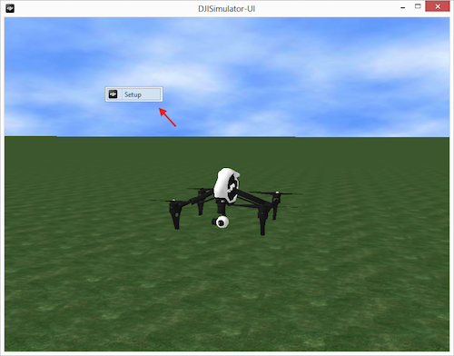
> 
>Then select **show trace** under the simulator UI Config tab to display the flight trace, as shown below:
>
>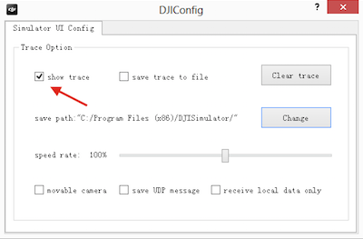
>
>Here is the result:
>
>
>
---

**5**. Click **Stop Simulation** to stop the simulation. Close the simulator, and turn off the aircraft, and turn off the remote controller after use. 

**Important**: If you want to stop midway through a Waypoint Mission, you should click **Stop Simulation** and stop the mission on the device you are running it from, otherwise the simulator may run the previous waypoint mission when you start it again.

For more info about DJI PC Simulator, please check the **DJI PC Simulator user manual.pdf** file, which is included in the download along with the simulator.

## Upgrading Your Aircraft's Firmware

It's important to make sure your aircraft's firmware supports the DJI Mobile SDK before going through the following steps. Please download the latest firmware version from here based on the aircraft you have: <https://developer.dji.com/mobile-sdk/downloads/> :

- Phantom 3 Professional Firmware
- Phantom 3 Advanced Firmware
- Inspire 1 Firmware

It's not necessary to upgrade the Remote Controller's firmware, just put the downloaded **bin** file in the SD Card, insert it to your aircraft's camera, and restart it to upgrade. It may take 10 ~ 30 minutes to finish the upgrade.

For the Inspire 1, you can check the upgrade status of the firmware by identifying the sound pattern from the aircraft:

- Upgrading: D D D D ... (fast) 
- Upgrade Success: D DD ...
- Upgrade Failed or Error: long beep sound

For the Phantom 3, you can check upgrade status of the firmware by looking at the camera status indicator: 

- Upgrading: camera status indicator will blink green and red
- Upgrade Success: camera sattus indicator will stop blinking 
- Upgrade Failed or Error: camera status indicator will show solid red

Regardless of what aircraft you are using, you can check whether or not the firmware was upgraded by checking the **txt** file generated during the upgrade process. For the Phantom 3 Professional, the txt file is named **"P3X_FW_RESULT_AB.txt"**, and for the Inspire 1, it's named **"WM610_FW_RESULT_AB.txt"**. Here are example contents of the **txt** file:

  
  
  

## Setup The Map View

### 1. Importing The Framework and Libraries

Now that you've finished the steps above, we can start working on the application. In our previous tutorial [**Creating a Camera Application**](https://github.com/DJI-Mobile-SDK/iOS-FPVDemo), you learned how to import and activate the DJI Mobile SDK into your Xcode project. If you haven't read that previously, please take a look at it. Once you've done that, we will set up the map view. 

**1**. Create a new project in Xcode and name it "**GSDemo**", download the latest DJI iOS SDK from [DJI Developer Website](http://developer.dji.com/mobile-sdk/downloads/) and copy the **DJISDK.framework** to your Xcode project's folder. Then, select the project target and go to Build Phases -> Link Binary With Libraries. Click the "+" button at the bottom and add two libraries to your project: libstdc++.6.0.9.tbd and libz.tbd. Take a look at the screenshot below:

  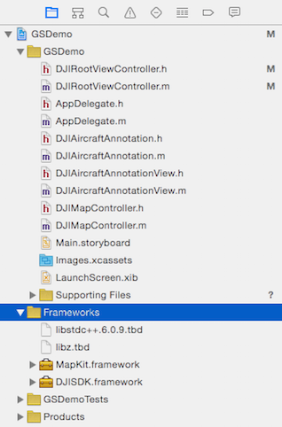

### 2. Creating the Map View

Now, let's delete the **ViewController.h** and **ViewController.m** files, which were created by Xcode when you created the project. Then, create a viewController named "**DJIRootViewController**" and set it as the **Root View Controller** in Main.storyboard. Moreover, drag a **MKMapView** from Object Library to **DJIRootViewController**, setup its AutoLayout constraints, and set its delegate to **DJIRootViewController**, as seen below:
   

After that, open the **DJIRootViewController.m** file, create an IBOutlet for the MKMapView, name it "**mapView**" and link it to the MKMapView in **Main.storyboard**. Import the following header files and implement MKMapView's delegate method:

~~~objc
#import "DJIRootViewController.h"
#import <DJISDK/DJISDK.h>
#import <MapKit/MapKit.h>

@interface DJIRootViewController() <MKMapViewDelegate>

@property (weak, nonatomic) IBOutlet MKMapView *mapView;

@end
~~~

Now, let's build and run the project. If everything is as it should be, you should see the following screenshot:

### 3. Adding Annotations to the MapView

Currently, the map view is simple. Let's add something interesting to it. Create a new **NSObject** file named **DJIMapController**, which will be used to deal with the MKAnnotations(or for our purposes, Waypoints) logic on the map. Open the DJIMapController.h file and add the following code to it:

~~~objc
#import <UIKit/UIKit.h>
#import <MapKit/MapKit.h>

@interface DJIMapController : NSObject

@property (strong, nonatomic) NSMutableArray *editPoints;

/**
 *  Add Waypoints in Map View
 */
- (void)addPoint:(CGPoint)point withMapView:(MKMapView *)mapView;

/**
 *  Clean All Waypoints in Map View
 */
- (void)cleanAllPointsWithMapView:(MKMapView *)mapView;

/**
 *  Current Edit Points
 *
 *  @return Return an NSArray contains multiple CCLocation objects
 */
- (NSArray *)wayPoints;

@end
~~~

Here, we create an NSMutableArray called **editPoints** to store waypoint objects and add two methods to implement **Add** and **Remove** waypoints. The last method will be used to return the current waypoint objects on the map in an array.

Let's go to the DJIMapController.m file and replace the original code with the following:

~~~objc
#import "DJIMapController.h"

@implementation DJIMapController

- (instancetype)init
{
    if (self = [super init]) {
        self.editPoints = [[NSMutableArray alloc] init];
    }
    return self;
}

- (void)addPoint:(CGPoint)point withMapView:(MKMapView *)mapView
{
    CLLocationCoordinate2D coordinate = [mapView convertPoint:point toCoordinateFromView:mapView];
    CLLocation *location = [[CLLocation alloc] initWithLatitude:coordinate.latitude longitude:coordinate.longitude];
    [_editPoints addObject:location];
    MKPointAnnotation* annotation = [[MKPointAnnotation alloc] init];
    annotation.coordinate = location.coordinate;
    [mapView addAnnotation:annotation];
}

- (void)cleanAllPointsWithMapView:(MKMapView *)mapView
{
    [_editPoints removeAllObjects];
    NSArray* annos = [NSArray arrayWithArray:mapView.annotations];
    for (int i = 0; i < annos.count; i++) {
        id<MKAnnotation> ann = [annos objectAtIndex:i];
        [mapView removeAnnotation:ann];
    }   
}

- (NSArray *)wayPoints
{
    return self.editPoints;
}

@end
~~~
First, we initialize the **editPoints** array in the init method, then create MKPointAnnotation objects from CGPoint and add them to our **mapView**, and finally implement the **cleanAllPointsWithMapView** method to clean up the **eidtPoints** array and the annotations on the mapView.

Go back to the DJIRootViewController.m file, import the DJIMapController.h header file, and create a DJIMapController property named **mapController**. Since we want to add annotation pins by tapping on the map, we also need to create a UITapGestureRecognizer named as **tapGesture**. Lastly, add a UIButton to the DJIRootViewController scene in Main.storyboard, set its IBOutlet name as "**editBtn**", and add an IBAction method named "**editBtnAction**" for it, as shown below:

~~~objc
@property (nonatomic, strong) DJIMapController *mapController;
@property (nonatomic, strong) UITapGestureRecognizer *tapGesture;
@property (weak, nonatomic) IBOutlet UIButton *editBtn;

- (IBAction)editBtnAction:(id)sender;
~~~

Once that is complete, open the DJIMapController.m file, initialize the **mapController** and **tapGesture** variables, and add the **tapGesture** to mapView to add waypoints. Furthermore, we need a boolean variable named "**isEditingPoints**" to store the edit waypoint state, which will also change the title of **editBtn** accordingly. Lastly, implement tapGesture's action method **addWayPoints**, as shown below:

~~~objc
@interface DJIRootViewController ()<MKMapViewDelegate>
@property (weak, nonatomic) IBOutlet MKMapView *mapView;
@property (nonatomic, assign)BOOL isEditingPoints;
@end

@implementation DJIRootViewController
- (void)viewDidLoad {
    [super viewDidLoad];
    
    self.mapController = [[DJIMapController alloc] init];
    self.tapGesture = [[UITapGestureRecognizer alloc] initWithTarget:self action:@selector(addWaypoints:)];
    [self.mapView addGestureRecognizer:self.tapGesture];
    
}

#pragma mark Custom Methods

- (void)addWaypoints:(UITapGestureRecognizer *)tapGesture
{
    CGPoint point = [tapGesture locationInView:self.mapView];
    
    if(tapGesture.state == UIGestureRecognizerStateEnded){

        if (self.isEditingPoints) {
            [self.mapController addPoint:point withMapView:self.mapView];
        }
    }
}

- (IBAction)editBtnAction:(id)sender {

    if (self.isEditingPoints) {
        [self.mapController cleanAllPointsWithMapView:self.mapView];
        [self.editBtn setTitle:@"Edit" forState:UIControlStateNormal];
    }else
    {
        [self.editBtn setTitle:@"Reset" forState:UIControlStateNormal];
    }
    
    self.isEditingPoints = !self.isEditingPoints;
    
}

#pragma mark MKMapViewDelegate Method
- (MKAnnotationView *)mapView:(MKMapView *)mapView viewForAnnotation:(id <MKAnnotation>)annotation
{
    if ([annotation isKindOfClass:[MKPointAnnotation class]]) {
        MKPinAnnotationView* pinView = [[MKPinAnnotationView alloc] initWithAnnotation:annotation reuseIdentifier:@"Pin_Annotation"];
        pinView.pinColor = MKPinAnnotationColorPurple;
        return pinView;
        
    }
    
    return nil;
}

~~~

In the above code, we also added an NSNotification observer to check the DJI Mobile SDK's state, to make sure it was sucessfully registered. At the same time, we implement the **addWaypoints** gesture action by calling DJIMapController's 

     - (void)addPoint:(CGPoint)point withMapView:(MKMapView *)mapView
method to add waypoints to the map. Next, we implement the IBAction method **editBtn**, which will update the button's title and clean up waypoints based on the value of **isEditingPoints**. Finally, we implement MKMapViewDelegate's method to change the pin color to purple.

When you are done with all the steps above, build and run your project and try to add waypoints on the map. If everything is fine, you will see the following animation:

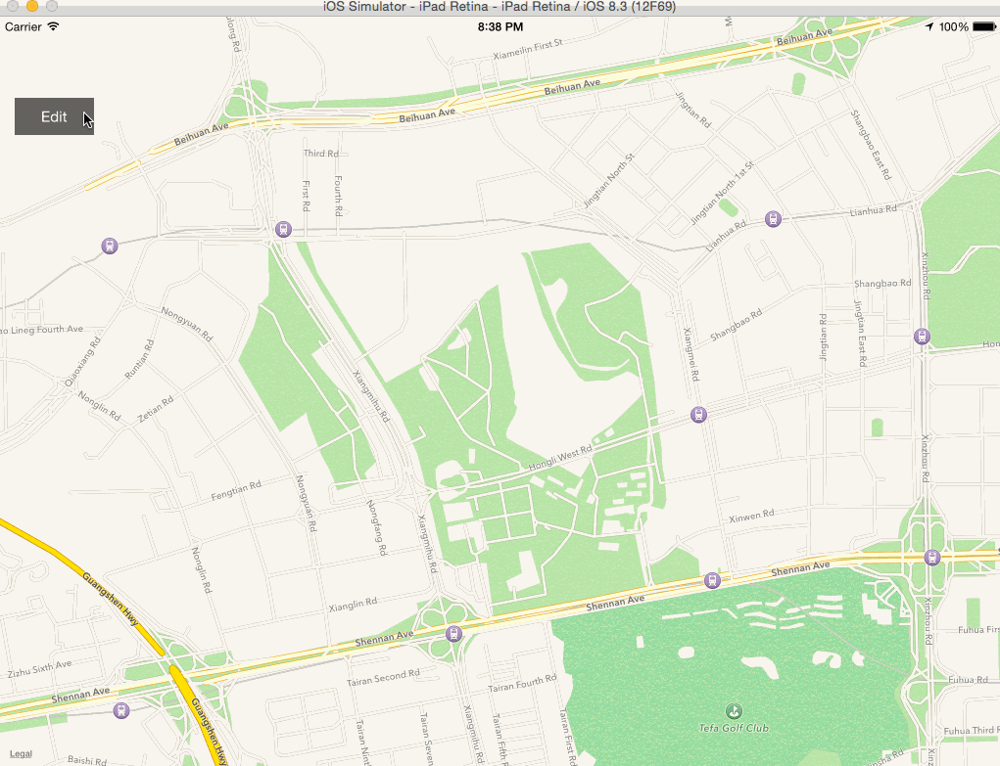

### 4. Focusing the MKMapView

You may be wondering why the map's location is different from your current location and why it is difficult to find your location on the map. Focusing the map to your current location quickly would be helpful for the application. To implement that feature, we need to use **CLLocationManager**.

Open the DJIRootViewController.m file and import CoreLocation's header file. Create a CLLocationManager property named "locationManager". Then create a CLLocationCoordinate2D property named "userLocation" to store the user's location data. Next, implement CLLocationManager's **CLLocationManagerDelegate** protocol in the class, as shown below:

~~~objc
#import <DJIRootViewController.h>
#import <DJISDK/DJISDK.h>
#import <MapKit/MapKit.h>
#import <CoreLocation/CoreLocation.h>

@interface DJIRootViewController()<MKMapViewDelegate, CLLocationManagerDelegate>

@property (nonatomic, weak) IBOutlet MKMapView *mapView;
@property (nonatomic, assign)BOOL isEditingPoints;
@property (nonatomic, strong) CLLocationManager* locationManager;
@property (nonatomic, assign) CLLocationCoordinate2D userLocation;
@property (nonatomic, strong) UITapGestureRecognizer *tapGesture;
@property (nonatomic, weak) IBOutlet UIButton *editBtn;

- (IBAction)editBtnAction:(id)sender;
- (IBAction)focusMapAction:(id)sender;

@end
~~~

In the code above, we also added a UIButton named "Focus Map" in DJIRootViewController's scene in Main.storyboard and added an IBAction method named as **focusMapAction**. Here is the screenshot of the scene from Main.storyboard:

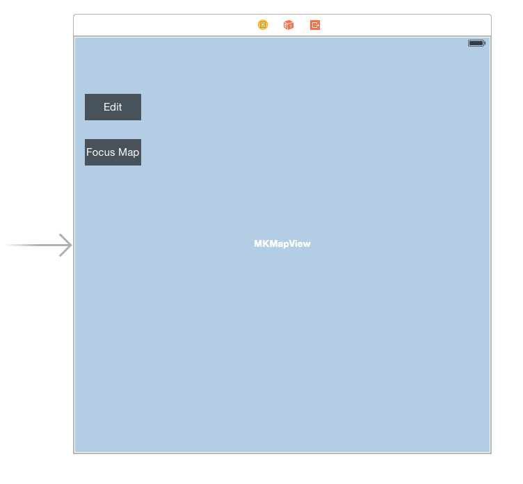

Once you are done, go back to DJIRootViewController.m file and add the following code:

~~~objc
- (void)viewWillAppear:(BOOL)animated
{
    [super viewWillAppear:animated];
    [self startUpdateLocation];
}

- (void)viewWillDisappear:(BOOL)animated
{
    [super viewWillDisappear:animated];
    [self.locationManager stopUpdatingLocation];
}

- (void)viewDidLoad {
    [super viewDidLoad];
    
    self.userLocation = kCLLocationCoordinate2DInvalid;
    
    self.mapController = [[DJIMapController alloc] init];
    self.tapGesture = [[UITapGestureRecognizer alloc] initWithTarget:self action:@selector(addWaypoints:)];
    [self.mapView addGestureRecognizer:self.tapGesture];
    
}

- (BOOL)prefersStatusBarHidden {
    return NO;
}

#pragma mark CLLocation Methods
-(void) startUpdateLocation
{
    if ([CLLocationManager locationServicesEnabled]) {
        if (self.locationManager == nil) {
            self.locationManager = [[CLLocationManager alloc] init];
            self.locationManager.delegate = self;
            self.locationManager.desiredAccuracy = kCLLocationAccuracyBest;
            self.locationManager.distanceFilter = 0.1;
            if ([self.locationManager respondsToSelector:@selector(requestAlwaysAuthorization)]) {
                [self.locationManager requestAlwaysAuthorization];
            }
            [self.locationManager startUpdatingLocation];
        }
    }else
    {
        UIAlertView *alert = [[UIAlertView alloc] initWithTitle:@"Location Service is not available" message:@"" delegate:self cancelButtonTitle:@"OK" otherButtonTitles:nil];
        [alert show];
    }
}

- (IBAction)focusMapAction:(id)sender {
{
    if (CLLocationCoordinate2DIsValid(self.userLocation)) {
        MKCoordinateRegion region = {0};
        region.center = self.userLocation;
        region.span.latitudeDelta = 0.001;
        region.span.longitudeDelta = 0.001;
        
        [self.mapView setRegion:region animated:YES];
    }
}

#pragma mark - CLLocationManagerDelegate
- (void)locationManager:(CLLocationManager *)manager didUpdateLocations:(NSArray *)locations
{
    CLLocation* location = [locations lastObject];
    self.userLocation = location.coordinate;
}

~~~

First, we initialize **userLocation** data to kCLLocationCoordinate2DInvalid in the viewDidLoad method. Then we add a new method named as "startUpdateLocation" to initialize **locationManger**, set its properties and start updating location. If the Location Service is not available, we add a UIAlertView to display the warning. The **startUpdateLocation** is called in viewWillAppear method and is stopped in the viewWillDisappear method. Moreover, we need to implement CLLocationManagerDelegate method to update **userLocation** property. Finally, we implement the "focusMapAction" method to focus **mapView** to the user's current location.

In iOS8, we must call **locationManager**'s **requestAlwaysAuthorization** first, which was done in **startUpdateLocation** method. 

Next, add a NSLocationAlwaysUsageDescription or NSLocationWhenInUseUsageDescription key to your project’s Info.plist containing the message to be displayed to the user when a UIAlert asking whether or not they want to allow the application to use their location. We set the messages empty here:

It's time to build and run the project to check the focus map feature. When you launch the app for the first time, a pop up alert asking for your permission to access your location will appear. Select **Allow** and press the **Focus Map** button. If the map view animates to your current location like the following animation, congratulations, you have finished the **Focus Map** feature!

### 5. Showing the Aircraft on Map View

Now, we can focus the mapView to our current location, which is a good start! However, let's do something more interesting. We're going to simulate the aircraft's GPS location using the DJI PC Simulator and show it on our map view.

You may know how to setup the DJI PC Simulator, and its basic usage. If you want to place the aircraft in your current GPS location on Map View, you can set the latitude and longitude values in the **Simulator Config** to yours. We take the simulator's initial values in the following example.

Let's come back to the code. Create a new subclass of **MKAnnotationView** named "DJIAircraftAnnotationView" and a new subclass of NSObject named **DJIAircraftAnnotation**. Below is the code:

- DJIAircraftAnnotationView.h

~~~objc
#import <MapKit/MapKit.h>

@interface DJIAircraftAnnotationView : MKAnnotationView

-(void) updateHeading:(float)heading;

@end
~~~

- DJIAircraftAnnotationView.m

~~~objc
#import "DJIAircraftAnnotationView.h"

@implementation DJIAircraftAnnotationView

- (instancetype)initWithAnnotation:(id <MKAnnotation>)annotation reuseIdentifier:(NSString *)reuseIdentifier
{
    self = [super initWithAnnotation:annotation reuseIdentifier:reuseIdentifier];
    if (self) {
        self.enabled = NO;
        self.draggable = NO;
        self.image = [UIImage imageNamed:@"aircraft.png"];
    }
    
    return self;
}

-(void) updateHeading:(float)heading
{
    self.transform = CGAffineTransformIdentity;
    self.transform = CGAffineTransformMakeRotation(heading);
}

@end

~~~

In the code above, we create a MKAnnotationView for the aircraft, add a method named **updateHeading** to change the aircraft's rotation, and set its image to "aircraft.png"(You can get the image from this tutorial's demo project.) in the init method. Also, we disable the DJIAircraftAnnotationView's draggable property. Take a look at the code below:

- DJIAircraftAnnotation.h

~~~objc
#import <MapKit/MapKit.h>
#import "DJIAircraftAnnotationView.h"

@interface DJIAircraftAnnotation : NSObject<MKAnnotation>

@property(nonatomic, readonly) CLLocationCoordinate2D coordinate;
@property(nonatomic, weak) DJIAircraftAnnotationView* annotationView;

-(id) initWithCoordiante:(CLLocationCoordinate2D)coordinate;

-(void)setCoordinate:(CLLocationCoordinate2D)newCoordinate;

-(void) updateHeading:(float)heading;

@end
~~~

- DJIAircraftAnnotation.m

~~~objc
#import "DJIAircraftAnnotation.h"

@implementation DJIAircraftAnnotation

-(id) initWithCoordiante:(CLLocationCoordinate2D)coordinate
{
    self = [super init];
    if (self) {
        _coordinate = coordinate;
    }   
    return self;
}

- (void)setCoordinate:(CLLocationCoordinate2D)newCoordinate
{
    _coordinate = newCoordinate;
}

-(void)updateHeading:(float)heading
{
    if (self.annotationView) {
        [self.annotationView updateHeading:heading];
    }
}
@end
~~~

The **DJIAircraftAnnotation** class implements the **MKAnnotation** protocol. It's used to store and update a CLLocationCoordinate2D property. Also, we can update DJIAircraftAnnotationView's heading with the **updateHeading** method.

Once you're done with that, open the DJIMapController.h file and import the DJIAircraftAnnotation.h file:

~~~objc
#import "DJIAircraftAnnotation.h"
~~~

Then create a property of an instance of DJIAircraftAnnotation and name it **aircraftAnnotation**. 

~~~objc
@property (nonatomic, strong) DJIAircraftAnnotation* aircraftAnnotation;
~~~

Furthermore, add two new methods to update the aircraft's location and it's heading on the map.

~~~objc
/**
 *  Update Aircraft's location in Map View
 */
-(void)updateAircraftLocation:(CLLocationCoordinate2D)location withMapView:(MKMapView *)mapView;

/**
 *  Update Aircraft's heading in Map View
 */
-(void)updateAircraftHeading:(float)heading;
~~~

Next, let's come back to the DJIMapController.m file and implement the two methods we just added:

~~~objc
-(void)updateAircraftLocation:(CLLocationCoordinate2D)location withMapView:(MKMapView *)mapView
{
    if (self.aircraftAnnotation == nil) {
        self.aircraftAnnotation = [[DJIAircraftAnnotation alloc] initWithCoordiante:location];
        [mapView addAnnotation:self.aircraftAnnotation];
    }
    
    [self.aircraftAnnotation setCoordinate:location];
}

-(void)updateAircraftHeading:(float)heading
{
    if (self.aircraftAnnotation) {
        [self.aircraftAnnotation updateHeading:heading];
    }
}
~~~

Also, since we don't want the **aircraftAnnotation** removed by the **cleanAllPointsWithMapView** method in the DJIMapController.m file, we need to modify it, as shown below:

~~~objc
- (void)cleanAllPointsWithMapView:(MKMapView *)mapView
{
    [_editPoints removeAllObjects];
    NSArray* annos = [NSArray arrayWithArray:mapView.annotations];
    for (int i = 0; i < annos.count; i++) {
        id<MKAnnotation> ann = [annos objectAtIndex:i];
        if (![ann isEqual:self.aircraftAnnotation]) {
            [mapView removeAnnotation:ann];
        }
       
    }   
}
~~~
We add an if statement to check if the annotation of the map view is equal to the **aircraftAnnotation** property, and if it is not, we remove it. By doing so, we can prevent the Aircraft's annotation from being removed.

To provide a better user experience, we need to add a status view on top of the mapView to show the aircraft's flight mode type, current GPS satellite count, vertical and horizontal flight speed and the flight altitude. Let's add the UI in Main.storyboard's RootViewController Scene, as seen below:

Once that's done, open DJIRootViewController.m file, create IBOutlets for the above UI elements and import DJISDK's header file and implement "DJIFlightControllerDelegate" and "DJISDKManagerDelegate" protocols. Also, we need to create a CLLocationCoordinate2D property named **droneLocation** to record the aircraft's location, as shown below:

~~~objc
#import <DJIRootViewController.h>
#import <DJISDK/DJISDK.h>
#import <MapKit/MapKit.h>
#import <CoreLocation/CoreLocation.h>

@interface DJIRootViewController()<MKMapViewDelegate, CLLocationManagerDelegate, DJISDKManagerDelegate, DJIFlightControllerDelegate>

@property(nonatomic, strong) IBOutlet UILabel* modeLabel;
@property(nonatomic, strong) IBOutlet UILabel* gpsLabel;
@property(nonatomic, strong) IBOutlet UILabel* hsLabel;
@property(nonatomic, strong) IBOutlet UILabel* vsLabel;
@property(nonatomic, strong) IBOutlet UILabel* altitudeLabel;

@property(nonatomic, assign) CLLocationCoordinate2D droneLocation;
~~~

Now, let's initialize the UI elements' values in a new method called **initUI**. Call the initUI method in the viewDidLoad method. Lastly, create a new method named "registerApp" and invoke it in the viewDidLoad method to register the app as shown below:

~~~objc

-(void) initUI
{
    self.modeLabel.text = @"N/A";
    self.gpsLabel.text = @"0";
    self.vsLabel.text = @"0.0 M/S";
    self.hsLabel.text = @"0.0 M/S";
    self.altitudeLabel.text = @"0 M";
}

- (void)registerApp
{
    NSString *appKey = @"Enter Your App Key Here";
    [DJISDKManager registerApp:appKey withDelegate:self];
}
~~~

~~~objc
- (void)viewDidLoad {
    [super viewDidLoad];

    [self registerApp];
    [self initUI];
    [self initData];
}

-(void)initData
{
    self.userLocation = kCLLocationCoordinate2DInvalid;
    self.droneLocation = kCLLocationCoordinate2DInvalid;
    
    self.mapController = [[DJIMapController alloc] init];
    self.tapGesture = [[UITapGestureRecognizer alloc] initWithTarget:self action:@selector(addWaypoints:)];
    [self.mapView addGestureRecognizer:self.tapGesture];

}
~~~

Next, implement the "DJISDKManagerDelegate" method as follows:

~~~objc

#pragma mark DJISDKManagerDelegate Methods

- (void)sdkManagerDidRegisterAppWithError:(NSError *_Nullable)error
{
    if (error){
        NSString *registerResult = [NSString stringWithFormat:@"Registration Error:%@", error.description];
        ShowMessage(@"Registration Result", registerResult, nil, @"OK");
    }
    else{
        [DJISDKManager startConnectionToProduct];
    }
}

- (void)sdkManagerProductDidChangeFrom:(DJIBaseProduct *_Nullable)oldProduct to:(DJIBaseProduct *_Nullable)newProduct
{
    if (newProduct){
        DJIFlightController* flightController = [DemoUtility fetchFlightController];
        if (flightController) {
            flightController.delegate = self;
        }
    }
    else{
        ShowMessage(@"Product disconnected", nil, nil, @"OK");
    }
}

~~~

In the code above, we can implement DJISDKManager's **sdkManagerDidRegisterAppWithError:** delegate method to check the register status and invoke the DJISDKManager's "startConnectionToProduct" method to connect to the aircraft. Moreover, the **sdkManagerProductDidChangeFrom:to:** delegate method will be invoked when the product connectivity status changes, so we can set DJIFlightController's delegate as DJIRootViewController here when product is connected.

You may notice that there is a "DemoUtility" class here, let's implement it now. Create a new NSObject class and named it as "DemoUtility", replace its .h file and .m file with the followings:

~~~objc
#ifndef DemoUtility_h
#define DemoUtility_h
#define WeakRef(__obj) __weak typeof(self) __obj = self
#define WeakReturn(__obj) if(__obj ==nil)return;
#define DEGREE(x) ((x)*180.0/M_PI)
#define RADIAN(x) ((x)*M_PI/180.0)
#endif

extern void ShowMessage(NSString *title, NSString *message, id target, NSString *cancleBtnTitle);

@class DJIFlightController;
@interface DemoUtility : NSObject
+(DJIFlightController*) fetchFlightController;
@end

~~~

~~~objc
#import "DemoUtility.h"
#import <DJISDK/DJISDK.h>

inline void ShowMessage(NSString *title, NSString *message, id target, NSString *cancleBtnTitle)
{
    dispatch_async(dispatch_get_main_queue(), ^{
        UIAlertView *alert = [[UIAlertView alloc] initWithTitle:title message:message delegate:target cancelButtonTitle:cancleBtnTitle otherButtonTitles:nil];
        [alert show];
    });
}

@implementation DemoUtility
+(DJIFlightController*) fetchFlightController {
    if (![DJISDKManager product]) {
        return nil;
    }
    if ([[DJISDKManager product] isKindOfClass:[DJIAircraft class]]) {
        return ((DJIAircraft*)[DJISDKManager product]).flightController;
    }
    return nil;
}
@end
~~~

Then in the **viewWillDisappear** method, we need to invoke the "stopUpdatingLocation" method of CLLocationManager to stop update location as shown below:

~~~objc
- (void)viewWillDisappear:(BOOL)animated
{
    [super viewWillDisappear:animated];
    [self.locationManager stopUpdatingLocation];
}
~~~

Moreover, update the **focusMapAction** method to set **droneLocation** as the center of the map view's region, as shown below:

~~~objc
- (IBAction)focusMapAction:(id)sender {

    if (CLLocationCoordinate2DIsValid(self.droneLocation)) {
        MKCoordinateRegion region = {0};
        region.center = self.droneLocation;
        region.span.latitudeDelta = 0.001;
        region.span.longitudeDelta = 0.001;
        [self.mapView setRegion:region animated:YES];
    }

}
~~~

Next, We need to modify the **MKMapViewDelegate** method to what is shown below. It will check the annotation variable's class and set its annotationView as a **DJIAircraftAnnotationView** Class type object:

~~~objc
- (MKAnnotationView *)mapView:(MKMapView *)mapView viewForAnnotation:(id <MKAnnotation>)annotation
{
    if ([annotation isKindOfClass:[MKPointAnnotation class]]) {
        MKPinAnnotationView* pinView = [[MKPinAnnotationView alloc] initWithAnnotation:annotation reuseIdentifier:@"Pin_Annotation"];
        pinView.pinColor = MKPinAnnotationColorPurple;
        return pinView;
        
    }else if ([annotation isKindOfClass:[DJIAircraftAnnotation class]])
    {
        DJIAircraftAnnotationView* annoView = [[DJIAircraftAnnotationView alloc] initWithAnnotation:annotation reuseIdentifier:@"Aircraft_Annotation"];
        ((DJIAircraftAnnotation*)annotation).annotationView = annoView;
        return annoView;
    }
    
    return nil;
}
~~~

Furthermore, let's implement the **DJIFlightControllerDelegate** method:

~~~objc
#pragma mark DJIFlightControllerDelegate

- (void)flightController:(DJIFlightController *)fc didUpdateSystemState:(DJIFlightControllerCurrentState *)state
{
    self.droneLocation = state.aircraftLocation;
    
    self.modeLabel.text = state.flightModeString;
    self.gpsLabel.text = [NSString stringWithFormat:@"%d", state.satelliteCount];
    self.vsLabel.text = [NSString stringWithFormat:@"%0.1f M/S",state.velocityZ];
    self.hsLabel.text = [NSString stringWithFormat:@"%0.1f M/S",(sqrtf(state.velocityX*state.velocityX + state.velocityY*state.velocityY))];
    self.altitudeLabel.text = [NSString stringWithFormat:@"%0.1f M",state.altitude];
    
    [self.mapController updateAircraftLocation:self.droneLocation withMapView:self.mapView];
    double radianYaw = RADIAN(state.attitude.yaw);
    [self.mapController updateAircraftHeading:radianYaw];
}
~~~

First, it will update the **droneLocation** with the aircraft's current location. Next, update the text for the status labels from the DJIFlightControllerCurrentState. Furthermore, update the aircraft's location and heading by calling the related methods from **DJIMapController**.

Now, let's test the application! 

Build and run the project to install the app onto your mobile device. After that, please connect the aircraft to your PC or Virtual Machine running Windows via a Micro USB cable, and then power on the aircraft and the remote controller. Click Display Simulator. You can type in your current location's latitude and longitude data in the Simulator Config, if you would like. 

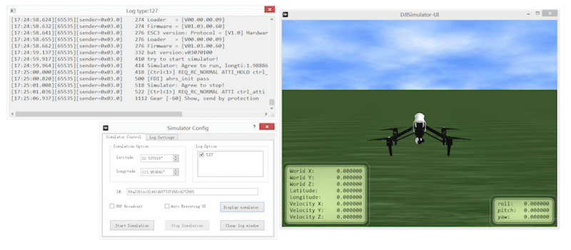

Then, run the app and connect your mobile device to the remote controller using Apple's lighting cable. You may see the following screenshot:

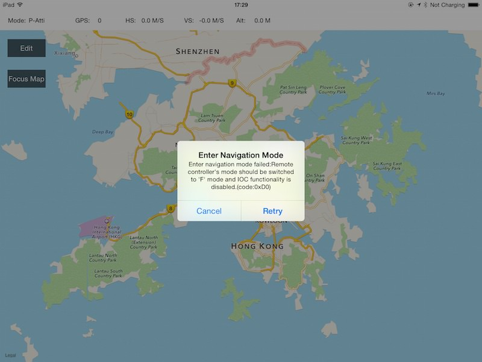

**Important**: To fix this problem, please switch the Remote Controller's mode selection to the **F** position (which used to be the A position in the previous version) and press **Retry** button. If the mode selection bar is in the F position when the autopilot is powered on, the user must toggle back and forth between **F** and another position and then press the **Retry** button again.

You are required to be in the **F** position when using the Intelligent Navigation, Hotpoint and Joystick functions in the DJI Mobile SDK.

Next, let's go to the DJI PC Simulator on your PC and press the **Start Simulation** button. If you check the application now, a tiny red aircraft will be shown on the map as seen below:

If you cannot find the aircraft, press the "**Focus Map**" button and the map view will zoom in to center the aircraft on the center of the map view region as shown below:

Now, if you press the **Stop Simulation** button on the Simulator Config, the aircraft will disappear on the map, since the simulator stops providing GPS data to the aircraft.
   
## Refactoring the UI

As you seen, the project's code structure was simple and not robust. In order to develop it further in this tutorial, it will need to be refactored and we will need to add more UI elements. 

### 1. Adding & Handling the New UIButtons

Firstly, we will create a new file named "DJIGSButtonController", which will be subclass of **UIViewController**. Make sure the check box saying "Also create XIB file" is selected when creating the file. Then open the DJIGSButtonController.xib file and set its size to **Freeform** under the "Size" dropdown in the **Simulated Metrics** section. In the view section, change the width to "100" and height to "288". Take a look at the changes made below:

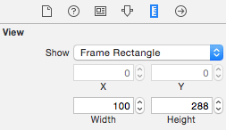

Next, drag eight UIButtons to the view and change their names to "Edit", "Back", "Clear", "Focus Map", "Start", "Stop", "Add" and "Config". "Edit" will sit on top of "Back", and "Focus Map" will sit on top of "Add". Make sure to hide the "Back", "Clear", "Start", "Stop", "Add" and "Config" buttons.

 Then add IBOutlets and IBActions for each of the eight buttons in the DJIGSButtonViewController.h file. Also, we will add an Enum named **DJIGSViewMode** with the two different modes the application could be in. Next, we add serveral delegate methods to be implemented by the delegate viewcontroller when IBAction methods for the buttons are trigger. Lastly, add the method **switchToMode:inGSButtonVC:** to update the state of the buttons when the **DJIGSViewMode** changed. Take a look at the code below:
 
 ~~~objc
#import <UIKit/UIKit.h>

typedef NS_ENUM(NSUInteger, DJIGSViewMode) {
    DJIGSViewMode_ViewMode,
    DJIGSViewMode_EditMode,
};

@class DJIGSButtonViewController;

@protocol DJIGSButtonViewControllerDelegate <NSObject>

- (void)stopBtnActionInGSButtonVC:(DJIGSButtonViewController *)GSBtnVC;
- (void)clearBtnActionInGSButtonVC:(DJIGSButtonViewController *)GSBtnVC;
- (void)focusMapBtnActionInGSButtonVC:(DJIGSButtonViewController *)GSBtnVC;
- (void)startBtnActionInGSButtonVC:(DJIGSButtonViewController *)GSBtnVC;
- (void)addBtn:(UIButton *)button withActionInGSButtonVC:(DJIGSButtonViewController *)GSBtnVC;
- (void)configBtnActionInGSButtonVC:(DJIGSButtonViewController *)GSBtnVC;
- (void)switchToMode:(DJIGSViewMode)mode inGSButtonVC:(DJIGSButtonViewController *)GSBtnVC;

@end

@interface DJIGSButtonViewController : UIViewController

@property (weak, nonatomic) IBOutlet UIButton *backBtn;
@property (weak, nonatomic) IBOutlet UIButton *stopBtn;
@property (weak, nonatomic) IBOutlet UIButton *clearBtn;
@property (weak, nonatomic) IBOutlet UIButton *focusMapBtn;
@property (weak, nonatomic) IBOutlet UIButton *editBtn;
@property (weak, nonatomic) IBOutlet UIButton *startBtn;
@property (weak, nonatomic) IBOutlet UIButton *addBtn;
@property (weak, nonatomic) IBOutlet UIButton *configBtn;

@property (assign, nonatomic) DJIGSViewMode mode;
@property (weak, nonatomic) id <DJIGSButtonViewControllerDelegate> delegate;

- (IBAction)backBtnAction:(id)sender;
- (IBAction)stopBtnAction:(id)sender;
- (IBAction)clearBtnAction:(id)sender;
- (IBAction)focusMapBtnAction:(id)sender;
- (IBAction)editBtnAction:(id)sender;
- (IBAction)startBtnAction:(id)sender;
- (IBAction)addBtnAction:(id)sender;
- (IBAction)configBtnAction:(id)sender;

@end
 ~~~
 
 Once you've taken care of that, open the DJIGSButtonViewController.m file to replace all the code in the file with the following code:
 
 ~~~objc
#import "DJIGSButtonViewController.h"

@implementation DJIGSButtonViewController

- (void)viewDidLoad {
    [super viewDidLoad];
    [self setMode:DJIGSViewMode_ViewMode];
}

- (void)didReceiveMemoryWarning {
    [super didReceiveMemoryWarning];
    // Dispose of any resources that can be recreated.
}

#pragma mark - Property Method
- (void)setMode:(DJIGSViewMode)mode
{
    _mode = mode;
    [_editBtn setHidden:(mode == DJIGSViewMode_EditMode)];
    [_focusMapBtn setHidden:(mode == DJIGSViewMode_EditMode)];
    [_backBtn setHidden:(mode == DJIGSViewMode_ViewMode)];
    [_clearBtn setHidden:(mode == DJIGSViewMode_ViewMode)];
    [_startBtn setHidden:(mode == DJIGSViewMode_ViewMode)];
    [_stopBtn setHidden:(mode == DJIGSViewMode_ViewMode)];
    [_addBtn setHidden:(mode == DJIGSViewMode_ViewMode)];
    [_configBtn setHidden:(mode == DJIGSViewMode_ViewMode)];
}

#pragma mark - IBAction Methods

- (IBAction)backBtnAction:(id)sender {
    [self setMode:DJIGSViewMode_ViewMode];
    if ([_delegate respondsToSelector:@selector(switchToMode:inGSButtonVC:)]) {
        [_delegate switchToMode:self.mode inGSButtonVC:self];
    }
}

- (IBAction)stopBtnAction:(id)sender {
    if ([_delegate respondsToSelector:@selector(stopBtnActionInGSButtonVC:)]) {
        [_delegate stopBtnActionInGSButtonVC:self];
    }
}

- (IBAction)clearBtnAction:(id)sender {
    if ([_delegate respondsToSelector:@selector(clearBtnActionInGSButtonVC:)]) {
        [_delegate clearBtnActionInGSButtonVC:self];
    }
}

- (IBAction)focusMapBtnAction:(id)sender {
    if ([_delegate respondsToSelector:@selector(focusMapBtnActionInGSButtonVC:)]) {
        [_delegate focusMapBtnActionInGSButtonVC:self];
    }
}

- (IBAction)editBtnAction:(id)sender {
    [self setMode:DJIGSViewMode_EditMode];
    if ([_delegate respondsToSelector:@selector(switchToMode:inGSButtonVC:)]) {
        [_delegate switchToMode:self.mode inGSButtonVC:self];
    }
}

- (IBAction)startBtnAction:(id)sender {
    if ([_delegate respondsToSelector:@selector(startBtnActionInGSButtonVC:)]) {
        [_delegate startBtnActionInGSButtonVC:self];
    }
}

- (IBAction)addBtnAction:(id)sender {
    if ([_delegate respondsToSelector:@selector(addBtn:withActionInGSButtonVC:)]) {
        [_delegate addBtn:self.addBtn withActionInGSButtonVC:self];
    }
}

- (IBAction)configBtnAction:(id)sender {
    if ([_delegate respondsToSelector:@selector(configBtnActionInGSButtonVC:)]) {
        [_delegate configBtnActionInGSButtonVC:self];
    }
}

@end
 ~~~
 
 With those changes, the code structure will look cleaner and more robust, which will help in its maintainence later on.
 
 Now, let's go to the DJIRootViewController.m file and delete the **editButton** IBOutlet, the **resetPointsAction** method, and the **focusMapAction** method. After making those deletions, create an UIView IBOutlet named "topBarView" and link it to the Main.storyboard's RootViewController's view, as seen below:
 
 
 
 Then, import the DJIGSButtonViewController.h header file. Create a property of type "DJIGSButtonViewController" named **gsButtonVC** and implement DJIGSButtonViewController's **DJIGSButtonViewControllerDelegate** protocol within the class, as shown below:
 
~~~objc
#import "DJIRootViewController.h"
#import <MapKit/MapKit.h>
#import <CoreLocation/CoreLocation.h>
#import <DJISDK/DJISDK.h>
#import "DJIMapController.h"
#import "DJIGSButtonViewController.h"
#import "DemoUtility.h"

#define kEnterNaviModeFailedAlertTag 1001

@interface DJIRootViewController ()<DJIGSButtonViewControllerDelegate, MKMapViewDelegate, CLLocationManagerDelegate, DJISDKManagerDelegate, DJIFlightControllerDelegate>
@property (nonatomic, assign)BOOL isEditingPoints;
@property (nonatomic, strong)DJIGSButtonViewController *gsButtonVC;
~~~

Furthermore, initialize the **gsButtonVC** property in the initUI method and move the original **focusMapAction** method's content to a new method named **focusMap**, as shown below:

~~~objc
self.gsButtonVC = [[DJIGSButtonViewController alloc] initWithNibName:@"DJIGSButtonViewController" bundle:[NSBundle mainBundle]];
[self.gsButtonVC.view setFrame:CGRectMake(0, self.topBarView.frame.origin.y + self.topBarView.frame.size.height, self.gsButtonVC.view.frame.size.width, self.gsButtonVC.view.frame.size.height)];
self.gsButtonVC.delegate = self;
[self.view addSubview:self.gsButtonVC.view];
~~~

~~~objc
- (void)focusMap
{
    if (CLLocationCoordinate2DIsValid(self.droneLocation)) {
        MKCoordinateRegion region = {0};
        region.center = self.droneLocation;
        region.span.latitudeDelta = 0.001;
        region.span.longitudeDelta = 0.001;
        
        [self.mapView setRegion:region animated:YES];
    }
}
~~~

Finally, implement **DJIGSButtonViewController**'s delegate methods, as shown below:

~~~objc
#pragma mark - DJIGSButtonViewController Delegate Methods
- (void)stopBtnActionInGSButtonVC:(DJIGSButtonViewController *)GSBtnVC
{
}

- (void)clearBtnActionInGSButtonVC:(DJIGSButtonViewController *)GSBtnVC
{
    [self.mapController cleanAllPointsWithMapView:self.mapView];
}

- (void)focusMapBtnActionInGSButtonVC:(DJIGSButtonViewController *)GSBtnVC
{
    [self focusMap];
}

- (void)configBtnActionInGSButtonVC:(DJIGSButtonViewController *)GSBtnVC
{

}

- (void)startBtnActionInGSButtonVC:(DJIGSButtonViewController *)GSBtnVC
{
}

- (void)switchToMode:(DJIGSViewMode)mode inGSButtonVC:(DJIGSButtonViewController *)GSBtnVC
{
    if (mode == DJIGSViewMode_EditMode) {
        [self focusMap];
    }
}

- (void)addBtn:(UIButton *)button withActionInGSButtonVC:(DJIGSButtonViewController *)GSBtnVC
{
    if (self.isEditingPoints) {
        self.isEditingPoints = NO;
        [button setTitle:@"Add" forState:UIControlStateNormal];
    }else
    {
        self.isEditingPoints = YES;
        [button setTitle:@"Finished" forState:UIControlStateNormal];
    }
}

~~~

In the **switchToMode:inGSButtonVC:** delegate method, we call the **focusMap** method. By doing this, we can focus the map view to the aircraft's location when the edit button is pressed, making it user friendly by preventing the user from having to zoom in to edit. Moreover, the  **isEditingPoints** property value and the add button title will be updated in the **addBtn:withActionInGSButtonVC** method when the button is pressed. 

Now, let's build and run the project and try to press the **Edit** and **Back** Buttons. Here are the animation when you press them:

## Configuring DJIWaypoint and DJIWaypointMission

### DJIWaypoint

Let's go to **DJIWaypoint.h** file and check it out. For example, you can use: 

~~~objc
-(id) initWithCoordinate:(CLLocationCoordinate2D)coordinate;
~~~
to create a waypoint object with a specific coordinate. Once you create a waypoint, you can add a **DJIWaypointAction** to it by calling:

~~~objc
-(BOOL) addAction:(DJIWaypointAction*)action;
~~~

Moreover, with waypoints, you have the ability to set the coordinate, altitude, heading and much more. For more details, please check the **DJIWaypoint.h** header file.

### DJIWaypointMission

A DJIWaypointMission is used when you want to upload, start and stop a Waypoint Mission. You can add waypoints of type **DJIWaypoint** using the method:

~~~objc
- (void)addWaypoint:(DJIWaypoint *_Nonnull)waypoint;
~~~

On the contrary, you can also delete waypoints from a task by using the method: 

~~~objc
- (void)removeWaypoint:(DJIWaypoint *_Nonnull)waypoint;
~~~
 method.
 
 Moreover, you can set the "finishedAction" property which is of **DJIWaypointMissionFinishedAction** enum type to configure what the aircraft does when the task is finished. Finally, you can set the **headingMode** property which is a **DJIWaypointMissionHeadingMode** enum type to configure what the aircraft's heading is while executing a task. 
  
For more details, please check the **DJIWaypointMission.h** header file in the DJI Mobile SDK.

### Creating The DJIWaypointConfigViewController

For this demo, we will assume that the parameters of each waypoint being added to the map view are the same. 

Now, let's create a new ViewController that will let the user to set the parameters of waypoints. Go to Xcode’s project navigator, right click on the **GSDemo** folder, select **New File...**, set its subclass to UIViewController, named it "DJIWaypointConfigViewController", and make sure "Also create XIB file" is selected. Next, open the DJIWaypointConfigViewController.xib file and implement the UI, as you see it below:

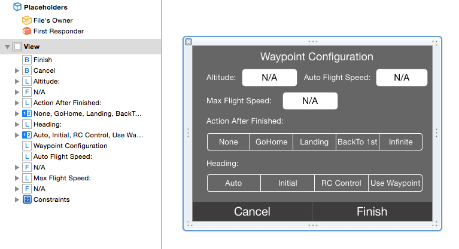

In the Waypoint Configuration ViewController, we use a UITextField to let the user set the **altitude** property of a DJIWaypoint object. Then, we use two UITextField to let the user set the **maxFlightSpeed** and **autoFlightSpeed** properties of DJIWaypointMission. Next, there are two UISegmentedControls to configure the **finishedAction** property and the **headingMode** property of a DJIWaypointMission object. 

At the bottom, we add two UIButtons for the **Cancel** and **Finish** actions. For more details about the settings, such as frame's position, frame's size, and background color of each UI element, please check the DJIWaypointConfigViewController.xib file in the downloaded project source code.

Now, let's create IBOutlets and IBActions for each of the UI elements in the DJIWaypointConfigViewController.h file, as shown below:

~~~objc
#import <UIKit/UIKit.h>

@class DJIWaypointConfigViewController;

@protocol DJIWaypointConfigViewControllerDelegate <NSObject>

- (void)cancelBtnActionInDJIWaypointConfigViewController:(DJIWaypointConfigViewController *)waypointConfigVC;
- (void)finishBtnActionInDJIWaypointConfigViewController:(DJIWaypointConfigViewController *)waypointConfigVC;

@end

@interface DJIWaypointConfigViewController : UIViewController

@property (weak, nonatomic) IBOutlet UITextField *altitudeTextField;
@property (weak, nonatomic) IBOutlet UITextField *autoFlightSpeedTextField;
@property (weak, nonatomic) IBOutlet UITextField *maxFlightSpeedTextField;
@property (weak, nonatomic) IBOutlet UISegmentedControl *actionSegmentedControl;
@property (weak, nonatomic) IBOutlet UISegmentedControl *headingSegmentedControl;

@property (weak, nonatomic) id <DJIWaypointConfigViewControllerDelegate>delegate;

- (IBAction)cancelBtnAction:(id)sender;
- (IBAction)finishBtnAction:(id)sender;

@end
~~~

Here, we also create two "DJIWaypointConfigViewControllerDelegate" delegate methods that are called when **Cancel** and **Finish** buttons are pressed.

Next, let's replace the code in the DJIWaypointConfigViewController.m file with the following code:

~~~objc
#import "DJIWaypointConfigViewController.h"
@interface DJIWaypointConfigViewController ()
@end

@implementation DJIWaypointConfigViewController

- (void)viewDidLoad {
    [super viewDidLoad];
    [self initUI];
}

- (void)didReceiveMemoryWarning {
    [super didReceiveMemoryWarning];
    // Dispose of any resources that can be recreated.
}

- (void)initUI
{
    self.altitudeTextField.text = @"100"; //Set the altitude to 100
    self.autoFlightSpeedTextField.text = @"8"; //Set the autoFlightSpeed to 8
    self.maxFlightSpeedTextField.text = @"10"; //Set the maxFlightSpeed to 10
    [self.actionSegmentedControl setSelectedSegmentIndex:1]; //Set the finishAction to DJIWaypointMissionFinishedGoHome
    [self.headingSegmentedControl setSelectedSegmentIndex:0]; //Set the headingMode to DJIWaypointMissionHeadingAuto
    
}

- (IBAction)cancelBtnAction:(id)sender {
    if ([_delegate respondsToSelector:@selector(cancelBtnActionInDJIWaypointConfigViewController:)]) {
        [_delegate cancelBtnActionInDJIWaypointConfigViewController:self];
    }
}

- (IBAction)finishBtnAction:(id)sender {
    if ([_delegate respondsToSelector:@selector(finishBtnActionInDJIWaypointConfigViewController:)]) {
        [_delegate finishBtnActionInDJIWaypointConfigViewController:self];
    }
}

@end
~~~

In the code above, we create an **initUI** method, which is called in the viewDidload method, to initialize the UI controls with some default data. For example, we set the default text for the **altitudeTextField** to **100**, so there is no need for the user to type in a custom altitude value in the textField when the application is first opened. They will be able to press the **Finish** button right away instead of having to change the settings before they start.

## Implementing the DJIWaypoint Mission

### Adding the DJIWaypointConfigViewController to DJIRootViewController

Now,let's go to DJIRootViewController.m file, add the DJIWaypointConfigViewController.h header file at the top, and create a property of type **DJIWaypointConfigViewController** with the name "waypointConfigVC". Then, implement the DJIWaypointConfigViewControllerDelegate protocol, as shown below:

~~~objc
#import "DJIWaypointConfigViewController.h"

@interface DJIRootViewController ()<DJIGSButtonViewControllerDelegate, DJIWaypointConfigViewControllerDelegate, MKMapViewDelegate, CLLocationManagerDelegate, DJISDKManagerDelegate, DJIFlightControllerDelegate>

@property (nonatomic, assign)BOOL isEditingPoints;
@property (nonatomic, strong)DJIGSButtonViewController *gsButtonVC;
@property (nonatomic, strong)DJIWaypointConfigViewController *waypointConfigVC;
~~~

Next, let's add some code to initialize the **waypointConfigVC** instance variable and set its delegate as "DJIRootViewController" at the bottom of the **initUI** method:

~~~objc
-(void) initUI
{
    self.modeLabel.text = @"N/A";
    self.gpsLabel.text = @"0";
    self.vsLabel.text = @"0.0 M/S";
    self.hsLabel.text = @"0.0 M/S";
    self.altitudeLabel.text = @"0 M";
    
    self.gsButtonVC = [[DJIGSButtonViewController alloc] initWithNibName:@"DJIGSButtonViewController" bundle:[NSBundle mainBundle]];
    [self.gsButtonVC.view setFrame:CGRectMake(0, self.topBarView.frame.origin.y + self.topBarView.frame.size.height, self.gsButtonVC.view.frame.size.width, self.gsButtonVC.view.frame.size.height)];
    self.gsButtonVC.delegate = self;
    [self.view addSubview:self.gsButtonVC.view];
    
    self.waypointConfigVC = [[DJIWaypointConfigViewController alloc] initWithNibName:@"DJIWaypointConfigViewController" bundle:[NSBundle mainBundle]];
    self.waypointConfigVC.view.alpha = 0;
    
    self.waypointConfigVC.view.autoresizingMask = UIViewAutoresizingFlexibleLeftMargin|UIViewAutoresizingFlexibleRightMargin|UIViewAutoresizingFlexibleTopMargin|UIViewAutoresizingFlexibleBottomMargin;
    
    CGFloat configVCOriginX = (CGRectGetWidth(self.view.frame) - CGRectGetWidth(self.waypointConfigVC.view.frame))/2;
    CGFloat configVCOriginY = CGRectGetHeight(self.topBarView.frame) + CGRectGetMinY(self.topBarView.frame) + 8;
    
    [self.waypointConfigVC.view setFrame:CGRectMake(configVCOriginX, configVCOriginY, CGRectGetWidth(self.waypointConfigVC.view.frame), CGRectGetHeight(self.waypointConfigVC.view.frame))];
    
    if ([UIDevice currentDevice].userInterfaceIdiom == UIUserInterfaceIdiomPad) //Check if it's using iPad and center the config view
    {
        self.waypointConfigVC.view.center = self.view.center;
    }

    self.waypointConfigVC.delegate = self;
    [self.view addSubview:self.waypointConfigVC.view];
    
}
~~~

In the code above, we set the **alpha** property of the **waypointConfigVC**'s view to 0 to initially hide the view. Then, center its location to the center of DJIRootViewController's view when it runs on iPad.

Furthermore, implement the **DJIWaypointConfigViewControllerDelegate** methods, as shown below:

~~~objc
#pragma mark - DJIWaypointConfigViewControllerDelegate Methods

- (void)cancelBtnActionInDJIWaypointConfigViewController:(DJIWaypointConfigViewController *)waypointConfigVC
{
    WeakRef(weakSelf);
    
    [UIView animateWithDuration:0.25 animations:^{
        WeakReturn(weakSelf);
        weakSelf.waypointConfigVC.view.alpha = 0;
    }];
}

- (void)finishBtnActionInDJIWaypointConfigViewController:(DJIWaypointConfigViewController *)waypointConfigVC
{
    WeakRef(weakSelf);
    
    [UIView animateWithDuration:0.25 animations:^{
        WeakReturn(weakSelf);
        weakSelf.waypointConfigVC.view.alpha = 0;
    }];

}
~~~

In the first delegate method, we use a class method from UIView to animate the changing **alpha** value of **waypointConfigVC**'s view:

~~~objc
+ (void)animateWithDuration:(NSTimeInterval)duration animations:(void (^)(void))animations NS_AVAILABLE_IOS(4_0);
~~~

In the second delegate method, we do the same thing as we did in the first delegate method.

Lastly, replace the code in the **configBtnActionInGSButtonVC:** method with the following code to show the **waypointConfigVC**'s view when the user presses the **Config** button:

~~~objc
- (void)configBtnActionInGSButtonVC:(DJIGSButtonViewController *)GSBtnVC
{
    WeakRef(weakSelf);

    [UIView animateWithDuration:0.25 animations:^{
        WeakReturn(weakSelf);
        weakSelf.waypointConfigVC.view.alpha = 1.0;
    }];
        
}
~~~

Once that's done, let's build and run the project. Try to show the **waypointConfigVC**'s view by pressing the **Edit** button and **Config** button:

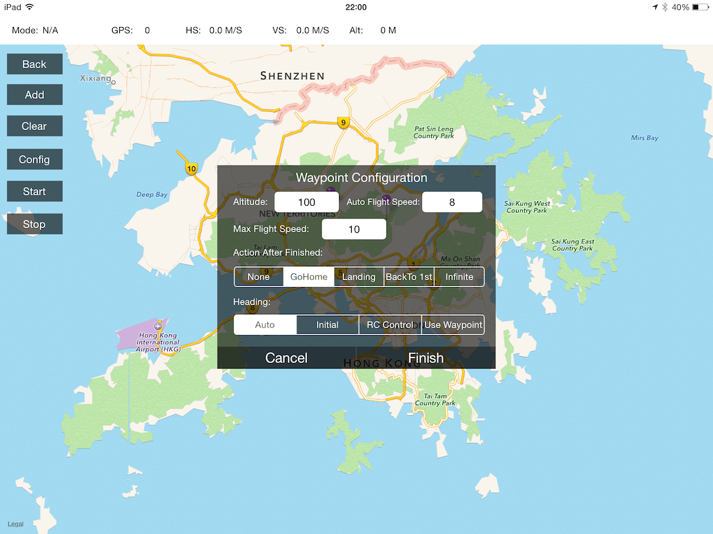

### Handling The DJIWaypoint Mission

Now let's go back to DJIRootViewController.m file. Create a property of type **DJIWaypointMission** and named it as "waypointMission" as shown below:

~~~objc
@property(nonatomic, strong) DJIWaypointMission* waypointMission;
~~~

Next, replace the code in **configBtnActionInGSButtonVC** delegate method with the followings:

~~~objc
- (void)configBtnActionInGSButtonVC:(DJIGSButtonViewController *)GSBtnVC
{
    WeakRef(weakSelf);
    
    NSArray* wayPoints = self.mapController.wayPoints;
    if (wayPoints == nil || wayPoints.count < DJIWaypointMissionMinimumWaypointCount) {
        ShowMessage(@"No or not enough waypoints for mission", @"", nil, @"OK");
        return;
    }
    
    [UIView animateWithDuration:0.25 animations:^{
        WeakReturn(weakSelf);
        weakSelf.waypointConfigVC.view.alpha = 1.0;
    }];
    
    if (self.waypointMission){
        [self.waypointMission removeAllWaypoints];
    }
    else{
        self.waypointMission = [[DJIWaypointMission alloc] init];
    }
    
    for (int i = 0; i < wayPoints.count; i++) {
        CLLocation* location = [wayPoints objectAtIndex:i];
        if (CLLocationCoordinate2DIsValid(location.coordinate)) {
            DJIWaypoint* waypoint = [[DJIWaypoint alloc] initWithCoordinate:location.coordinate];
            [self.waypointMission addWaypoint:waypoint];
        }
    }
}
~~~

In the code above, we create a local NSArray variable named **wayPoints** and assign its value as the mapController's **wayPoints** array. Next, check whether or not the array exists or whether or not it's empty. If it is empty or does not exist, show a UIAlertView letting the user know there are no waypoints for the mission. 

**Important**: For safety, it's important to add logic to check the GPS satellite count, before the start of the mission. If the satellite count is less than 6, you should prevent the user from starting the waypoint mission and show a warning. Since we are using the DJI PC Simulator here, we are testing the application under a perfect situation, where the GPS satellite count is always 10.

Next, we use a for loop to get the **CLLocation** for each waypoint from the **wayPoints** array and check if its **coordinate** is valid by using the method:

~~~objc
BOOL CLLocationCoordinate2DIsValid(CLLocationCoordinate2D coord);
~~~

Finally, if the coordinate is valid, we create a waypoint of type **DJIWaypoint** and add it to the **waypointMission**.

Once that is complete, let's go to DJIWaypointConfigViewController's delegate method **finishBtnActionInDJIWaypointConfigViewController** and replace the code inside with the followings:

~~~objc
- (void)finishBtnActionInDJIWaypointConfigViewController:(DJIWaypointConfigViewController *)waypointConfigVC
{
    WeakRef(weakSelf);
    
    [UIView animateWithDuration:0.25 animations:^{
        WeakReturn(weakSelf);
        weakSelf.waypointConfigVC.view.alpha = 0;
    }];
    
    for (int i = 0; i < self.waypointMission.waypointCount; i++) {
        DJIWaypoint* waypoint = [self.waypointMission getWaypointAtIndex:i];
        waypoint.altitude = [self.waypointConfigVC.altitudeTextField.text floatValue];
    }
    
    self.waypointMission.maxFlightSpeed = [self.waypointConfigVC.maxFlightSpeedTextField.text floatValue];
    self.waypointMission.autoFlightSpeed = [self.waypointConfigVC.autoFlightSpeedTextField.text floatValue];
    self.waypointMission.headingMode = (DJIWaypointMissionHeadingMode)self.waypointConfigVC.headingSegmentedControl.selectedSegmentIndex;
    self.waypointMission.finishedAction = (DJIWaypointMissionFinishedAction)self.waypointConfigVC.actionSegmentedControl.selectedSegmentIndex;

    [self.missionManager prepareMission:self.waypointMission withProgress:^(float progress) {
        //Do something with progress
    } withCompletion:^(NSError * _Nullable error) {
        if (error){
            NSString* prepareError = [NSString stringWithFormat:@"Prepare Mission failed:%@", error.description];
            ShowMessage(@"", prepareError, nil, @"OK");
        }else {
            ShowMessage(@"", @"Prepare Mission Finished", nil, @"OK");
        }
    }];
}
~~~

Above, we use a for loop to set the **altitude** property of each DJIWaypoint in the **waypointMission** waypoint array based on the settings that are set in the DJIWaypointConfigViewController. After that is complete, we update the "maxFlightSpeed", "autoFlightSpeed", "headingMode" and "finishedAction" properties of **waypointMission**. Then we call the **prepareMission** method of DJIMissionManager to prepare the waypoint mission for execution. You can get the preparation progress from the "DJIMissionProgressHandler" block.

Furthermore, let's implement **startBtnActionInGSButtonVC** as shown below:

~~~objc
- (void)startBtnActionInGSButtonVC:(DJIGSButtonViewController *)GSBtnVC
{
    [self.missionManager startMissionExecutionWithCompletion:^(NSError * _Nullable error) {
        if (error){
            ShowMessage(@"Start Mission Failed", error.description, nil, @"OK");
        }else
        {
            ShowMessage(@"", @"Mission Started", nil, @"OK");
        }
    }];
}
~~~

Here, call the **startMissionExecutionWithCompletion** method of DJIMissionManager to start the DJIWaypoint mission! Then create a UIAlertView to display error message when start mission failed.

Finally, let's implement the **stopMissionExecutionWithCompletion** method of DJIMissionManager in the **DJIGSButtonViewController** delegate method to stop the waypoint mission, as shown below:

~~~objc
- (void)stopBtnActionInGSButtonVC:(DJIGSButtonViewController *)GSBtnVC
{
    [self.missionManager stopMissionExecutionWithCompletion:^(NSError * _Nullable error) {
        if (error){
            NSString* failedMessage = [NSString stringWithFormat:@"Stop Mission Failed: %@", error.description];
            ShowMessage(@"", failedMessage, nil, @"OK");
        }else
        {
            ShowMessage(@"", @"Stop Mission Finished", nil, @"OK");
        }
    }];
}
~~~

## Showtime

You've come a long way in this tutorial, and it's time to test the whole application.

**Important**: Make sure the battery level of your aircraft is more than 10%, otherwise the waypoint mission may fail!

Build and run the project to install the application into your mobile device. After that, please connect the aircraft to your PC or Virtual Machine running Windows via a Micro USB cable. Then, power on the remote controller and the aircraft, in that order. 

Next, press the **Display Simulator** button in the DJI PC Simulator and feel free to type in your current location's latitude and longitude data into the simulator.

Then connect your mobile device to the remote controller using Apple's lighting cable and run the application. You may see the following screenshot:

If you encounter this issue, check the solution to this problem in the previous part of this tutorial. Next, let's come back to the DJI PC Simulator on your PC and press the **Start Simulation** button. A tiny red aircraft will appear on the map in your application, as seen below:

Press the **Edit** button, and the map view will zoom in to the region you are in and will center the aircraft:

Next, test the waypoint feature by tapping wherever you'd like on the map view. Wherever you do tap, a waypoint will be added and a purple pin will appear exactly at the location of the waypoint, as shown below:

Once you press the **Config** button, the **Waypoint Configuration** view will appear. After you're satisfied with the changes, press the **Finish** button. The waypoint mission will start to prepare. Then press the **Start** button to start the waypoint mission execution. Now you will should see the aircraft move towards the waypoints you set previously on the map view, as shown below:

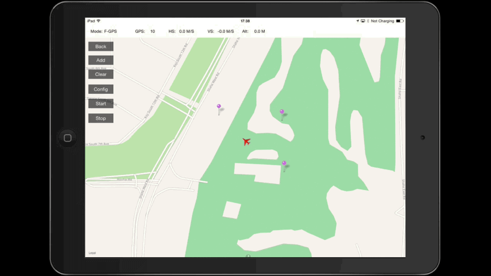

At the same time, you will be able to see the Inspire 1 take off and start to fly in the DJI PC Simulator.

When the waypoint mission finishes, the Inspire 1 will start to go home!

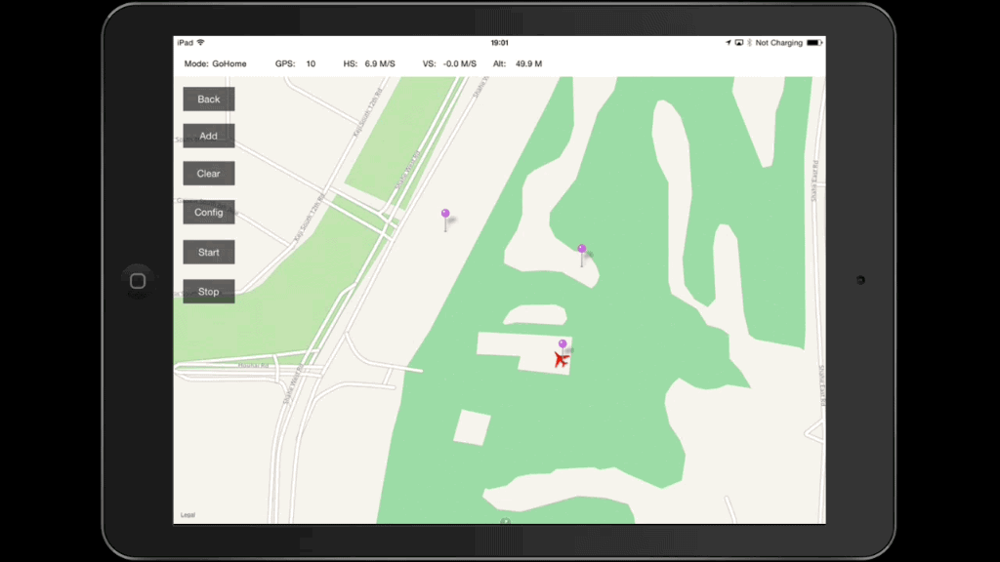 

The remote controller will start beeping, and the **Go Home** button on the remote controller will start to flash a white light. Let's take a look at the DJI PC Simulator now:

 
The inspire 1 will eventually go home, land, and the beeping from the remote controller will stop. The application will go back to its normal status. If you press the **Clear** button, all the waypoints you previously set will be cleared. During the mission, if you'd ever like to stop the DJIWaypoint mission, you can do so by pressing the **Stop** button.

## Summary
   
   In this tutorial, you’ve learned how to setup and use the DJI PC Simulator to test your waypoint mission application, upgrade your aircraft's firmware to the developer version, use the DJI Mobile SDK to create a simple map view, modify annotations of the map view, show the aircraft on the map view by using GPS data from the DJI PC Simulator. Next, you learned how to configure **DJIWaypoint** parameters, how to add waypoints to **DJIWaypointMission**. Moreover, you learned how to use DJIMissionManager to **prepare**, **start** and **stop** missions. 
      
   Congratulations! Now that you've finished the demo project, you can build on what you've learned and start to build your own waypoint mission application. You can improve the method which waypoints are added(such as drawing a line on the map and generating waypoints automatically), play around with the properties of a waypoint (such as heading, etc.), and adding more functionality. In order to make a cool waypoint mission application, you still have a long way to go. Good luck and hope you enjoy this tutorial!

