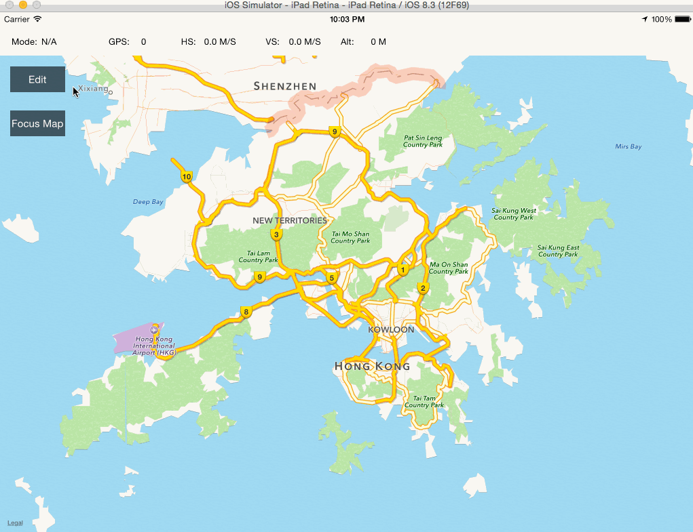
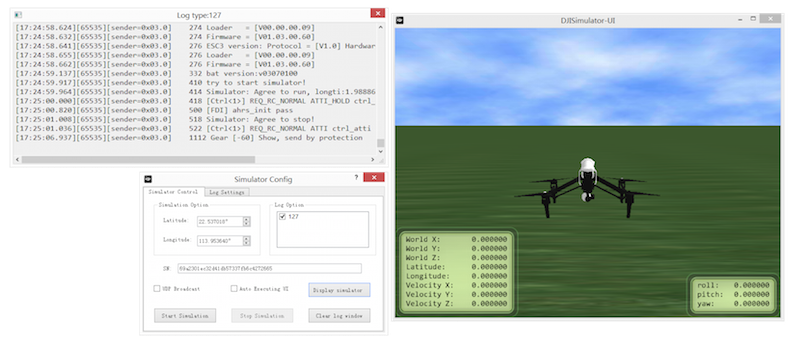
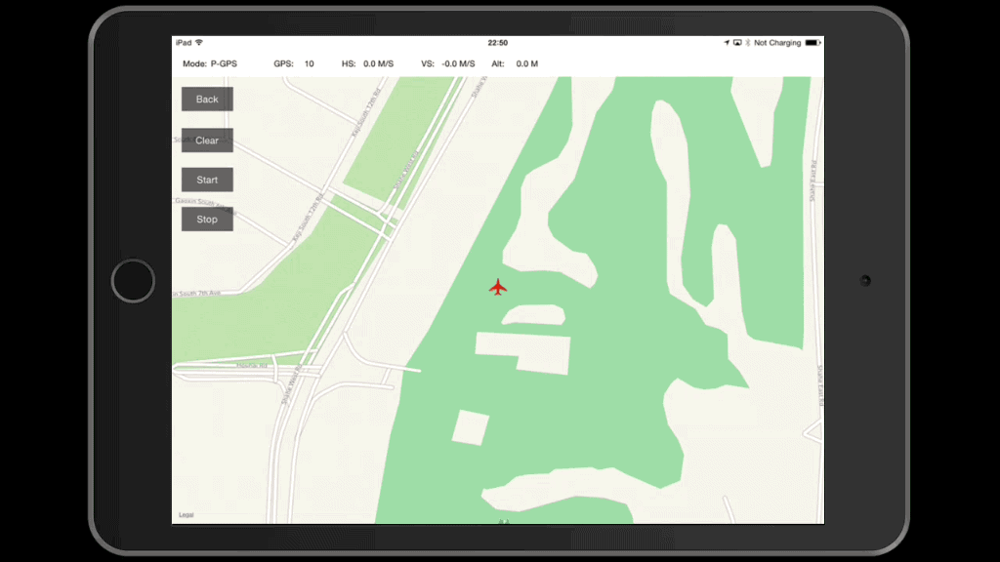

# How to create a MapView and Waypoint Application: Part 2/2

<!-- toc -->

*Note: The code in this tutorial has been written to be run on the iPad. Please make sure you run this code on an iPad or an iPad simulator.*

In this tutorial, you will learn how to implement the basic processes of using Waypoints in the GroundStation. Of the three features(waypoint, hotpoint, and follow me), waypoint is the most complicated feature and commonly used in GroundStation. If you haven't read Part 1 of this tutorial, please take a look at it [here](../../../iOS/GSDemo/Part1/GSDemo_Part1_en.md) before moving forward. Let's get started!

   You can download the demo project for this tutorial from here: <https://github.com/DJI-Mobile-SDK/iOS-GSDemo-Part2.git>
   
## 1. Refactor the UI
In Part 1 of this tutorial, the project's code structure was simple and not robust. In order to develop it further in this tutorial, it will need to be refactored and we will need to add more UI elements. 
#### 1. Add & Handle The New UIButtons
First, we will create a new file named **DJIGSButtonController**, which will be subclass of **UIViewController**. Make sure the check box saying **Also create XIB file** is selected when creating the file. Then open the **DJIGSButtonController.xib** file and set its size to **Freeform** under the **Size** dropdown in the **Simulated Metrics** section. In the view section, change the width to **110** and height to **260**. Take a look at the changes made below:

Next, drag six UIButtons to the view and change their names to **Edit**, **Back**, **Clear**, **Focus Map**, **Start** and **Stop**. **Edit** will sit on top of **Back**, and **Focus Map** will sit on top of **Clear**. Make sure to hide the **Back**, **Clear**, **Start** and **Stop** buttons.

 Then add IBOutlets and IBActions for each of the six buttons in the **DJIGSButtonViewController.h** file. Also, we will add an Enum named **DJIGSViewMode** with the two different modes the application could be in. Next, we add serveral delegate methods to be implemented by the delegate viewcontroller when IBAction methods for the buttons are trigger. Lastly, add the method **- (void)switchToMode:(DJIGSViewMode)mode inGSButtonVC:(DJIGSButtonViewController *)GSBtnVC;** to update the state of the buttons when the **DJIGSViewMode** changed. Take a look at the code below:
 
 ~~~objc
 #import <UIKit/UIKit.h>
 
 typedef NS_ENUM(NSUInteger, DJIGSViewMode) {
    DJIGSViewMode_ViewMode,
    DJIGSViewMode_EditMode,
};

@class DJIGSButtonViewController;

@protocol DJIGSButtonViewControllerDelegate <NSObject>

- (void)stopBtnActionInGSButtonVC:(DJIGSButtonViewController *)GSBtnVC;
- (void)clearBtnActionInGSButtonVC:(DJIGSButtonViewController *)GSBtnVC;
- (void)focusMapBtnActionInGSButtonVC:(DJIGSButtonViewController *)GSBtnVC;
- (void)startBtnActionInGSButtonVC:(DJIGSButtonViewController *)GSBtnVC;

- (void)switchToMode:(DJIGSViewMode)mode inGSButtonVC:(DJIGSButtonViewController *)GSBtnVC;
@end

@interface DJIGSButtonViewController : UIViewController

@property (weak, nonatomic) IBOutlet UIButton *backBtn;
@property (weak, nonatomic) IBOutlet UIButton *stopBtn;
@property (weak, nonatomic) IBOutlet UIButton *clearBtn;
@property (weak, nonatomic) IBOutlet UIButton *focusMapBtn;
@property (weak, nonatomic) IBOutlet UIButton *editBtn;
@property (weak, nonatomic) IBOutlet UIButton *startBtn;

@property (assign, nonatomic) DJIGSViewMode mode;
@property (weak, nonatomic) id <DJIGSButtonViewControllerDelegate> delegate;

- (IBAction)backBtnAction:(id)sender;
- (IBAction)stopBtnAction:(id)sender;
- (IBAction)clearBtnAction:(id)sender;
- (IBAction)focusMapBtnAction:(id)sender;
- (IBAction)editBtnAction:(id)sender;
- (IBAction)startBtnAction:(id)sender;

@end
 ~~~
 
 Once you've taken care of that, open the **DJIGSButtonViewController.m** file to replace all the code in the file with the following code:
 
 ~~~objc
 #import "DJIGSButtonViewController.h"

@implementation DJIGSButtonViewController

- (void)viewDidLoad {
    [super viewDidLoad];
    [self setMode:DJIGSViewMode_ViewMode];
}

- (void)didReceiveMemoryWarning {
    [super didReceiveMemoryWarning];
    // Dispose of any resources that can be recreated.
}

#pragma mark - Property Method
- (void)setMode:(DJIGSViewMode)mode
{
    _mode = mode;
    [_editBtn setHidden:(mode == DJIGSViewMode_EditMode)];
    [_focusMapBtn setHidden:(mode == DJIGSViewMode_EditMode)];
    [_backBtn setHidden:(mode == DJIGSViewMode_ViewMode)];
    [_clearBtn setHidden:(mode == DJIGSViewMode_ViewMode)];
    [_startBtn setHidden:(mode == DJIGSViewMode_ViewMode)];
    [_stopBtn setHidden:(mode == DJIGSViewMode_ViewMode)];
}

#pragma mark - IBAction Methods
- (IBAction)backBtnAction:(id)sender {
    [self setMode:DJIGSViewMode_ViewMode];
    if ([_delegate respondsToSelector:@selector(switchToMode:inGSButtonVC:)]) {
        [_delegate switchToMode:self.mode inGSButtonVC:self];
    }
}

- (IBAction)stopBtnAction:(id)sender {
 
    if ([_delegate respondsToSelector:@selector(stopBtnActionInGSButtonVC:)]) {
        [_delegate stopBtnActionInGSButtonVC:self];
    }
}

- (IBAction)clearBtnAction:(id)sender {
    
    if ([_delegate respondsToSelector:@selector(clearBtnActionInGSButtonVC:)]) {
        [_delegate clearBtnActionInGSButtonVC:self];
    }
}

- (IBAction)focusMapBtnAction:(id)sender {
    
    if ([_delegate respondsToSelector:@selector(focusMapBtnActionInGSButtonVC:)]) {
        [_delegate focusMapBtnActionInGSButtonVC:self];
    }
}

- (IBAction)editBtnAction:(id)sender {
    
    [self setMode:DJIGSViewMode_EditMode];
    if ([_delegate respondsToSelector:@selector(switchToMode:inGSButtonVC:)]) {
        [_delegate switchToMode:self.mode inGSButtonVC:self];
    }
}

- (IBAction)startBtnAction:(id)sender {
    
    if ([_delegate respondsToSelector:@selector(startBtnActionInGSButtonVC:)]) {
        [_delegate startBtnActionInGSButtonVC:self];
    }
}

@end
 ~~~
 
 With those changes, the code structure will look cleaner and more robust, which will help in its maintainence later on.
 
 Now, let's go to the **DJIRootViewController.h** file and delete the **editButton** IBOutlet, the **resetPointsAction** method, and the **focusMapAction** method. After making those deletions, create an UIView IBOutlet named "topBarView" and link it to the **Main.storyboard**'s RootViewController's  view, as seen below:
 
 
 
 Then, open the **DJIRootViewController.m** file, import the **DJIGSButtonViewController.h** header file. Create a property of type **DJIGSButtonViewController** named **gsButtonVC** and implement **DJIGSButtonViewController**'s **DJIGSButtonViewControllerDelegate** protocol within the class, as shown below:
 
~~~objc
#import "DJIRootViewController.h"
#import "DJIGSButtonViewController.h"

#define kEnterNaviModeFailedAlertTag 1001

@interface DJIRootViewController ()<DJIGSButtonViewControllerDelegate>
@property (nonatomic, assign)BOOL isEditingPoints;
@property (nonatomic, strong)DJIGSButtonViewController *gsButtonVC;
@end
~~~

Furthermore, initialize the **gsButtonVC** property in the **initUI** method and move the original **focusMapAction** method's content to a new method named **focusMap**, as shown below:

~~~objc
self.gsButtonVC = [[DJIGSButtonViewController alloc] initWithNibName:@"DJIGSButtonViewController" bundle:[NSBundle mainBundle]];
[self.gsButtonVC.view setFrame:CGRectMake(0, self.topBarView.frame.origin.y + self.topBarView.frame.size.height, self.gsButtonVC.view.frame.size.width, self.gsButtonVC.view.frame.size.height)];
self.gsButtonVC.delegate = self;
[self.view addSubview:self.gsButtonVC.view];
~~~

~~~objc
- (void)focusMap
{
    if (CLLocationCoordinate2DIsValid(self.droneLocation)) {
        MKCoordinateRegion region = {0};
        region.center = self.droneLocation;
        region.span.latitudeDelta = 0.001;
        region.span.longitudeDelta = 0.001;
        
        [self.mapView setRegion:region animated:YES];
    }
}
~~~

Finally, implement **DJIGSButtonViewController**'s delegate methods, as shown below:

~~~objc
#pragma mark - DJIGSButtonViewController Delegate Methods
- (void)stopBtnActionInGSButtonVC:(DJIGSButtonViewController *)GSBtnVC
{
}

- (void)clearBtnActionInGSButtonVC:(DJIGSButtonViewController *)GSBtnVC
{
    [self.mapController cleanAllPointsWithMapView:self.mapView];
}

- (void)focusMapBtnActionInGSButtonVC:(DJIGSButtonViewController *)GSBtnVC
{
    [self focusMap];
}

- (void)startBtnActionInGSButtonVC:(DJIGSButtonViewController *)GSBtnVC
{
}

- (void)switchToMode:(DJIGSViewMode)mode inGSButtonVC:(DJIGSButtonViewController *)GSBtnVC
{
    if (mode == DJIGSViewMode_EditMode) {
         self.isEditingPoints = YES;
        [self focusMap];
    }else
    {
         self.isEditingPoints = No;
    }
}
~~~

In the **- (void)switchToMode:(DJIGSViewMode)mode inGSButtonVC:(DJIGSButtonViewController *)GSBtnVC** delegate method, we call the **focusMap** method. By doing this, we can focus the map view to the aircraft's location when the edit button is pressed, making it user friendly by preventing the user from having to zoom in to edit. Moreover, when the application is in edit mode, the  **isEditingPoints** property value is set to **YES**. 

Now, let's build and run the project and try to press the **Edit** and **Back** Buttons. Here are the animation when you press them:

## 2. Configure The DJIGroundStationWaypoint and The DJIGroundStationTask

#### 1. DJIGroundStationWaypoint

Let's go to **DJIGroundStationWaypoint.h** file and check it out. For example, you can use: 

~~~objc
-(id) initWithCoordinate:(CLLocationCoordinate2D)coordinate;
~~~
to create a waypoint object with a specific coordinate. Once you create a waypoint, you can add a **DJIWaypointAction** to it by calling:

~~~objc
-(BOOL) addWaypointAction:(DJIWaypointAction*)action;
~~~

Moreover, with waypoints, you have the ability to set the coordinate, altitude, heading, horizontalVelocity and much more. For more details, please check the **DJIGroundStationWaypoint.h** header file.

#### 2. DJIGroundStationTask

A **DJIGroundStationTask** is used when you want to start a GroundStation Waypoint task. You can call its class method **+(id) newTask;** directly to create a new task. Once you create the task, you can add waypoints of type **DJIGroundStationWaypoint** using the method: 

~~~objc
-(void) addWaypoint:(DJIGroundStationWaypoint*)waypoint;
~~~

On the contrary, you can also delete waypoints from a task by using the method: 

~~~objc
-(void) removeWaypoint:(DJIGroundStationWaypoint*)waypoint;
~~~
 method.
 
 Moreover, you can set the **isLoop** property of a **DJIGroundStationTask** to decide whether to execute the task looply. Also, you can set the **finishedAction** property which is of **DJIGSTaskFinishedAction** enum type to configure what the aircraft does when the task is finished. Finally, you can set the **headingMode** property which is a **DJIGSHeadingMode** enum type to configure what the aircraft's heading is while executing a task. Below, you can find some parts of the header file:
 
~~~objc
/**
 *  Action of task when finished
 */
typedef NS_ENUM(NSUInteger, DJIGSTaskFinishedAction){
    /**
     *  No action. aircraft will stay at the last waypoint
     */
    GSTaskFinishedNoAction,
    /**
     *  Aircraft will go home
     */
    GSTaskFinishedGoHome,
    /**
     *  Aircraft will auto landing
     */
    GSTaskFinishedAutoLanding,
    /**
     *  Aircraft will go to the first waypoint
     */
    GSTaskFinishedGoFirstWaypoint
};

/**
 *  Heading mode
 */
typedef NS_ENUM(NSUInteger, DJIGSHeadingMode){
    /**
     *  Aircraft's heading toward to the next waypoint
     */
    GSHeadingTowardNexWaypoint,
    /**
     *  Aircraft's heading using the initial direction
     */
    GSHeadingUsingInitialDirection,
    /**
     *  Aircraft's heading control by the remote controller
     */
    GSHeadingControlByRemoteController,
    /**
     *  Aircraft's heading using the waypoint's heading value
     */
    GSHeadingUsingWaypointHeading,
};

/**
 *  Whether execute task looply. Default is NO
 */
@property(nonatomic, assign) BOOL isLoop;

/**
 *  Action for the aircraft while the task finished
 */
@property(nonatomic, assign) DJIGSTaskFinishedAction finishedAction;

/**
 *  How the aircraft heading while executing task
 */
@property(nonatomic, assign) DJIGSHeadingMode headingMode;

/**
 *  Create new task
 *
 */
+(id) newTask;

/**
 *  Add waypoint
 *
 *  @param waypoint
 */
-(void) addWaypoint:(DJIGroundStationWaypoint*)waypoint;

/**
 *  Remove one waypoint
 *
 *  @param waypoint Waypoint will be removed
 */
-(void) removeWaypoint:(DJIGroundStationWaypoint*)waypoint;

~~~
 
For more details, please check the **DJIGroundStationTask.h** header file in the DJI Mobile SDK.

#### 3. Create The DJIWaypointConfigViewController

For this demo, we will assume that the parameters of each waypoint being added to the map view are the same. 

Now, let's create a new ViewController that will let the user to set the parameters of waypoints. Go to Xcode’s project navigator, right click on the **GSDemo** folder, select **New File...**, set its subclass to **UIViewController**, named it **DJIWaypointConfigViewController**, and make sure "Also create XIB file" is selected. Next, open the **DJIWaypointConfigViewController.xib** file and implement the UI, as you see it below:

In the Waypoint Configuration ViewController, we use a UITextField to let the user set the **altitude** property of a **DJIGroundStationWaypoint** object. Then, there is a UISwitcher to configure the **isLoop** property of a **DJIGroundStationTask** object, which will let you turn on/off whether the task repeats. Next, there are three UISegmentedControls to configure the **horizontalVelocity** property of a **DJIGroundStationWaypoint** object, the **finishedAction** property of a **DJIGroundStationTask** object, and the **headingMode** property of a **DJIGroundStationTask** object. 

At the bottom, we add two UIButtons for the **Cancel** and **Finish** actions. For more details about the settings, such as frame's position, frame's size, and background color of each UI element, please check the **DJIWaypointConfigViewController.xib** file in the downloaded project source code.

Now, let's create IBOutlets and IBActions for each of the UI elements in the **DJIWaypointConfigViewController.h** file, as shown below:

~~~objc
#import <UIKit/UIKit.h>

@class DJIWaypointConfigViewController;

@protocol DJIWaypointConfigViewControllerDelegate <NSObject>

- (void)cancelBtnActionInDJIWaypointConfigViewController:(DJIWaypointConfigViewController *)waypointConfigVC;
- (void)finishBtnActionInDJIWaypointConfigViewController:(DJIWaypointConfigViewController *)waypointConfigVC;

@end

@interface DJIWaypointConfigViewController : UIViewController

@property (weak, nonatomic) IBOutlet UITextField *altitudeTextField;
@property (weak, nonatomic) IBOutlet UISwitch *repeatSwitcher;
@property (weak, nonatomic) IBOutlet UISegmentedControl *speedSegmentedControl;
@property (weak, nonatomic) IBOutlet UISegmentedControl *actionSegmentedControl;
@property (weak, nonatomic) IBOutlet UISegmentedControl *headingSegmentedControl;

@property (weak, nonatomic) id <DJIWaypointConfigViewControllerDelegate>delegate;

- (IBAction)cancelBtnAction:(id)sender;
- (IBAction)finishBtnAction:(id)sender;

@end
~~~

Here, we also create two **DJIWaypointConfigViewControllerDelegate** delegate methods that are called when **Cancel** and **Finish** buttons are pressed.

Next, let's replace the code in the ** DJIWaypointConfigViewController.m** file with the following code:

~~~objc
#import "DJIWaypointConfigViewController.h"

@interface DJIWaypointConfigViewController ()

@end

@implementation DJIWaypointConfigViewController

- (void)viewDidLoad {
    [super viewDidLoad];

    [self initUI];   
}

- (void)didReceiveMemoryWarning {
    [super didReceiveMemoryWarning];
    // Dispose of any resources that can be recreated.
}

- (void)initUI
{
    self.altitudeTextField.text = @"50";
    [self.repeatSwitcher setOn:NO animated:YES]; //Turn off it to cancel execute GroundStation Task looply
    [self.speedSegmentedControl setSelectedSegmentIndex:1]; //Set the horizontal speed to Mid
    [self.actionSegmentedControl setSelectedSegmentIndex:1]; //Set the finishAction to GSTaskFinishedGoHome
    [self.headingSegmentedControl setSelectedSegmentIndex:0]; //Set the headingMode to GSHeadingTowardNexWaypoint
    
}

- (IBAction)cancelBtnAction:(id)sender {
 
    if ([_delegate respondsToSelector:@selector(cancelBtnActionInDJIWaypointConfigViewController:)]) {
        [_delegate cancelBtnActionInDJIWaypointConfigViewController:self];
    }
}

- (IBAction)finishBtnAction:(id)sender {
    
    if ([_delegate respondsToSelector:@selector(finishBtnActionInDJIWaypointConfigViewController:)]) {
        [_delegate finishBtnActionInDJIWaypointConfigViewController:self];
    }
}

@end
~~~

In the code above, we create an **initUI** method, which is called in the **viewDidload** method, to initialize the UI controls with some default data. For example, we set the default text for the **altitudeTextField** to **50**, so there is no need for the user to type in a custom altitude value in the textField when the application is first opened. They will be able to press the **Finish** button right away instead of having to change the settings before they start.

## 3. Setup The GroundStation Task

#### 1. Add The DJIWaypointConfigViewController to DJIRootViewController
Now,let's go to **DJIRootViewController.m** file, add the **DJIWaypointConfigViewController.h** header file at the top, and create a property of type **DJIWaypointConfigViewController** with the name **waypointConfigVC**. Then, implement the **DJIWaypointConfigViewControllerDelegate** protocol, as shown below:

~~~objc
#import "DJIRootViewController.h"
#import "DJIGSButtonViewController.h"
#import "DJIWaypointConfigViewController.h"

#define kEnterNaviModeFailedAlertTag 1001

@interface DJIRootViewController ()<DJIGSButtonViewControllerDelegate, DJIWaypointConfigViewControllerDelegate>
@property (nonatomic, assign)BOOL isEditingPoints;
@property (nonatomic, strong)DJIGSButtonViewController *gsButtonVC;
@property (nonatomic, strong)DJIWaypointConfigViewController *waypointConfigVC;
@end
~~~

Next, let's add some code to initialize the **waypointConfigVC** instance variable and set its delegate as **DJIRootViewController** at the bottom of the **initUI** method:

~~~objc
-(void) initUI
{
    self.modeLabel.text = @"N/A";
    self.gpsLabel.text = @"0";
    self.vsLabel.text = @"0.0 M/S";
    self.hsLabel.text = @"0.0 M/S";
    self.altitudeLabel.text = @"0 M";
    
    self.gsButtonVC = [[DJIGSButtonViewController alloc] initWithNibName:@"DJIGSButtonViewController" bundle:[NSBundle mainBundle]];
    [self.gsButtonVC.view setFrame:CGRectMake(0, self.topBarView.frame.origin.y + self.topBarView.frame.size.height, self.gsButtonVC.view.frame.size.width, self.gsButtonVC.view.frame.size.height)];
    self.gsButtonVC.delegate = self;
    [self.view addSubview:self.gsButtonVC.view];
    
    self.waypointConfigVC = [[DJIWaypointConfigViewController alloc] initWithNibName:@"DJIWaypointConfigViewController" bundle:[NSBundle mainBundle]];
    self.waypointConfigVC.view.alpha = 0;
    self.waypointConfigVC.view.center = self.view.center;
    self.waypointConfigVC.delegate = self;
    [self.view addSubview:self.waypointConfigVC.view];
    
}
~~~

In the code above, we set the **alpha** property of the **waypointConfigVC**'s view to 0 to initially hide the view. Then, center its location to the center of **DJIRootViewController**'s view.

Furthermore, implement the **DJIWaypointConfigViewControllerDelegate** methods, as shown below:

~~~objc
#pragma mark - DJIWaypointConfigViewControllerDelegate Methods

- (void)cancelBtnActionInDJIWaypointConfigViewController:(DJIWaypointConfigViewController *)waypointConfigVC
{
    __weak DJIRootViewController *weakSelf = self;
    
    [UIView animateWithDuration:0.25 animations:^{
        weakSelf.waypointConfigVC.view.alpha = 0;
    }];
}

- (void)finishBtnActionInDJIWaypointConfigViewController:(DJIWaypointConfigViewController *)waypointConfigVC
{
    __weak DJIRootViewController *weakSelf = self;
    
    [UIView animateWithDuration:0.25 animations:^{
        weakSelf.waypointConfigVC.view.alpha = 0;
    }];

}
~~~

In the first delegate method, we use a class method from UIView to animate the changing **alpha** value of **waypointConfigVC**'s view:

~~~objc
+ (void)animateWithDuration:(NSTimeInterval)duration animations:(void (^)(void))animations NS_AVAILABLE_IOS(4_0);
~~~

In the second delegate method, we do the same thing as we did in the first delegate method.

Lastly, replace the code in the

~~~objc
- (void)startBtnActionInGSButtonVC:(DJIGSButtonViewController *)GSBtnVC;
~~~
method with the following code to show the **waypointConfigVC**'s view when the user presses the **start** button:

~~~objc
- (void)startBtnActionInGSButtonVC:(DJIGSButtonViewController *)GSBtnVC
{
    __weak DJIRootViewController *weakSelf = self;

    [UIView animateWithDuration:0.25 animations:^{
        weakSelf.waypointConfigVC.view.alpha = 1.0;
    }];
        
}
~~~

Once that's done, let's build and run the project. Try to show the **waypointConfigVC**'s view by pressing the **Edit** button and **Start** button:

#### 2. Handle The GroundStation Task

Now let's go back to **DJIRootViewController.h** file. First, implement the **GroundStationDelegate** and **DJINavigationDelegate** protocols in the interface. Then, create a property of type **DJIGroundStationTask** and named it as **gsTask**. Also, create a property of type **UIAlertView** and named it **uploadProgressView**. The UIAlertView will be used to show the status of GroundStation task. The complete header file of **DJIRootViewController** will look as shown below:

~~~objc
#import <UIKit/UIKit.h>
#import <DJISDK/DJISDK.h>
#import "DJIMapController.h"
#import <MapKit/MapKit.h>
#import <CoreLocation/CoreLocation.h>

@interface DJIRootViewController : UIViewController<MKMapViewDelegate, CLLocationManagerDelegate, DJIDroneDelegate, DJIMainControllerDelegate, GroundStationDelegate, DJINavigationDelegate>

@property (nonatomic, strong) DJIMapController *mapController;
@property (weak, nonatomic) IBOutlet MKMapView *mapView;
@property(nonatomic, strong) CLLocationManager* locationManager;
@property(nonatomic, assign) CLLocationCoordinate2D userLocation;
@property(nonatomic, assign) CLLocationCoordinate2D droneLocation;
@property (nonatomic, strong) UITapGestureRecognizer *tapGesture;

@property (weak, nonatomic) IBOutlet UIView *topBarView;

@property(nonatomic, strong) IBOutlet UILabel* modeLabel;
@property(nonatomic, strong) IBOutlet UILabel* gpsLabel;
@property(nonatomic, strong) IBOutlet UILabel* hsLabel;
@property(nonatomic, strong) IBOutlet UILabel* vsLabel;
@property(nonatomic, strong) IBOutlet UILabel* altitudeLabel;

@property(nonatomic, strong) DJIDrone* inspireDrone;
@property(nonatomic, strong) DJIInspireMainController* inspireMainController;

@property(nonatomic, strong) DJIGroundStationTask* gsTask;
@property(nonatomic, strong) UIAlertView* uploadProgressView;

@end
~~~

Next, go to **DJIRootViewController.m** file and set **inspireMainController** instance variable's **groundStationDelegate** and **navigationDelegate** to **DJIRootViewController** as shown below:

~~~objc
- (void)initDrone
{
    self.inspireDrone = [[DJIDrone alloc] initWithType:DJIDrone_Inspire];
    self.inspireMainController = (DJIInspireMainController*)self.inspireDrone.mainController;
    self.inspireDrone.delegate = self;
    self.inspireMainController.mcDelegate = self;
    self.inspireMainController.groundStationDelegate = self;
    self.inspireMainController.navigationDelegate = self;
}
~~~

Moreover, add the following code to the bottom of the **startBtnActionInGSButtonVC** delegate method:

~~~objc
- (void)startBtnActionInGSButtonVC:(DJIGSButtonViewController *)GSBtnVC
{
    __weak DJIRootViewController *weakSelf = self;

    [UIView animateWithDuration:0.25 animations:^{
        weakSelf.waypointConfigVC.view.alpha = 1.0;
    }];
    
    NSArray* wayPoints = self.mapController.wayPoints;
    if (wayPoints == nil || wayPoints.count == 0) {
        UIAlertView *alert = [[UIAlertView alloc] initWithTitle:@"No waypoint for mission" message:@"" delegate:self cancelButtonTitle:@"OK" otherButtonTitles:nil];
        [alert show];
        return;
    }

    self.gsTask = [DJIGroundStationTask newTask];
    for (int i = 0; i < wayPoints.count; i++) {
        CLLocation* location = [wayPoints objectAtIndex:i];
        if (CLLocationCoordinate2DIsValid(location.coordinate)) {
            DJIGroundStationWaypoint* waypoint = [[DJIGroundStationWaypoint alloc] initWithCoordinate:location.coordinate];
            [self.gsTask addWaypoint:waypoint];
        }
    }
    
}
~~~

In the code being added above, we create a local **NSArray** variable named **wayPoints** and assign its value as the **mapController**'s **wayPoints** array. Next, check whether or not the array exists or whether or not it's empty. If it is empty or does not exist, show a UIAlertView letting the user know there are no waypoints for the mission. 

**Important**: For safety, it's important to add logic to check the GPS satellite count, which was discussed in Part 1 of this tutorial, before the start of the mission. If the satellite count is less than 6, you should prevent the user from starting the ground station mission and show a warning. Since we are using the DJI PC Simulator here, we are testing the application under a perfect situation, where the GPS satellite count is always 10.

Next, we initialize the **gsTask** instance variable by calling the **newTask** class method of **DJIGroundStationTask**. Furthermore, we use a for loop to get the **CLLocation** for each waypoint from the **wayPoints** array and check if its **coordinate** is valid by using the method:

~~~objc
BOOL CLLocationCoordinate2DIsValid(CLLocationCoordinate2D coord);
~~~

Finally, if the coordinate is valid, we create a waypoint of type **DJIGroundStationWaypoint** and add it to the **gsTask** by calling the method:

~~~objc
-(void) addWaypoint:(DJIGroundStationWaypoint*)waypoint;
~~~

Once that is complete, let's go to DJIWaypointConfigViewController's delegate method **finishBtnActionInDJIWaypointConfigViewController** and add the following code related to **gsTask** at the bottom of the method, as shown below:

~~~objc
- (void)finishBtnActionInDJIWaypointConfigViewController:(DJIWaypointConfigViewController *)waypointConfigVC
{
    __weak DJIRootViewController *weakSelf = self;
    
    [UIView animateWithDuration:0.25 animations:^{
        weakSelf.waypointConfigVC.view.alpha = 0;
    }];
    
    for (int i = 0; i < self.gsTask.waypointCount; i++) {
        DJIGroundStationWaypoint* waypoint = [self.gsTask waypointAtIndex:i];
        waypoint.altitude = [self.waypointConfigVC.altitudeTextField.text floatValue];
        waypoint.horizontalVelocity = self.waypointConfigVC.speedSegmentedControl.selectedSegmentIndex * 3 + 3;
    }
    
    self.gsTask.isLoop = self.waypointConfigVC.repeatSwitcher.isOn;
    self.gsTask.headingMode = (DJIGSHeadingMode)self.waypointConfigVC.headingSegmentedControl.selectedSegmentIndex;
    self.gsTask.finishedAction = (DJIGSTaskFinishedAction)self.waypointConfigVC.actionSegmentedControl.selectedSegmentIndex;
    
    [self.inspireMainController uploadGroundStationTask:self.gsTask];
}
~~~

Above, we use a for loop to set the **altitude** and **horizontalVelocity** properties of each **DJIGroundStationWaypoint** in the **gsTask** waypoint array based on the settings that are set in the **DJIWaypointConfigViewController**. After that is complete, we update the **isLoop**, **headingMode** and **finishedAction** properties of **gsTask**. Finally, we call the **uploadGroundStationTask** method of **DJIInspireMainController**(since we are using the Inspire in this tutorial) to upload the groundStation task.

Furthermore, let's create a new method named **hideProgressView** that will hide the **uploadProgressView** and implement it in the **GroundStationDelegate** methods to update the Mission Status, as shown below:

~~~objc
-(void) hideProgressView
{
    if (self.uploadProgressView) {
        [self.uploadProgressView dismissWithClickedButtonIndex:-1 animated:YES];
    }
}

#pragma mark - GroundStationDelegate
-(void) groundStation:(id<DJIGroundStation>)gs didExecuteWithResult:(GroundStationExecuteResult*)result
{
    if (result.currentAction == GSActionStart) {
        if (result.executeStatus == GSExecStatusFailed) {
            [self hideProgressView];
            NSLog(@"Mission Start Failed...");
        }
    }
    if (result.currentAction == GSActionUploadTask) {
        if (result.executeStatus == GSExecStatusFailed) {
            [self hideProgressView];
            NSLog(@"Upload Mission Failed");
        }
    }
}

-(void) groundStation:(id<DJIGroundStation>)gs didUploadWaypointMissionWithProgress:(uint8_t)progress
{
    if (self.uploadProgressView == nil) {
        self.uploadProgressView = [[UIAlertView alloc] initWithTitle:@"Mission Uploading" message:@"" delegate:nil cancelButtonTitle:nil otherButtonTitles:nil];
        [self.uploadProgressView show];
    }
    
    NSString* message = [NSString stringWithFormat:@"%d%%", progress];
    [self.uploadProgressView setMessage:message];
}
~~~

Above, the first delegate method is used to get the ground station result when it's executed. We call the **hideProgressView** method to hide the **uploadProgressView** after we check **currentAction** and **executeStatus** in **GroundStationExecuteResult**.

The second delegate method is used to check the progress of uploading the waypoint mission. Here, we initialize the **uploadProgressView** instance variable and set its **message** property to the **progress** variable of the delegate method. For more details, please check the **DJIGroundStation.h** file.

Finally, let's implement the **DJINavigationDelegate** methods as shown below:

~~~objc
-(void) onNavigationMissionStatusChanged:(DJINavigationMissionStatus*)missionStatus
{
}

-(void) onNavigationPostMissionEvents:(DJINavigationEvent*)event
{
        if (event.eventType == NavigationEventMissionUploadFinished) {
        DJINavigationMissionUploadFinishedEvent* finishedEvent = (DJINavigationMissionUploadFinishedEvent*)event;
        [self.uploadProgressView setTitle:@"Mission Upload Finished"];
        if (!finishedEvent.isMissionValid) {
            [self.uploadProgressView setMessage:@"Mission Invalid!"];
        }
        else
        {
            [self.uploadProgressView setMessage:[NSString stringWithFormat:@"Estimate Time:%d s", (int)finishedEvent.eatimateTime]];
            [self.inspireMainController startGroundStationTask];
        }
        
        [self performSelector:@selector(hideProgressView) withObject:nil afterDelay:3.0];
    }
    else if (event.eventType == NavigationEventMissionExecuteFinished)
    {
        UIAlertView *alert = [[UIAlertView alloc] initWithTitle:@"Mission Finished" message:@"" delegate:self cancelButtonTitle:@"OK" otherButtonTitles:nil];
        [alert show];

    }
}
~~~

The first delegate is used to check the mission status. You can check the type of the mission by accessing the **missionStatus** variable's **missionType** property, which is defined in the **DJINavigation.h**, as shown in the enum of type **DJINavigationMissionType**:

~~~objc
typedef NS_ENUM(uint8_t, DJINavigationMissionType)
{
    /**
     *  No mission
     */
    NavigationMissionNone,
    /**
     *  Waypoint mission
     */
    NavigationMissionWaypoint,
    /**
     *  Hotpoint mission
     */
    NavigationMissionHotpoint,
    /**
     *  Followme mission, Not support now
     */
    NavigationMissionFollowme,
    /**
     *  Unknown mission
     */
    NavigationMissionUnknown
};
~~~

The second delegate method is used to check the current mission event. You can check the **event** variable's **eventType** property to obtain what event the mission is currently in. The **DJINavigationEventType** is defined in the **DJINavigation.h** header file, as shown below:

~~~objc
/**
 *  Navigation event type
 */
typedef NS_ENUM(uint8_t, DJINavigationEventType){
    /**
     *  Mission upload finished event
     */
    NavigationEventMissionUploadFinished,
    /**
     *  Mission execute finished event
     */
    NavigationEventMissionExecuteFinished,
    /**
     *  Aircraft reach target waypoint event
     */
    NavigationEventWaypointReached,
};
~~~
In the second delegate method, when the eventType is equal to **NavigationEventMissionUploadFinished**, since **DJINavigationMissionUploadFinishedEvent** is a subclass of **DJINavigationEvent**, we create a **DJINavigationMissionUploadFinishedEvent** variable by casting the method's **event** variable. Then update the **uploadProgressView**'s title with "Mission Upload Finished". After that, if the **finishedEvent**'s **isMissionValid** bool value is false, we set the **message** of **uploadProgressView** to "Mission Invalid!". Otherwise, we set the **message** of **uploadProgressView** to a formatted **NSString** object using the **eatimateTime** property of the **finishedEvent** object. 

Next, call the **startGroundStationTask** method of the **inspireMainController** to start the waypoint ground station task! After that, we call the **performSelector** method and pass in **hideProgressView** to hide the progress view after 3 second delay.

When the eventType is equal to **NavigationEventMissionExecuteFinished**, we show an **UIAlertView** to tell the user that the waypoint ground station mission is finished!

Finally, let's implement the **stopBtnActionInGSButtonVC** method, which is a  **DJIGSButtonViewController** delegate method to stop the ground station task, as shown below:

~~~objc
- (void)stopBtnActionInGSButtonVC:(DJIGSButtonViewController *)GSBtnVC
{
    [self.inspireMainController stopGroundStationTask];
}
~~~

## 4. Showtime

You've come a long way in this tutorial, and it's time to test the whole application.

**Important**: Make sure the battery level of your aircraft is more than 10%, otherwise the ground station mission may fail!

Build and run the project to install the application into your mobile device. After that, please connect the aircraft to your PC or Virtual Machine running Windows via a Micro USB cable. Then, power on the remote controller and the aircraft, in that order. Next, press the **Display Simulator** button in the DJI PC Simulator and feel free to type in your current location's latitude and longitude data into the simulator.

Then connect your mobile device to the remote controller using Apple's lighting cable and run the application. You may see the following screenshot:

If you encounter this issue, check the solution to this problem in Part 1 of this tutorial. Next, let's come back to the DJI PC Simulator on your PC and press the **Start Simulation** button. A tiny red aircraft will appear on the map in your application, as seen below:

Press the "**Edit**" button, and the map view will zoom in to the region you are in and will center the aircraft:

Next, test the waypoint feature by tapping wherever you'd like on the map view. Wherever you do tap, a waypoint will be added and a purple pin will appear exactly at the location of the waypoint, as shown below:

Once you press the **Start** button, the **Waypoint Configuration** view will appear. After you're satisfied with the changes, press the **Finish** button. The waypoint mission will start to upload and when it finishes, the mission will start to be processed. You will start to see the aircraft move towards the waypoints you set previously on the map view, as shown below:

At the same time, you will be able to see the Inspire 1 take off and start to fly automatically in the DJI PC Simulator.

![takeOff] (../../../images/iOS/GSDemo/takeOff.gif)

When the waypoint mission finishes, an alert view titled **Mission Finished** will appear, and the Inspire 1 will start to go home!

 

The remote controller will start beeping, and the **Go Home** button on the remote controller will start to flash a white light. Let's take a look at the DJI PC Simulator now:

 
The inspire 1 will eventually go home, land, and the beeping from the remote controller will stop. The application will go back to its normal status. If you press the **Clear** button, all the waypoints you previously set will be cleared and another waypoint waypoint mission will be started. During the mission, if you'd ever like to stop the groundStation task, you can do so by pressing the **Stop** button.

## 5. Where To Go From Here?
   
   In this tutorial, you learned how to configure both **DJIGroundStationWaypoint** and **DJIGroundStationTask**. Moreover, you learned how to use DJIGroundStationTask to add waypoints, how to use **upload**, **start** and **stop** methods to configure the ground station task, which are the methods from DJIInspireMainController(since we're using an Inspire 1). Also, you learned how to use the **DJINavigationDelegate** and **GroundStationDelegate** methods to obtain information from the ground station task.
      
   Congratulations! Now that you've finished the demo project, you can build on what you've learned and start to build your own ground station application. You can improve the way waypoints are added(such as drawing a line on the map and generating waypoints automatically), play around with the properties of a waypoint (such as heading, horizontal speed, etc.), and adding more functionality. In order to make a cool ground station application, you still have a long way to go. Good luck and hope you enjoy this tutorial!
