# Creating a Panorama Application

<!-- toc -->

*If you come across any mistakes or bugs in this tutorial, please let us know using a Github issue, a post on the DJI forum, or commenting in the Gitbook. Please feel free to send us Github pull request and help us fix any issues.*

*Note: For the DJI Inspire 1 and the Phantom 3 Professional, using the DJI SDK and OpenCV Lib*

---

In this tutorial, you will learn how to build a cool panorama app. With the help of the powerful DJI SDK and OpenCV libraries, it is actually easy. you will use the Waypoint feature of Intelligent Navigation and Joystick to rotate the aircraft to take photos. The panorama application can be broken down into several simple tasks, all you need to do is to follow the tutorial step by step. Let's get started!

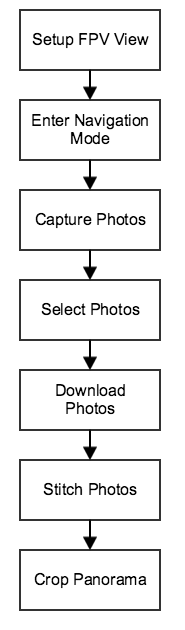

   You can download the demo project for this tutorial from here: <https://github.com/DJI-Mobile-SDK/iOS-PanoramaDemo.git>

## Implementing the FPV

**1.** Import the DJI SDK and the FFMPEG decoding library. If you don't know how to do this please refer to the tutorial [How to create a Camera Application](http://dji-dev.gitbooks.io/mobile-sdk-tutorials/content/en/iOS/FPVDemo/FPVDemo_en.html).

**2.** In the **Main.storyboard**, add a new View Controller called **CaptureViewController** and set it as the root View Controller for the new View Controller you just added in **Main.storyboard**:

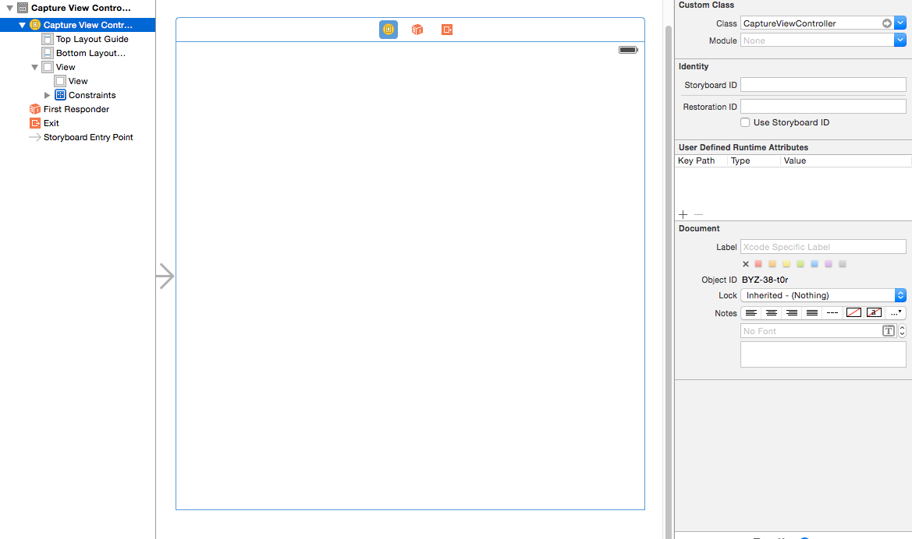

**3.** Add a UIView inside the View Controller and set it as an IBOutlet called "**fpvPreviewView**" in the **CaptureViewController.h**:

~~~objc
#import <UIKit/UIKit.h>

@interface CaptureViewController : UIViewController
@property (strong, nonatomic) IBOutlet UIView *fpvPreviewView;
@end
~~~

Import the **DJISDK** and **VideoPreviewer** header files to **CaptureViewController.m**. Then create **DJIDrone** and **DJIInspireCamera** instance variables (based on the UAV you have) and implement their delegate protocols as shown below:

~~~objc
#import "CaptureViewController.h"
#import <DJISDK/DJISDK.h>
#import "VideoPreviewer.h"

@interface CaptureViewController ()<DJIAppManagerDelegate, DJICameraDelegate, DJIDroneDelegate>
@property (strong, nonatomic) DJIDrone *drone;
@property (strong, nonatomic) DJIInspireCamera *camera;
@end
~~~
 
**4.** Initialize the **drone** instance and set its type to **DJIDrone_Inspire**. Also, initialize the **camera** instance as **(DJIInspireCamera *)_drone.camera**. Set the **drone** and **camera** instances' delegates to **self** and call the **start** method of **VideoPreviewer**'s instance in the **ViewDidLoad** method. Next, set the **fpvPreviewView** instance as a view of **VideoPreviewer** to show the Video Stream. Finally, call the **registerApp** method to activate the app:

~~~objc
- (void)viewDidLoad {
    [super viewDidLoad];
    
    self.drone = [[DJIDrone alloc] initWithType:DJIDrone_Inspire];
    self.drone.delegate = self;
    self.camera = (DJIInspireCamera *)_drone.camera;
    self.camera.delegate = self;
    
    [[VideoPreviewer instance] setView:self.fpvPreviewView];
    
    [self registerApp];
}

- (void) registerApp {
    NSString *appKey = @"161c6ced2a8bb103be572c3d";
    [DJIAppManager registerApp:appKey withDelegate:self];
}
~~~

Implement the **DJICameraDelegate** methods, as shown below:

~~~objc
#pragma mark - DJICameraDelegate

-(void) camera:(DJICamera*)camera didReceivedVideoData:(uint8_t*)videoBuffer length:(int)length {
    uint8_t* pBuffer = (uint8_t*)malloc(length);
    memcpy(pBuffer, videoBuffer, length);
    [[VideoPreviewer instance].dataQueue push:pBuffer length:length];
}

-(void) camera:(DJICamera*)camera didUpdateSystemState:(DJICameraSystemState*)systemState {

}
~~~

The **DJIDroneDelegate** method looks like this: 

~~~objc
#pragma mark - DJIDroneDelegate
-(void) droneOnConnectionStatusChanged:(DJIConnectionStatus)status {
    if (status == ConnectionSuccessed) {
        NSLog(@"Connection Successed");
    } else if(status == ConnectionStartConnect) {
        NSLog(@"Start Reconnect");
    } else if(status == ConnectionBroken) {
        NSLog(@"Connection Broken");
    } else if (status == ConnectionFailed) {
        NSLog(@"Connection Failed");
    }
}
~~~

Furthermore, connect to the drone and start the camera system state update when the app registers. Implement the **DJIAppManagerDelegate** method as follows: 

~~~objc
- (void)appManagerDidRegisterWithError:(int)error {
    NSString* message = @"Register App Successed!";
    if (error != RegisterSuccess) {
        message = @"Register App Failed!";
    }else{
    	NSLog(@"registerAppSuccess");
        [_drone connectToDrone];
        [_camera startCameraSystemStateUpdates];
        [[VideoPreviewer instance] start];
    }
    
    UIAlertView* alertView = [[UIAlertView alloc] initWithTitle:@"Register App" message:message delegate:nil cancelButtonTitle:@"OK" otherButtonTitles:nil];
    [alertView show];
}
~~~

**5.** Build and run the project on your mobile device, then connect your device to the aircraft. Now you can see view the camera's video stream on your device.

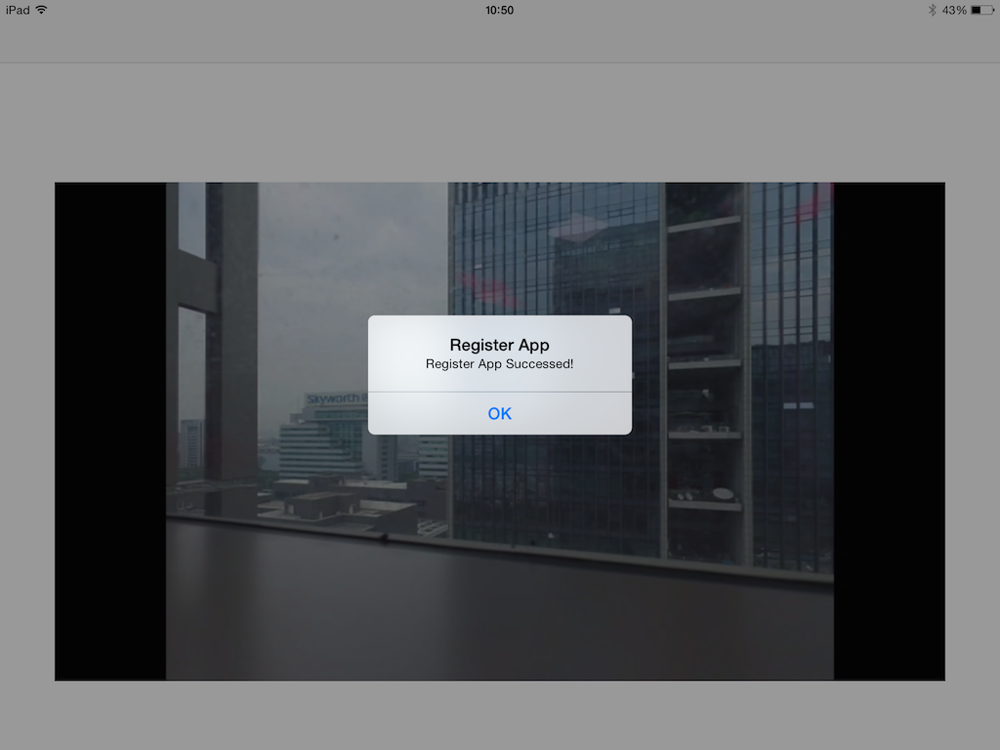

## Rotating with Joystick
In order to generate a panorama, you need to take a series of photos from different angles while keeping the center of the drone still. This is easy to do with the gimbal on the Inspire 1, but with the Phantom 3 you cannot control the gimbal's yaw angle using our SDK. Instead we will rotate the entire drone. Here's how to do it.

**1.** Create a **navigation** instance variable in the **interface** of **CaptureViewController.m**:

~~~objc
@interface CaptureViewController ()<DJICameraDelegate, DJIDroneDelegate,GroundStationDelegate>
@property (strong, nonatomic) DJIDrone *drone;
@property (strong, nonatomic) DJIInspireCamera *camera;
@property (weak, nonatomic) NSObject<DJINavigation>* navigation;
@end
~~~

**2.** Initialize the **navigation** instance in the **viewWillAppear** method: 

~~~objc
self.navigation = self.drone.mainController.navigationManager;
~~~

**3.** The drone must switch into Navigation mode before we can control it through the DJI SDK. Add an **Enter Navigation** button and a **Capture** button in **Capture View Controller** in **Main.storyboard**. Name their **IBOutlet**s **enterNavigationBtn** and **captureBtn** respectively, and their **IBAction**s **-(IBAction)onEnterNavigationClicked:(id)sender** and **-(IBAction)onCaptureButtonClicked:(id)sender**.

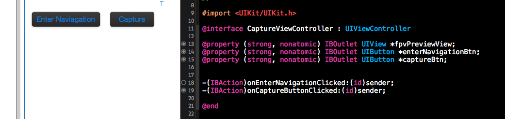

**4.** Implement the **onEnterNavigationClicked** method as shown below: 

~~~objc
-(IBAction)onEnterNavigationClicked:(id)sender {
    [self.navigation enterNavigationModeWithResult:^(DJIError *error) {
        UIAlertView* alertView = [[UIAlertView alloc] initWithTitle:@"Enter Navigation" message:[NSString stringWithFormat:@"Enter Navigation Mode:%@", error.errorDescription] delegate:nil cancelButtonTitle:@"OK" otherButtonTitles:nil];
        [alertView show];
    }];
}
~~~

Please switch the Remote Controller's mode selection to the **F** position (in the previous version it was in the **A** position) before you click the **Enter Navigation** button. Upon pressing the **Enter Navigation** button you should see something like this: 

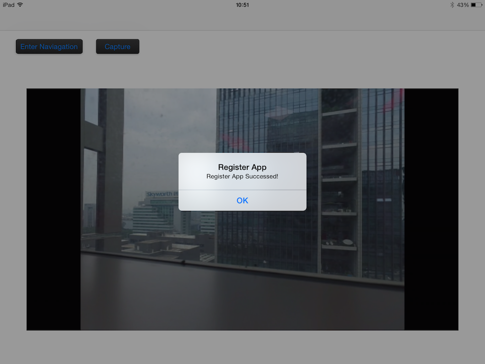

**5.** Define the angle for each rotation: 

~~~~objc
#define ROTATE_ANGLE 45.0
~~~~

Using the joystick api is similar to issuing commands using your remote controller. The joystick api can be used to directly specify the pitch, roll, yaw and throttle values of the drone and must be called with a certain frequency determined by the drone's flight controller, otherwise the the flight controller will assume that the connection is lost. Hence, we must start by sending a void command:

~~~objc
NSTimer *timer =  [NSTimer scheduledTimerWithTimeInterval:0.02 target:self selector:@selector(warmingUp) userInfo:nil repeats:YES];
[timer fire];

- (void) warmingUp {
    DJIFlightControlData noActionData;
    noActionData.mPitch = 0;
    noActionData.mRoll = 0;
    noActionData.mThrottle = 0;
    noActionData.mYaw = 0;
    [_navigation.flightControl sendFlightControlData:noActionData withResult:nil];
}
~~~

Then you can implement a **rotateDroneWithJoystick** method as shown below: 

~~~objc
- (void)rotateDroneWithJoystick {
	NSTimer *timer =  [NSTimer scheduledTimerWithTimeInterval:0.02 target:self selector:@selector(warmingUp) userInfo:nil repeats:YES];
    [timer fire];
    dispatch_async(dispatch_get_global_queue(DISPATCH_QUEUE_PRIORITY_DEFAULT, 0), ^{
        sleep(2);
        [timer invalidate];
		DJIFlightControlData ctrlData;
    	ctrlData.mPitch = 0;
    	ctrlData.mRoll = 0;
    	ctrlData.mThrottle = 0;
    	ctrlData.mYaw = ROTATE_ANGLE;
    	[self.navigation.flightControl sendFlightControlData:ctrlData withResult:nil];//rotate the drone
    });
}
~~~ 

First, we send the void command for 2 seconds at 50Hz, dispatch a thread to sleep 2 second, then send the actual command to rotate the drone.

implement the **onCaptureButtonClicked** method to rotate the drone:

~~~objc
-(IBAction)onCaptureButtonClicked:(id)sender {
	[self rotateDroneWithJoystick];
}
~~~

You can set up the flight control data by setting a **DJINavigationFlightControlData** structure. As the code above shows, you can set the mYaw angle to be 45 degrees, and the drone's yaw will rotate 45.0 degrees upon calling:

~~~objc
- (void) sendFlightControlData:(DJINavigationFlightControlData)controlData withResult:(DJIExecuteResultBlock)result;
~~~

Give your app a go! Connect your mobile device to the remote controller, switch to navigation mode and push the **Capture** button. Have fun controlling your drone from your mobile device!

## Shooting a Series of Photos
**1.** Define the number of photos you want to shoot:

~~~objc
#define PHOTO_NUMBER 8
~~~

This is the DJI api command to make the drone take photos:

~~~objc
-(void) startTakePhoto:(CameraCaptureMode)captureMode withResult:(DJIExecuteResultBlock)block;
~~~

Now rewrite the **rotateDroneWithJoystick** method as shown below. With this method, the drone will automatically take several photos at different angles:

~~~objc
- (void)rotateDroneWithJoystick {
    dispatch_async(dispatch_get_global_queue(DISPATCH_QUEUE_PRIORITY_DEFAULT, 0), ^{
        DJINavigationFlightControlData ctrlData;
        ctrlData.mPitch = 0;
        ctrlData.mRoll = 0;
        ctrlData.mThrottle = 0;
        ctrlData.mYaw = ROTATE_ANGLE;
        
        for(int i = 0;i < PHOTO_NUMBER; i++){
            [self.navigation.flightControl sendFlightControlData:ctrlData withResult:nil];//rotate the drone
            sleep(2);
            
            [_camera startTakePhoto:CameraSingleCapture withResult:nil];
            sleep(2);
        }
        
        dispatch_async(dispatch_get_main_queue(), ^{
            UIAlertView* alertView = [[UIAlertView alloc] initWithTitle:@"Capture Photos" message:@"Capture finished" delegate:nil cancelButtonTitle:@"OK" otherButtonTitles:nil];
            [alertView show];
        });
    });
}
~~~

You must dispatch a new thread and sleep for 2 seconds between rotating the drone and taking a photo because it takes some time to finish each operation. Neglecting to give the drone time to execute each operation will result in the operations being executed out of order or blurry photos being captured. Moreover, you can show an alert view in the main thread to notify that shooting is completed.

## Shooting Photos with Intelligent Navigation 

**Note: We do NOT recommend using ground station when battery capacity is less than 30%**

It seems a bit inconvenient to have to sleep in between rotating the drone and taking photos. Shouldn't there be an easier, more efficient way of doing this? Of course! Ground station is designed for carrying out series of actions, which is perfect for our application!

**1.** To specify the ground station mission, first we must get the drone information. Add **DJIMainControllerDelegate** in the interface of **CaptureViewController.m**, then add some properties as shown below:

~~~objc
@property (atomic) CLLocationCoordinate2D droneLocation;
@property (atomic) double droneAltitude;
@property (atomic) DJIGpsSignalLevel gpsSignalLevel;
@property (atomic) double droneYaw;
~~~

Add **DJIMainControllerDelegate** in the interface of **CaptureViewController.m**. Initialize **droneLocation** and set up **mainController**'s delegate in the **viewDidLoad** method: 

~~~objc
self.droneLocation = kCLLocationCoordinate2DInvalid;
self.drone.mainController.mcDelegate = self;
~~~

Then rewrite the **DJIAppManagerDelegate** method. Here we add a line to call **startUpdateMCSystemState** to update the drone state:

~~~objc
#pragma mark DJIAppManagerDelegate
- (void)appManagerDidRegisterWithError:(int)error {
    NSString* message = @"Register App Successed!";
    if (error != RegisterSuccess) {
        message = @"Register App Failed!";
    }else{
        NSLog(@"registerAppSuccess");
        [_drone connectToDrone];
        [_camera startCameraSystemStateUpdates];
        [self.drone.mainController startUpdateMCSystemState];
        [[VideoPreviewer instance] start];
    }
    
    UIAlertView* alertView = [[UIAlertView alloc] initWithTitle:@"Register App" message:message delegate:nil cancelButtonTitle:@"OK" otherButtonTitles:nil];
    [alertView show];
}
~~~

Implement the **DJIMainControllerDelegate** method as shown below. Now you can get the drone information immediately:

~~~objc
#pragma mark - DJIMainControllerDelegate
-(void) mainController:(DJIMainController*)mc didUpdateSystemState:(DJIMCSystemState*)state {
    self.droneLocation = CLLocationCoordinate2DMake(state.droneLocation.latitude, state.droneLocation.longitude);
    self.gpsSignalLevel = state.gpsSignalLevel;
    self.droneAltitude = state.altitude;
    self.droneYaw = state.attitude.yaw;
}
~~~

**2.** Add an instance variable called **waypointMission** in the interface:

~~~objc
@property (weak, nonatomic) NSObject<DJIWaypointMission>* waypointMission;
~~~

Then initialize **waypointMission** in the **viewDidLoad** method: 

~~~objc
self.waypointMission = self.navigation.waypointMission;
~~~ 

**3.** When using ground station, you must set up waypoints, which determine where the drone will fly to and the action that it will perform once it reaches that destination. Now implement your customer method **createWaypointMission**: 

~~~objc
- (void)createWaypointMission {
    [self.waypointMission removeAllWaypoints];
    self.waypointMission.finishedAction = DJIWaypointMissionFinishedNoAction;
    self.waypointMission.headingMode = DJIWaypointMissionHeadingAuto;
    self.waypointMission.flightPathMode = DJIWaypointMissionFlightPathNormal;
    
    DJIWaypoint *wp1 = [[DJIWaypoint alloc] initWithCoordinate:self.droneLocation];
    wp1.altitude = self.droneAltitude;
    double rotateAngle = self.droneYaw;
    for (int i = 0; i < PHOTO_NUMBER ; i++) {
        rotateAngle += ROTATE_ANGLE;
        DJIWaypointAction *action1 = [[DJIWaypointAction alloc] initWithActionType:DJIWaypointActionStartTakePhoto param:0];
        DJIWaypointAction *action2 = [[DJIWaypointAction alloc] initWithActionType:DJIWaypointActionRotateAircraft param:rotateAngle];
        [wp1 addAction:action1];
        [wp1 addAction:action2];
    }
    
    DJIWaypoint *wp2 = [[DJIWaypoint alloc] initWithCoordinate:self.droneLocation];
    wp2.altitude = self.droneAltitude + 1;
    
    //add waypoint to waypoint mission
    [self.waypointMission addWaypoint:wp1];
    [self.waypointMission addWaypoint:wp2];
}
~~~ 

First, you should remove all waypoints in **waypointMission** before setting up your own mission to make sure that you are starting with a clean slate. Then set the drone take no action when finished, auto-head when moving and fly between waypoints in a straight line. Then, initialize the drone's current location and altitude as the waypoint position. Now you can add a series of actions to the first waypoint. We set the current yaw angle as the initial rotate action angle, then in the next action take a photo and increase the **rotateAngle** by **ROTATE_ANGLE** and rotate to this new angle. Repeat these actions until you take **PHOTO_NUMBER** photos. Ground station requires at least two waypoints, and each waypoint must be at a different physical location, so we add a second waypoint and demand the drone rise 1 meter and take no action. Finally, after defining these waypoints, we add these waypoints to **waypointMission**.

**4.**  Upload the waypoint mission before starting it. Implement the customer method called **uploadWaypointMission** as follows:

~~~objc
- (void)uploadWaypointMission {
    __weak typeof(self) weakSelf = self;
    //setup progress handler
    [self.waypointMission setUploadProgressHandler:^(uint8_t progress) {
        NSString *message = [NSString stringWithFormat:@"Mission Upload %d%%" ,progress];
        if (weakSelf.uploadMissionProgressAlert == nil) {
            weakSelf.uploadMissionProgressAlert = [[UIAlertView alloc] initWithTitle:nil message:message delegate:nil cancelButtonTitle:nil otherButtonTitles:nil];
            [weakSelf.uploadMissionProgressAlert show];
        }
        else {
            [weakSelf.uploadMissionProgressAlert setMessage:message];
        }
        
        if (progress == 100) {
            [weakSelf.uploadMissionProgressAlert dismissWithClickedButtonIndex:0 animated:YES];
            weakSelf.uploadMissionProgressAlert = nil;
        }
    }];
    //upload mission
    [self.waypointMission uploadMissionWithResult:^(DJIError *error) {
        if (weakSelf.uploadMissionProgressAlert) {
            [weakSelf.uploadMissionProgressAlert dismissWithClickedButtonIndex:0 animated:YES];
            weakSelf.uploadMissionProgressAlert = nil;
        }
        [weakSelf.waypointMission setUploadProgressHandler:nil];
        [self startWaypointMission];
    }];
}
~~~

In this method we set up the upload progress handler first. In the handler, we initialize an alert view and update its message to show the progress, then dismiss it when the upload finishes. Also, we call the **uploadMissionWithResult** method to begin uploading, dismiss the alert view, clear the upload progress handler and call the customer method **startWaypointMission** to start the mission in the **DJIExecuteResultBlock**.

**5.** In the **startWaypointMission** method, as shown below, call the **startMissionWithResult** method and show the execute result in an alert view: 

~~~objc
- (void)startWaypointMission {
    [self.waypointMission startMissionWithResult:^(DJIError *error) {
        UIAlertView* alertView = [[UIAlertView alloc] initWithTitle:@"Start Mission" message:[NSString stringWithFormat:@"%@", error.errorDescription] delegate:nil cancelButtonTitle:@"OK" otherButtonTitles:nil];
        [alertView show];
    }];
}
~~~

**6.** Since the ground station relies on accurate GPS positioning, you should check the GPS level before executing the ground station mission. We must also check whether the waypoint mission is valid. Implement **rotateDroneWithGoundStation** as follows:

~~~objc
- (void)rotateDroneWithGoundStation {
    if (CLLocationCoordinate2DIsValid(self.droneLocation) && self.gpsSignalLevel != GpsSignalLevel0 && self.gpsSignalLevel != GpsSignalLevel1) {
        [self createWaypointMission];
        if (self.waypointMission.isValid ) {
            [self uploadWaypointMission];
        }
        else {
            UIAlertView* alertView = [[UIAlertView alloc] initWithTitle:@"Upload Mission" message:@"Waypoint mission invalid!" delegate:nil cancelButtonTitle:@"OK" otherButtonTitles:nil];
            [alertView show];
        }
    }
    else {
        UIAlertView* alertView = [[UIAlertView alloc] initWithTitle:@"GPS signal weak" message:@"Rotate drone failed" delegate:nil cancelButtonTitle:@"OK" otherButtonTitles:nil];
        [alertView show];
    }
}
~~~

**7.** Now we need to monitor the status of the ground station misson. Add the **DJINavigationDelegate** and **isMissionStarted** instance variables in the interface of **CaptureViewController.m**:

~~~objc
@property (nonatomic) bool isMissionStarted;
~~~

Then initialize **isMissionStarted** and set the delegate in the **viewDidLoad** method:

~~~objc
- (void)viewDidLoad {
    [super viewDidLoad];
    self.isMissionStarted = NO;
    self.droneLocation = kCLLocationCoordinate2DInvalid;
    
    self.drone = [[DJIDrone alloc] initWithType:DJIDrone_Inspire];
    self.drone.delegate = self;
    
    self.camera = (DJIInspireCamera *)_drone.camera;
    self.camera.delegate = self;
    
    self.navigation = self.drone.mainController.navigationManager;
    self.navigation.delegate = self;

    self.waypointMission = self.navigation.waypointMission;
    
    self.drone.mainController.mcDelegate = self;
    
    [[VideoPreviewer instance] setView:self.fpvPreviewView];
    
    [self registerApp];
}
~~~

Then rewrite the **startWaypointMission** method as shown below: 

~~~objc
- (void)startWaypointMission {
    [self.waypointMission startMissionWithResult:^(DJIError *error) {
        self.isMissionStarted = YES;
        UIAlertView* alertView = [[UIAlertView alloc] initWithTitle:@"Start Mission" message:[NSString stringWithFormat:@"%@", error.errorDescription] delegate:nil cancelButtonTitle:@"OK" otherButtonTitles:nil];
        [alertView show];
    }];
}
~~~

When the ground station mission finishes, **missionStatus.missionType** in the **DJINavigationDelegate** becomes **DJINavigationMissionNone**. We can show an alert view to notify the user that the mission is done. Here is our code in **DJINavigationDelegate** method:

~~~objc
#pragma mark - DJINavigationDelegate
-(void) onNavigationMissionStatusChanged:(DJINavigationMissionStatus*)missionStatus {
    if (self.isMissionStarted && missionStatus.missionType == DJINavigationMissionNone) {
        UIAlertView* alertView = [[UIAlertView alloc] initWithTitle:@"Ground Station" message:@"mission finished" delegate:nil cancelButtonTitle:@"OK" otherButtonTitles:nil];
        [alertView show];
        self.isMissionStarted = NO;
    }
}
~~~ 

**8.** Now rewrite the **onCaptureButtonClicked** method:

~~~objc
-(IBAction)onCaptureButtonClicked:(id)sender {
    [self rotateDroneWithGoundStation];
}
~~~

Run your code and check out your drone as it follows the waypoint commands! Isn't it easier to control your drone using ground station?

**9.** Now you that have three ways to take photos, you need an alert view to allow the user to choose which method to use based on your drone, the environment and the GPS signal status.

Update **onCaptureButtonClicked** as follows:

~~~objc
-(IBAction)onCaptureButtonClicked:(id)sender {
    UIAlertView* alertView = [[UIAlertView alloc] initWithTitle:@"Select Mode" message:@"" delegate:self cancelButtonTitle:@"GroundStation" otherButtonTitles:@"Joystick", nil];
    alertView.tag = kCaptureModeAlertTag;
    [alertView show];
}
~~~

Here **kCaptureModeAlertTag** is the tag used to distinguish this alert view from other alert views:

~~~objc
#define kCaptureModeAlertTag 100
~~~

Implement the **UIAlertView** delegate method:

~~~objc
#pragma mark UIAlertView Delegate Methods
- (void)alertView:(UIAlertView *)alertView clickedButtonAtIndex:(NSInteger)buttonIndex
{
    if (alertView.tag == kCaptureModeAlertTag) {
        if (buttonIndex == 0){
            [self rotateDroneWithGoundStation];
        }else if(buttonIndex == 1){
            [self rotateDroneWithJoystick];
        }
    }
}
~~~

Now the user can choose their preferred shooting method.

## Downloading Photos
In order to download multiple photos, you must navigate through a series of modes playback modes. Enter **Playback** mode, then enter **Multiple Preview** mode, then enter **Multiple Edit** mode, select all the files you need, before downloading all selected files.
 

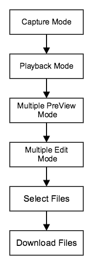

**1.** Add a new **Download** button in **Capture View Controller** in **Main.storyboard**, then in **CaptureViewController.h** set its **IBOutlet** to **downloadBtn** and **IBAction** to **-(IBAction)onDownloadButtonClicked:(id)sender**.

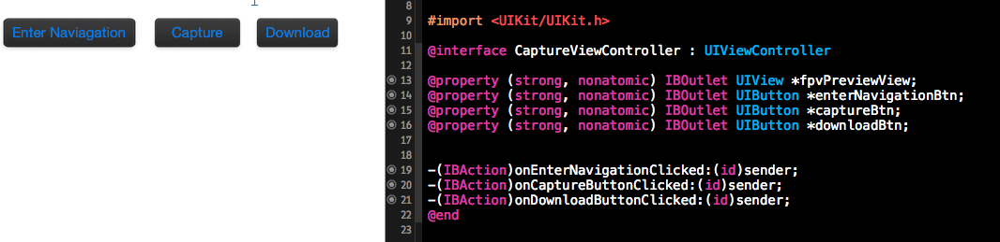

**2.** Add a new variable to record the number of photos selected in the **interface** of **CaptureViewController.m**:

~~~objc
    __block int _selectedPhotoNumber;
~~~

Implement the **DJICameraDelegate** **didUpdatePlaybackState** method as shown below to update the selected photo count: 

~~~objc
-(void) camera:(DJICamera *)camera didUpdatePlaybackState:(DJICameraPlaybackState*)playbackState {
    _selectedPhotoNumber=playbackState.numbersOfSelected;
}
~~~

**3.** Implement the **onDownloadButtonClicked** method to enter playback mode:  

~~~objc
-(IBAction)onDownloadButtonClicked:(id)sender {
    __weak typeof(self) weakSelf = self;
    [_camera setCameraWorkMode:CameraWorkModePlayback withResult:^(DJIError *error) {
        if (error.errorCode == ERR_Successed) {
            [weakSelf selectPhotos];//custom method
        }else {
            UIAlertView* alertView = [[UIAlertView alloc] initWithTitle:@"Camera WorkMode" message:@"Enter playback mode failed" delegate:nil cancelButtonTitle:@"OK" otherButtonTitles:nil];
            [alertView show];
        }
    }];
}
~~~

Then we set the camera work mode as playback mode. If successful, you can call the custom method to select photos, else show a alert view to show what's gone wrong. 

**4**. Now implement your custom method to select the latest photos you took for the panorama:

~~~objc
-(void)selectPhotos {
    dispatch_async(dispatch_get_global_queue(DISPATCH_QUEUE_PRIORITY_DEFAULT, 0), ^{
        [self.camera enterMultiplePreviewMode];
        sleep(1);
        [self.camera enterMultipleEditMode];
        sleep(1);

        
        while (_selectedPhotoNumber!=PHOTO_NUMBER) {
            [self.camera selectAllFilesInPage];
            sleep(1);
            
            if(_selectedPhotoNumber>PHOTO_NUMBER){
                for(int unselectFileIndex=0; _selectedPhotoNumber!=PHOTO_NUMBER;unselectFileIndex++){
                    [self.camera unselectFileAtIndex:unselectFileIndex];
                    sleep(1);
                }
                break;
            }
            else if(_selectedPhotoNumber <PHOTO_NUMBER){
                [self.camera multiplePreviewPreviousPage];
                sleep(1);
            }
            
        }
        [self downloadPhotos];//custom method
    });
}
~~~

It takes a few seconds for the drone to respond to commands, so you should dispatch a new thread to send commands and sleep in between. As shown in the flow diagram above, you should enter **MultiplePreviewMode** and **MultipleEditMode** before selecting photos. How do we select the last PHOTO_NUMBER photos? Here is our strategy:

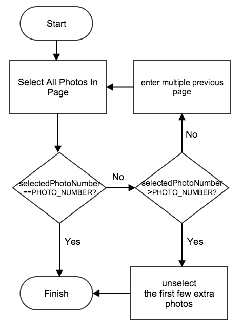

The default selected photo is the last photo. Select all photos in the last page. If you have selected more photos than necessary, you can deselect the extra photos starting from index 0. If you do not have enough photos selected, just go to previous page and repeat the procedure again until you select the exact number of photos needed.

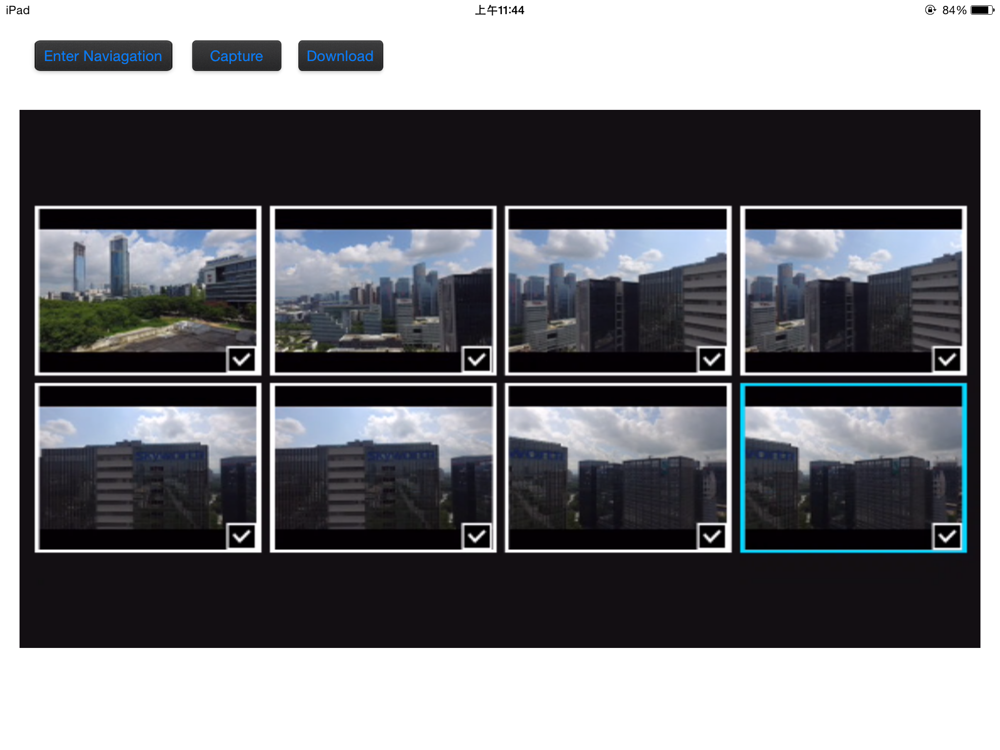

**5.** Implement your custom **downloadPhotos** method. 

Add a new variable in the **interface** to store downloaded binary data:

~~~objc
__block NSMutableData *_downloadedFileData;
~~~

The **downloadPhotos** method is shown below:

~~~objc
-(void)downloadPhotos {
    [_camera downloadAllSelectedFilesWithPreparingBlock:^(NSString* fileName, DJIDownloadFileType fileType, NSUInteger fileSize, BOOL* skip) {
        _downloadedFileData =[NSMutableData new];
    } dataBlock:^(NSData *data, NSError *error) {
        [_downloadedFileData appendData:data];
    } completionBlock:^{
        dispatch_async(dispatch_get_main_queue(), ^{
            UIAlertView* alertView = [[UIAlertView alloc] initWithTitle:@"Download Files" message:@"1 file download finished" delegate:nil cancelButtonTitle:@"OK" otherButtonTitles:nil];
            [alertView show];
            UIImage *downloadPhoto=[UIImage imageWithData: _downloadedFileData];
            UIImageWriteToSavedPhotosAlbum(downloadPhoto, nil, nil, nil);
        });
    }];
}
~~~

In the **DJIFileDownloadPreparingBlock**, you initialize **_downloadedFileData** and append data in **DJIFileDownloadingBlock**. You can then dispatch a main thread, show an alert view and save the photo in a local album in the **DJIFileDownloadCompletionBlock**. Now you can see a series of photos in your album.

But there is no download progress information! Let's add to the **downloadPhotos** method. Rewrite the **interface** in the **CaptureViewController.m** as shown below: 

~~~objc
@interface CaptureViewController ()<DJICameraDelegate, DJIDroneDelegate,GroundStationDelegate>{
    __block NSMutableData *_downloadedFileData;
    __block int _selectedPhotoNumber;
    __block long totalFileSize;
    __block NSString *targetFileName;
}
@property (strong, nonatomic) DJIDrone *drone;
@property (strong, nonatomic) DJIInspireCamera *camera;
@property (strong, nonatomic) id<DJINavigation> navigation;
@property (strong, nonatomic) UIAlertView* downloadProgressAlert;
@property (strong, nonatomic) NSMutableArray *imageArray;
@end
~~~

Then rewrite the **downloadPhotos** method. Set up a timer in the **DJIFileDownloadPreparingBlock** to update the download progress, file name and other values regularly. **updateDownloadProgress** method is the **selector** of the timer. The **showDownloadProgressAlert** method initializes and shows an alert view. When the download finishes, we don't save photos in a local album anymore, but save them in the **_imageArray** to prepare it for stitching:

~~~objc
-(void)downloadPhotos {
    __block int finishedFileCount=0;
    __weak typeof(self) weakSelf = self;
    __block NSTimer *timer;
    _imageArray=[NSMutableArray new];
    
    [_camera downloadAllSelectedFilesWithPreparingBlock:^(NSString* fileName, DJIDownloadFileType fileType, NSUInteger fileSize, BOOL* skip) {
        _totalFileSize=(long)fileSize;
        _downloadedFileData=[NSMutableData new];
        _targetFileName=fileName;
        dispatch_async(dispatch_get_main_queue(), ^{
            [weakSelf showDownloadProgressAlert];
            [weakSelf.downloadProgressAlert setTitle:[NSString stringWithFormat:@"Download (%d/%d)", finishedFileCount + 1, PHOTO_NUMBER]];
            [weakSelf.downloadProgressAlert setMessage:[NSString stringWithFormat:@"FileName:%@ FileSize:%0.1fKB Downloaded:0.0KB", fileName, fileSize / 1024.0]];
            timer =  [NSTimer scheduledTimerWithTimeInterval:1.0 target:self selector:@selector(updateDownloadProgress) userInfo:nil repeats:YES];
            [timer fire];
        });
    } dataBlock:^(NSData *data, NSError *error) {
        [_downloadedFileData appendData:data];
    } completionBlock:^{
        dispatch_async(dispatch_get_main_queue(), ^{
            [timer invalidate];
            finishedFileCount++;
            if(finishedFileCount>=PHOTO_NUMBER) {
                [self.downloadProgressAlert dismissWithClickedButtonIndex:0 animated:YES];
                self.downloadProgressAlert = nil;
                 [_camera setCameraWorkMode:CameraWorkModeCapture withResult:nil];

                UIAlertView* alertView = [[UIAlertView alloc] initWithTitle:[NSString stringWithFormat:@"Download (%d/%d)", finishedFileCount, PHOTO_NUMBER] message:@"download finished" delegate:nil cancelButtonTitle:@"OK" otherButtonTitles:nil];
                [alertView show];
            }
            UIImage *downloadPhoto=[UIImage imageWithData:_downloadedFileData];
            [_imageArray addObject:downloadPhoto];
        });
    }];
}

-(void)updateDownloadProgress{
    [self.downloadProgressAlert setMessage:[NSString stringWithFormat:@"FileName:%@ FileSize:%0.1fKB Downloaded:%0.1fKB", _targetFileName, _totalFileSize / 1024.0, _downloadedFileData.length / 1024.0]];
}

-(void) showDownloadProgressAlert {
    if (self.downloadProgressAlert == nil) {
        self.downloadProgressAlert = [[UIAlertView alloc] initWithTitle:@"" message:@"" delegate:nil cancelButtonTitle:nil otherButtonTitles:nil];
        [self.downloadProgressAlert show];
    }
}
~~~

If everything is OK, you should see something like this:

## Using OpenCV to Create Panorama

### Creating Stitching View

Since we don't need the FPV view when stitching, we add a new view controller called **StitchingViewController** to generate and present the panorama.

**1.** Embed a navigation controller in **CaptureViewController** and add a new button called **Stitch**.

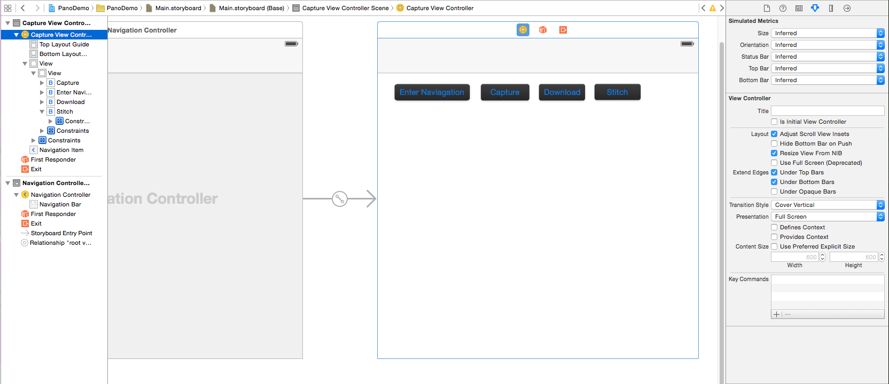

Create a view controller class called **StitchingViewController** and a new view controller in the **Main.storyboard** corresponding. Then add a button named **Stitch** and set its action segue to **Show** **StitchingViewController**. Set its identifier to **Stitching**.

**2.** Add an instance variable **imageArray** in **StitchingViewController.h**:

~~~objc
@property (strong,nonatomic) NSMutableArray * imageArray;
~~~

Add the **prepareForSegue** method to pass the downloaded photos to the next view controller in **CaptureViewController.m**:

~~~objc
-(void)prepareForSegue:(UIStoryboardSegue *)segue sender:(id)sender {
    if([segue.identifier isEqualToString:@"Stitching"]) {
        [segue.destinationViewController setValue:_imageArray forKey:@"imageArray"];
    }
}
~~~
**3.** Add an activity indicator in the **StitchingViewController**, set its behavior to **Hides When Stopped**, then set its outlet to be called **activityIndicator**:

### Importing OpenCV
**1.** Build **opencv2.framework** for iOS. See more details in [Installation in iOS](http://docs.opencv.org/doc/tutorials/introduction/ios_install/ios_install.html). If you have any difficulties compiling the source code, you can just download this project and copy the **opencv2.framework**. 

**2.** Select the project target, go to **Build Phases** -> **Link Binary With Libraries**. Click the "+" button at the bottom and add  the**AssetsLibrary.framework** library to your project. Click the "+" button, click on **Add others** and navigate to the directory where **opencv2.framework** is located and click open.

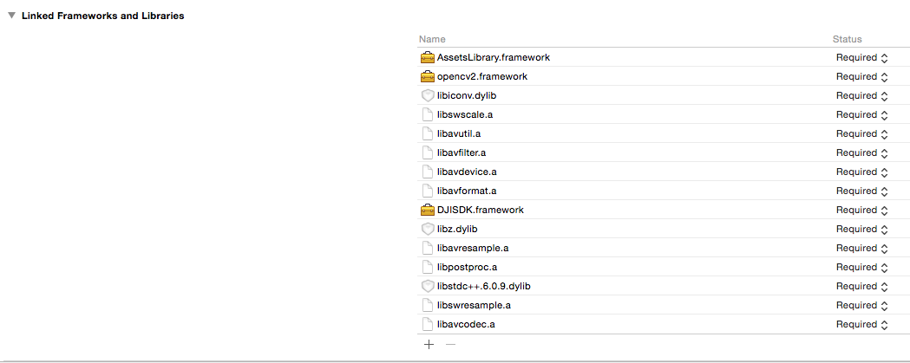

**3.** Add a PCH file into your project. Go to **Build Setting** -> **Precompile Prefix Header**, set its value **YES**, and set **Prefix Header** to be the location of the PCH file.

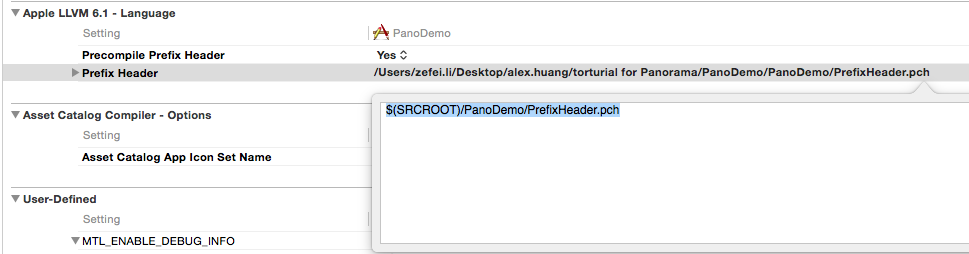

Open your PCH file and add the following lines of code:

~~~objc
#ifdef __cplusplus
    #import <opencv2/opencv.hpp>
#endif

#ifdef __OBJC__
    #import <UIKit/UIKit.h>
    #import <Foundation/Foundation.h>
#endif
~~~

**4.** Build your project. If nothing wrong happens, you have successfully installed the OpenCV library into your project.

### Stitching Photos

**1.** In OpenCV all the image processing operations are usually carried out on the Mat structure. In iOS however, to render an image on screen it has to be an instance of the UIImage class. To convert an OpenCV Mat to an UIImage we use the Core Graphics framework available in iOS. Find more details in[Convert UIImage to cv::Mat](http://docs.opencv.org/doc/tutorials/ios/image_manipulation/image_manipulation.html#opencviosimagemanipulation). You can define a n**OpenCVConversion** class to deal with the conversion issue.

In the **OpenCVConversion.h** file:

~~~objc
@interface OpenCVConversion : NSObject

+ (cv::Mat)cvMatFromUIImage:(UIImage *)image;//convert UIImage to cv::Mat
+ (cv::Mat)cvMatGrayFromUIImage:(UIImage *)image;//convert UIImage to gray cv::Mat
+ (cv::Mat)cvMat3FromUIImage:(UIImage *)image; //convert UIImage to cv::Mat without alpha channel
+(UIImage *)UIImageFromCVMat:(cv::Mat)cvMat;//convert cv::Mat to UIImage

@end
~~~

Here is the code in **OpenCVConversion.mm**:

~~~objc
#import "OpenCVConversion.h"

@implementation OpenCVConversion

+ (cv::Mat)cvMatFromUIImage:(UIImage *)image {
    CGColorSpaceRef colorSpace = CGImageGetColorSpace(image.CGImage);
    CGFloat cols = image.size.width;
    CGFloat rows = image.size.height;
    
    cv::Mat cvMat(rows, cols, CV_8UC4); // 8 bits per component, 4 channels (color channels + alpha)
    
    CGContextRef contextRef = CGBitmapContextCreate(cvMat.data,                 // Pointer to  data
                                                    cols,                       // Width of bitmap
                                                    rows,                       // Height of bitmap
                                                    8,                          // Bits per component
                                                    cvMat.step[0],              // Bytes per row
                                                    colorSpace,                 // Colorspace
                                                    kCGImageAlphaNoneSkipLast |
                                                    kCGBitmapByteOrderDefault); // Bitmap info flags
    
    CGContextDrawImage(contextRef, CGRectMake(0, 0, cols, rows), image.CGImage);
    CGContextRelease(contextRef);
    
    return cvMat;
}

+ (cv::Mat)cvMatGrayFromUIImage:(UIImage *)image {
    CGColorSpaceRef colorSpace = CGImageGetColorSpace(image.CGImage);
    CGFloat cols = image.size.width;
    CGFloat rows = image.size.height;
    
    cv::Mat cvMat(rows, cols, CV_8UC1); // 8 bits per component, 1 channels
    
    CGContextRef contextRef = CGBitmapContextCreate(cvMat.data,                 // Pointer to data
                                                    cols,                       // Width of bitmap
                                                    rows,                       // Height of bitmap
                                                    8,                          // Bits per component
                                                    cvMat.step[0],              // Bytes per row
                                                    colorSpace,                 // Colorspace
                                                    kCGImageAlphaNoneSkipLast |
                                                    kCGBitmapByteOrderDefault); // Bitmap info flags
    
    CGContextDrawImage(contextRef, CGRectMake(0, 0, cols, rows), image.CGImage);
    CGContextRelease(contextRef);
    
    return cvMat;
}

+ (cv::Mat)cvMat3FromUIImage:(UIImage *)image {
    cv::Mat result=[self cvMatFromUIImage:image];
    cv::cvtColor(result, result, CV_RGBA2RGB);
    return result;
}

+(UIImage *)UIImageFromCVMat:(cv::Mat)cvMat
{
    NSData *data = [NSData dataWithBytes:cvMat.data length:cvMat.elemSize()*cvMat.total()];
    CGColorSpaceRef colorSpace;
    
    if (cvMat.elemSize() == 1) {
        colorSpace = CGColorSpaceCreateDeviceGray();
    } else {
        colorSpace = CGColorSpaceCreateDeviceRGB();
    }
    
    CGDataProviderRef provider = CGDataProviderCreateWithCFData((__bridge CFDataRef)data);
    
    // Creating CGImage from cv::Mat
    CGImageRef imageRef = CGImageCreate(cvMat.cols,                                 //width
                                        cvMat.rows,                                 //height
                                        8,                                          //bits per component
                                        8 * cvMat.elemSize(),                       //bits per pixel
                                        cvMat.step[0],                            //bytesPerRow
                                        colorSpace,                                 //colorspace
                                        kCGImageAlphaNone|kCGBitmapByteOrderDefault,// bitmap info
                                        provider,                                   //CGDataProviderRef
                                        NULL,                                       //decode
                                        false,                                      //should interpolate
                                        kCGRenderingIntentDefault                   //intent
                                        );
    
    
    // Getting UIImage from CGImage
    UIImage *finalImage = [UIImage imageWithCGImage:imageRef];
    CGImageRelease(imageRef);
    CGDataProviderRelease(provider);
    CGColorSpaceRelease(colorSpace);
    
    return finalImage;
}

@end
~~~

**2.** In order to call OpenCV functions in objective-C, you have to create a header file and a C++ file as the stitching wrapper file. The code in **StitchingWrapper.h** is shown below. Input a vector of cv::Mat and the reference of cv::Mat. This function will tell whether the stitching is successful and return the stitched cv::Mat through a **result** reference:

~~~cpp
#ifndef Stitching_Header_h
#define Stitching_Header_h

bool stitch (const cv::vector <cv::Mat> & images, cv::Mat &result);

#endif
~~~

Here is the code in **StitchingWrapper.cpp**:

~~~cpp
#include "stitchingWrapper.h"
#include "opencv2/highgui/highgui.hpp"
#include "opencv2/stitching/stitcher.hpp"

using namespace cv;

bool stitch (const cv::vector <cv::Mat> & images, cv::Mat &result) {
    Stitcher stitcher = Stitcher::createDefault(false);
    Stitcher::Status status = stitcher.stitch(images, result);
    
    if (status != Stitcher::OK) {
        return false;
    }
    return true;
}
~~~

**3.** Now you can customize your stitching method in the new class called **Stitching**. Here is the class method declaration for stitching, to be put in the **Stitching.h** file. Users input an image array and a reference of cv::Mat, it will return whether the stitching is successful and the stitching result:

~~~objc
#import <Foundation/Foundation.h>

@interface Stitching : NSObject
+ (bool) stitchImageWithArray:(NSMutableArray*)imageArray andResult:(cv::Mat &) result;
@end
~~~ 

**Stitching.mm** is shown below: 

~~~objc
#import "Stitching.h"
#import "StitchingWrapper.h"
#import "OpenCVConversion.h"

#define COMPRESS_RATIO 0.2

@implementation Stitching

+ (bool) stitchImageWithArray:(NSMutableArray*)imageArray andResult:(cv::Mat &) result {
    
    NSMutableArray* compressedImageArray =[NSMutableArray new];
    for(UIImage *rawImage in imageArray){
        UIImage *compressedImage=[self compressedToRatio:rawImage ratio:COMPRESS_RATIO];
        [compressedImageArray addObject:compressedImage];
    }
    [imageArray removeAllObjects];
    
    
    if ([compressedImageArray count]==0) {
        NSLog (@"imageArray is empty");
        return false;
    }
    cv::vector<cv::Mat> matArray;
    
    for (id image in compressedImageArray) {
        if ([image isKindOfClass: [UIImage class]]) {
            cv::Mat matImage = [OpenCVConversion cvMat3FromUIImage:image];
            matArray.push_back(matImage);
        }
    }
    NSLog(@"Stitching...");
    if(!stitch(matArray, result)){
        return false;
    }
    
    return true;
}

+ (UIImage *)compressedToRatio:(UIImage *)img ratio:(float)ratio {
    CGSize compressedSize;
    compressedSize.width=img.size.width*ratio;
    compressedSize.height=img.size.height*ratio;
    UIGraphicsBeginImageContext(compressedSize);
    [img drawInRect:CGRectMake(0, 0, compressedSize.width, compressedSize.height)];
    UIImage* compressedImage = UIGraphicsGetImageFromCurrentImageContext();
    UIGraphicsEndImageContext();
    return compressedImage;
}

@end
~~~

Because of the limited computing ability and memory storage of mobile devices, you are not encouraged to process full resolution images, or the stitching process will take a long time or run out of memory to use. We call the **+ (UIImage *)compressedToRatio:(UIImage *)img ratio:(float)ratio** method to reduce the photo width and height by a ratio of **COMPRESS_RATIO**, which reduces the resolution dramatically(COMPRESS_RATIO2). Then we convert the images to cv::Mat and push them into cv::vector. Finally, you can call the **stitch** function in **StitchingWrapper.cpp** to do the actual stitching job.

**4.** Add a **UIImageView** in the **Main.storyboard**, set the **Mode** to **Aspect Fit** and set up its outlet, called**imageView**.

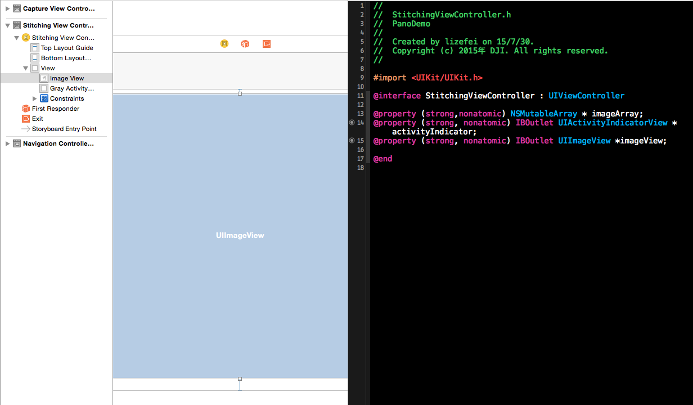

Set the code in **StitchingViewController.mm** as shown below:

~~~objc
#import "StitchingViewController.h"
#import "Stitching.h"
#import "OpenCVConversion.h"

@interface StitchingViewController ()

@end

@implementation StitchingViewController

- (void)viewDidLoad {
    [super viewDidLoad];
}

-(void)viewWillAppear:(BOOL)animated {
    [super viewWillAppear:animated];
    
    [_activityIndicator startAnimating];
    dispatch_async(dispatch_get_global_queue(DISPATCH_QUEUE_PRIORITY_DEFAULT, 0), ^{
        cv::Mat stitchMat;
        [Stitching stitchImageWithArray:_imageArray andResult:stitchMat];
        
        UIImage *stitchImage=[OpenCVConversion UIImageFromCVMat:stitchMat];
        UIImageWriteToSavedPhotosAlbum(stitchImage, nil, nil, nil);
        
        dispatch_async(dispatch_get_main_queue(), ^{
            [_activityIndicator stopAnimating];
            _imageView.image=stitchImage;
        });
    });
}
~~~

Now download latest photos and click the **Stitch** button. After a minute you will be able to see an amazing panorama!

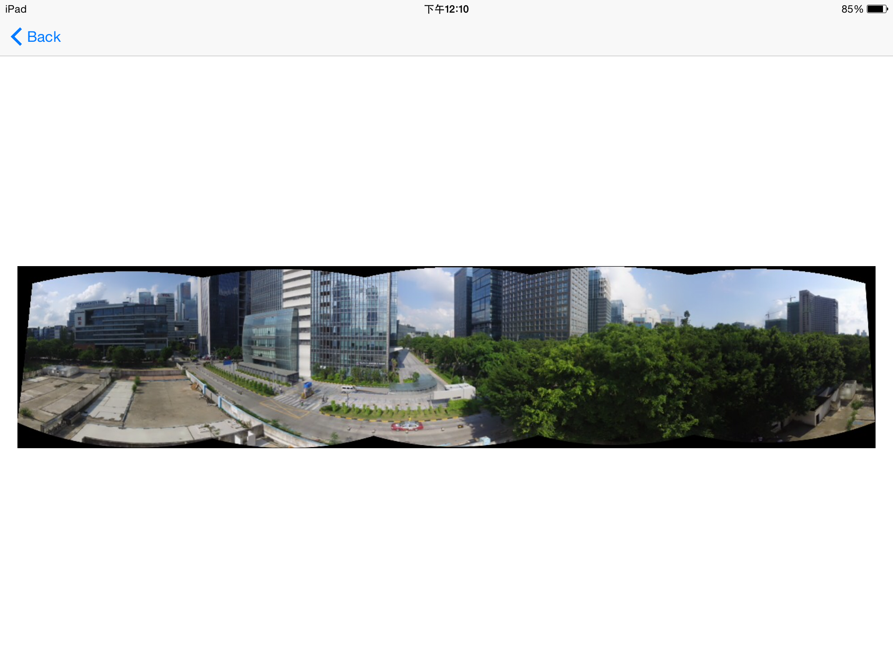

### Cropping the Panorama
You have made an excellent panorama, but the uneven black edge is pretty annoying. Let's optimize our app and make your panorama perfect!

**1.** Create a new class called **Cropping** to deal with the black edge.

Here is the code in **Cropping.h**:

~~~objc
#import <Foundation/Foundation.h>

@interface Cropping : NSObject
+ (bool) cropWithMat: (const cv::Mat &)src andResult:(cv::Mat &)dest;
@end
~~~

The implementation of **+ (bool) cropWithMat: (const cv::Mat &)src andResult:(cv::Mat *)dest** in **Cropping.mm** is shown below:

~~~objc
#import "Cropping.h"

#define CUTBLACKTHREASHOLD 0.05

@implementation Cropping

+ (bool) cropWithMat: (const cv::Mat &)src andResult: (cv::Mat &)dest {
    cv::Mat gray;
    cvtColor(src, gray, CV_BGR2GRAY);//convert src to gray
    
    cv::Rect roiRect(0,0,gray.cols,gray.rows); // start as the source image - ROI is the complete SRC-Image
    
    while (1) {
        NSLog(@"%d %d %d %d",roiRect.x,roiRect.y,roiRect.width,roiRect.height);
        
        bool isTopNotBlack=checkBlackRow(gray, roiRect.y,roiRect);
        bool isLeftNotBlack=checkBlackColumn(gray, roiRect.x,roiRect);
        bool isBottomNotBlack=checkBlackRow(gray, roiRect.y+roiRect.height,roiRect);
        bool isRightNotBlack=checkBlackColumn(gray, roiRect.x+roiRect.width,roiRect);
        
        if(isTopNotBlack && isLeftNotBlack && isBottomNotBlack && isRightNotBlack) {
            cv::Mat imageReference = src(roiRect);
            imageReference.copyTo(dest);
            return true;
        }
        // If not, scale ROI down
        // if x is increased, width has to be decreased to compensate
        if(!isLeftNotBlack) {
            roiRect.x++;
            roiRect.width--;
        }
        // same is valid for y
        if(!isTopNotBlack) {
            roiRect.y++;
            roiRect.height--;
        }
        if(!isRightNotBlack) {
            roiRect.width--;
        }
        if(!isBottomNotBlack) {
            roiRect.height--;
        }
        if(roiRect.width <= 0 || roiRect.height <= 0) {
            return false;
        }
    }
}

bool checkBlackRow(const cv::Mat& roi, int y, const cv::Rect &rect) {
    int zeroCount = 0;
    for(int x=rect.x; x<rect.width; x++) {
        if(roi.at<uchar>(y, x) == 0) {
            zeroCount++;
        }
    }
    if((zeroCount/(float)roi.cols)>CUTBLACKTHREASHOLD) {
        return false;
    }
    return true;
}

bool checkBlackColumn(const cv::Mat& roi, int x,const cv::Rect &rect) {
    int zeroCount = 0;
    for(int y=rect.y; y<rect.height; y++) {
        if(roi.at<uchar>(y, x) == 0) {
            zeroCount++;
        }
    }
    if((zeroCount/(float)roi.rows)>CUTBLACKTHREASHOLD) {
        return false;
    }
    return true;
}

@end
~~~

The **bool checkBlackRow(const cv::Mat& roi, int y)** function checks whether the number of black pixels in row y is more than **CUTBLACKTHREASHOLD**, while the **bool checkBlackColumn(const cv::Mat& roi, int x)** checks the same for column x. These two functions indicate whether the row or column is part of a black edge that we don't need. **+ (bool) cropWithMat: (const cv::Mat &)src andResult: (cv::Mat &)dest** converts the src cv::Mat to gray cv::Mat and initializes the **roiRect** to be the frame of **src** cv::Mat. It then checks each of the four edges of the **src** Mat in **roiRect**. If an edge is black, it narrows the corresponding edge of **roiRect** and repeats checking and narrowing until none of the edges are black. Finally, it copies the pixels in **roiRect** of **src** to **dest** to complete the cropping process.

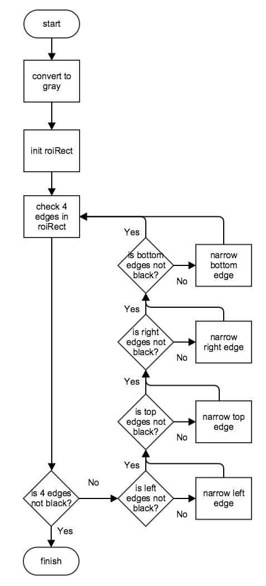

**2.** Rewrite the **Stitching.mm** file as shown below: 

~~~objc
#import "StitchingViewController.h"
#import "Stitching.h"
#import "OpenCVConversion.h"
#import "Cropping.h"

@implementation StitchingViewController

- (void)viewDidLoad {
    [super viewDidLoad];
}

-(void)viewWillAppear:(BOOL)animated {
    [super viewWillAppear:animated];
    
    [_activityIndicator startAnimating];
    dispatch_async(dispatch_get_global_queue(DISPATCH_QUEUE_PRIORITY_DEFAULT, 0), ^{
        cv::Mat stitchMat;
        if(![Stitching stitchImageWithArray:_imageArray andResult:stitchMat]) {
            [self showAlertWithTitle:@"Stitching" andMessage:@"Stitching failed"];
            return;
        }
        
        cv::Mat cropedMat;
        if(![Cropping cropWithMat:stitchMat andResult:cropedMat]){
            [self showAlertWithTitle:@"Cropping" andMessage:@"cropping failed"];
            return;
        }
        
        UIImage *stitchImage=[OpenCVConversion UIImageFromCVMat:cropedMat];
        UIImageWriteToSavedPhotosAlbum(stitchImage, nil, nil, nil);
        
        dispatch_async(dispatch_get_main_queue(), ^{
            [_activityIndicator stopAnimating];
            _imageView.image=stitchImage;
        });
    });
}

-(void) showAlertWithTitle:(NSString *)title andMessage:(NSString *)message {
    dispatch_async(dispatch_get_main_queue(), ^{
        UIAlertView* alertView = [[UIAlertView alloc] initWithTitle:title message:message delegate:nil cancelButtonTitle:@"OK" otherButtonTitles:nil];
        [alertView show];
        [_activityIndicator stopAnimating];
    });
}

@end
~~~

Now, capture a series of photos, download them and stitch them together. Congratulations, you have generated a perfect panorama!

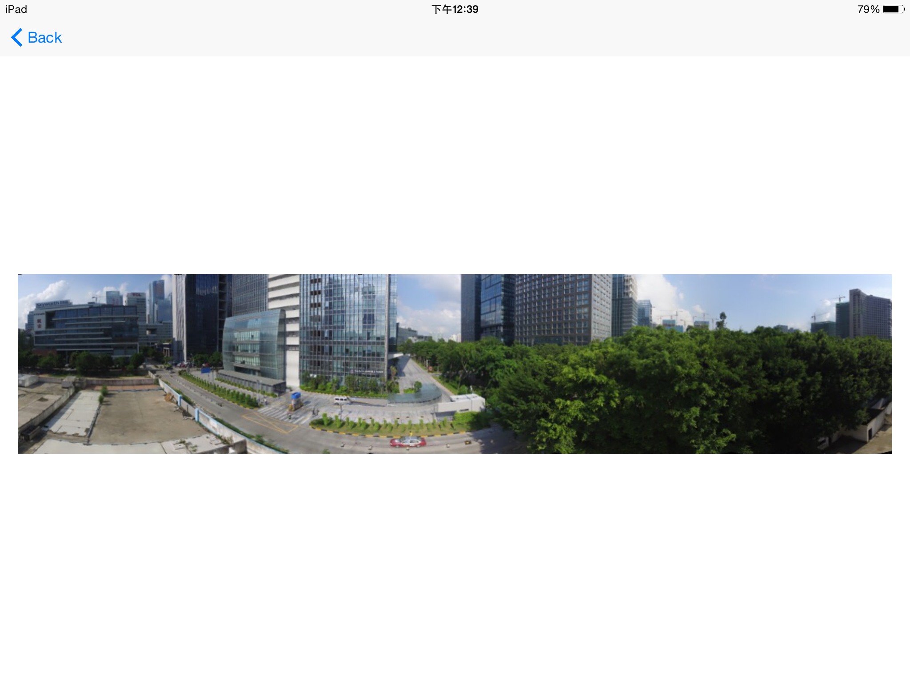

## Summary
   
   In this tutorial, you’ve learned how to use the Joystick feature and the Waypoint feature of Intelligent Navigation to control the aircraft to rotate and take photos. Then you used OpenCV to stitch and crop photos into a cool panorama!
      
   Congratulations! Now that you've finished the demo project, you can build on what you have learnt and start to build your own panorama applications. You can improve the project by showing the aircraft's flight mode type, current GPS satellite count, vertical and horizontal flight speed and the flight altitude, etc. There are still a large number of ways to make this a turly fantastic application! Good luck, and we hope you enjoyed this tutorial!

