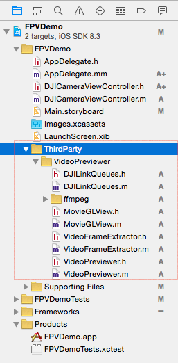

# DJI Mobile iOS SDK 教程

## 如何创建一个航拍相机App: 第一部分

### 1. 下载SDK

你可以从这里下载到最新的SDK <https://dev.dji.com/cn/products/sdk/mobile-sdk/downloads>

开发包内容包括：

- 相机、云台、地面站、操纵杆等各模块的demo程序（地面站和操纵杆仅Level 2 开发者可使用）
- API 说明文档
- lib库文件

支持平台：支持iOS 6.1 及以上版本

### 2. 解压SDK并导入到自己的工程

**1**. 先拷贝DJISDK.framework到您的工程目录下，再将DJISDK.framework拖到您工程”Frameworks”的目录下，如下图所示:

   
   
**2**. 从Xcode的左侧导航栏选择当前工程，进入右侧的 Build Phases -> Link Binary With Libraries. 点击底部的 "+" 按钮添加 libstdc++.6.0.9.dylib 和 libz.dylib 到你的工程中. 编译SDK时需要用到这些动态库。

**3**. 由于iOS SDK中使用了C++进行开发，故为了在工程中使用SDK，需要修改工程其中一个实现文件的后缀名为"**.mm**". 这里我们修改 "**AppDelegate.m**" 文件, 修改为 "**AppDelegate.mm**".

**4**. **重要提示**: APP如需支持Inspire 1/Phantom 3 Professional飞行器, 需要添加MFI通信支持。

   添加方法：在工程的Supporting Files文件夹下的plist文件添加MFI协议名称，如下图所示：  
   
   
   
### 3. 激活 SDK

**1**. 在 **AppDelegate.mm** 文件中导入SDK头文件:

~~~objc
   #import <DJISDK/DJISDK.h>
~~~

**2**. 实现 **DJIAppManagerDelegate** 的委托方法，并且在注册App成功后，发送通知，如下图所示：

~~~objc
@interface AppDelegate ()<DJIAppManagerDelegate>

@end

@implementation AppDelegate

- (BOOL)application:(UIApplication *)application didFinishLaunchingWithOptions:(NSDictionary *)launchOptions {

    NSString *appKey = @"Enter Your App Key";
    [DJIAppManager registerApp:appKey withDelegate:self];
    
    return YES;
}

#pragma mark DJIAppManagerDelegate Method
-(void)appManagerDidRegisterWithError:(int)error
{
    NSString* message = @"Register App Successed!";
    if (error != RegisterSuccess) {
        message = @"Register App Failed!";
    }else
    {
        [[NSNotificationCenter defaultCenter] postNotificationName:@"RegisterAppSuccess" object:nil];
    }
    
    UIAlertView* alertView = [[UIAlertView alloc] initWithTitle:@"Register App" message:message delegate:nil cancelButtonTitle:@"OK" otherButtonTitles:nil];	
    [alertView show];
}

~~~

---
**注意**: 你可以在SDK网站上创建属于你自己App的**App Key**: <https://dev.dji.com/cn/user/mobile-sdk>, 如下图所示:

另外, **App Key** 是和工程的 **Bundle Identifier**相关联的. 所以如果Bundle Identifier不正确的话，你就不能在多个不同工程里面使用同一个App Key。

---

**3**. 现在运行你的Xcode工程, 如果一切顺利, 你可以看到 "Register App Successed!" 的提示！

### 4. 实现FPV视图功能
  **1**. 我们使用 FFMPEG 解码库 (http://ffmpeg.org) 对视频流进行解码. 你可以在下载好的SDK开发包中找到 **VideoPreviewer** 文件夹. 将它拷贝到 Xcode 工程的文件夹中, 然后像下图所示添加到工程导航栏的**thirdParty**文件夹下:
  
 
 
  **2**. 接下来来到XCode -> Project -> Build Phases -> Link Binary With Libraries中, 点击“**+**” 添加libiconv.dylib动态库文件. 然后在Build Settings中的Header Search Paths 添加FFMPEG的 include 文件夹路径. 同时在Library Search Paths中添加 FFMPEG的 lib 文件夹的路径，如下图所示:
  
  
  
  
  **3**. 创建 **DJICameraViewController** 并在 **Main.storyboard** 中设置它为**Root ViewController**, 添加一个 UIView到该viewController中, 设置它的 IBOutlet 为**fpvPreviewView**, 然后在底部添加两个 UIButton 和一个 UISegmentedControl 控件, 设置好它们的IBOutlets 和 IBActions，如下图所示:
  
  
  
  打开 **DJICameraViewController.m** 文件 导入 **DJISDK** 和 **VideoPreviewer** 头文件, 然后创建 **DJIDrone** 和 **DJICamera** 实例变量，如下所示实现它们的委托方法:
  
~~~objc
#import <DJISDK/DJISDK.h>
#import "VideoPreviewer.h"

@interface DJICameraViewController ()<DJICameraDelegate, DJIDroneDelegate>
{
    DJIDrone *_drone;
    DJICamera* _camera;
}

~~~
**4**. 在**ViewDidLoad** 函数中初始化 DJIDrone 实例变量 然后设置它的类型为 **DJIDrone_Inspire** (你可以根据你的飞机机型输入), 设置它的delegate 并启动 Video Previewer. 同时, 添加一个 NSNotificationCenter 的监听来检查 **RegisterAppSuccess** 消息:
  
~~~objc
- (void)viewDidLoad {
    [super viewDidLoad];
    
    [[NSNotificationCenter defaultCenter] addObserver:self selector:@selector(registerAppSuccess:) name:@"RegisterAppSuccess" object:nil];
    _drone = [[DJIDrone alloc] initWithType:DJIDrone_Inspire];
    _drone.delegate = self;
    _camera = _drone.camera;
    _camera.delegate = self;
    
    [[VideoPreviewer instance] start];
    
}

- (void)registerAppSuccess:(NSNotification *)notification
{
    
    NSLog(@"registerAppSuccess");
    [_drone connectToDrone];
    [_camera startCameraSystemStateUpdates];
    
}

~~~
  
接着, 在**viewWillAppear**方法中设置 **fpvPreviewView** 实例变量为 **VideoPreviewer** 的视图，以展示视频流画面，然后在**viewWillDisappear** 方法中重置为nil:
 
~~~objc
- (void)viewWillAppear:(BOOL)animated
{
    [super viewWillAppear:animated];
    
    [_drone connectToDrone];
    [_camera startCameraSystemStateUpdates];
    [[VideoPreviewer instance] setView:self.fpvPreviewView];
    
}

- (void)viewWillDisappear:(BOOL)animated
{
    
    [super viewWillDisappear:animated];
    [_camera stopCameraSystemStateUpdates];
    [_drone disconnectToDrone];
    [[VideoPreviewer instance] setView:nil];
    
}
~~~
  
  最后, 实现 DJICameraDelegate 方法:
  
~~~objc
#pragma mark - DJICameraDelegate

-(void) camera:(DJICamera*)camera didReceivedVideoData:(uint8_t*)videoBuffer length:(int)length
{
    uint8_t* pBuffer = (uint8_t*)malloc(length);
    memcpy(pBuffer, videoBuffer, length);
    [[VideoPreviewer instance].dataQueue push:pBuffer length:length];
}

-(void) camera:(DJICamera*)camera didUpdateSystemState:(DJICameraSystemState*)systemState
{
    if (!systemState.isTimeSynced) { //Only for Phantom 2 Vision/Phantom 2 Vision+ to check camera time
        [_camera syncTime:nil];
    }
    if (systemState.isUSBMode) { //Only for Phantom 2 Vision/Phantom 2 Vision+ to keep cameraMode when systemState is under USBMode
        [_camera setCamerMode:CameraCameraMode withResultBlock:Nil];
    }
    
}

-(void) droneOnConnectionStatusChanged:(DJIConnectionStatus)status
{
    if (status == ConnectionSuccessed) {
        NSLog(@"Connection Successed");
    }
    else if(status == ConnectionStartConnect)
    {
        NSLog(@"Start Reconnect");
    }
    else if(status == ConnectionBroken)
    {
        NSLog(@"Connection Broken");
    }
    else if (status == ConnectionFailed)
    {
        NSLog(@"Connection Failed");
    }
}

~~~
   -(void) camera:(DJICamera*)camera didReceivedVideoData:(uint8_t*)videoBuffer length:(int)length 委托方法用来发送视频流信息给**VideoPreviewer**进行解码.
   
   -(void) camera:(DJICamera*)camera didUpdateSystemState:(DJICameraSystemState*)systemState 委托方法用来获取相机的状态信息, 它会被频繁调用, 所以你可以在这个委托方法中更新你的App界面状态和相机参数设置.
   
   -(void) droneOnConnectionStatusChanged:(DJIConnectionStatus)status 委托方法用来检查飞行器的连接状态.
   
  **5**. 编译运行你的工程, 检查下一切是否正常. 如果你可以看到类似以下截屏画面, 那么你就可以准备启动你的航拍飞机，享受飞机摄像机上的FPV画面了!
  
  
  
### 5. 连接飞行器
完成以上步骤后, 现在就可以连接你的移动设备到DJI飞行器上，检查是否获取到FPV画面，以下是连接指引：

* 连接 Inspire 1, Phantom 3 Professional or Phantom 3 Advanced:

  **1**. 首先启动遥控器电源, 再启动你的飞行器
  
  **2**. 使用苹果的数据线将移动设备连接到遥控器上
  
  **3**. 如果弹出“是否信任该设备？”对话框，选择信任
  
  **4**. 使用app来控制飞机的相机

* 连接 DJI Phantom 2 Vision+ or Phantom 2 Vision:

  **1**. 首先启动遥控器电源, 再启动你的飞行器
  
  **2**. 启动Wi-Fi中继器电源
  
  **3**. 在你的移动设备上启动 WIFI ，然后连接到名字类似Phantom-xxxxxx (xxxxxx是你的中继器SSID数字)的WIFI网络上
  
  **4**. 使用app来控制飞机的相机
  
  
### 6. 享受FPV视图

如果你可以在app中看到飞机的视频流，那么恭喜，你已经完成了第一部分教程的内容了！下图是app的截屏：

  

### 7. 现在要怎么做?

   你可以从这里下载到本教程的Demo工程:<https://github.com/DJI-Mobile-SDK/FPVDemo-Part1.git>
   
   你已经学会了如何配置DJI Mobile SDK的iOS开发环境，并成功用它开发app来展示飞行器相机的FPV画面。在接下来的教程中，我们会在此基础上添加拍照和录像功能. 请关注我们[第二部分](../Part2/FPVDemo_Part2_ch.html)的教程，希望你喜欢！
