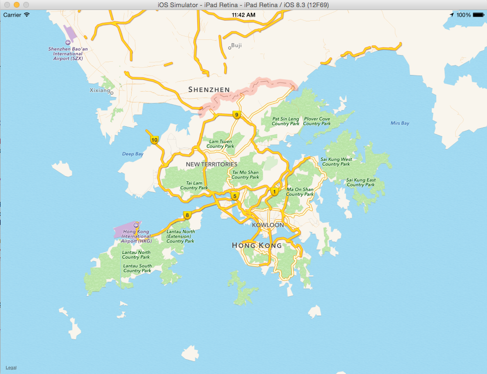
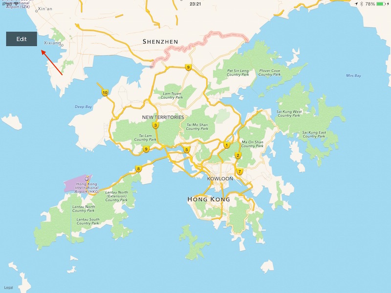
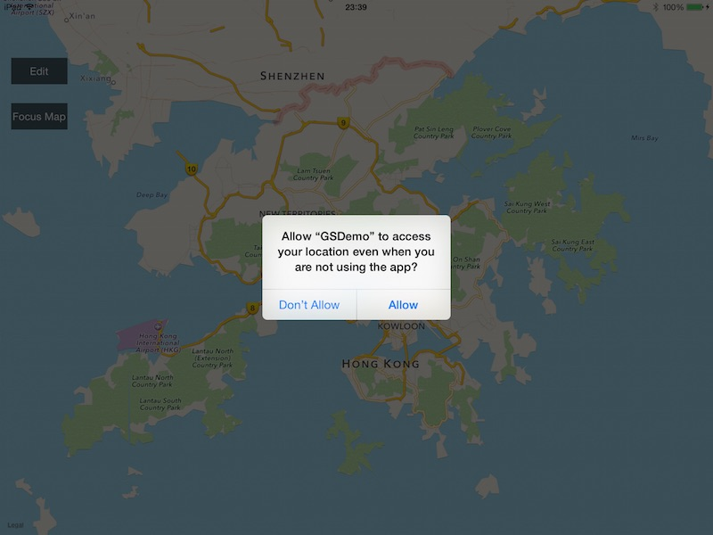
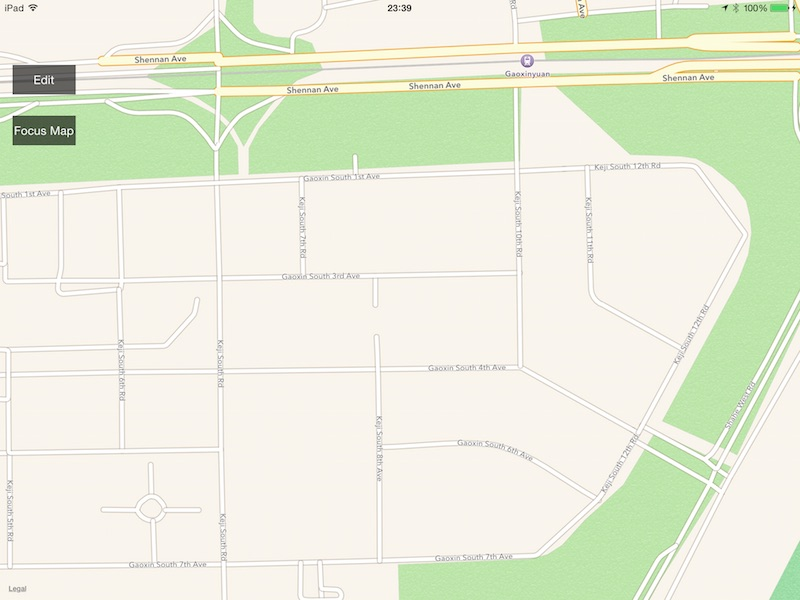
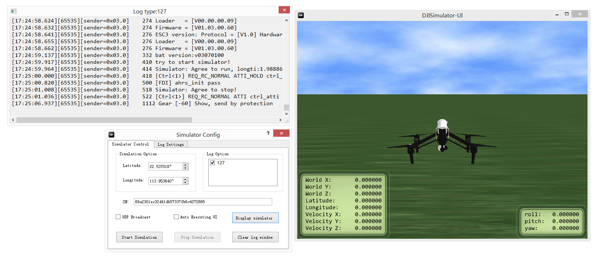
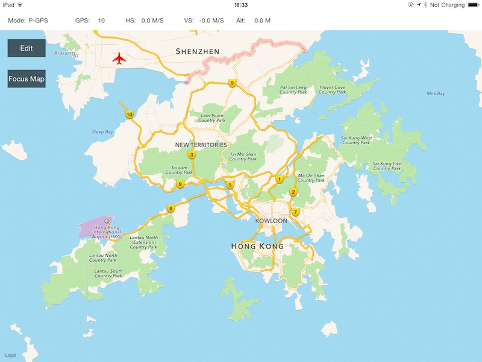
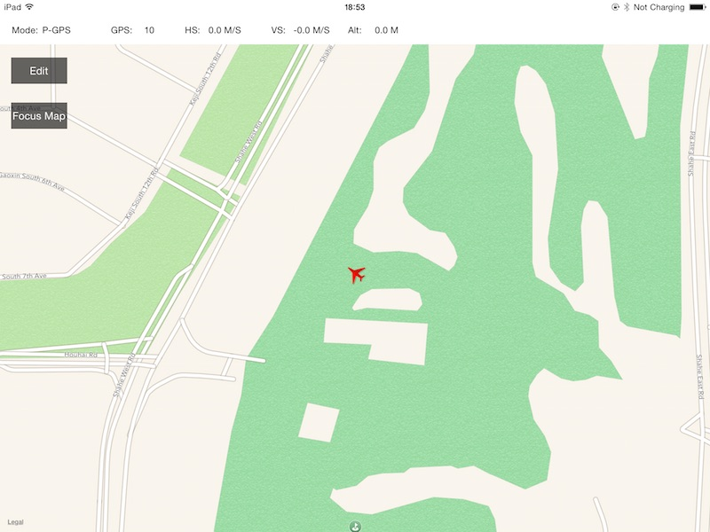

# DJI Mobile iOS SDK Tutorial
 

# How to create a MapView and Waypoint Application: Part 1/2
In this tutorial, you will learn how to setup the DJI PC Simulator, upgrade your Inspire 1, Phantom 3 Professional and Phantom 3 Advanced's firmware to the beta version, and how to test the GroundStation API with DJI PC Simulator. Also, you will get comfortable with the basic process of using DJI GroundStation's Waypoint feature. So let's get started!

   You can download the demo project for this tutorial from here: <https://github.com/DJI-Mobile-SDK/iOS-GSDemo-Part1.git>

## 1. Using The DJI PC Simulator

#### **1**. **Introduction**

The DJI PC Simulator is a flight simulator designed for SDK developers. The simulator creates a virtual 3D environment and provides data analysis from flight data transmitted to the PC via the UDP protocol.

**Supported Operating Systems**: Windows 7, Windows 8, and Windows 8.1

**Supported DJI Platforms**: Matrice 100, Inspire 1, Phantom 3 Professional, and Phantom 3 Advanced

#### **2**. **Install and setup the DJI PC Simulator**

First, you should download the DJI PC Simulator and WIN Driver from here: <http://dev.dji.com/en/products/sdk/onboard-sdk/downloads> :

- DJI PC Simulator Installer & User Manual V1.0
- WIN Driver Installer

You must install the driver before running the simulator. Since the simulator only supports Windows, you should find a PC or install a Virtual Manchine(Like VMWare or Parallels Desktop) to run Windows on your Mac. Now, double click the **DJI_WIN_Driver_Installer.exe** file to install it. If a dialog box saying **"Please power on MC and connect it to PC via USB!"** pops up, just ignore it, click **"YES"**, and follow the rest of the instructions to install the driver. 

Then, double click the **DJISimulator-Installer.exe** file and follow the instructions to install the program. 

#### **3**. **How to use the DJI PC Simulator**

**1**. The **Simulator Config** window will appear once you launch the DJI PC Simulator. Set the **Latitude** and **Longitude** values based on your preference. The **SN** represents the connected aircraft's SN number. If you do not see the **SN**, your aircraft is not connected properly to the PC or there is an issues with your firmware.

 

---
**Note**: 

- The aircraft will not take off if the latitude and longitude values are near a [No Fly Zone](http://flysafe.dji.com/no-fly).

- Select **show log window** under the Log Settings tab to display the log window, as seen below:

 

---

**2**. Connect the aircraft to your PC via the Micro USB cable, turn on the remote controller and finally turn on the aircraft. Click **Display Simulator**, and you will see the screenshot below(it will show whatever aircraft you are using). In this case you see the Inspire 1:

 

---
**Note**: 

- Do **NOT** launch the DJI Pilot app when the DJI PC Simulator is running.

- Do **NOT** mount the propellers on the aircraft when the DJI PC Simulator is running, in case the motors start by accident. That would be extremely dangerous.

---

**3**. Start the simulation by clicking **Start Simulation**. You can use the remote controller to change the course of the aircraft by swithing the control mode to **P** or bring it back home with the **Return-to-Home** button on the remote controller.

Please check the data on the left down corner of view, World X, Y, Z represents the North-South, East- West, and Up-Down axes (take the North, East and Up directions as positive). 

**4**. In order to change the view angle, left-click and drag, and to scroll, zoom in and zoom out.

 
 
 

**5**. Click **Stop Simulation** to stop the simulation. Close the simulator, and turn off the aircraft, and turn off the remote controller after use. 

**Important**: If you want to stop midway through a GroundStation Waypoint Mission, you should click **Stop Simulation** and stop the mission on the device you are running it from, otherwise the simulator may run the previous groundstation mission when you start it again.

For more info about DJI PC Simulator, please check the **DJI PC Simulator user manual.pdf** file, which is included in the download along with the simulator.

## 2. Upgrade Your Aircraft's Firmware

It's important to make sure your aircraft's firmware supports the DJI Mobile SDK before going through the following steps. Please download the beta version firmware from here based on the aircraft you have: <http://dev.dji.com/en/products/sdk/onboard-sdk/downloads> :

- Phantom 3 Professional Firmware
- Phantom 3 Advanced Firmware
- Inspire 1 Firmware

It's not necessary to upgrade the Remote Controller's firmware, just put the downloaded **bin** file in the SD Card, insert it to your aircraft's camera, and restart it to upgrade. It may take 10 ~ 30 minutes to finish the upgrade.

For the Inspire 1, you can check the upgrade status of the firmware by identifying the sound pattern from the aircraft:

- Upgrading: D D D D ... (fast) 
- Upgrade Success: D DD ...
- Upgrade Failed or Error: long beep sound

For the Phantom 3, you can check upgrade status of the firmware by looking at the camera status indicator: 

- Upgrading: camera status indicator will blink green and red
- Upgrade Success: camera sattus indicator will stop blinking 
- Upgrade Failed or Error: camera status indicator will show solid red

Regardless of what aircraft you are using, you can check whether or not the firmware was upgraded by checking the **txt** file generated during the upgrade process. For the Phantom 3 Professional, the txt file is named **"P3X_FW_RESULT_AB.txt"**, and for the Inspire 1, it's named **"WM610_FW_RESULT_AB.txt"**. Here are example contents of the **txt** file:

  
  
  

## 3. Setup The Map View

#### **1**. **Import The Framework and Libraries**

Now that you've finished the steps above, we can start working on the application. In our previous tutorial [**How to create a Camera Application**](https://github.com/dji-sdk/Mobile-SDK-Tutorial/blob/master/iOS-FPVDemo/en/FPVDemo/Part1/FPVDemo_Part1_en.md), you learned how to import and activate the DJI Mobile SDK into your Xcode project. If you haven't read that previously, please take a look at it. Once you've done that, we will set up the map view. 

**1**. Create a new project in Xcode and name it "**GSDemo**", copy the **DJISDK.framework** to your Xcode project's folder. Then, select the project target and go to Build Phases -> Link Binary With Libraries. Click the "+" button at the bottom and add two libraries to your project: libstdc++.6.0.9.dylib and libz.dylib. Take a look at the screenshot below:

  

#### **2**. Create The Map View
Now, let's delete the **ViewController.h** and **ViewController.m** files, which were created by Xcode when you created the project. Then, create a viewController named "**DJIRootViewController**" and set it as the **Root View Controller** in **Main.storyboard**. Moreover, drag a **MKMapView** from Object Library to **DJIRootViewController**, setup its AutoLayout constraints, and set its delegate to **DJIRootViewController**, as seen below:
   

After that, open the **DJIRootViewController.h** file, create an IBOutlet for the MKMapView, name it "**mapView**" and link it to the MKMapView in **Main.storyboard**. Import the following header files and implement MKMapView's delegate method:

~~~objc
#import <DJISDK/DJISDK.h>
#import <MapKit/MapKit.h>

@interface DJIRootViewController : UIViewController<MKMapViewDelegate>

@property (weak, nonatomic) IBOutlet MKMapView *mapView;

@end
~~~

Now, let's build and run the project. If everything is as it should be, you should see the following screenshot:

#### **3**. Add Annotations to The MapView

Currently, the map view is simple. Let's add something interesting to it. Create a new **NSObject** file named **DJIMapController**, which will be used to deal with the MKAnnotations(or for our purposes, Waypoints) logic on the map. Open the **DJIMapController.h** file and add the following code to it:

~~~objc
#import <UIKit/UIKit.h>
#import <MapKit/MapKit.h>

@interface DJIMapController : NSObject

@property (strong, nonatomic) NSMutableArray *editPoints;

/**
 *  Add Waypoints in Map View
 */
- (void)addPoint:(CGPoint)point withMapView:(MKMapView *)mapView;

/**
 *  Clean All Waypoints in Map View
 */
- (void)cleanAllPointsWithMapView:(MKMapView *)mapView;

/**
 *  Current Edit Points
 *
 *  @return Return an NSArray contains multiple CCLocation objects
 */
- (NSArray *)wayPoints;

@end
~~~

Here, we create an NSMutableArray called **editPoints** to store waypoint objects and add two methods to implement **Add** and **Remove** waypoints. The last method will be used to return the current waypoint objects on the map in an array.

Let's go to the **DJIMapController.m** file and replace the original code with the following:

~~~objc
#import "DJIMapController.h"

@implementation DJIMapController

- (instancetype)init
{
    if (self = [super init]) {
        self.editPoints = [[NSMutableArray alloc] init];
    }
    return self;
}

- (void)addPoint:(CGPoint)point withMapView:(MKMapView *)mapView
{
    CLLocationCoordinate2D coordinate = [mapView convertPoint:point toCoordinateFromView:mapView];
    CLLocation *location = [[CLLocation alloc] initWithLatitude:coordinate.latitude longitude:coordinate.longitude];
    [_editPoints addObject:location];
    MKPointAnnotation* annotation = [[MKPointAnnotation alloc] init];
    annotation.coordinate = location.coordinate;
    [mapView addAnnotation:annotation];
}

- (void)cleanAllPointsWithMapView:(MKMapView *)mapView
{
    [_editPoints removeAllObjects];
    NSArray* annos = [NSArray arrayWithArray:mapView.annotations];
    for (int i = 0; i < annos.count; i++) {
        id<MKAnnotation> ann = [annos objectAtIndex:i];
        [mapView removeAnnotation:ann];
    }   
}

- (NSArray *)wayPoints
{
    return self.editPoints;
}

@end
~~~
First, we initialize the **editPoints** array in the **init** method, then create **MKPointAnnotation** objects from **CGPoint** and add them to our **mapView**, and finally implement the **cleanAllPointsWithMapView** method to clean up the **eidtPoints** array and the annotations on the mapView.

Go back to the **DJIRootViewController.h** file, import the DJIMapController.h header file, and create a **DJIMapController** property named **mapController**. Since we want to add annotation pins by tapping on the map, we also need to create a **UITapGestureRecognizer** named as "**tapGesture**". Lastly, add a **UIButton** to the **DJIRootViewController** scene in **Main.storyboard**, set its IBOutlet name as "**editBtn**", and add an IBAction method named "**editBtnAction**" for it, as shown below:

~~~objc
@property (nonatomic, strong) DJIMapController *mapController;
@property (nonatomic, strong) UITapGestureRecognizer *tapGesture;
@property (weak, nonatomic) IBOutlet UIButton *editBtn;

- (IBAction)editBtnAction:(id)sender;
~~~

Once that is complete, open the **DJIMapController.m** file, initialize the **mapController** and **tapGesture** variables, and add the **tapGesture** to mapView to add waypoints. Furthermore, we need a boolean variable named "**isEditingPoints**" to store the edit waypoint state, which will also change the title of **editBtn** accordingly. Lastly, implement tapGesture's action method **addWayPoints**, as shown below:

~~~objc
#import "DJIRootViewController.h"

@interface DJIRootViewController ()
@property (nonatomic, assign)BOOL isEditingPoints;
@end

@implementation DJIRootViewController
- (void)viewDidLoad {
    [super viewDidLoad];
    
    self.mapController = [[DJIMapController alloc] init];
    self.tapGesture = [[UITapGestureRecognizer alloc] initWithTarget:self action:@selector(addWaypoints:)];
    [self.mapView addGestureRecognizer:self.tapGesture];
    
    [[NSNotificationCenter defaultCenter] addObserver:self selector:@selector(registerAppSuccess:) name:@"RegisterAppSuccess" object:nil];
}

#pragma mark Custom Methods

- (void)registerAppSuccess:(NSNotification *)notification
{

}

- (void)addWaypoints:(UITapGestureRecognizer *)tapGesture
{
    CGPoint point = [tapGesture locationInView:self.mapView];
    
    if(tapGesture.state == UIGestureRecognizerStateEnded){

        if (self.isEditingPoints) {
            [self.mapController addPoint:point withMapView:self.mapView];
        }
    }
}

- (IBAction)editBtnAction:(id)sender {

    if (self.isEditingPoints) {
        [self.mapController cleanAllPointsWithMapView:self.mapView];
        [self.editBtn setTitle:@"Edit" forState:UIControlStateNormal];
    }else
    {
        [self.editBtn setTitle:@"Reset" forState:UIControlStateNormal];
    }
    
    self.isEditingPoints = !self.isEditingPoints;
    
}

#pragma mark MKMapViewDelegate Method
- (MKAnnotationView *)mapView:(MKMapView *)mapView viewForAnnotation:(id <MKAnnotation>)annotation
{
    if ([annotation isKindOfClass:[MKPointAnnotation class]]) {
        MKPinAnnotationView* pinView = [[MKPinAnnotationView alloc] initWithAnnotation:annotation reuseIdentifier:@"Pin_Annotation"];
        pinView.pinColor = MKPinAnnotationColorPurple;
        return pinView;
        
    }
    
    return nil;
}

~~~

In the above code, we also added an NSNotification observer to check the DJI Mobile SDK's state, to make sure it was sucessfully registered. At the same time, we implement the **addWaypoints** gesture action by calling DJIMapController's 

     - (void)addPoint:(CGPoint)point withMapView:(MKMapView *)mapView
method to add waypoints to the map. Next, we implement the IBAction method **editBtn**, which will update the button's title and clean up waypoints based on the value of **isEditingPoints**. Finally, we implement MKMapViewDelegate's method to change the pin color to purple.

When you are done with all the steps above, build and run your project and try to add waypoints on the map. If everything is fine, you will see the following screenshot:

#### **4**. Focus The MKMapView

You may be wondering why the map's location is different from your current location and why it is difficult to find your location on the map. Focusing the map to your current location quickly would be helpful for the application. To implement that feature, we need to use **CLLocationManager**.

Open the **DJIRootViewController.h** file and import CoreLocation's header file. Create a **CLLocationManager** property named "**locationManager**". Then create a **CLLocationCoordinate2D** property named "**userLocation**" to store the user's location data. Next, implement **CLLocationManager**'s **CLLocationManagerDelegate** protocol in the class, as shown below:

~~~objc
#import <DJISDK/DJISDK.h>
#import <MapKit/MapKit.h>
#import <CoreLocation/CoreLocation.h>

@interface DJIRootViewController : UIViewController<MKMapViewDelegate, CLLocationManagerDelegate>

@property (nonatomic, weak) IBOutlet MKMapView *mapView;
@property (nonatomic, strong) CLLocationManager* locationManager;
@property (nonatomic, assign) CLLocationCoordinate2D userLocation;
@property (nonatomic, strong) UITapGestureRecognizer *tapGesture;
@property (nonatomic, weak) IBOutlet UIButton *editBtn;

- (IBAction)editBtnAction:(id)sender;
- (IBAction)focusMapAction:(id)sender;

@end
~~~

In the code above, we also added a UIButton named "**Focus Map**" in DJIRootViewController's scene in **Main.storyboard** and added an IBAction method named as "**focusMapAction**". Here is the screenshot of the scene from **Main.storyboard**:

Once you are done, go to **DJIRootViewController.m** file and add the following code:

~~~objc
- (void)viewWillAppear:(BOOL)animated
{
    [super viewWillAppear:animated];
    [self startUpdateLocation];
}

- (void)viewWillDisappear:(BOOL)animated
{
    [super viewWillDisappear:animated];
    [self.locationManager stopUpdatingLocation];
}

- (void)viewDidLoad {
    [super viewDidLoad];
    
    self.userLocation = kCLLocationCoordinate2DInvalid;
    
    self.mapController = [[DJIMapController alloc] init];
    self.tapGesture = [[UITapGestureRecognizer alloc] initWithTarget:self action:@selector(addWaypoints:)];
    [self.mapView addGestureRecognizer:self.tapGesture];
    
    [[NSNotificationCenter defaultCenter] addObserver:self selector:@selector(registerAppSuccess:) name:@"RegisterAppSuccess" object:nil];
    
}

#pragma mark CLLocation Methods
-(void) startUpdateLocation
{
    if ([CLLocationManager locationServicesEnabled]) {
        if (self.locationManager == nil) {
            self.locationManager = [[CLLocationManager alloc] init];
            self.locationManager.delegate = self;
            self.locationManager.desiredAccuracy = kCLLocationAccuracyBest;
            self.locationManager.distanceFilter = 0.1;
            if ([self.locationManager respondsToSelector:@selector(requestAlwaysAuthorization)]) {
                [self.locationManager requestAlwaysAuthorization];
            }
            [self.locationManager startUpdatingLocation];
        }
    }else
    {
        UIAlertView *alert = [[UIAlertView alloc] initWithTitle:@"Location Service is not available" message:@"" delegate:self cancelButtonTitle:@"OK" otherButtonTitles:nil];
        [alert show];
    }
}

- (IBAction)focusMapAction:(id)sender {
{
    if (CLLocationCoordinate2DIsValid(self.userLocation)) {
        MKCoordinateRegion region = {0};
        region.center = self.userLocation;
        region.span.latitudeDelta = 0.001;
        region.span.longitudeDelta = 0.001;
        
        [self.mapView setRegion:region animated:YES];
    }
}

#pragma mark - CLLocationManagerDelegate
- (void)locationManager:(CLLocationManager *)manager didUpdateLocations:(NSArray *)locations
{
    CLLocation* location = [locations lastObject];
    self.userLocation = location.coordinate;
}

~~~

First, we initialize **userLocation** data to kCLLocationCoordinate2DInvalid in the viewDidLoad method. Then we add a new method named as **startUpdateLocation** to initialize **locationManger**, set its properties and start updating location. If the Location Service is not available, we add an UIAlertView to display the warning. The **startUpdateLocation** is called in **viewWillAppear** method and is stopped in the **viewWillDisappear** method. Moreover, we need to implement CLLocationManagerDelegate method to update **userLocation** property. Finally, we implement the **focusMapAction** method to focus **mapView** to the user's current location.

In iOS8, we must call **locationManager**'s **requestAlwaysAuthorization** first, which was done in **startUpdateLocation** method. Next, add a NSLocationAlwaysUsageDescription or NSLocationWhenInUseUsageDescription key to your project’s Info.plist containing the message to be displayed to the user when a UIAlert asking whether or not they want to allow the application to use their location. We set the messages empty here:

It's time to build and run the project to check the focus map feature. If it works well, you should see the following screenshot:

When you launch the app for the first time, a pop up alert asking for your permission to access your location will appear. Select **Allow** and press the **Focus Map** button. If the map view animates to your current location like the following screenshot, congratulations, you have finished the **Focus Map** feature!

#### **5**. Show The Aircraft on Map View

Now, we can focus the mapView to our current location, which is a good start! However, let's do something more interesting. We're going to simulate the aircraft's GPS location using the DJI PC Simulator and show it on our map view.

You may know how to setup the DJI PC Simulator, and its basic usage. If you want to place the aircraft in your current GPS location on Map View, you can set the latitude and longitude values in the **Simulator Config** to yours. We take the simulator's initial values in the following example.

Let's come back to the code. Create a new subclass of **MKAnnotationView** named "DJIAircraftAnnotationView" and a new subclass of **NSObject** named **DJIAircraftAnnotation**. Below is the code:

- DJIAircraftAnnotationView.h

~~~objc
#import <MapKit/MapKit.h>

@interface DJIAircraftAnnotationView : MKAnnotationView

-(void) updateHeading:(float)heading;

@end
~~~

- DJIAircraftAnnotationView.m

~~~objc
#import "DJIAircraftAnnotationView.h"

@implementation DJIAircraftAnnotationView

- (instancetype)initWithAnnotation:(id <MKAnnotation>)annotation reuseIdentifier:(NSString *)reuseIdentifier
{
    self = [super initWithAnnotation:annotation reuseIdentifier:reuseIdentifier];
    if (self) {
        self.enabled = NO;
        self.draggable = NO;
        self.image = [UIImage imageNamed:@"aircraft.png"];
    }
    
    return self;
}

-(void) updateHeading:(float)heading
{
    self.transform = CGAffineTransformIdentity;
    self.transform = CGAffineTransformMakeRotation(heading);
}

@end

~~~

In the code above, we create a MKAnnotationView for the aircraft, add a method named **updateHeading** to change the aircraft's rotation, and set its image to "**aircraft.png**"(You can get the image from this tutorial's demo project.) in the init method. Also, we disable the DJIAircraftAnnotationView's draggable property. Take a look at the code below:

- DJIAircraftAnnotation.h

~~~objc
#import <MapKit/MapKit.h>
#import "DJIAircraftAnnotationView.h"

@interface DJIAircraftAnnotation : NSObject<MKAnnotation>

@property(nonatomic, readonly) CLLocationCoordinate2D coordinate;
@property(nonatomic, weak) DJIAircraftAnnotationView* annotationView;

-(id) initWithCoordiante:(CLLocationCoordinate2D)coordinate;

-(void)setCoordinate:(CLLocationCoordinate2D)newCoordinate;

-(void) updateHeading:(float)heading;

@end
~~~

- DJIAircraftAnnotation.m

~~~objc
#import "DJIAircraftAnnotation.h"

@implementation DJIAircraftAnnotation

-(id) initWithCoordiante:(CLLocationCoordinate2D)coordinate
{
    self = [super init];
    if (self) {
        _coordinate = coordinate;
    }   
    return self;
}

- (void)setCoordinate:(CLLocationCoordinate2D)newCoordinate
{
    _coordinate = newCoordinate;
}

-(void)updateHeading:(float)heading
{
    if (self.annotationView) {
        [self.annotationView updateHeading:heading];
    }
}
@end
~~~

The **DJIAircraftAnnotation** class implements the **MKAnnotation** protocol. It's used to store and update a CLLocationCoordinate2D property. Also, we can update DJIAircraftAnnotationView's heading with the **updateHeading** method.

Once you're done with that, open the **DJIMapController.h** file and import the **DJIAircraftAnnotation.h** file:

~~~objc
#import "DJIAircraftAnnotation.h"
~~~

Then create a property of an instance of DJIAircraftAnnotation and name it **aircraftAnnotation**. 

~~~objc
@property (nonatomic, strong) DJIAircraftAnnotation* aircraftAnnotation;
~~~

Furthermore, add two new methods to update the aircraft's location and it's heading on the map.

~~~objc
/**
 *  Update Aircraft's location in Map View
 */
-(void)updateAircraftLocation:(CLLocationCoordinate2D)location withMapView:(MKMapView *)mapView;

/**
 *  Update Aircraft's heading in Map View
 */
-(void)updateAircraftHeading:(float)heading;
~~~

Next, let's come back to the **DJIMapController.m** file and implement the two methods we just added:

~~~objc
-(void)updateAircraftLocation:(CLLocationCoordinate2D)location withMapView:(MKMapView *)mapView
{
    if (self.aircraftAnnotation == nil) {
        self.aircraftAnnotation = [[DJIAircraftAnnotation alloc] initWithCoordiante:location];
        [mapView addAnnotation:self.aircraftAnnotation];
    }
    
    [self.aircraftAnnotation setCoordinate:location];
}

-(void)updateAircraftHeading:(float)heading
{
    if (self.aircraftAnnotation) {
        [self.aircraftAnnotation updateHeading:heading];
    }
}
~~~

Also, since we don't want the **aircraftAnnotation** removed by the **cleanAllPointsWithMapView** method in the DJIMapController.m file, we need to modify it, as shown below:

~~~objc
- (void)cleanAllPointsWithMapView:(MKMapView *)mapView
{
    [_editPoints removeAllObjects];
    NSArray* annos = [NSArray arrayWithArray:mapView.annotations];
    for (int i = 0; i < annos.count; i++) {
        id<MKAnnotation> ann = [annos objectAtIndex:i];
        if (![ann isEqual:self.aircraftAnnotation]) {
            [mapView removeAnnotation:ann];
        }
       
    }   
}
~~~
We add an if statement to check if the annotation of the map view is equal to the **aircraftAnnotation** property, and if it is not, we remove it. By doing so, we can prevent the Aircraft's annotation from being removed.

To provide a better user experience, we need to add a status view on top of the mapView to show the aircraft's flight mode type, current GPS satellite count, vertical and horizontal flight speed and the flight altitude. Let's add the UI in **Main.storyboard**'s RootViewController Scene, as seen below:

Once that's done, open **DJIRootViewController.h** file, create IBOutlets for the above UI elements and import DJISDK's header file and implement **DJIDroneDelegate** and **DJIMainControllerDelegate** protocols. Here we use Inspire 1 for the demo, so we need to create two properties, one of type **DJIDrone** and another of type **DJIInspireMainController**'s property. Also, we need to create a **CLLocationCoordinate2D** property named **droneLocation** to record the aircraft's location, as shown below:

~~~objc
#import <DJISDK/DJISDK.h>
@interface DJIRootViewController : UIViewController<MKMapViewDelegate, CLLocationManagerDelegate, DJIDroneDelegate, DJIMainControllerDelegate>

@property(nonatomic, strong) IBOutlet UILabel* modeLabel;
@property(nonatomic, strong) IBOutlet UILabel* gpsLabel;
@property(nonatomic, strong) IBOutlet UILabel* hsLabel;
@property(nonatomic, strong) IBOutlet UILabel* vsLabel;
@property(nonatomic, strong) IBOutlet UILabel* altitudeLabel;

@property(nonatomic, strong) DJIDrone* inspireDrone;
@property(nonatomic, strong) DJIInspireMainController* inspireMainController;
@property(nonatomic, assign) CLLocationCoordinate2D droneLocation;
~~~

Now, let's move on to the **DJIRootViewController.m** file and initialize the UI elements' values in a method called **initUI**. Also, add an **initDrone** method to initialize the properties for **inspireDrone**. Call the **initUI** and **initDrone** methods in the **viewDidLoad** method:

~~~objc

-(void) initUI
{
    self.modeLabel.text = @"N/A";
    self.gpsLabel.text = @"0";
    self.vsLabel.text = @"0.0 M/S";
    self.hsLabel.text = @"0.0 M/S";
    self.altitudeLabel.text = @"0 M";
}

- (void)initDrone
{
    self.inspireDrone = [[DJIDrone alloc] initWithType:DJIDrone_Inspire];
    self.inspireMainController = (DJIInspireMainController*)self.inspireDrone.mainController;
    self.inspireDrone.delegate = self;
    self.inspireMainController.mcDelegate = self;
}
~~~

The **DJIInspireMainController** subclass from **DJIMainController** is a mainController to control the aircraft and get the DJIMCSystemState during take off, landing, and etc. You can check its header file in the SDK for more info. In the **initDrone** method, we set **inspireDrone** and **inspireMainController** delegates as self.

Remember the **registerAppSuccess** method we've added previously? Let's have it look like this:

~~~objc
#pragma mark NSNotification Selector Method
- (void)registerAppSuccess:(NSNotification *)notification
{
    [self.inspireDrone connectToDrone];
    [self.inspireMainController startUpdateMCSystemState];
}
~~~

In the method above, when the app is registerd successfully, we can call DJIDrone's **connectToDrone** method to connect to the aircraft, and call **startUpdateMCSystemState** method to start updating the aircraft's system state, which is information we need to update our aircraft's location and heading. Moreover, in the **viewWillDisappear** method, we need to disconnect from the drone, as shown below:

~~~objc
- (void)viewWillDisappear:(BOOL)animated
{
    [super viewWillDisappear:animated];

    [self.locationManager stopUpdatingLocation];
    [self.inspireDrone disconnectToDrone];
}
~~~

In the **viewDidLoad** method, assign the **droneLocation** property's value as kCLLocationCoordinate2DInvalid. 

~~~objc
    self.droneLocation = kCLLocationCoordinate2DInvalid;
~~~

Also, update the **focusMapAction** method to set **droneLocation** as the center of the map view's region, as shown below:

~~~objc
- (IBAction)focusMapAction:(id)sender {

    if (CLLocationCoordinate2DIsValid(self.droneLocation)) {
        MKCoordinateRegion region = {0};
        region.center = self.droneLocation;
        region.span.latitudeDelta = 0.001;
        region.span.longitudeDelta = 0.001;
        [self.mapView setRegion:region animated:YES];
    }

}
~~~

Next, We need to modify the **MKMapViewDelegate** method to what is shown below. It will check the annotation variable's class and set its annotationView as a **DJIAircraftAnnotationView** Class type object:

~~~objc
- (MKAnnotationView *)mapView:(MKMapView *)mapView viewForAnnotation:(id <MKAnnotation>)annotation
{
    if ([annotation isKindOfClass:[MKPointAnnotation class]]) {
        MKPinAnnotationView* pinView = [[MKPinAnnotationView alloc] initWithAnnotation:annotation reuseIdentifier:@"Pin_Annotation"];
        pinView.pinColor = MKPinAnnotationColorPurple;
        return pinView;
        
    }else if ([annotation isKindOfClass:[DJIAircraftAnnotation class]])
    {
        DJIAircraftAnnotationView* annoView = [[DJIAircraftAnnotationView alloc] initWithAnnotation:annotation reuseIdentifier:@"Aircraft_Annotation"];
        ((DJIAircraftAnnotation*)annotation).annotationView = annoView;
        return annoView;
    }
    
    return nil;
}
~~~

Furthermore, let's implement the **DJIMainControllerDelegate** method:

~~~objc
#pragma mark - DJIMainControllerDelegate Method

-(void) mainController:(DJIMainController*)mc didUpdateSystemState:(DJIMCSystemState*)state
{
    self.droneLocation = state.droneLocation;
    DJIInspireMCSystemState* inspireState = (DJIInspireMCSystemState*)state;
    if (!inspireState.canIOCWork) {
        [self.inspireMainController setFlightModeSwitchable:YES withResult:nil];
    }
    if (inspireState.isIOCWorking) {
        [self.inspireMainController setIOCWorking:NO withResult:nil];
    }
    
     self.modeLabel.text = inspireState.flightModeString;
    self.gpsLabel.text = [NSString stringWithFormat:@"%d", inspireState.satelliteCount];
    self.vsLabel.text = [NSString stringWithFormat:@"%0.1f M/S",inspireState.velocityZ];
    self.hsLabel.text = [NSString stringWithFormat:@"%0.1f M/S",(sqrtf(inspireState.velocityX*inspireState.velocityX + inspireState.velocityY*inspireState.velocityY))];
    self.altitudeLabel.text = [NSString stringWithFormat:@"%0.1f M",inspireState.altitude];
        
    [self.mapController updateAircraftLocation:self.droneLocation withMapView:self.mapView];
    double radianYaw = (state.attitude.yaw * M_PI / 180.0);
    [self.mapController updateAircraftHeading:radianYaw];
    
}
~~~

First, it will update the **droneLocation** with the aircraft's current location. Then, it will disable the inspireMainController's IOC function.

***
**Important**: Since there are conflicts between DJI Mobile SDK's GroundStation and IOC, you cannot use them at the same time. Please make sure to close the IOC feature before using GroundStation. Otherwise, you will run into errors.
***

Next, update the text for the status labels from the DJIMCSystemState. Furthermore, update the aircraft's location and heading by calling the related methods from **DJIMapController**.

Finally, let's implement the DJIDroneDelegate Method, as shown below:

~~~objc
#pragma mark - DJIDroneDelegate Method
-(void) droneOnConnectionStatusChanged:(DJIConnectionStatus)status
{
    if (status == ConnectionSuccessed) {
        [self.inspireMainController enterNavigationModeWithResult:^(DJIError *error) {
            if (error.errorCode != ERR_Successed) {
                NSString* message = [NSString stringWithFormat:@"Enter navigation mode failed:%@", error.errorDescription];
                UIAlertView* alertView = [[UIAlertView alloc] initWithTitle:@"Enter Navigation Mode" message:message delegate:self cancelButtonTitle:@"Cancel" otherButtonTitles:@"Retry", nil];
                alertView.tag = kEnterNaviModeFailedAlertTag;
                [alertView show];
            }
        }];
    }
    
}
~~~

If it succeeds to connect to the aircraft, call **DJIInspireMainController**'s **enterNavigationModeWithResult** method to check if the aircraft entered navigation mode successfully. If not, just show a UIAlertView to the user. We need to implement UIAlertView's delegate method as shown below:

~~~objc
#pragma mark - UIAlertViewDelegate

- (void)alertView:(UIAlertView *)alertView clickedButtonAtIndex:(NSInteger)buttonIndex
{
    if (alertView.tag == 1002) {
        if (buttonIndex == 1) {
            [self.inspireMainController enterNavigationModeWithResult:^(DJIError *error) {
                if (error.errorCode != ERR_Successed) {
                    NSString* message = [NSString stringWithFormat:@"Enter navigation mode failed:%@", error.errorDescription];
                    UIAlertView* alertView = [[UIAlertView alloc] initWithTitle:@"Enter Navigation Mode" message:message delegate:self cancelButtonTitle:@"Cancel" otherButtonTitles:@"Retry", nil];
                    alertView.tag = kEnterNaviModeFailedAlertTag;
                    [alertView show];
                }
            }];
        }
    }
}
~~~

Let's test the application! 
Build and run the project to install the app onto your mobile device. After that, please connect the aircraft to your PC or Virtual Machine running Windows via a Micro USB cable, and then power on the aircraft and the remote controller. Click Display Simulator. You can type in your current location's latitude and longitude data in the Simulator Config, if you would like. 

Then, run the app and connect your mobile device to the remote controller using Apple's lighting cable. You may see the following screenshot:

**Important**: To fix this problem, please switch the Remote Controller's mode selection to the **F** position (which used to be the A position in the previous version) and press **Retry** button. If the mode selection bar is in the F position when the autopilot is powered on, the user must toggle back and forth between **F** and another position and then press the **Retry** button again.

You are required to be in the **F** position when using the Ground Station, Hotpoint and Joystick functions in the DJI Mobile SDK.

Next, let's go to the DJI PC Simulator on your PC and press the **Start Simulation** button. If you check the application now, a tiny red aircraft will be shown on the map as seen below:

If you cannot find the aircraft, press the "**Focus Map**" button and the map view will zoom in to center the aircraft on the center of the map view region as seen below:

Now, if you press the **Stop Simulation** button on the Simulator Config, the aircraft will disappear on the map, since the simulator stops providing GPS data to the aircraft.

## 4. Where To Go From Here?
   
   You’ve learned how to setup and use the DJI PC Simulator to test your groundStation application, upgrade your aircraft's firmware to the developer version, use the DJI Mobile SDK to create a simple map view, modify annotations of the map view, show the aircraft on the map view by using GPS data from the DJI PC Simulator, and much more.
   
   In the [next tutorial](../Part2/GSDemo-Part2_en.md), we will implement the basic functionality of waypoints in the groundStation. Your aircraft will be able to fly automatically on the map view based on the waypoints you set. Please move on to the second part of this tutorial. Hope you enjoy it!