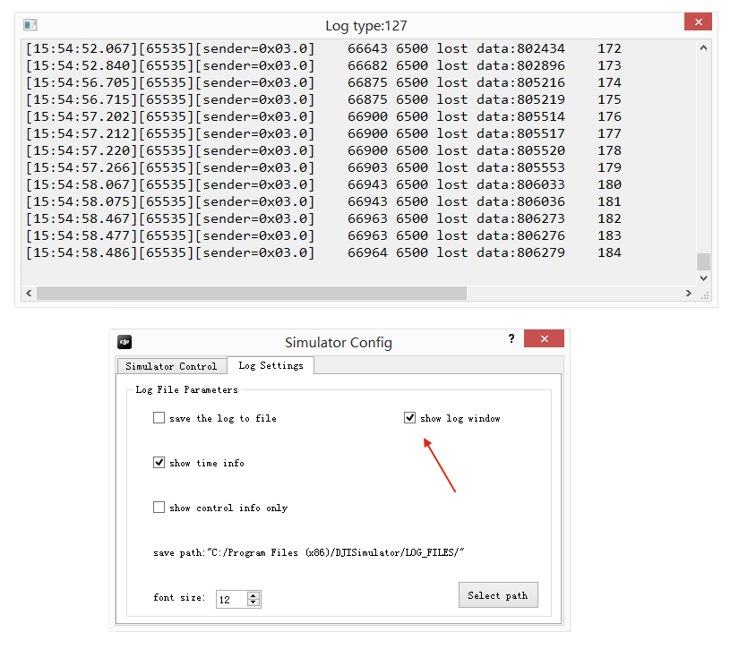

# DJI Mobile iOS SDK 教程
 
# 如何创建一个地图和地面站预设航点功能App: 第一部分

*注意: 本教程中的代码是针对iPad开发的. 请确保在iPad或者iPad模拟器上运行本教程代码。*

在本教程中, 你将学到如何安装使用 DJI PC 模拟器, 如何升级你的 Inspire 1, Phantom 3 Professional 和 Phantom 3 Advanced的固件到Beta版本, 以及如何使用DJI PC 模拟器去测试地面站的API. 同时, 你将学到地面站预设航点功能的基本使用流程. 现在开始学习吧!

   你可以在这里下载到本教程的全部代码: <https://github.com/DJI-Mobile-SDK/iOS-GSDemo-Part1.git>

## 1. 使用DJI PC 模拟器

#### **1**. 介绍
DJI PC 模拟器专为 SDK 开发者所设计。模拟器通过 UDP 广播的方式传输飞行器模拟的参数, 在 PC 端实现飞行器的 3D 虚拟显示,并且可以进行数据分析。

**适用操作系统**: Windows 7, Windows 8, 和 Windows 8.1

**适用飞行器型号**: Matrice 100, Inspire 1, Phantom 3 Professional 和 Phantom 3 Advanced

#### **2**. 安装DJI PC模拟器

首先, 请从这里下载DJI PC模拟器和DJI WIN 驱动程序: <http://dev.dji.com/cn/products/sdk/onboard-sdk/downloads> :

- DJI PC模拟器及用户手册V1.0
- WIN Driver Installer

你必须在使用模拟器前安装好驱动程序. 因为目前模拟器只支持Windows系统, 你必须找到一台 PC 或者有运行着Windows系统虚拟机(像 VMWare 或者 Parallels Desktop)的Mac才能使用模拟器. 现在, 双击 **DJI_WIN_Driver_Installer.exe** 文件进行安装. 如果弹出一个写着“请给主控供电并用USB连接电脑”的对话框, 点击**是**, 然后按照指引安装好即可。

接着, 双击 **DJISimulator-Installer.exe** 文件并按指引安装好模拟器即可。 

#### **3**. **如何使用DJI PC模拟器**

**1**. 运行DJI PC模拟器时，会首先弹出**Simulator Config**对话框. 设置好 **Latitude（纬度）** 和 **Longitude(经度)** 的值. **SN** 代表连接到PC模拟器上的飞机序列号. 如果 **SN** 的值为空, 请检查你的飞机是否和PC连接好，或者你的飞机的固件版本是否属于开发版本.

 

---
**Note**: 

- 如果你的飞机的经纬度靠近[禁飞区](http://flysafe.dji.com/no-fly), 它将无法起飞。

- 在Log Settings选项中勾选**show log window**, 可以弹出log调试界面:

 

---

**2**. 通过Micro-USB线将你的飞机连接到PC上, 启动遥控器然后启动飞机。 点击**Display Simulator**, 会出现以下界面(它会显示你正在使用的飞机). 当前使用的是Inspire 1:

 

---
**注意**: 

- 使用模拟器时不需要连接 DJI Pilot App.

- 使用模拟器时不需要安装螺旋桨至飞行器.

---

**3**. 点击 Start Simulation 开始模拟飞行。用户可以使用遥控器（档位拨到F档）和 SDK API 串口来控制飞行器的起飞、降落、飞行方向和返航。飞行状态栏 World X,Y,Z 分别表示北-南,东-西 和上-下方向。其中,北、东和上的数值为正值,南、西和下的数值为负值。

**4**. 单击和拖曳鼠标可以调整观测飞行器的角度。滚动鼠标可以放大或缩小飞行视图。

 
 
 

**5**. 点击 Stop Simulation 结束模拟飞行。使用完毕后关闭飞行器、遥控器和模拟器。 

**重要**: 如果你想中途停止地面站任务, 你必须点击 **Stop Simulation** 来停止飞行任务, 否则在你下次启动地面站任务时，模拟器可能会继续执行上次的地面站任务。

要了解更多关于 DJI PC模拟器的内容, 请阅读 **DJI PC 模拟器用户手册.pdf** 文件, 你可以从下载的DJI PC模拟器包里面找到该文件。

## 2. 升级你的飞机固件

确保你的飞机固件支持DJI Mobile SDK的开发，对于接下来的教程操作很重要. 请从这里下载beta版本的飞机固件: <http://dev.dji.com/cn/products/sdk/onboard-sdk/downloads> :

- Phantom 3 Professional 固件升级包
- Phantom 3 Advance 固件升级包
- Inspire1 固件升级包

一般不必升级遥控器的固件, 只需把下载好的 **bin** 文件放到SD卡中, 把SD卡插到飞机的相机上面, 然后重启飞机升级即可. 升级过程可能会花10 ~ 30分钟的时间.

对于Inspire 1, 你可以通过检查飞机发出的声音来判断升级状态:

- 升级中: 嘀-嘀-嘀-嘀 ...(短促的) 
- 升级成功: 嘀---嘀嘀 ...
- 升级失败或者出错: 嘀 ---- (长鸣提示音)

对于Phantom 3系列, 你可以检查云台上面的指示灯来判断升级状态: 

- 升级中: 绿红交替闪烁
- 升级成功: 定制闪烁 
- 升级失败或者出错: 红灯常亮

根据你目前使用的飞机, 你可以通过检查升级过程生成的 **txt** 文件来获取固件升级结果。 对于Phantom 3 Professional, txt文件的名字为 **"P3X_FW_RESULT_AB.txt"**. 对于Inspire 1, txt文件的名字为 **"WM610_FW_RESULT_AB.txt"**. 以下是 **txt** 文件内容例子:

  
  
  

## 3. 创建Map View

#### **1**. 导入Framework 和 库文件

你已经完成了以上步骤, 可以开始开发应用程序了. 在之前的教程 [**如何创建一个航拍相机App**](http://gitlab.djicorp.com/SDKDemo/FPVDemo-Part1/blob/master/Tutorial/FPVDemo_Part1_en.md), 你学会了如何导入DJI Mobile SDK到你的Xcode工程中，并进行激活操作。如果你还没有阅读, 请先看下再进行以下操作。 

**1**. 在Xcode中创建一个工程并命名为 "**GSDemo**", 复制 **DJISDK.framework** 到你的 Xcode 工程文件夹中. 然后, 选择工程，并进入 Build Phases -> Link Binary With Libraries. 点击底部的 "+" 按钮添加以下两个库文件到工程中: libstdc++.6.0.9.dylib 和 libz.dylib. 以下是截图:

  

#### **2**. 创建Map View
接着, 我们删除 **ViewController.h** 和 **ViewController.m** 文件, 他们在你创建Xcode工程时，自动帮你生成了. 然后, 创建一个名字为"DJIRootViewController"的viewController，并在**Main.storyboard**中将它设置为 Root View Controller. 接着, 从Object Library中拖一个 **MKMapView** 到 **DJIRootViewController**中, 设置它的AutoLayout constraints, 以及它的delegate到**DJIRootViewController**, 如下图所示:
   

紧接着, 打开**DJIRootViewController.h**文件, 为MKMapView创建一个IBOutlet, 命名为 "mapView", 然后把它连接到**Main.storyboard**的“MKMapView”. 导入以下头文件并实现MKMapView的delegate方法:

~~~objc
#import <DJISDK/DJISDK.h>
#import <MapKit/MapKit.h>

@interface DJIRootViewController : UIViewController<MKMapViewDelegate>

@property (weak, nonatomic) IBOutlet MKMapView *mapView;

@end
~~~

现在, 编译运行下工程. 如果一切正常, 你会看到以下截屏画面:

#### **3**. 添加Annotations到MapView中

目前的map view比较简单. 我们给它加点有趣的东西吧. 新建一个**NSObject**文件并命名为"DJIMapController", 它会被用来处理地图上的MKAnnotations(对于本教程来说,是预设航点设置)逻辑. 打开 **DJIMapController.h** 文件，然后添加以下代码:

~~~objc
#import <UIKit/UIKit.h>
#import <MapKit/MapKit.h>

@interface DJIMapController : NSObject

@property (strong, nonatomic) NSMutableArray *editPoints;

/**
 *  Add Waypoints in Map View
 */
- (void)addPoint:(CGPoint)point withMapView:(MKMapView *)mapView;

/**
 *  Clean All Waypoints in Map View
 */
- (void)cleanAllPointsWithMapView:(MKMapView *)mapView;

/**
 *  Current Edit Points
 *
 *  @return Return an NSArray contains multiple CCLocation objects
 */
- (NSArray *)wayPoints;

@end
~~~

这里, 我们创建了一个叫做"editPoints"的NSMutableArray来存放waypoint对象。并且添加了两个方法，用于添加和删除waypoint. 最后的方法是用来返回添加到当前地图上的waypoint对象.

来到**DJIMapController.m**文件，并用以下代码替换掉原来的内容:

~~~objc
#import "DJIMapController.h"

@implementation DJIMapController

- (instancetype)init
{
    if (self = [super init]) {
        self.editPoints = [[NSMutableArray alloc] init];
    }
    return self;
}

- (void)addPoint:(CGPoint)point withMapView:(MKMapView *)mapView
{
    CLLocationCoordinate2D coordinate = [mapView convertPoint:point toCoordinateFromView:mapView];
    CLLocation *location = [[CLLocation alloc] initWithLatitude:coordinate.latitude longitude:coordinate.longitude];
    [_editPoints addObject:location];
    MKPointAnnotation* annotation = [[MKPointAnnotation alloc] init];
    annotation.coordinate = location.coordinate;
    [mapView addAnnotation:annotation];
}

- (void)cleanAllPointsWithMapView:(MKMapView *)mapView
{
    [_editPoints removeAllObjects];
    NSArray* annos = [NSArray arrayWithArray:mapView.annotations];
    for (int i = 0; i < annos.count; i++) {
        id<MKAnnotation> ann = [annos objectAtIndex:i];
        [mapView removeAnnotation:ann];
    }   
}

- (NSArray *)wayPoints
{
    return self.editPoints;
}

@end
~~~
首先, 我们在init方法中初始化**editPoints**数组对象, 然后从CGPoint创建 **MKPointAnnotation** 对象并把它添加到我们的 **mapView**上, 最后实现 **cleanAllPointsWithMapView** 方法来清空eidtPoints数组，以及mapview上的annotations对象.

回到**DJIRootViewController.h**文件, 导入DJIMapController.h头文件, 然后创建一个叫“mapController”的**DJIMapController** 属性. 因为我们希望通过点击地图来添加航点标注钉, 我们还需要创建一个叫"tapGesture"的 **UITapGestureRecognizer** 属性. 最后, 添加一个 UIButton 到 **Main.storyboard** 的 **DJIRootViewController** 视图中, 设置它的IBOutlet名字为 "**editBtn**", 然后为它添加一个名为"**editBtnAction**"的IBAction方法, 如下所示:

~~~objc
@property (nonatomic, strong) DJIMapController *mapController;
@property (nonatomic, strong) UITapGestureRecognizer *tapGesture;
@property (weak, nonatomic) IBOutlet UIButton *editBtn;

- (IBAction)editBtnAction:(id)sender;
~~~

完成以上步骤后, 打开DJIMapController.m文件, 初始化**mapController** 和 **tapGesture** 变量, 然后添加 **tapGesture** 到 mapView 上用于航点添加手势. 进一步的, 我们需要一个命名为"**isEditingPoints**"的布尔值去存储编辑 waypoint 的状态, 它也会用来判断修改**editBtn**的标题. 最后, 实现 **tapGesture**的action方法 **addWayPoints**, 如下图所示:

~~~objc
#import "DJIRootViewController.h"

@interface DJIRootViewController ()
@property (nonatomic, assign)BOOL isEditingPoints;
@end

@implementation DJIRootViewController
- (void)viewDidLoad {
    [super viewDidLoad];
    
    self.mapController = [[DJIMapController alloc] init];
    self.tapGesture = [[UITapGestureRecognizer alloc] initWithTarget:self action:@selector(addWaypoints:)];
    [self.mapView addGestureRecognizer:self.tapGesture];
    
    [[NSNotificationCenter defaultCenter] addObserver:self selector:@selector(registerAppSuccess:) name:@"RegisterAppSuccess" object:nil];
}

#pragma mark Custom Methods

- (void)registerAppSuccess:(NSNotification *)notification
{

}

- (void)addWaypoints:(UITapGestureRecognizer *)tapGesture
{
    CGPoint point = [tapGesture locationInView:self.mapView];
    
    if(tapGesture.state == UIGestureRecognizerStateEnded){

        if (self.isEditingPoints) {
            [self.mapController addPoint:point withMapView:self.mapView];
        }
    }
}

- (IBAction)editBtnAction:(id)sender {

    if (self.isEditingPoints) {
        [self.mapController cleanAllPointsWithMapView:self.mapView];
        [self.editBtn setTitle:@"Edit" forState:UIControlStateNormal];
    }else
    {
        [self.editBtn setTitle:@"Reset" forState:UIControlStateNormal];
    }
    
    self.isEditingPoints = !self.isEditingPoints;
    
}

#pragma mark MKMapViewDelegate Method
- (MKAnnotationView *)mapView:(MKMapView *)mapView viewForAnnotation:(id <MKAnnotation>)annotation
{
    if ([annotation isKindOfClass:[MKPointAnnotation class]]) {
        MKPinAnnotationView* pinView = [[MKPinAnnotationView alloc] initWithAnnotation:annotation reuseIdentifier:@"Pin_Annotation"];
        pinView.pinColor = MKPinAnnotationColorPurple;
        return pinView;
        
    }
    
    return nil;
}

~~~

在以上代码中, 我们添加了一个NSNotification通知监听器去检查DJI Mobile SDK的注册状态, 确保app注册成功. 同时, 我们通过调用DJIMapController 的 

     - (void)addPoint:(CGPoint)point withMapView:(MKMapView *)mapView
方法来实现**addWaypoints** gesture action 以添加 waypoints 到map上. 接着, 我们实现了IBAction方法**editBtn**, 更新按钮的标题，并且根据**isEditingPoints**的布尔值去清空waypoints. 最后, 我们实现 MKMapViewDelegate的方法来修改pin（航点钉）的颜色为紫色.

完成以上步骤后, 编译运行工程，尝试通过点击屏幕添加航点到地图上. 如果一切顺利, 你会看到以下动画:

#### **4**. 定位MKMapView到特定位置

你也许发现了地图的位置和你当前的坐标位置不一致，而且很难找到你在地图上的当前位置。如果有一个功能，能让我们迅速定位到你在地图上的当前位置，app会人性化很多。 要实现该功能，我们需要使用**CLLocationManager**.

打开**DJIRootViewController.h**文件并且导入CoreLocation的头文件. 创建一个命名为"locationManager"的 **CLLocationManager** 属性. 然后创建一个命名为"userLocation"的**CLLocationCoordinate2D**的属性来存储用户当前的坐标位置信息. 接着, 在类里面实现CLLocationManager的 **CLLocationManagerDelegate**协议, 如下图所示:

~~~objc
#import <DJISDK/DJISDK.h>
#import <MapKit/MapKit.h>
#import <CoreLocation/CoreLocation.h>

@interface DJIRootViewController : UIViewController<MKMapViewDelegate, CLLocationManagerDelegate>

@property (nonatomic, weak) IBOutlet MKMapView *mapView;
@property (nonatomic, strong) CLLocationManager* locationManager;
@property (nonatomic, assign) CLLocationCoordinate2D userLocation;
@property (nonatomic, strong) UITapGestureRecognizer *tapGesture;
@property (nonatomic, weak) IBOutlet UIButton *editBtn;

- (IBAction)editBtnAction:(id)sender;
- (IBAction)focusMapAction:(id)sender;

@end
~~~

这里我们在**Main.storyboard**的DJIRootViewController中添加了一个命名为"Focus Map"的UIButton, 并且添加了一个叫"focusMapAction"的IBAction方法. 以下是**Main.storyboard**的截图:

完成以上步骤后, 打开**DJIRootViewController.m**文件并添加以下代码：

~~~objc
- (void)viewWillAppear:(BOOL)animated
{
    [super viewWillAppear:animated];
    [self startUpdateLocation];
}

- (void)viewWillDisappear:(BOOL)animated
{
    [super viewWillDisappear:animated];
    [self.locationManager stopUpdatingLocation];
}

- (void)viewDidLoad {
    [super viewDidLoad];
    
    self.userLocation = kCLLocationCoordinate2DInvalid;
    
    self.mapController = [[DJIMapController alloc] init];
    self.tapGesture = [[UITapGestureRecognizer alloc] initWithTarget:self action:@selector(addWaypoints:)];
    [self.mapView addGestureRecognizer:self.tapGesture];
    
    [[NSNotificationCenter defaultCenter] addObserver:self selector:@selector(registerAppSuccess:) name:@"RegisterAppSuccess" object:nil];
    
}

#pragma mark CLLocation Methods
-(void) startUpdateLocation
{
    if ([CLLocationManager locationServicesEnabled]) {
        if (self.locationManager == nil) {
            self.locationManager = [[CLLocationManager alloc] init];
            self.locationManager.delegate = self;
            self.locationManager.desiredAccuracy = kCLLocationAccuracyBest;
            self.locationManager.distanceFilter = 0.1;
            if ([self.locationManager respondsToSelector:@selector(requestAlwaysAuthorization)]) {
                [self.locationManager requestAlwaysAuthorization];
            }
            [self.locationManager startUpdatingLocation];
        }
    }else
    {
        UIAlertView *alert = [[UIAlertView alloc] initWithTitle:@"Location Service is not available" message:@"" delegate:self cancelButtonTitle:@"OK" otherButtonTitles:nil];
        [alert show];
    }
}

- (IBAction)focusMapAction:(id)sender {
{
    if (CLLocationCoordinate2DIsValid(self.userLocation)) {
        MKCoordinateRegion region = {0};
        region.center = self.userLocation;
        region.span.latitudeDelta = 0.001;
        region.span.longitudeDelta = 0.001;
        
        [self.mapView setRegion:region animated:YES];
    }
}

#pragma mark - CLLocationManagerDelegate
- (void)locationManager:(CLLocationManager *)manager didUpdateLocations:(NSArray *)locations
{
    CLLocation* location = [locations lastObject];
    self.userLocation = location.coordinate;
}

~~~

首先, 我们在viewDidLoad方法中初始化 **userLocation** 的值为 kCLLocationCoordinate2DInvalid. 然后我们添加了一个新的方法 startUpdateLocation 来初始化 **locationManger**, 设置好它的参数值并且开始更新位置信息. 如果app的定位服务不可用, 我们可以添加一个UIAlertView来展示警告信息. 在**viewWillAppear**方法中调用**startUpdateLocation**，然后在 viewWillDisappear方法中停止它. 进一步的, 我们需要实现 CLLocationManagerDelegate 方法来更新 **userLocation** 属性. 最后, 我们实现 **focusMapAction** 方法来定位地图到用户当前的坐标位置.

在iOS8中, 我们必须首先调用 locationManager的 **requestAlwaysAuthorization** 方法, 我们在**startUpdateLocation** 方法中实现了该调用. 接着, 在工程的Info.plist中添加 NSLocationAlwaysUsageDescription 或者 NSLocationWhenInUseUsageDescription key, 你可以对这两个key设置具体的值。当出现提示信息，询问你是否允许应用程序使用你当前的地理位置信息时，你对这两个key设置的值也会出现。这里我们设置两个key的值为空:

编译运行工程，检查下地图定位的功能. 当你第一次启动app时, app会弹出一个对话框，询问是否允许访问你的地理位置信息. 选择**允许** 然后点击 **Focus Map** 按钮. 如果效果和以下动画一样，地图自动定位到你当前的位置, 恭喜, 你已经完成了Focus Map功能!

#### **5**. 在地图上显示飞机

现在, 我们可以定位地图到我们当前的位置, 这是一个好的开端! 让我们来做一些更有趣的事情吧. 我们将用DJI PC 模拟器来模拟飞机的GPS位置并将其显示在地图上.

你可能已经知道如何设置DJI PC 模拟器以及它的基本使用方法. 如果你想要将飞机位置设置为你当前的GPS位置，你可以在**Simulator Config**里将经纬度改成你当前的经纬度. 在接下来的例子中，我们将使用模拟器的初始数值.

我们回到代码. 创建一个**MKAnnotationView**的新子类名为"DJIAircraftAnnotationView"和一个**NSObject**的新子类名为**DJIAircraftAnnotation**. 下面是代码:

- DJIAircraftAnnotationView.h

~~~objc
#import <MapKit/MapKit.h>

@interface DJIAircraftAnnotationView : MKAnnotationView

-(void) updateHeading:(float)heading;

@end
~~~

- DJIAircraftAnnotationView.m

~~~objc
#import "DJIAircraftAnnotationView.h"

@implementation DJIAircraftAnnotationView

- (instancetype)initWithAnnotation:(id <MKAnnotation>)annotation reuseIdentifier:(NSString *)reuseIdentifier
{
    self = [super initWithAnnotation:annotation reuseIdentifier:reuseIdentifier];
    if (self) {
        self.enabled = NO;
        self.draggable = NO;
        self.image = [UIImage imageNamed:@"aircraft.png"];
    }
    
    return self;
}

-(void) updateHeading:(float)heading
{
    self.transform = CGAffineTransformIdentity;
    self.transform = CGAffineTransformMakeRotation(heading);
}

@end

~~~

在上面的代码中，我们为飞机创造了一个MKAnnotationView, 加入了一个名为**updateHeading**的方法来改变飞机的头部方向, 并在init方法里设置它的图片为 "**aircraft.png**"(你可以在此教程的demo里获取图片) . 同时我们禁用了DJIAircraftAnnotationView'的draggable属性. 看看下面的代码:

- DJIAircraftAnnotation.h

~~~objc
#import <MapKit/MapKit.h>
#import "DJIAircraftAnnotationView.h"

@interface DJIAircraftAnnotation : NSObject<MKAnnotation>

@property(nonatomic, readonly) CLLocationCoordinate2D coordinate;
@property(nonatomic, weak) DJIAircraftAnnotationView* annotationView;

-(id) initWithCoordiante:(CLLocationCoordinate2D)coordinate;

-(void)setCoordinate:(CLLocationCoordinate2D)newCoordinate;

-(void) updateHeading:(float)heading;

@end
~~~

- DJIAircraftAnnotation.m

~~~objc
#import "DJIAircraftAnnotation.h"

@implementation DJIAircraftAnnotation

-(id) initWithCoordiante:(CLLocationCoordinate2D)coordinate
{
    self = [super init];
    if (self) {
        _coordinate = coordinate;
    }   
    return self;
}

- (void)setCoordinate:(CLLocationCoordinate2D)newCoordinate
{
    _coordinate = newCoordinate;
}

-(void)updateHeading:(float)heading
{
    if (self.annotationView) {
        [self.annotationView updateHeading:heading];
    }
}
@end
~~~

**DJIAircraftAnnotation** 类实现了 **MKAnnotation** 协议. 它被用来储存并更新CLLocationCoordinate2D属性. 同时，我们用**updateHeading** 来改变DJIAircraftAnnotationView的方向.

当你完成以上操作后，打开 **DJIMapController.h** 文件并导入 **DJIAircraftAnnotation.h** 文件:

~~~objc
#import "DJIAircraftAnnotation.h"
~~~

然后创建一个**DJIAircraftAnnotation**的属性，命名为**aircraftAnnotation**. 

~~~objc
@property (nonatomic, strong) DJIAircraftAnnotation* aircraftAnnotation;
~~~

进一步的, 添加以下两个新方法来更新飞机在地图上的位置和头部转向:

~~~objc
/**
 *  Update Aircraft's location in Map View
 */
-(void)updateAircraftLocation:(CLLocationCoordinate2D)location withMapView:(MKMapView *)mapView;

/**
 *  Update Aircraft's heading in Map View
 */
-(void)updateAircraftHeading:(float)heading;
~~~

接下来，回到 **DJIMapController.m** 文件并实现我们刚加入的两个方法:

~~~objc
-(void)updateAircraftLocation:(CLLocationCoordinate2D)location withMapView:(MKMapView *)mapView
{
    if (self.aircraftAnnotation == nil) {
        self.aircraftAnnotation = [[DJIAircraftAnnotation alloc] initWithCoordiante:location];
        [mapView addAnnotation:self.aircraftAnnotation];
    }
    
    [self.aircraftAnnotation setCoordinate:location];
}

-(void)updateAircraftHeading:(float)heading
{
    if (self.aircraftAnnotation) {
        [self.aircraftAnnotation updateHeading:heading];
    }
}
~~~

这里，因为我们不希望DJIMapController.m文件里的**cleanAllPointsWithMapView** 方法将**aircraftAnnotation**（它代表在地图上面的飞机）删除掉,我们需要修改它，如下所示:

~~~objc
- (void)cleanAllPointsWithMapView:(MKMapView *)mapView
{
    [_editPoints removeAllObjects];
    NSArray* annos = [NSArray arrayWithArray:mapView.annotations];
    for (int i = 0; i < annos.count; i++) {
        id<MKAnnotation> ann = [annos objectAtIndex:i];
        if (![ann isEqual:self.aircraftAnnotation]) {
            [mapView removeAnnotation:ann];
        }
       
    }   
}
~~~
我们加入一个if语句来检查地图的annotation是否等于**aircraftAnnotation** 属性, 如果不等于，我们移除它. 这样做，可以防止飞机的annotation被移除.

为了提供一个更好的用户体验，我们需要在地图的上方加入一个信息栏来显示飞机当前的状态：当前的GPS卫星数，垂直飞行速度，水平飞行速度以及飞机的高度. 让我们在*Main.storyboard**的 RootViewController Scene画面里加入UI，如下所示:

当以上任务完成时。打开 DJIRootViewController.h 文件, 为以上UI元素创建IBOutlets， 导入DJISDK的头文件并且实现 **DJIDroneDelegate** and **DJIMainControllerDelegate** 协议. 我们在demo里使用的是Inspire 1，所以我们需要创建两个属性，一个是 **DJIDrone**的属性另外一个是 **DJIInspireMainController**的属性. 同时我们需要创建一个名为 “droneLocation”的**CLLocationCoordinate2D** 属性来记录飞机的位置, 如下所示:

~~~objc
#import <DJISDK/DJISDK.h>
@interface DJIRootViewController : UIViewController<MKMapViewDelegate, CLLocationManagerDelegate, DJIDroneDelegate, DJIMainControllerDelegate>

@property(nonatomic, strong) IBOutlet UILabel* modeLabel;
@property(nonatomic, strong) IBOutlet UILabel* gpsLabel;
@property(nonatomic, strong) IBOutlet UILabel* hsLabel;
@property(nonatomic, strong) IBOutlet UILabel* vsLabel;
@property(nonatomic, strong) IBOutlet UILabel* altitudeLabel;

@property(nonatomic, strong) DJIDrone* inspireDrone;
@property(nonatomic, strong) DJIInspireMainController* inspireMainController;
@property(nonatomic, assign) CLLocationCoordinate2D droneLocation;
~~~

现在，我们来到 DJIRootViewController.m 文件并在**initUI**方法里初始化UI元素的值. 同时加入一个 **initDrone** 方法来初始化 **inspireDrone**属性. 在viewDidLoad 方法里运行 **initUI** 以及 **initDrone** 方法 :

~~~objc

-(void) initUI
{
    self.modeLabel.text = @"N/A";
    self.gpsLabel.text = @"0";
    self.vsLabel.text = @"0.0 M/S";
    self.hsLabel.text = @"0.0 M/S";
    self.altitudeLabel.text = @"0 M";
}

- (void)initDrone
{
    self.inspireDrone = [[DJIDrone alloc] initWithType:DJIDrone_Inspire];
    self.inspireMainController = (DJIInspireMainController*)self.inspireDrone.mainController;
    self.inspireDrone.delegate = self;
    self.inspireMainController.mcDelegate = self;
}
~~~

**DJIMainController**的子类**DJIInspireMainController** 是一个可以用来控制飞机，在飞机起飞，着陆，以及其他时候获取DJIMCSystemState的主控制器.你可以在SDK里查看它的头文件以获取更多资料. 在 initDrone 方法中, 我们设置 **inspireDrone** 和 **inspireMainController** 的delegate为self.

记得我们之前加入的 **registerAppSuccess** 方法吗? 我们把这个方法修改下:

~~~objc
#pragma mark NSNotification Selector Method
- (void)registerAppSuccess:(NSNotification *)notification
{
    [self.inspireDrone connectToDrone];
    [self.inspireMainController startUpdateMCSystemState];
}
~~~

在以上方法中，当app成功注册时，我们可以运行 **connectToDrone** 方法来连接飞机, 并且运行 **startUpdateMCSystemState** 方法来更新飞机的系统状态, 这些信息会被用来更新我们飞机的位置及方向. 更进一步，在 **viewWillDisappear** 方法里, 我们需要中断与飞机的连接, 如下所示:

~~~objc
- (void)viewWillDisappear:(BOOL)animated
{
    [super viewWillDisappear:animated];

    [self.locationManager stopUpdatingLocation];
    [self.inspireDrone disconnectToDrone];
}
~~~

在**viewDidLoad** 方法里, 把 **droneLocation** 属性的值改为 kCLLocationCoordinate2DInvalid. 

~~~objc
    self.droneLocation = kCLLocationCoordinate2DInvalid;
~~~

同时，更新 **focusMapAction** 方法来设置 **droneLocation** 为地图的中心区域，如下所示:

~~~objc
- (IBAction)focusMapAction:(id)sender {

    if (CLLocationCoordinate2DIsValid(self.droneLocation)) {
        MKCoordinateRegion region = {0};
        region.center = self.droneLocation;
        region.span.latitudeDelta = 0.001;
        region.span.longitudeDelta = 0.001;
        [self.mapView setRegion:region animated:YES];
    }

}
~~~

接下来，我们需要将 **MKMapViewDelegate** 方法修改成下面的样子. 它会检查 annotation 变量的类并将它的annotationView属性设置为一个 **DJIAircraftAnnotationView** 类的实例:

~~~objc
- (MKAnnotationView *)mapView:(MKMapView *)mapView viewForAnnotation:(id <MKAnnotation>)annotation
{
    if ([annotation isKindOfClass:[MKPointAnnotation class]]) {
        MKPinAnnotationView* pinView = [[MKPinAnnotationView alloc] initWithAnnotation:annotation reuseIdentifier:@"Pin_Annotation"];
        pinView.pinColor = MKPinAnnotationColorPurple;
        return pinView;
        
    }else if ([annotation isKindOfClass:[DJIAircraftAnnotation class]])
    {
        DJIAircraftAnnotationView* annoView = [[DJIAircraftAnnotationView alloc] initWithAnnotation:annotation reuseIdentifier:@"Aircraft_Annotation"];
        ((DJIAircraftAnnotation*)annotation).annotationView = annoView;
        return annoView;
    }
    
    return nil;
}
~~~

接着，我们来实现 **DJIMainControllerDelegate** 方法:

~~~objc
#pragma mark - DJIMainControllerDelegate Method

-(void) mainController:(DJIMainController*)mc didUpdateSystemState:(DJIMCSystemState*)state
{
    self.droneLocation = state.droneLocation;
    DJIInspireMCSystemState* inspireState = (DJIInspireMCSystemState*)state;
    if (!inspireState.canIOCWork) {
        [self.inspireMainController setFlightModeSwitchable:YES withResult:nil];
    }
    if (inspireState.isIOCWorking) {
        [self.inspireMainController setIOCWorking:NO withResult:nil];
    }
    
     self.modeLabel.text = inspireState.flightModeString;
    self.gpsLabel.text = [NSString stringWithFormat:@"%d", inspireState.satelliteCount];
    self.vsLabel.text = [NSString stringWithFormat:@"%0.1f M/S",inspireState.velocityZ];
    self.hsLabel.text = [NSString stringWithFormat:@"%0.1f M/S",(sqrtf(inspireState.velocityX*inspireState.velocityX + inspireState.velocityY*inspireState.velocityY))];
    self.altitudeLabel.text = [NSString stringWithFormat:@"%0.1f M",inspireState.altitude];
        
    [self.mapController updateAircraftLocation:self.droneLocation withMapView:self.mapView];
    double radianYaw = (state.attitude.yaw * M_PI / 180.0);
    [self.mapController updateAircraftHeading:radianYaw];
    
}
~~~

首先，他会更新 **droneLocation**，将其变为飞机当前的位置. 然后它会禁用 inspireMainController的 IOC 功能.

***
**重要事项**: 因为 DJI Mobile SDK的 GroundStation 和 IOC之间存在使用上的冲突, 你无法同时使用他们. 请确保你关闭IOC功能后再使用GroundStation，不然你将会遇到错误. 
***

接下来，更新DJIMCSystemState的状态Label的文字. 用**DJIMapController**里的相关方法来更新飞机的位置以及方向.

最后，实现DJIDroneDelegate 方法，如下所示:

~~~objc
#pragma mark - DJIDroneDelegate Method
-(void) droneOnConnectionStatusChanged:(DJIConnectionStatus)status
{
    if (status == ConnectionSuccessed) {
        [self.inspireMainController enterNavigationModeWithResult:^(DJIError *error) {
            if (error.errorCode != ERR_Successed) {
                NSString* message = [NSString stringWithFormat:@"Enter navigation mode failed:%@", error.errorDescription];
                UIAlertView* alertView = [[UIAlertView alloc] initWithTitle:@"Enter Navigation Mode" message:message delegate:self cancelButtonTitle:@"Cancel" otherButtonTitles:@"Retry", nil];
                alertView.tag = kEnterNaviModeFailedAlertTag;
                [alertView show];
            }
        }];
    }
    
}
~~~

如果它成功连接上飞机，运行 **DJIInspireMainController**的 **enterNavigationModeWithResult** 方法来检查飞机是否成功进入地面站模式. 如果没有成功，弹出UIAlertView提醒用户. 这里我们实现UIAlertView的delegate方法，如下所示:

~~~objc
#pragma mark - UIAlertViewDelegate

- (void)alertView:(UIAlertView *)alertView clickedButtonAtIndex:(NSInteger)buttonIndex
{
    if (alertView.tag == 1002) {
        if (buttonIndex == 1) {
            [self.inspireMainController enterNavigationModeWithResult:^(DJIError *error) {
                if (error.errorCode != ERR_Successed) {
                    NSString* message = [NSString stringWithFormat:@"Enter navigation mode failed:%@", error.errorDescription];
                    UIAlertView* alertView = [[UIAlertView alloc] initWithTitle:@"Enter Navigation Mode" message:message delegate:self cancelButtonTitle:@"Cancel" otherButtonTitles:@"Retry", nil];
                    alertView.tag = kEnterNaviModeFailedAlertTag;
                    [alertView show];
                }
            }];
        }
    }
}
~~~

现在我们测试下这个应用吧! 
编译运行工程，将此app安装到你的移动设备上。 然后，用Micro-USB连接线将你的飞机连接上装有Windows系统的PC或者虚拟机, 并且启动飞机和遥控器. 按下Display Simulator按钮. 如果你喜欢，可以在Simulator Config里输入你当前位置的经纬度. 

然后运行app，并且将你的移动设备连接到你的遥控器上. 以下是截图画面:

**重要事项**: 为了解决以上提醒框的问题，将遥控器上的模式到 **F** 位置上 (在之前的版本中，模式在A位置上) 并且按下 **Retry** 按钮. 如果当自动巡航开始时模式选择已在F位置，用户需要拨动其他位置再调回 **F** 位置，然后按下 **Retry** 按键.

在DJI Mobile SDK里使用地面站，热点环绕，以及JoyStick功能都必须将模式调到 **F** 位置.

接着，打开PC上的DJI PC 模拟器并按下 **Start Simulation** 按键. 如果你现在查看app，一架小型红色飞机将会在地图上显示:

如果你无法找到飞机，按下 "**Focus Map**" 按钮，然后地图会以飞机为中心放大定位显示，如下动画所示:

现在，如果你在Simulator Config里按下 **Stop Simulation** ，飞机会从地图上消失，因为模拟器停止向飞机传送GPS模拟信息.

## 4. 现在要怎么做?

   你可以在这里下载到此教程的demo工程: <https://github.com/dji-sdk/GSDemo-Part1.git>
   
   你已经学会了如何设置并使用DJI PC Simulator来测试你的地面站应用，如何将你的飞机的固件升级为开发者版本，如何使用DJI Mobile SDK来创建简单的地图，如何修改地图的annotation，以及如何在地图上使用DJI PC Simulator传送过来的的GPS模拟信息来更新飞机的位置等。
   
   在下一篇教程里，我们将实现地面站预设航点的基本功能。你的飞机将能够根据您设定的航点在地图上自动巡航飞行. 请移步至下一篇教程. 希望你能喜欢!
