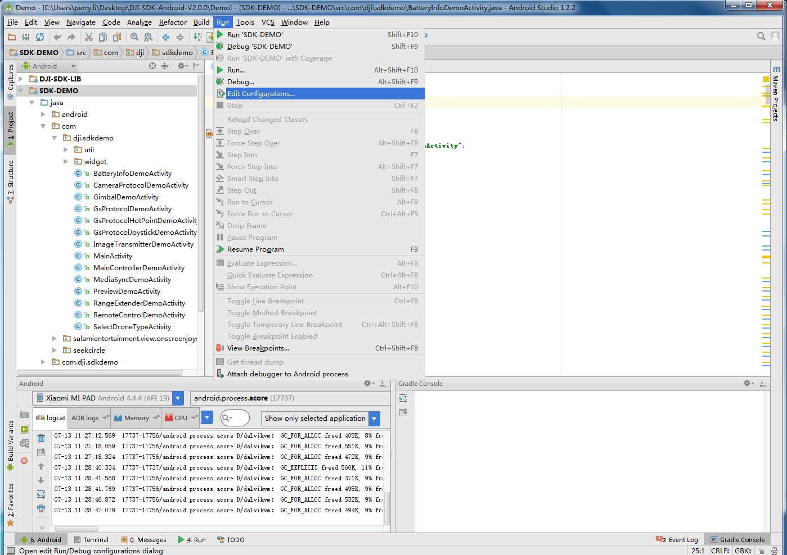

## Android Studio工程导入教程

*如果您在本教程中遇到任何错误或者bug，请使用Github issue，在DJI论坛发帖或者在Gitbook中评论告知我们。您可以随时给我们发送Github pull request来帮助我们修复错误。*

---

<!-- toc -->

DJI SDK Demo导入Android Studio的方法有两种：一种是直接把下载的文件夹里的Android Studio目录下的工程导入Android Studio; 第二种是把Eclipse下的工程导入Android Studio。

## 导入Android Studio工程到Android Studio

1.下载完整DJI-SDK-Android包
从<https://developer.dji.com/mobile-sdk/downloads/>下载最新的DJI Android SDK包。解压，其中有一个文件夹为**Android Studio**，这里面是Android Studio版本的工程。

2.打开Android Studio, 选择 **Open an existing Android Studio project**。一个对话框会弹出让你选择Android Studio工程的路径。选择**./V2.1.0/Android Studio/DJI-SDK-Android-V2.1.0**可以导入DJI SDK Demo。

**注意：** 如果有一个弹框说local.properties的sdk路径设置不对，需要使用默认的sdk路径，请选择“OK”，或者可以直接打开local.properties文件设置sdk路径为你电脑中android sdk的路径。

## 导入Eclipse工程到Android Studio

1.下载完整DJI-SDK-Android包
从<https://developer.dji.com/mobile-sdk/downloads/>下载最新的DJI Android SDK包。解压，其中有一个文件夹为**Eclipse**，这里面是Eclipse版本的工程。

2.打开Android Studio，选择**Import project(Eclipse ADT, Gradle,etc.)**

然后一路next，默认选择就可以。在这过程中会提示你是否将DJI-SDK-LIB导入，选择是。

请确认“DJI-SDK-LIB”项目的libs文件夹里有以下的.so libs和jars：

4.如果在windows端的Android Studio出现导入后run图标为黑色的情况，则需更改设置，如下图打开Edit Configure

  

如果没有Android Application，需手动添加这一项

 
 
 配置如下：
 

