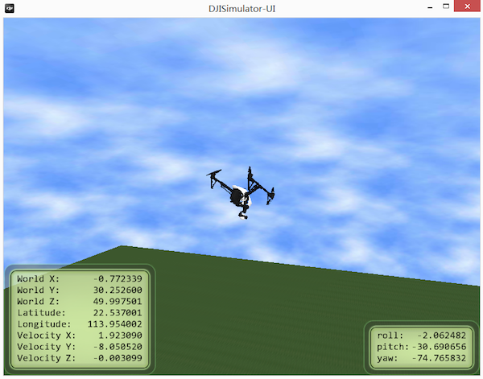
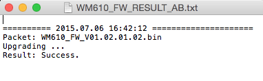
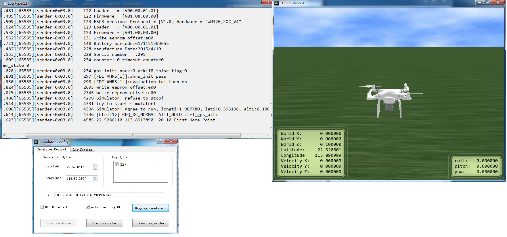
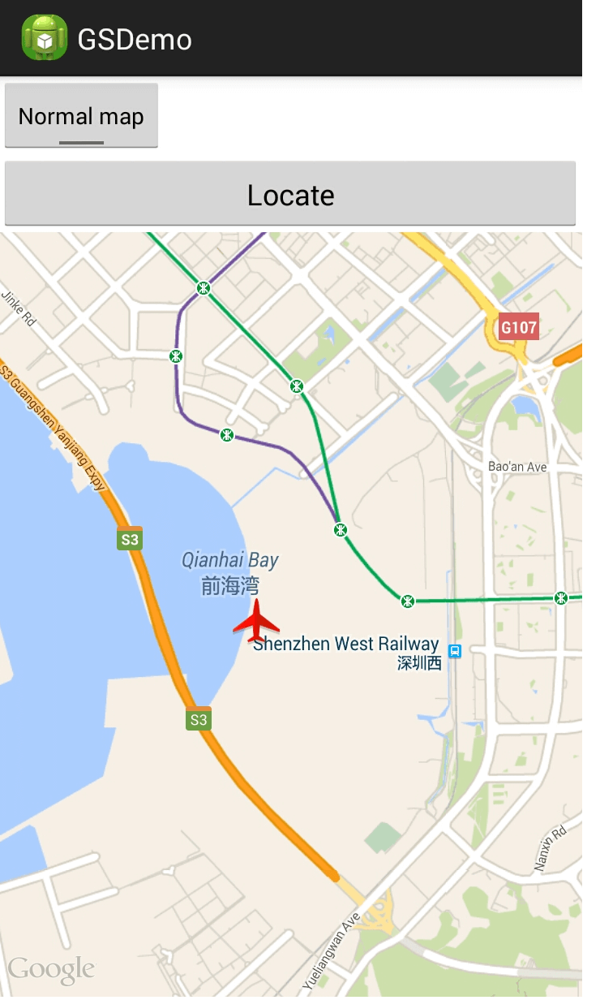
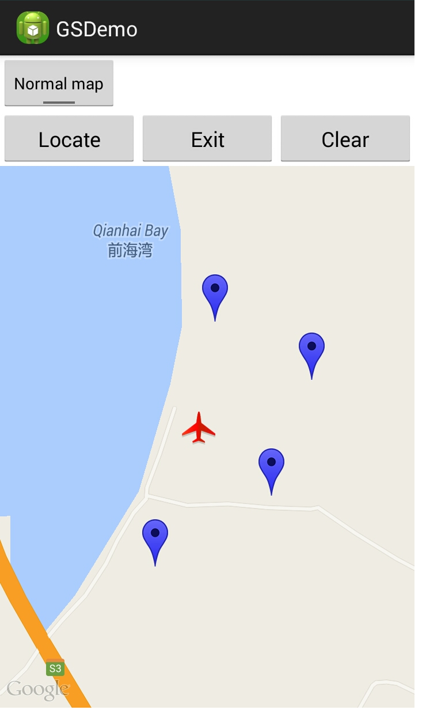
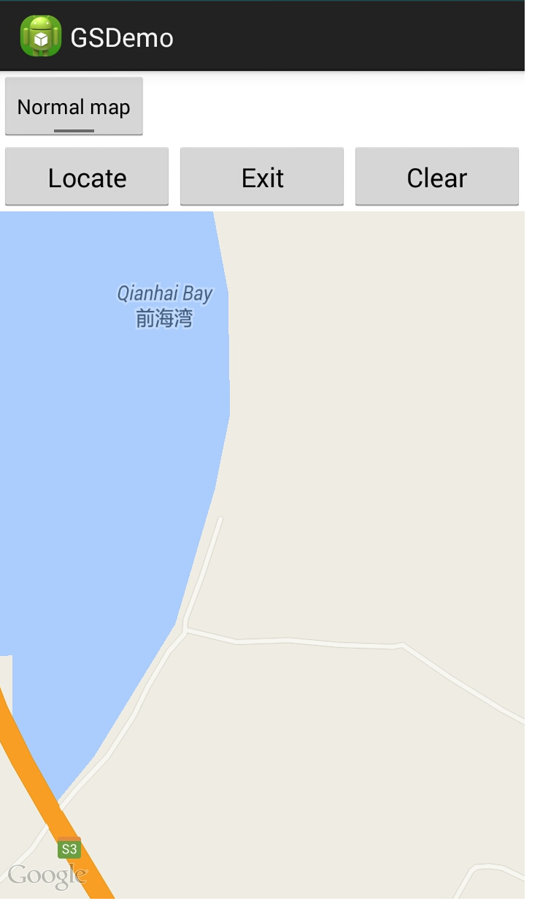
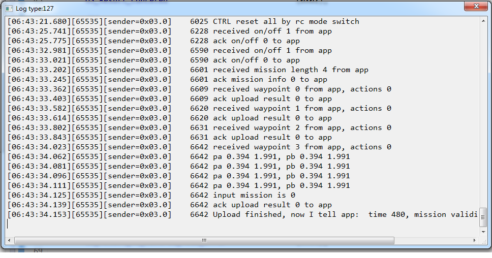
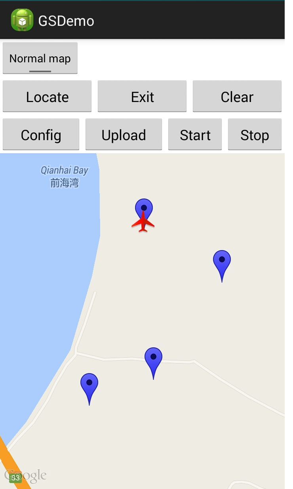

# 创建智能飞行预设航点功能App

在这个教程里，你将学会如何安装和使用DJI PC模拟器（用来模拟DJI飞行器的飞控）；如何升级你的Inspire 1，Phantom 3 Professional和Phantom 3 Advanced的固件到最新的beta版本； 如何使用DJI PC模拟器测试地面站的API。而且，你将学到怎样设置已添加的航点，上传航点，开始地面站任务和停止地面站任务。让我们开始吧！

你可以从这里下载到该教程的示例程序: <https://github.com/DJI-Mobile-SDK/Android-GSDemo-GoogleMap.git>

## 使用DJI PC模拟器

### 1. 使用说明

DJI PC模拟器是一个供DJI SDK开发者使用的飞行模拟器。模拟器包含有一个虚拟的3D环境和对通过UDP协议传输到PC的飞行数据的分析。

**支持的操作系统**：Windows 7, Windows 8 和 Windows 8.1

**支持的DJI平台**：Matrice 100, Inspire 1, Phantom 3 Professional和Phantom 3 Advanced

### 2.安装和使用DJI PC模拟器

首先，请从以下DJI SDK开发者网址<http://dev.dji.com/en/products/sdk/onboard-sdk/downloads>下载DJI PC Simulator安装软件和WIN Driver驱动程序。
- DJI PC Simulator Installer & User Manual V1.0
- WIN Driver Installer

先安装WIN Driver驱动程序，然后再安装DJI PC模拟器。如果你是使用的Mac系统，你需要找一个Windows系统的电脑安装或是安装一个虚拟机（比如使用VMWare或是Parallels Desktop)，因为目前只有在Windows平台的模拟器。双击已下载的DJI_WIN_Driver_Install.exe文件来安装。如果弹出一个弹框“Please power on MC and connect it to PC via USB!”，你暂时可以忽略它，继续点击“YES”和跟着指示来安装驱动。

安装好驱动后，双击DJISimulator-Installer.exe文件，跟着指示来安装DJI PC模拟器。

### 3. 怎样使用DJI PC模拟器

**1**. 每次打开模拟器，模拟器的Config窗口将会出现。你可以设置飞行器所在的纬度(Latitude)和经度(Longitude)。"SN"表示连接的飞机的序列号。

 

---
**注意**:

- 如果飞机的纬度(Latitude)和经度(Longitude)在限飞区域里，飞机将无法起飞。
- 在“Log Settings”标签页下面选择 “Show Log Window”使得log窗口可以在使用模拟器时显示

 

---

**2**. 把飞机用USB线连接到PC，然后打开飞机和遥控器的电源。点击“Display Simulator”。你可以看到如下所示的窗口：

 

---
**注意**: 

- 请不要在DJI PC模拟器运行的时候打开DJI Pilot app。

- 请不要把桨安装到飞机上，这是非常危险的，以免电机转动出现事故。

---

**3**. 点击“Enter simulator”开始模拟。你可以使用遥控器来控制飞机或是使用返回Home点来让飞机返回预设的Home点。World X, Y, Z分别代表北-南方向，东-西方向，和上-下方向（北，东，和上为正方向）。

**4**. 用鼠标左击DJISimulator-UI界面，按住拖动鼠标可以改变模拟器视图的角度。滚动鼠标可以放大缩小视图。

 
 
 
 
**5**. 点击“Stop simulator”来停止模拟。在使用后关闭模拟器，关闭飞机和遥控器电源

**重要**: 如果你想要中途停止地面站航点功能，需要先点击“Stop simulator”来停止。否则，模拟器会继续执行之前中途停止时未执行完的的航点任务。

想要了解DJI PC Simulator的更多信息，请查看与模拟器安装文件一起下载的**DJI PC Simulator user manual.pdf**文件

## 升级固件

在开始这个教程的DJI SDK开发之前，需要确认飞机的固件支持DJI Mobile SDK的开发。请从以下网址<http://dev.dji.com/en/products/sdk/onboard-sdk/downloads>下载适合你的飞机类型的beta版本固件

把下载的**bin**文件放到SD卡上，插入飞机上相机使用的SD卡槽，重启飞机进行升级。大概需要10到30分钟完成升级。如果需要遥控器支持USB附件模式连接，则需要升级遥控器，把下载的**bin**文件放到USB移动盘，然后插入遥控器的USB接口，当遥控器的指示灯为蓝色时，则遥控器正在升级，当升级成功，遥控器指示灯会变为绿色，当升级失败，遥控器指示灯会变为红色。

你可以通过辨别飞机的声音来检测固件升级状态：

- 升级当中：B B B ...
- 升级成功：B BB ...
- 升级失败：B...
- 严重错误：D D D...

你也可以通过检查升级过程中产生的**txt**文件来判断固件升级状态。对于Phantom 3 Professional，txt文件的名字是**"P3X_FW_RESULT_AB.txt"**，对于Inspire 1，txt文件名字是**"WM610_FW_RESULT_AB.txt"**。以下是其中内容的例子：

  
  
  
  
## 设置地图视图

### 1. 创建地图视图 

为了方便地面站功能，我们需要一个地图来添加航点，显示航点位置，显示在开启地面站任务后飞机的移动。我们在这里使用高德地图作为一个例子。

(1) 获取Map API Key

为了在应用程序中调用第三方Map服务，必须先获取第三方Map服务的API Key。获取步骤如下。
a. 首先找到该App的数字证书的keystore的认证指纹。分两种情况：(1)如果是作为实际产品发布的签名App,该App的数字证书的keystore将保存在用户自己定义的路径中；(2)如果是作为调试阶段的App,该App的数字证书的keystore通常保存在ANDROID_SDK_HOME环境变量对应的路径的.android/目录下，在该目录下可以找到一个debug.keystore文件，该文件就是调试App的数字证书的keystore的存储路径。用户可以在命令行窗口通过以下命令获取认证指纹：

	keytool -list -v -keystore <Android keystore的存储位置>
	
或者通过选择**Window > Preferences > Android> Build**菜单，获取**SHA1 fingerprint**,如下图所示：

b. 登录<http://lbs.amap.com>，系统显示登录高德地图的页面。已注册过的用户可以直接登录，未注册的注册过后可以登录。用户登录后选择"Android地图SDK",然后点击右上角的账号，下拉菜单中会有“我的KEY”,点击进入，可以输入SHA1和工程的包名，获取API Key。

(2) 高德地图的创建

一旦为指定应用申请了API Key，接下来即可使用高德地图了。高德地图提供了一个MapView组件，这个MapView继承了FrameLayout, 因此它的本质就是一个普通的容器控件，所以开发者可以直接将该MapView添加到应用界面上。MapView只是一个容器，真正为MapView提供地图支持的是AMap类，MapView可通过getMap()方法来获取它所封装的AMap对象，AMap对象则提供了大量的方法来控制地图。

通过以下步骤给Android应用添加高德地图支持：

1. 登录 <http://lbs.amap.com/api/android-sdk/down>，下载xxx.zip和xxx.zip两个压缩包
2. 将上面两个压缩包解压，解压之后得到两个jar包。
3. 将第三步解压得到的两个jar包复制到Android应用的libs/目录下，
4. 打开Android应用的**AndroidManifest.xml**文件，在该文件的<application.../>元素内添加如下<meta-data.../>子元素：

~~~
	<!-- 启用高德地图服务 -->
	<meta-data
		android:name="com.amap.api.v2.apikey"
		android:value="xxx"
~~~

其中的android:value属性值应该填写前面申请得到的API Key。

5. 在Android应用的**AndroidManifest.xml**文件中添加如下权限：

~~~
    <uses-permission android:name="android.permission.INTERNET" />
    <uses-permission android:name="android.permission.WRITE_EXTERNAL_STORAGE" />
    <uses-permission android:name="android.permission.READ_PHONE_STATE" />
   
    <uses-permission android:name="android.permission.ACCESS_COARSE_LOCATION" />
    <uses-permission android:name="android.permission.ACCESS_NETWORK_STATE"/>
    <uses-permission android:name="android.permission.ACCESS_FINE_LOCATION" />
    <uses-permission android:name="android.permission.CHANGE_WIFI_STATE" />
    <uses-permission android:name="android.permission.ACCESS_WIFI_STATE" />
    <uses-permission android:name="android.permission.CHANGE_CONFIGURATION" />
    <uses-permission android:name="android.permission.WRITE_SETTINGS" />
~~~

经过上面步骤，高德地图SDK添加完成，剩下的事情就是使用MapView组件了，MapView组件与普通Android组件的区别并不大。

在界面布局文件中添加MapView组件，我们同时添加一个ToggleButton用来切换地图的卫星视图和正常视图，

~~~   
	<com.amap.api.maps2d.MapView
		android:id="@+id/map"
		android:layout_width="match_parent"
		android:layout_height="match_parent"/>
	<ToggleButton 
	   android:id="@+id/tb"
	   android:layout_width="wrap_content"
	   android:layout_height="wrap_content"
	   android:layout_gravity="top|right"
	   android:textOff="Normal map"
	   android:textOn="Satellite map"
	   android:checked="false"/>
~~~

在我们的例子中加载地图的Activity如下，

~~~

import com.amap.api.maps2d.AMap;
import com.amap.api.maps2d.AMap.OnMapClickListener;
import com.amap.api.maps2d.CameraUpdate;
import com.amap.api.maps2d.CameraUpdateFactory;
import com.amap.api.maps2d.MapView;
import com.amap.api.maps2d.model.BitmapDescriptorFactory;
import com.amap.api.maps2d.model.LatLng;
import com.amap.api.maps2d.model.Marker;
import com.amap.api.maps2d.model.MarkerOptions;

public class GSDemoActivity extends DemoBaseActivity implements OnClickListener, OnMapClickListener{
	protected static final String TAG = "GSDemoActivity";
    private MapView mapView;
	private AMap aMap;
	
	private ToggleButton tb;
	
	
	@Override
    protected void onCreate(Bundle savedInstanceState) {
        super.onCreate(savedInstanceState);
        setContentView(R.layout.activity_gsdemo);
        mapView = (MapView) findViewById(R.id.map);
        mapView.onCreate(savedInstanceState);
        init();
        
        tb = (ToggleButton) findViewById(R.id.tb);
        
        tb.setOnCheckedChangeListener(new CompoundButton.OnCheckedChangeListener() {
		 @Override
		 public void onCheckedChanged(CompoundButton buttonView, boolean isChecked) {
		 if (isChecked) {
		 	// Use the satellite map
		 	aMap.setMapType(AMap.MAP_TYPE_SATELLITE);
		 }else{
			//Use the normal map
			aMap.setMapType(AMap.MAP_TYPE_NORMAL);
		 }
				
		}
		});
		
	 // Initializing Amap object
    private void init(){
        if (aMap == null) {
            aMap = mapView.getMap();
            setUpMap();
        }
    }
    
    ...
    
        @Override
    protected void onResume(){
        super.onResume();
        mapView.onResume();
        
        DJIDrone.getDjiMC().startUpdateTimer(1000); // Start the update timer for MC to update info
    }
    
    @Override
    protected void onPause(){
        super.onPause();
        mapView.onPause();
        DJIDrone.getDjiMC().stopUpdateTimer(); // Stop the update timer for MC to update info
    }
    
    @Override
    protected void onSaveInstanceState (Bundle outState) {
        super.onSaveInstanceState(outState);
        mapView.onSaveInstanceState(outState);
    }
    
    @Override
    protected void onDestroy(){
        super.onDestroy();
        mapView.onDestroy();
    }
~~~

MapView要求在其所在的Activity的生命周期方法中回调该MapView的生命周期方法。以上代码的Activity的生命周期方法内回调了MapView的生命周期方法。

现在你可以编译并运行你的app，你将看到高德地图被加载。

 
### 2. 定位飞行器

现在已经加载了高德地图，我们怎样把飞行器定位到地图上呢？我们可以根据**DJIMainControllerSystemState**里的**droneLocationLatitude**, **droneLocationLongitude**放置一个标记点到地图上，实现**private void updateDroneLocation()** 函数用于更新飞行器位置。

在这个函数里，用**public interface DJIMcuUpdateStateCallBack**这个接口获得飞行器的位置信息，设置这个接口到DJI SDK主控回调函数**public void setMcuUpdateStateCallBack(DJIMcuUpdateStateCallBack mCallBack)**。然后更新标记点位置显示到地图上，代码如下：

~~~java
	// Update the drone location based on states from MCU.
    private void updateDroneLocation(){
        // Set the McuUpdateSateCallBack
        mMcuUpdateStateCallBack = new DJIMcuUpdateStateCallBack(){

            @Override
            public void onResult(DJIMainControllerSystemState state) {
                droneLocationLat = state.droneLocationLatitude;
                droneLocationLng = state.droneLocationLongitude;
                Log.e(TAG, "drone lat "+state.droneLocationLatitude);
                Log.e(TAG, "drone lat "+state.homeLocationLatitude);
                Log.e(TAG, "drone lat "+state.droneLocationLongitude);
                Log.e(TAG, "drone lat "+state.homeLocationLongitude);
            }     
        };
        Log.e(TAG,"setMcuUpdateState");
        DJIDrone.getDjiMC().setMcuUpdateStateCallBack(mMcuUpdateStateCallBack);
        
        // The following codes show the aircraft location on the map using a marker
        LatLng pos = new LatLng(droneLocationLat, droneLocationLng);
        //Create MarkerOptions object
        final MarkerOptions markerOptions = new MarkerOptions();
        markerOptions.position(pos);
        markerOptions.icon(BitmapDescriptorFactory.fromResource(R.drawable.aircraft));
        
        runOnUiThread(new Runnable() {
            @Override
            public void run() {
                if (droneMarker != null) {
                    droneMarker.remove();
                }
             
                droneMarker = aMap.addMarker(markerOptions);
            }
          });
    } 
~~~

这个函数会在SDK APIs初始化完成和**DJIDrone.connectToDrone()**调用后被调用。请注意只有在SDK激活成功的情况下才会调用SDK APIs，以上函数在checkPermission返回0的情况下被调用。

~~~java
	new Thread(){
            public void run() {
                try {
                    DJIDrone.checkPermission(getApplicationContext(), new DJIGerneralListener() {
                        
                        @Override
                        public void onGetPermissionResult(int result) {
                            // TODO Auto-generated method stub
                            if (result == 0) {
                                handler.sendMessage(handler.obtainMessage(SHOWDIALOG, DJIError.getCheckPermissionErrorDescription(result)));
                                updateDroneLocation(); // Obtain the drone's lat and lng from MCU.
                            } else {
                                handler.sendMessage(handler.obtainMessage(SHOWDIALOG, getString(R.string.demo_activation_error)+DJIError.getCheckPermissionErrorDescription(result)+"\n"+getString(R.string.demo_activation_error_code)+result));
                        
                            }
                        }
                    });
                } catch (Exception e) {
                    e.printStackTrace();
                }
            }
        }.start();
~~~

为了更新主控信息，我们还需要在**onResume**里调用**public boolean startUpdateTimer(int interval)**，在**onPause**里调用**public boolean stopUpdateTimer()**停止更新。

~~~java
    @Override
    protected void onResume(){
        super.onResume();
        DJIDrone.getDjiMC().startUpdateTimer(1000); // Start the update timer for MC to update info
        ServiceManager.getInstance().pauseService(false);
    }
    
    @Override
    protected void onPause(){
        super.onPause();
        DJIDrone.getDjiMC().stopUpdateTimer(); // Stop the update timer for MC to update info
        ServiceManager.getInstance().pauseService(true);
    }
~~~

编译并运行应用，测试定位函数，用USB连接飞机主控到电脑，打开模拟器，模拟器打开如下：

点击“locate”按钮，我们看到一个标记点表示飞行器显示在地图上。

### 3. 添加和清除航点

一个重要的需求就是直观的添加航点，接下来将教你如何通过点击地图添加航点，我们放置一个按钮“add”。当我们点击“add”按钮时，逻辑变量“isAdd”变为“true”，按钮的文字变成“Exit”，我们进入航点模式：在地图上点击一下设置一个航点。出现一个标记点表示已添加一个航点。当我们点击“Exit”按钮时，我们退出航点模式。地图点击的监听器代码如下：

~~~java
	 @Override
    public void onMapClick(LatLng point) {
    	if (isAdd == true){
    		markWaypoint(point);
    		DJIGroundStationWaypoint mDJIGroundStationWaypoint = new DJIGroundStationWaypoint(point.latitude, point.longitude);
    		mGroundStationTask.addWaypoint(mDJIGroundStationWaypoint);
    		//Add waypoints to Waypoint arraylist;
    	}else{
    		// Do not add waypoint;
    	}
    		
    }
~~~

当我们点击地图时，**public void onMapClick(LatLng point)**这段代码会被执行。DJIGroundStationWaypoint的一个实例会被添加到mGroundStationTask里。

我们添加“clear”按钮清空所有已添加的航点。点击“clear”按钮时，所有地图上的标记点和mGroundStationTask里所有的航点都会被清空。

~~~java
	 @Override
    public void onClick(View v) {
        // TODO Auto-generated method stub
        switch (v.getId()) {
			  
			  ...
            
            case R.id.clear:{
                runOnUiThread(new Runnable(){
                    @Override
                    public void run() {
                        aMap.clear();
                    }
                    
                });            
                mGroundStationTask.RemoveAllWaypoint(); // Remove all the waypoints added to the task
                break;
            }
			  
			  ...
			  
        }
    }

~~~

## 设置已添加的航点和DJIGroundStationTask

在这个教程里，我们对第一部分进一步开发，首先设置已添加的航点

作为一个简单的示例，我们为所有已添加航点设置一样的参数，用户自己编程可以为每个航点设置不同的参数。

首先添加一个“Config”按钮，当用户点击按钮时，弹出一个配置窗口。

我们用一个窗口来加载设置，这些设置包括航点的高度，是否重复任务，执行任务时的水平速度，航点执行后的动作，航点飞行时的飞行器朝向。（高度和速度是**DJIGroundStationWaypoint**下的，这里我们将所有航点的高度和速度设成一样，用户也可以为每个航点设置不同的高度和速度）。这里就不展示这个窗口的代码了，当用户填入数值选择项目后点击“完成”，下面的函数会被调用，用于设置**DJIGroundStationTask**和**DJIGroundStationWaypoint**：

~~~java
	    private void configGroundStationTask(){
        mGroundStationTask.isLoop = repeatGSTask;
        mGroundStationTask.finishAction=actionAfterFinishTask;
        mGroundStationTask.movingMode = heading;
        for (int i=0; i<mGroundStationTask.wayPointCount; i++){
            mGroundStationTask.getWaypointAtIndex(i).speed = speedGSTask;
            mGroundStationTask.getWaypointAtIndex(i).altitude = altitude;
        }
    }
~~~

## 上传航点到飞行器

在第一部分，我们设置好了**DJIGroundStationTask**。然而，这些航点只是存储在移动设备上，在开始任务时我们需要上传航点到飞行器，点击“upload”按钮下面的代码会被调用：

~~~java
	   private void uploadGroundStationTask(){
        DJIDrone.getDjiGroundStation().openGroundStation(new DJIGroundStationExecuteCallBack(){

            @Override
            public void onResult(GroundStationResult result) {
                // TODO Auto-generated method stub
                String ResultsString = "return code =" + result.toString();
                handler.sendMessage(handler.obtainMessage(SHOWTOAST, ResultsString));
                
                if (result == GroundStationResult.GS_Result_Successed) {
                    DJIDrone.getDjiGroundStation().uploadGroundStationTask(mGroundStationTask, new DJIGroundStationExecuteCallBack(){
    
                        @Override
                        public void onResult(GroundStationResult result) {
                            // TODO Auto-generated method stub
                            String ResultsString = "return code =" + result.toString();
                            handler.sendMessage(handler.obtainMessage(SHOWTOAST, ResultsString));
                        }
                        
                    });
                }
            }
            
        });
    }
~~~

正如我们所看到的那样，首先我们要调用**public void openGroundStation(final DJIGroundStationExecuteCallBack mCallBack)**打开地面站，当地面站打开成功（返回**GroundStationResult.GS_Result_Successed**），**public void uploadGroundStationTask(final DJIGroundStationTask task, final DJIGroundStationExecuteCallBack mCallBack)**将会被执行。

**注意:**当遇到**GroundStationResult.GS_Result_Rc_Control_Mode_Error**这个错误时，意思是你的遥控器模式开关没有拨到F挡，在使用地面站，热点环绕，操纵杆时，遥控器模式开关必须拨到F挡。

为了解决这个问题，请将遥控器模式开关拨到F挡（之前版本是A挡）然后尝试重新上传航点，当飞行器上电时模式开关已经置于F挡，则需要来回切换一下才能上传航点。

如果航点上传成功，模拟器日志窗口将会显示"received mission length xx from app"。

## 开始和停止地面站任务

上传航点到飞行器后，我们可以开始地面站任务了，点击“Start”按钮后，下面的代码将会执行，调用**public void startGroundStationTask(final DJIGroundStationExecuteCallBack mCallBack)**

~~~java
	    private void startGroundStationTask(){
        DJIDrone.getDjiGroundStation().startGroundStationTask(new DJIGroundStationExecuteCallBack(){

            @Override
            public void onResult(GroundStationResult result) {
                // TODO Auto-generated method stub
                String ResultsString = "return code =" + result.toString();
                handler.sendMessage(handler.obtainMessage(SHOWTOAST, ResultsString));
            }
        });
    }
~~~

在地面站任务进行中，通过调用**public void pauseGroundStationTask(final DJIGroundStationExecuteCallBack mCallBack)**可以暂停任务，调用**public void closeGroundStation(final DJIGroundStationExecuteCallBack mCallBack)**可以关闭地面站

~~~java
	    private void stopGroundStationTask(){
        DJIDrone.getDjiGroundStation().pauseGroundStationTask(new DJIGroundStationExecuteCallBack(){

            @Override
            public void onResult(GroundStationResult result) {
                // TODO Auto-generated method stub
                String ResultsString = "return code =" + result.toString();
                handler.sendMessage(handler.obtainMessage(SHOWTOAST, ResultsString));
                
                DJIDrone.getDjiGroundStation().closeGroundStation(new DJIGroundStationExecuteCallBack(){

                    @Override
                    public void onResult(GroundStationResult result) {
                        // TODO Auto-generated method stub
                        String ResultsString = "return code =" + result.toString();
                        handler.sendMessage(handler.obtainMessage(SHOWTOAST, ResultsString));
                    }

                });
            }
        });
        mGroundStationTask.RemoveAllWaypoint();
    }
~~~ 

## 总结

在这个教程里，你已经学习了怎样设置DJI PC模拟器用于测试地面站应用，怎样升级飞行器固件到开发者版本，怎样使用DJI Mobile SDK创建简单的地图显示，修改地图的标注，增员通过DJI PC模拟器的GPS数据显示飞行器到地图上。你还学习了怎样设置**DJIGroundStationWaypoint**和**DJIGroundStationTask**。而且学习了怎样使用**DJIGroundStationTask**添加航点，上传，开始和停止。

恭喜！现在你已经完成了这个示例程序，你可以学着自己做一个自己的地面站应用，你可以改进航点的添加方式（比如在地图上画线自动生成航点），掌握航点的属性（例如朝向，水平飞行速度等等），或者其他更多功能，做好一个好的地面站程序，你仍然有需要学习很多，希望你喜欢这个教程。