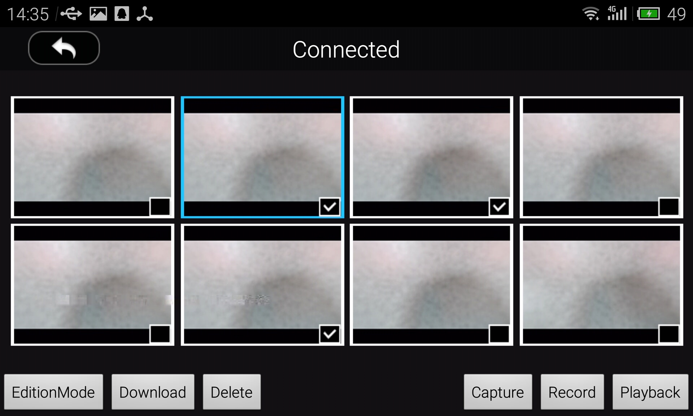

# 创建照片和视频回放应用

<!-- toc -->

*如果您在本教程中遇到任何错误或者bug，请使用Github issue，在DJI论坛发帖或者在Gitbook中评论告知我们。您可以随时给我们发送Github pull request来帮助我们修复错误。关于文档的修改需要符合[格式标准](https://github.com/dji-sdk/Mobile-SDK-Tutorial/issues/19)*

*提醒: 本教程目前只支持Phantom 3 Professional 和 Inspire 1 机型*

---

## 注意请知悉
回放模式在设计初期，为了支持直播的需求（即做到遥控器连接电视，直接通过遥控器操作回放界面，不需要连接手机），所以将回放的显示界面实现直接做在相机中，由相机直接将回放选择界面通过hdmi推过来，app这边只是做界面的显示，并不是拉取数据操作UI做显示。

## 概览
在此教程中，你将会知晓Inspire 1, Phantom 3 Professional所特有的多种相机模式，以及如何切换和获取不同的相机模式和如何为回放相册app创造一个交互良好的UI界面。最重要的，当然还有如何选择和下载媒体文件。让我们开始吧!

你可以在此下载此教程的demo工程: <https://github.com/DJI-Mobile-SDK/Android-PlaybackDemo>

当你学习此教程时，这份教程demo将会提供很多有价值的代码参考。

## 相机模式

在开发回放相册app之前，我们将简单地解释SDK中每个相机模式的特性。 Inspire 1和 Phantom 3 Professional有四个相机模式, **Capture 模式, Record 模式, Playback 模式** 和 **Download 模式**。在 **Capture 模式**中, 用户能够使用拍照功能，比如拍摄照片和设置相机参数，其他动作例如录像回放等将不被直接响应。在**Record 模式**中，上述的拍照功能将被禁用，而且用户此时只能使用开始或者停止录像等摄像相关方法。**Playback 模式**可以让用户预览飞行器上SD卡里的媒体文件。**Download 模式**允许用户下载媒体文件，但是前提是所有想要下载的文件必须正确选择以及设置。

**但是，特别地，Phantom 3 Advanced只有3种相机模式: Capture模式，Record模式以及Download模式。下一个教程将会解释这些不一样的内容。**

在Mobile Android SDK中，开发者可以运行`setCameraMode`的方法以切换相机模式和`getCameraMode`方法来获取相机模式。请注意Phantom 2飞行器比较特殊因为他们只有两种模式: `CameraMode.Camera_Camera_Mode` and `Camera.Camera_USB_Mode`,这些模式已经不被新一代飞行器支持。)

~~~java
	//Set up the Camera Mode. 
    DJIDrone.getDjiCamera().setCameraMode(CameraMode, DJIExecuteResultCallback)
	
	//Get the Camera Mode
	DJIDrone.getDjiCamera().getCameraMode(DJICameraModeCallBack)
~~~

## 辨别相机的模式状态

我们在上面已经介绍了有四或者三种相机模式(取决于你的飞行器）。如何正确辨别你所在的模式是开发一个好的回放相册app的关键。 在mobile android SDK中，有一个返回当前相机的回放状态的callback设置。当状态被改变时，开发者可以设置一个callback功能来运行其对应的应对措施。此callback可以每秒钟可执行10次。

~~~java

	DJIDrone.getDjiCamera().setDJICameraPlayBackStateCallBack(new DJICameraPlayBackStateCallBack() {
		@Override
		public void onResult(DJICameraPlaybackState state) {
			....
			
			Some statements..

			....
		}
	});

~~~

每当 SDK 获取回放状态模式信息时, SDK将所获取的信息打包并且创造一个`DJICameraPlaybackState`的实例来从SDK转移信息到app。 为了更深的了解状态提醒, 我们简单的介绍 `DJICameraPlaybackState`的属性。这些属性将会在下面的表格中详细说明。

<table>
<tbody>
<tr>
<td><b>Attribute</b></td>
<td><b>Description</b></td>
</tr>
<tr>
<td>currentSelectedFileIndex</td>
<td>返回当前预览的文件ID,可用户显示用户当前浏览哪张图片。</td>
</tr>
<tr>
<td>fileDeleteStatus</td>
<td>反映文件删除的三种状态，他们分别是(<b>Media_File_Delete_Failed</b>, <b>Media_File_Delete_Successed</b> and <b>Media_File_Deleting</b>). 开发者能够使用这些枚举去分辨相机的删除进度。</td>
</tr>
<tr>
<td>isAllFilesInPageSelected</td>
<td>返回一个布尔型去判断是否所有的文件已经被选择。</td>
</tr>
<tr>
<td>isFileDownloaded</td>
<td>告知用户文件能否已经被下载，当相机模式处于单张回放的模式。防止用户无意地多次下载。</td>
</tr>
<tr>
<td>isSelectedFileValid</td>
<td>4K视频或DNG照片是无法被下载的，这个属性是用户当前选择的图片能否正确被下载。</td>
</tr>
<tr>
<td>mediaFileType</td>
<td>反馈当前选择的图片的文件类型，这些文件类型包括: <b>Media_File_DNG</b>, <b>Media_File_JPEG</b> and <b>Media_File_VIDEO</b>.</td>
</tr>
<tr>
<td>numbersOfMediaFiles</td>
<td>这个属性用于返回多媒体文件的数量，这可以用于显示相簿的基本信息。</td>
</tr>
<tr>
<td>numbersOfPhotos</td>
<td>这个属性用于返回照片的数量，同样这个属性可以用于显示相簿的基本信息。</td>
</tr>
<tr>
<td>numbersOfSelected</td>
<td>这个属性用户返回被选择的文件数量，这个属性可以用于选择模式中对选择文件数的记录。</td>
</tr>
<tr>
<td>numbersOfThumbnail</td>
<td>返回可以被下载的缩略图数量。</td>
</tr>
<tr>
<td>numbersOfVideos</td>
<td>与`theNumberOfPhotos`相类似，返回SD卡中的视频数量</td>
</tr>
<tr>
<td>photoCenterCoordinateX</td>
<td>返回图片的x轴中心坐标。</td>
</tr>
<tr>
<td>photoCenterCoordinateY</td>
<td>返回图片的y轴中心坐标。</td>
</tr>
<tr>
<td>photoHeight</td>
<td>返回照片的高度。</td>
</tr>
<tr>
<td>photoWidth</td>
<td>返回照片的宽度。</td>
</tr>
<tr>
<td>playbackMode</td>
<td>回放模式的推送枚举状态: <b><ul><li>Media_Files_Download</li> <li>Multiple_Media_Files_Delete</li> <li>Multiple_Media_Files_Display</li> <li>Single_Photo_Playback</li> <li>Single_Photo_Zoom</li> <li>Single_Video_Playback_Start</li> <li>Single_Video_Playback_Stop</li></ul></b> 基于这些状态的推送UI内容将会被修改.</td>
</tr>
<tr>
<td>videoDuration</td>
<td>回放视频的总体时长</td>
</tr>
<tr>
<td>videoPlayPosition</td>
<td>回放视频当前的播放时长</td>
</tr>
<tr>
<td>videoPlayProgress</td>
<td>视频播放进度</td>
</tr>
</tbody>
</table>

如你所见，此类中有很多的属性。其中，有一些是关于媒体文件的基本信息，有一些能为开发者提供一些重要信息，比如当前相机模式，方便程序动态的修正其状态。例如，开发者可以用`DJICameraPlaybackState`中的信息来选择UI元素来显示。

现在你已经熟悉了SDK提供的基本回放信息，我们可以开始创建我们的回放相册APP应用了。

## 照片集应用的UI要素

### 3.1 多预览回放模式的GridView

在我们官方app DJI Pilot中，你可以在app画面当查看8个thumbnails(如果你现在还没有安装DJI Pilot到你的安卓设备 [按下此链接来安装](https://play.google.com/store/apps/details?id=dji.pilot&hl=en))。为了更好地用户体验，我们将为开发者提供一个类似的 UI 要素。首先我们将实现的是 Gridview (更多GridView细节在正式的Android教程 [请按这里](http://developer.android.com/reference/android/widget/GridView.html)).

以下是多预览UI的基本样式. 以下八个图片预览每一个都是一个按钮. 我们通过GridView来实现这些按钮. 

在我们开始之前，我们需要注意grid view的两个特点:

- grid view可滑动.
- 用户可以设计每个block里的实例.

 我们可以重写基本的 Gridview 来满足我们的需求 (一个不能滑动的 gridview 和8个透明的按钮).接下来的代码显示我们如何重写GridView。你可以加入更多的功能到你实现的GridView中。

~~~java

	public class PlaybackGridView extends GridView {
		public PlaybackGridView(Context context) {
			super(context);
		}

		public PlaybackGridView(Context context, AttributeSet attrs) {
			supper(context, attrs);
		}

		public PlaybackGridView(Context context, AttributeSet attrs, int defStyle) {
			super(context, attrs, defStyle);
		}

		@Override
		public boolean dispatchTouchEvent(MotionEvent ev) {
			if (ev.getAction() == MotionEvent.ACTION_MOVE) {
				return true;
			}
			return super.dispatchTouchEvent(ev);
		}
	}

~~~

`dispatchTouchEvent(MotionEvent ev)`方法设置gridview的不可滑动属性。为了使用它来复写GridView, 开发者应该使用完整的文件路径作为为item tag。以demo工程中的`activity_playback_protocol.xml`文件 为例:

~~~xml

	<?xml version="1.0" encoding="utf-8"?>
	<RelativeLayout xmlns:android="http://schemas.android.com/apk/res/android"
		android:layout_width="match_parent"
		android:layout_height="match_parent"
		android:orientation="vertical">
			<!-- 自定义的 GirdView -->
			<com.dji.download.demo.PlaybackGridView
				android:id="@+id/GridView"
				android:layout_width="fill_parent"
				android:layout_height="fill_parent"
				android:layout_marginTop="57dp"
				android:layout_marginLeft="6dp"
				android:layout_marginRight="6dp"
				android:marginBottom="57dp"
				android:numberColumns="4"
				android:android:verticalSpacing="8dp"
				android:horizontalSpacing="8dp"
				android:stretchMode="columnWidth"
				android:gravity="center"/>
	</RelativeLayout>

~~~

如此，我们就完成了简单的girdview配置。下一个文件, `button_gridview_item.xml`将定义gridview中每一个元素的样式内容。

~~~xml

	<?xml version="1.0" encoding="utf-8"?>
	<LinearLayout xmlns:android="http://schemas.android.com/apk/res/android"
	    android:layout_width="match_parent"
	    android:layout_height="match_parent"
	    android:orientation="vertical" 
	    >
    
	    <Button 
	        android:id="@+id/TransparencyButton"
	        android:layout_width="fill_parent"
	        android:layout_height="110dp"
	        android:background="@android:color/yellow"
	        android:focusable="false"
	        android:focusableInTouchMode="false"
	        />
	</LinearLayout>

~~~

恭喜! 你现在已经收集了创造一个回放相册APP的所需要的重要UI要素，接下来的代码将帮你将它们组合成一个好看的UI.

~~~java

	public class PlaybackProtocolActivity extends Activity implements OnClickListener {
		private PlaybackGridView mGridView;

		@Override
		protected void onCreate(Bundle savedInstanceState) {
			super.onCreate(savedInstanceState);
			setContentView(R.layout.activity_playback_protocol);

			onInitActivity();
		}

		private void onInitActivity() {
			mGridView = (PlaybackGridView)findViewById(R.id.GridView);

			ButtonAdapter adapter = new ButtonAdapter(this);
			mGridView.setAdapter(adapter);
		}

		@Override
		protected void onPause() {
			//Pause the AOA service
			ServiceManager.getInstance().pauseService(true);
		}

		@Override
		protected void onResume() {
			//Resume the AOA service
			ServiceManager.getInstance().pauseService(false);
		}

		@Override
		public void onClick(View v)	{
			....
		
			Some statements
		
			....
		}

		class ButtonAdapter extends BaseAdapter {
	        private LayoutInflater inflater;
	        
	        public ButtonAdapter (Context mContext) {
	            super();
	            inflater = LayoutInflater.from(mContext);
	        }
	        
	        @Override
	        public int getCount()
	        {
	            return 8;
	        }
	
	        @Override
	        public Object getItem(int position)
	        {
	            return position;
	        }
		
	        @Override
	        public long getItemId(int position)
	        {
	            return position;
	        }
		
	        @Override
	        public View getView(int position, View convertView, ViewGroup parent)
	        {
	            Button mBtn;
	            final int p = position;
	            if (null == convertView) {
	                convertView = inflater.inflate(R.layout.button_gridview_item, null);
	                mBtn = (Button)convertView.findViewById(R.id.TransparencyButton);
	                convertView.setTag(mBtn);
	            } else {
	                mBtn = (Button)convertView.getTag();
	            }
	            return convertView;
	        }
	        
	    }
	}

~~~

我们刚刚完成了我们应用的框架! 现在，在你的`AndroidManifest.xml`文件里设置`PlaybackProtocolActivity`为主activity. 运行你的工程来享受你的成果!

### 3.2 相机模式UI 

在我们开始这部分之前, 我们将会做一些修改:

1. 模仿此 [创建航拍相机App](../../../Android/FPVDemo/FPVDemo_ch.md) 来设置Android Open Accessory (AOA)。
2. 将你的 main activity 从 `PlaybackProtocolActivity` 改成 `DJIAoaActivity`。
3. 加入一个DjiGLSurfaceView元素来显示第一人视角(第二和三步也在 "创建航拍相机App" 教程中可以找到)。
4. 在按钮加入item `android:visibility="Gone"` 到我们`activity_playback_protocol.xml`里的gridview。
5. 在`button_gridview_item.xml`里将 `android:background="@android:color/yellow"` 替换成 `android:background="@android:color/transparent"` 以改变按钮颜色。

现在我们可以继续我们的教程。请回想起我们在第一部分中所学到的内容, 我们有四个照片模式并且每一个功能都互为相斥，内容并不能同时使用。为了使用户对它更清晰, 开发者应该根据当前相机的状态，调整UI元素。让我们在`activity_playback_protocol.xml`里加入一些按钮。

~~~xml

	<RelativeLayout xmlns:android="http://schemas.android.com/apk/res/android"
		android:layout_width="match_parent"
		android:layout_height="martch_parent"
		android:orientation="vertical">
			<com.dji.download.demo.PlaybackGridView
				android:id="@+id/GridView"
				.../>
			
			<RelativeLayout 
		        android:layout_width="fill_parent"
		        android:layout_height="40dp"
		        android:layout_alignParentBottom="true">
		        
		        <Button 
		            android:id="@+id/CaptureBtnPlayback"
		            android:layout_width="wrap_content"
		            android:layout_height="wrap_content"
		            android:layout_alignParentLeft="true"
		            android:text="@string/playback_protocol_capture_button_string"
		            android:textSize="14sp"
		            android:visibility="gone"
		            />
		        
		        <Button 
		            android:id="@+id/StartRecordBtnPlayback"
		            android:layout_width="wrap_content"
		            android:layout_height="wrap_content"
		            android:layout_toRightOf="@id/CaptureBtnPlayback"
		            android:text="@string/playback_protocol_strat_record_button_string"
		            android:textSize="14sp"
		            android:visibility="gone"
		            />
		        
		        <Button 
		            android:id="@+id/StopRecordBtnPlayback"
		            android:layout_width="wrap_content"
		            android:layout_height="wrap_content"
		            android:layout_toRightOf="@id/StartRecordBtnPlayback"
		            android:text="@string/playback_protocol_strat_record_button_string"
		            android:textSize="14sp"
		            android:visibility="gone"
		            />
		        
		        <Button
		            android:id="@+id/MultiplePreviewBtnPlayback"
		            android:layout_width="wrap_content"
		            android:layout_height="wrap_content"
		            android:layout_toRightOf="@id/StopRecordBtnPlayback"
		            android:text="@string/playback_protocol_multiple_preview_mode_button_string"
		            android:textSize="14sp"
		            android:visibility="gone"
		            />
		        
		        <Button
		            android:id="@+id/MultiSelectPreviewBtnPlayback"
		            android:layout_width="wrap_content"
		            android:layout_height="wrap_content"
		            android:layout_toRightOf="@id/MultiplePreviewBtnPlayback"
		            android:text="@string/playback_protocol_edition_mode_button_string"
		            android:visibility="gone"
		            android:textSize="14sp" 
		            />
		        
		        <Button
		            android:id="@+id/DownloadBtnPlayback"
		            android:layout_width="wrap_content"
		            android:layout_height="wrap_content"
		            android:layout_toRightOf="@id/MultiSelectPreviewBtnPlayback"
		            android:visibility="gone"
		            android:text="@string/playback_protocol_download_button_string"
		            android:textSize="14sp"
		            />
		        
		        <Button
		            android:id="@+id/DeleteBtnPlayback"
		            android:layout_width="wrap_content"
		            android:layout_height="wrap_content"
		            android:layout_toRightOf="@id/DownloadBtnPlayback"
		            android:visibility="gone"
		            android:text="@string/playback_protocol_delete_button_string"
		            android:textSize="14sp"
		            />
		        
		        <Button 
		            android:id="@+id/PlaybackModeBtnPlayback"
		            android:layout_width="wrap_content"
		            android:layout_height="wrap_content"
		            android:layout_alignParentRight="true"
		            android:text="@string/playback_protocol_playback_mode_button_string"
		            android:textSize="14sp"
		            />
		        
		        <Button 
		            android:id="@+id/RecordModeBtnPlayback"
		            android:layout_width="wrap_content"
		            android:layout_height="wrap_content"
		            android:layout_toLeftOf="@id/PlaybackModeBtnPlayback"
		            android:text="@string/playback_protocol_record_mode_button_string"
		            android:textSize="14sp"
		            />
		        
		        <Button 
		            android:id="@+id/CaptureModeBtnPlayback"
		            android:layout_width="wrap_content"
		            android:layout_height="wrap_content"
		            android:layout_toLeftOf="@id/RecordModeBtnPlayback"
		            android:text="@string/playback_protocol_capture_mode_button_string"
		            android:textSize="14sp"
		            />
		    </RelativeLayout>
	</RelativeLayout>

~~~

**Capture**, **Record** 和 **Playback** 按钮, 它们由于能够来回切换所以在所有的状态中他们都会显示出来，然而其他的内容并不是一定出现，所以他们的可见性`visibility`已经被设置为Gone了。在 **Playback** ，模式中我们有三个子模式 **Single Preview**, **Multiple Preview** 和 **Multiple Edition**. 进入 **Playback** 模式将使用户进入 **Single Preview** 模式。在 **Multiple Preview** 模式中，用户可以按下任何图片来进入该照片的 **Single Preview** 模式。**Multiple Edition** 回放模式不同于 **Multiple Preview** 因为它使用户能够选择他们感兴趣的文件，下载和删除它们. 下面的截图将会概述那些按钮和功能属于哪一个模式。

现在Activity增加以下的代码，用于状态的模式切换:

~~~java

	private void onStatusChange(final int status) {
        PlaybackProtocolActivity.this.runOnUiThread(new Runnable() {
            public void run() {
                switch (status) {
                    case CAPTURE : {
                        mStartTakePhotoBtn.setVisibility(VISIBLE);
                        mStartRecordBtn.setVisibility(GONE);
                        mStopRecordBtn.setVisibility(GONE);
                        mMultiplePreviewModeBtn.setVisibility(GONE);
                        mMultiSelectPreviewModeBtn.setVisibility(GONE);
                        mDownloadBtn.setVisibility(GONE);
                        mDeleteBtn.setVisibility(GONE);
                        mGridView.setVisibility(GONE);
                        mPlayVideoBtn.setVisibility(GONE);
                        mPauseVideoBtn.setVisibility(GONE);
                        break;
                    }
                    
                    case RECORD : {
                        mStartTakePhotoBtn.setVisibility(GONE);
                        mStartRecordBtn.setVisibility(VISIBLE);
                        mStopRecordBtn.setVisibility(VISIBLE);
                        mMultiplePreviewModeBtn.setVisibility(GONE);
                        mMultiSelectPreviewModeBtn.setVisibility(GONE);
                        mDownloadBtn.setVisibility(GONE);
                        mDeleteBtn.setVisibility(GONE);
                        mGridView.setVisibility(GONE);
                        mPlayVideoBtn.setVisibility(GONE);
                        mPauseVideoBtn.setVisibility(GONE);
                        break;
                    }
                    
                    case PLAYBACK : {
                        mStartTakePhotoBtn.setVisibility(GONE);
                        mStartRecordBtn.setVisibility(GONE);
                        mStopRecordBtn.setVisibility(GONE);
                        mMultiplePreviewModeBtn.setVisibility(VISIBLE);
                        mMultiSelectPreviewModeBtn.setVisibility(GONE);
                        mDownloadBtn.setVisibility(VISIBLE);
                        mDeleteBtn.setVisibility(VISIBLE);
                        mGridView.setVisibility(GONE);
                        break;
                    }
                    
                    case MULTIPLEPLAYBACK : {
                        mStartTakePhotoBtn.setVisibility(GONE);
                        mStartRecordBtn.setVisibility(GONE);
                        mStopRecordBtn.setVisibility(GONE);
                        mMultiplePreviewModeBtn.setVisibility(GONE);
                        mMultiSelectPreviewModeBtn.setVisibility(VISIBLE);
                        mDownloadBtn.setVisibility(VISIBLE);
                        mDeleteBtn.setVisibility(VISIBLE);
                        mGridView.setVisibility(VISIBLE);
						break;
                    }
                }
            }
        });
    }

~~~

此方法将UI状态分成4个部分(拍照，录像，回放，多回放)。当相机模式改变时，此方法将能够调整UI元素的。

除了调整UI，我们也应该从我们的app发送一个请求到我们的飞行器中用于改变相机模式. 记得第一部分中的 `setCameraMode(CameraMode mode)` 方法吗? 现在我们将把他用上:

~~~java

	private void onPressStatusBtn(final int status) {
        DJIDrone.getDjiCamera().setCameraMode(CameraMode.find(status), new DJIExecuteResultCallback() {
            @Override
            public void onResult(DJIError mErr) {
                if (DJIError.RESULT_OK == mErr.errorCode) {
                    onStatusChange(status);
                }
            }
        });
    }

~~~

`status` 参数告诉此方法应该将相机切换到哪一个模式. 我们使用以下 constants 为参数.

~~~java

	private final static int CAPTURE = 2;
    private final static int RECORD = 3;
    private final static int PLAYBACK = 4;
    private final static int MULTIPLEPLAYBACK = 5;

~~~

常数量值从2开始是因为`CameraMode`enum中的`Camera_Capture_Mode` 的值为2。 我们修改我们的 `onClick()` 方法使 `onPressStatusBtn(final int status)`相应的代码如下可见：

~~~java

	public void onClick(View v) {
		switch(v.getId()) {
			....
			
			case R.id.CaptureModeBtnPlayback : {
                onPressStatusBtn(CAPTURE);
                break;
            }
			
			case R.id.RecordModeBtnPlayback : {
                onPressStatusBtn(RECORD);
                break;
            }
            
            case R.id.PlaybackModeBtnPlayback : {
                onPressStatusBtn(PLAYBACK);
                break;
            }
            
            case R.id.MultiplePreviewBtnPlayback : {
                DJIDrone.getDjiCamera().enterMultiplePreviewMode(mExecuteCallback);
                onStatusChange(MULTIPLEPLAYBACK);
                break;
            }

			....
		}
	}
~~~

为了保持UI逻辑的一致, 我们同时在`onCreate()`方法中检测当前相机的状态。在我们的demo中, 我们将在 `checkPermission(Context, DJIGeneralListener)` 获取SDK等级后执行相机状态检测的操作。

~~~java

	 new Thread(){
            public void run() {
                try {
                    DJIDrone.checkPermission(getApplicationContext(), new DJIGerneralListener() {
                        
                        @Override
                        public void onGetPermissionResult(int result) {
                            // TODO Auto-generated method stub
                            Log.e(TAG, "onGetPermissionResult = "+result);
                            Log.e(TAG, "onGetPermissionResultDescription = "+DJIError.getCheckPermissionErrorDescription(result));
                            if (result == 0) {
                                //This method require sdk level higher than level-1. Also permission should be got befor invoking this method.
                                DJIDrone.getDjiCamera().getCameraMode(new DJICameraModeCallBack() {
                                    public void onResult(CameraMode mode) {
                                        onStatusChange(mode.value());
                                        if (mode._equals(CameraMode.Camera_PlayBack_Mode.value())) {
                                            DJIDrone.getDjiCamera().setCameraMode(CameraMode.Camera_PlayBack_Mode, mExecuteCallback);
                                        }
                                    }
                                });
                            } else {
                                Log.e(TAG,"Result error.");                     
                            }
                        }
                    });
                } catch (Exception e) {
                    // TODO Auto-generated catch block
                    e.printStackTrace();
                }
            }
        }.start();

~~~

Inspire 1和 Phantom 3 Professional的遥控器有照相，录像，和进入回放模式的按钮。当这些按钮被按下时，相机的状态将会根据按钮而改变。如果我们的应用能根据遥控器上的按钮并自动调整UI,那就更完美了

为了监听遥控器, 我们将使用`DJIRemoteControllerUpdateAttitudeCallBack`。将下面的代码加入到 onCreate() 方法, 当请确保先定义变量 `mRemoteControllerUpdateAttitudeCallBack`。

~~~java

	        mRemoteControllerUpdateAttitudeCallBack = new DJIRemoteControllerUpdateAttitudeCallBack() {

            @Override
            public void onResult(DJIRemoteControllerAttitude attitude)
            {
                if (attitude.playbackStatus || attitude.recordStatus || attitude.shutterStatus) {
                    DJIDrone.getDjiCamera().getCameraMode(new DJICameraModeCallBack() {

                        @Override
                        public void onResult(CameraMode mode)
                        {
                            onStatusChange(mode.value());
                        }
                        
                    });
                }
            }
            
        };
        
        DJIDrone.getDjiRemoteController().setRemoteControllerUpdateAttitudeCallBack(mRemoteControllerUpdateAttitudeCallBack);

~~~

`attitude.playbackStatus`, `attitude.recordStatus` 和 `attitude.shutterStatus` 显示相应的遥控器上的按钮的状态. 当用户在遥控器上按下相应的按钮式, 这些 attributes 将变为`true`.

你的APP已经能够根据相机的模式状态来调整对应的UI逻辑啦，运行你的app，享受你的成果吧!

### 3.3 相册动作控制

为了一个更好的用户体验, 我们将加入一些基本的手势到我们的应用中. 在 **Multiple Preview** 模式, 如果用户向上或下滑动, 画面将显示上一面或下一面照片. 在 **Single Preview** 模式中, 如果用户向左或右滑, 画面将显示上一个活下一个媒体文件. 我们用GestureDetector 来实现此方法。

*更多 GestureDetector 类的信息, 请去此链接: <http://developer.android.com/reference/android/view/GestureDetector.html>*

~~~java

	private GestureDector mGestureDector;

	mGestureDetector = new GestureDetector(this, new GestureDetector.SimpleOnGestureListener(){ 
           @Override
           public boolean onFling(MotionEvent e1, MotionEvent e2, float velocityX, float velocityY) {
               if (e2.getRawX() - e1.getRawX() > GESTURETHRESHOLD) {
                   DJIDrone.getDjiCamera().singlePreviewNextPage(mExecuteCallback);
                   return true;
               }
               
               if (e1.getRawX() - e2.getRawX() > GESTURETHRESHOLD) {
                   DJIDrone.getDjiCamera().singlePreviewPreviousPage(mExecuteCallback);
                   return true;
               }
               
               if (e1.getRawY() - e2.getRawY() > GESTURETHRESHOLD) {
                   DJIDrone.getDjiCamera().multiplePreviewPreviousPage(mExecuteCallback);
                   return true;
               }
               
               if (e2.getRawY() - e1.getRawY() > GESTURETHRESHOLD) {
                   DJIDrone.getDjiCamera().multiplePreviewNextPage(mExecuteCallback);
                   return true;
               }
               return false;
           }
	});

~~~

如果你运行你的应用并且尝试此方法，你可能会发现UI的处理逻辑并没有跟你的预期一致。这是因为gridview 和 gesture detectors 将会尝试获取用户的动作。这两样内容的方法检测的先后顺序导致用户意图获取异常。为了避免此情况，我们需要重写`dispatchTouchEvent`方法

~~~java

	@Override
    public boolean dispatchTouchEvent(MotionEvent event) {
        if (mGestureDetector.onTouchEvent(event))
            return false;
        super.dispatchTouchEvent(event);
        return true;
    }

~~~

好样的! 一些自定义的动作已经加入到了你的app里，使得你的app用户体验更好了。

### 3.4 播放视频

DJI Camera 提供了一个视频预览功能让用户能享受他们拍摄的视频。在我们app当前的状态，用户应该可以进入单预览回放模式并且滑动左或右以浏览他们的视频文件。同时，当他们预览视频文件时，他们希望能够按下一个播放或暂停按钮来控制是视频的回放。要实现这个功能，首先加入两个按钮到你的 `activity.xml` 文件。

~~~xml

	 <RelativeLayout 
        android:layout_width="fill_parent"
        android:layout_height="50dp"
        android:layout_alignParentBottom="true"
        android:layout_marginBottom="40dp"
        >"
        
        <ImageButton
            android:id="@+id/PlayVideoBtnPlayback"
            android:layout_height="wrap_content"
            android:layout_width="wrap_content"
            android:layout_alignParentLeft="true"
            android:layout_marginLeft="40dp"
            android:src="@drawable/play_video"
            android:visibility="gone"
            android:background="@android:color/transparent"
            />
        
        <ImageButton 
            android:id="@+id/PauseVideoBtnPlayback"
            android:layout_height="wrap_content"
            android:layout_width="wrap_content"
            android:layout_alignParentLeft="true"
            android:layout_marginLeft="40dp"
            android:src="@drawable/pause_video"
            android:visibility="gone"
            android:background="@android:color/transparent"
        />
    </RelativeLayout>

~~~

这些按钮的图片源需要被复制到 `drawable-mdpi` 文件夹, 并且两个元素需要加入到.xml 文件 `drawable`.

	<item android:drawable="drawable/play_video" android:state_pressed="false"></item>
	<item android:drawable="drawable/pause_video" adnroid:state_pressed="false"></item>

但是，回放模式中有两种媒体文件提供给用户在单预览回放模式中预览。如果播放按钮或者暂停按钮在用户回看图片时出现，这样的逻辑错误会影响APP的交互体验。为了防止这个问题，我们在`onCreate()`中设置一个listener来检查何种文件用户正在预览。

~~~java

	  mCameraPlaybackStateCallBack = new DJICameraPlayBackStateCallBack(){

            @Override
            public void onResult(DJICameraPlaybackState state)
            {
                mCameraPlaybackState = state;
                    PlaybackProtocolActivity.this.runOnUiThread(new Runnable() {

                        @Override
                        public void run()
                        {
                            // TODO Auto-generated method stub
                            isVideoPreview();
                        }
                        
                    });
            }
            
        };

~~~

`isVideoPreview()` 被用来调整 UI 功能.

~~~java

	private void isVideoPreview() {
        if (mCameraPlaybackState.mediaFileType.value() == CameraMediaFileType.Media_File_VIDEO.value()) {
            if (mCameraPlaybackState.videoPlayProgress == 0) {
                mPlayVideoBtn.setVisibility(VISIBLE);
                mPauseVideoBtn.setVisibility(GONE);
            } else {
                mPlayVideoBtn.setVisibility(GONE);
                mPauseVideoBtn.setVisibility(VISIBLE);
            }
        } else {
            mPlayVideoBtn.setVisibility(GONE);
            mPauseVideoBtn.setVisibility(GONE);
        }
    }

~~~

现在app将自动检测相机是否在视频单预览回放模式，并且如果不是的话屏蔽播放和暂停按钮.

你已经成功的实现了所有的此教程提供的UI功能了! 再来试试你的app吧.

## 下载删除媒体文件

### 4.1 完成下载功能

在前面的部分，我们讨论并且实现了4个相机模式中的3个。在这部分，你将完成最后一个相机模式，**Download Mode**.

请注意 **DNG 图片和4k 视频无法再回放模式中下载**. 还有，以下的两个方法不被Inspire 1和Phantom 3 Professional所支持:

- `fetchMediaData(DJIMedia, DJIExecuteResultCallback)`
- `fetchMediaThumbnail(DJIMedia, DJIExecuteResultCallback)`

我们已经实现了所有需要的UI功能，最后剩下的时往我们已有的按钮中加入一些逻辑. 将以下代码加入进 `onClick(View v)`:

~~~java

	@Override
	public void onClick(View v) {
	....
		
		case R.id.MultiSelectPreviewBtnPlayback : {
	        if (!isEdited) {
	            DJIDrone.getDjiCamera().enterMultipleEditMode(mExecuteCallback);
	            isEdited = true;
	        } else {
	            DJIDrone.getDjiCamera().exitMultipleEditMode(mExecuteCallback);
	            isEdited = false;
	        }
	        break;
	    }
	    
	    case R.id.DeleteBtnPlayback : {
	        if (mCameraPlaybackState.playbackMode._equals(CameraPlaybackMode.Multiple_Media_Files_Display.value())) {
	            DJIDrone.getDjiCamera().deleteAllSelectedFiles(mExecuteCallback);
	            isEdited = false;
	        } else {
	            DJIDrone.getDjiCamera().deleteCurrentPreviewFile(mExecuteCallback);
	        }
	        break;
	    }
	    
	    case R.id.DownloadBtnPlayback : {
	        File destDir = new File(Environment.getExternalStorageDirectory().getPath() + "/Dji_Sdk_Test/");
	        if (!destDir.exists()) {
	            destDir.mkdirs();
	        }
	        if (!mCameraPlaybackState.playbackMode._equals(CameraPlaybackMode.Multiple_Media_Files_Display.value()))
	            DJIDrone.getDjiCamera().downloadCurrentPreviewFile(destDir, mFileDownloadCallBack);
	        else
	            DJIDrone.getDjiCamera().downloadAllSelectedFiles(destDir, mFileDownloadCallBack);
	        break;
	    }
		
	....
	}

~~~

我们创造一个`DJIFileDownloadCallBack`实例加入到 `onCreate()` 方法, 如下所示. `DJIFileDownloadCallBack` 包括一个 handler. 你可以在我们的demo代码里找到handler的声明。 

~~~java

	mFileDownloadCallBack = new DJIFileDownloadCallBack() {
            
            @Override
            public void OnStart()
            {
                handler.sendMessage(handler.obtainMessage(SHOWDOWNLOADDIALOG, null));
                
                if(mProgressDialog != null){
                    mProgressDialog.setProgress(0);
                }
                
                handler.sendMessage(handler.obtainMessage(SHOWTOAST, "download OnStart"));
                DJILogHelper.getInstance().LOGD("", "download OnStart",true,false);
            }

            @Override
            public void OnError(Exception exception)
            {
                // TODO Auto-generated method stub
                handler.sendMessage(handler.obtainMessage(CLOSEDOWNLOADDIALOG, null));
                handler.sendMessage(handler.obtainMessage(SHOWTOAST, "download OnError :"+exception.toString()));
                DJILogHelper.getInstance().LOGD("", "download OnError :"+exception.toString(),true,false);
            }
            
            @Override
            public void OnEnd()
            {
                // TODO Auto-generated method stub
                
                handler.sendMessage(handler.obtainMessage(CLOSEDOWNLOADDIALOG, null));
                handler.sendMessage(handler.obtainMessage(SHOWTOAST, "download OnEnd" + mCameraPlaybackState.numbersOfSelected));
                
                DJILogHelper.getInstance().LOGD("", "download OnEnd",true,false);
                
                DJIDrone.getDjiCamera().finishDownloadAllSelectedFiles(new DJIExecuteResultCallback() {
                    
                    @Override
                    public void onResult(DJIError mErr)
                    {
                        // TODO Auto-generated method stub
                        DJILogHelper.getInstance().LOGD("", "download finishDownloadAllSelectedFiles:"+mErr.errorDescription,true,false);
                    }
                });
                
                isEdited = false;
            }

            @Override
            public void OnProgressUpdate(int progress)
            {
                // TODO Auto-generated method stub
                if(mProgressDialog != null){
                    mProgressDialog.setProgress(progress);
                }
                
                DJILogHelper.getInstance().LOGD("", "download OnProgressUpdate progress="+progress,true,false);
            }

        };

~~~

对于多预览下载, 开发者应该首先运行 `enterMultipleEditMode(DJIExecuteResultCallback)` 来进入多剪辑模式。用户能够选择他们想要删除或者下载的媒体文件，为了支持选择媒体文件和进入单预览回放状态，下述的代码应该加入到`ButtonAdapter`的`getView(int position, View convertView, ViewGroup parent)` 方法中。

	mBtn.setOnClickListener(new OnClickListener() {
	
	    @Override
	    public void onClick(View v)
	    {
	        if (!isEdited) {
	            DJIDrone.getDjiCamera().enterSinglePreviewModeWithIndex(p, new DJIExecuteResultCallback() {
	
	                @Override
	                public void onResult(DJIError mErr)
	                {
	                    // TODO Auto-generated method stub
	                    if (mErr.errorCode == DJIError.RESULT_OK) {
	                        onStatusChange(PLAYBACK);
	                    }
	                }
	            });
	            isMultiple = false;
	            
	        } else {
	            DJIDrone.getDjiCamera().selectFileAtIndex(p, mExecuteCallback);
	        }
	    }
	    
	});

现在尝试选择一些媒体文件并下载它们!

### 4.2 自动下载媒体文件

一些开发者可能想要从他们的飞行器自动下载媒体文件. 此部分将介绍如何做到这点. 首先，开发者应该明白 **所有用以下载的方法都是异步的, 意思是说一些方法应该等待无人机的ack来继续他们的进程**

这里是自动下载的实现代码，开发者能够使用`handler`去发送`ENTERPLAYBACK`的消息去执行以下自动化执行的代码:

~~~java

	private Handler handler = new Handler(new Handler.Callback() {
        
        @Override
        public boolean handleMessage(Message msg)
        {
            switch (msg.what) {
				case STARTAUTODOWNLOAD : {
					DJIDrone.getDjiCamera().setCameraMode(CameraMode.Camera_PlayBack_Mode, new DJIExecuteResultCallback() {
            
			            @Override
			            public void onResult(DJIError mErr)
			            {
			                // TODO Auto-generated method stub
			                if(mErr.errorCode == DJIError.RESULT_OK) {
			                    handler.sendEmptyMessageDelayed(ENTERMULTIPLEPLAYBACK, 2000);
			                }
			            }
			        });
					break;
				}                
                case ENTERMULTIPLEPLAYBACK : {
                    DJIDrone.getDjiCamera().enterMultiplePreviewMode(new DJIExecuteResultCallback() {
                        
                        @Override
                        public void onResult(DJIError mErr)
                        {
                            // TODO Auto-generated method stub
                            if (mErr.errorCode == DJIError.RESULT_OK) {
                                handler.sendEmptyMessageDelayed(ENTERMULTIPLEEDIT, 2000);
                            }
                        }
                    });
                    break;
                }
                
                case ENTERMULTIPLEEDIT : {
                    DJIDrone.getDjiCamera().enterMultipleEditMode(new DJIExecuteResultCallback() {
                        
                        @Override
                        public void onResult(DJIError mErr)
                        {
                            // TODO Auto-generated method stub
                            if (mErr.errorCode == DJIError.RESULT_OK) {
                                handler.sendEmptyMessageDelayed(SELECTFIRSTFILE, 2000);
                            }
                        }
                    });
                    break;
                }
                
                case SELECTFIRSTFILE : {
					/** There are a lot of selection methods in our SDK, developers could use them to handle which one they want to download.
                    DJIDrone.getDjiCamera().selectFileAtIndex(0, new DJIExecuteResultCallback() {
                        
                        @Override
                        public void onResult(DJIError mErr)
                        {
                            // TODO Auto-generated method stub
                            if (mErr.errorCode == DJIError.RESULT_OK) {
                                handler.sendEmptyMessageDelayed(DOWNLOADIT, 2000);
                            }
                        }
                    });
                    break;
                }
                
                case DOWNLOADIT : {
                    File destDir = new File(Environment.getExternalStorageDirectory().getPath() + "/Dji_Sdk_Test/");
                    if (!destDir.exists()) {
                        destDir.mkdirs();
                    }
					/** The implementation of mFileDownloadCallBack could be found in the previous tutorial. **/
                    DJIDrone.getDjiCamera().downloadAllSelectedFiles(destDir, mFileDownloadCallBack);
                    break;
                }
            }
            return false;
        }
    });

~~~

你能够调用`handler.sendEmptyMessage(STARTAUTODOWNLOAD)` 自动化下载多媒体文件. 

概括起来，开发者应该按照以下几点来时用户下载多个文件:

第一步：`setCameraMode`去设置相机模式进入到回放模式。

第二步: `enterMultipleEditMode` 来进入多剪辑回放状态使得用户参以浏览他们想要下载的照片.

第三步: 当 `enterMultipleEditMode`成功并且返回ack时,使用 `selectFileAtIndex`, `selectAllFiles` 和 `selectAllFilesInPage` 方法来根据用户的输入来选取照片.

第四步: 当选择方法成功并且返回ack时, 执行 `downloadAllSelectedFiles`.

第五步: app成功下载文件. `finishDownloadAllSelectedFiles`应该被执行党ack确认相机返回到了回放模式.

## 总结

在此教程中，你学会了如何切换以及获取当前相机的模式, 下载和删除没文件, 实现动作操作, 以及很多创造一个为了Inspire 1 和Phantom 3 Professional相片和视频集的应用.

在下一个教程中。我们将实现Phantom 3 Advanced的相薄. 

