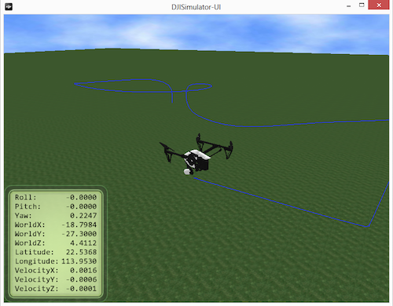
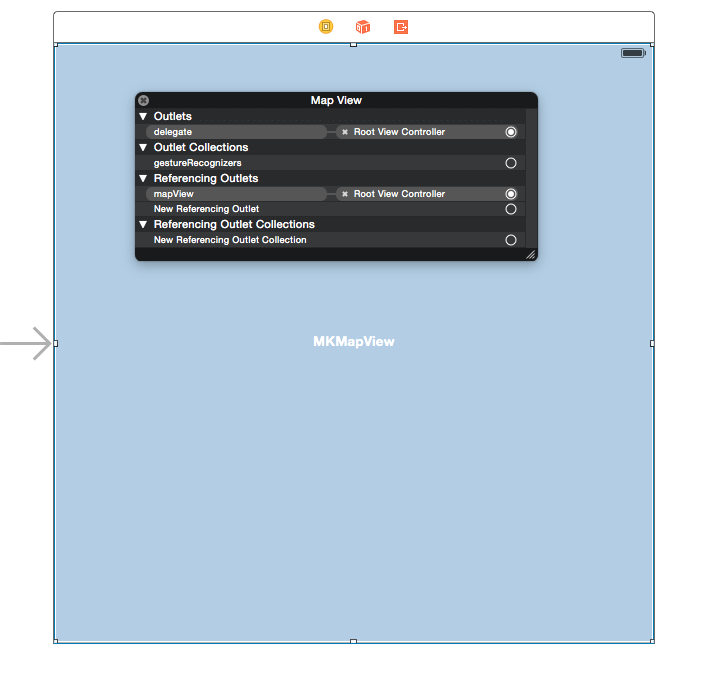
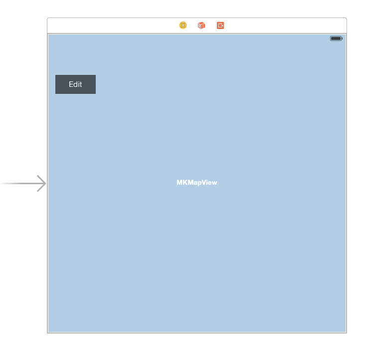
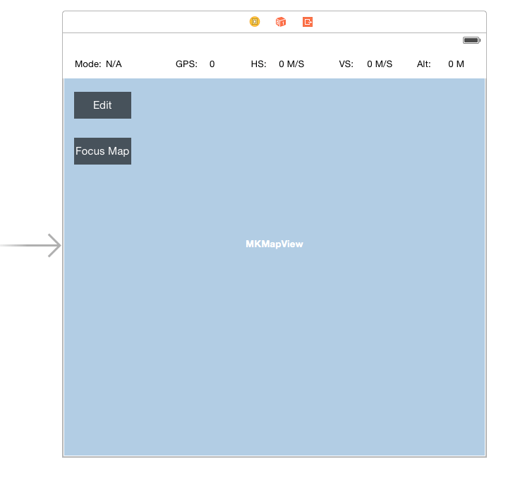
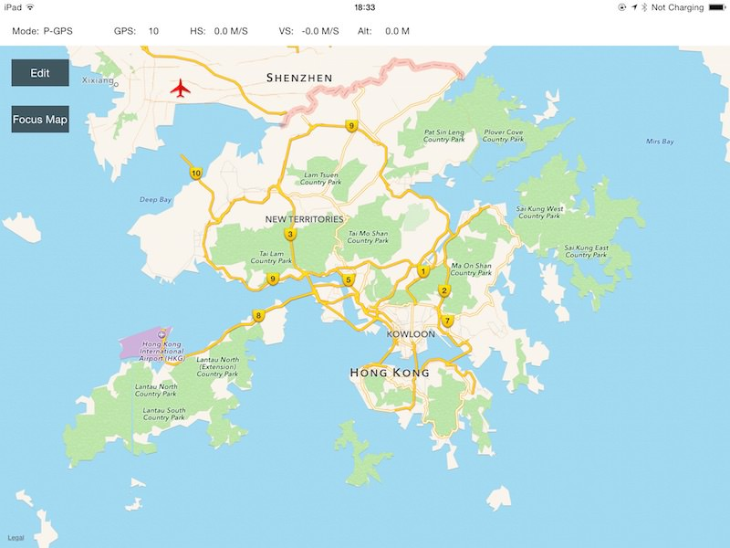
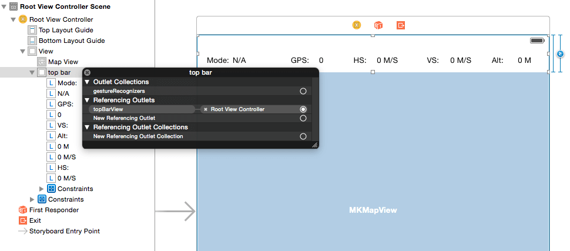
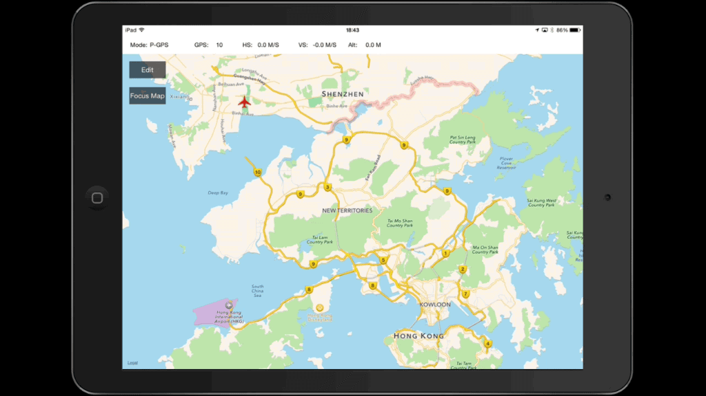
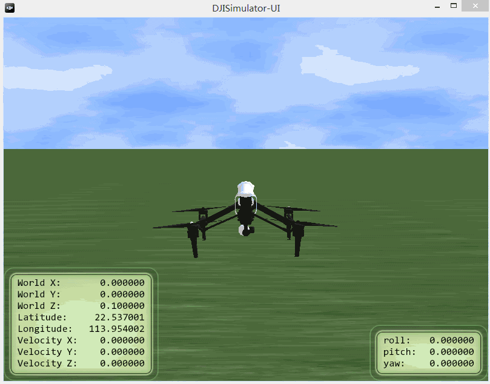

# 创建智能飞行预设航点功能App

<!-- toc -->

*如果您在本教程中遇到任何错误或者bug，请使用Github issue，在DJI论坛发帖或者在Gitbook中评论告知我们。您可以随时给我们发送Github pull request来帮助我们修复错误。关于文档的修改需要符合[格式标准](https://github.com/dji-sdk/Mobile-SDK-Tutorial/issues/19)*

---

在本教程中, 你将学到如何安装使用 DJI PC 模拟器, 如何升级你的 Inspire 1, Phantom 3 Professional 和 Phantom 3 Advanced的固件到Beta版本, 以及如何使用DJI PC 模拟器去测试地面站的API. 同时, 你将学到地面站预设航点功能的基本使用流程. 现在开始学习吧!

   你可以在这里下载到本教程的全部代码: <https://github.com/DJI-Mobile-SDK/iOS-GSDemo.git>

## 使用DJI PC模拟器

### 1. 介绍
DJI PC 模拟器专为 SDK 开发者所设计。模拟器通过 UDP 广播的方式传输飞行器模拟的参数, 在 PC 端实现飞行器的 3D 虚拟显示,并且可以进行数据分析。

**适用操作系统**: Windows 7, Windows 8, 和 Windows 8.1

**适用飞行器型号**: Matrice 100, Inspire 1, Phantom 3 Professional 和 Phantom 3 Advanced

### 2. 安装DJI PC模拟器

首先, 请从这里下载DJI PC模拟器和DJI WIN 驱动程序: <https://developer.dji.com/mobile-sdk/downloads> :

- DJI PC模拟器及用户手册V1.0
- WIN Driver Installer

你必须在使用模拟器前安装好驱动程序. 因为目前模拟器只支持Windows系统, 你必须找到一台 PC 或者有运行着Windows系统虚拟机(像 VMWare 或者 Parallels Desktop)的Mac才能使用模拟器. 现在, 双击 **DJI_WIN_Driver_Installer.exe** 文件进行安装. 如果弹出一个写着“请给主控供电并用USB连接电脑”的对话框, 点击**是**, 然后按照指引安装好即可。

接着, 双击 **DJISimulator-Installer.exe** 文件并按指引安装好模拟器即可。 

### 3. 使用DJI PC模拟器

**1**. 运行DJI PC模拟器时，会首先弹出**Simulator Config**对话框. 设置好 **Latitude（纬度）** 和 **Longitude(经度)** 的值. **SN** 代表连接到PC模拟器上的飞机序列号. 如果 **SN** 的值为空, 请检查你的飞机是否和PC连接好，或者你的飞机的固件版本是否属于开发版本.

 

---
**Note**: 

- 如果你的飞机的经纬度靠近[禁飞区](http://flysafe.dji.com/no-fly), 它将无法起飞。

- 在Log Settings选项中勾选**show log window**, 可以弹出log调试界面:

 

---

**2**. 通过Micro-USB线将你的飞机连接到PC上, 启动遥控器然后启动飞机。 点击**Display Simulator**, 会出现以下界面(它会显示你正在使用的飞机). 当前使用的是Inspire 1:

 

---
**注意**: 

- 使用模拟器时不需要连接 DJI Pilot App.

- 使用模拟器时不需要安装螺旋桨至飞行器.

---

**3**. 点击 Start Simulation 开始模拟飞行。用户可以使用遥控器（档位拨到F档）和 SDK API 串口来控制飞行器的起飞、降落、飞行方向和返航。飞行状态栏 World X,Y,Z 分别表示北-南,东-西 和上-下方向。其中,北、东和上的数值为正值,南、西和下的数值为负值。

**4**. 单击和拖曳鼠标可以调整观测飞行器的角度。滚动鼠标可以放大或缩小飞行视图。

 
 
 
 
---
>**注意**: 
> 你还可以在模拟器上看到飞机的飞行轨迹线。右键点击模拟器对话框，选中**setup**，如下所示:
>
>
> 
>然后勾选simulator UI Config选项卡下面的**show trace**，以显示飞行轨迹，如下所示:
>
>
>
>以下是效果图:
>
>
>
---

**5**. 点击 Stop Simulation 结束模拟飞行。使用完毕后关闭飞行器、遥控器和模拟器。 

**重要**: 如果你想中途停止地面站任务, 你必须点击 **Stop Simulation** 来停止飞行任务, 否则在你下次启动地面站任务时，模拟器可能会继续执行上次的地面站任务。

要了解更多关于 DJI PC模拟器的内容, 请阅读 **DJI PC 模拟器用户手册.pdf** 文件, 你可以从下载的DJI PC模拟器包里面找到该文件。

## 升级飞机固件

确保你的飞机固件支持DJI Mobile SDK的开发，对于接下来的教程操作很重要. 请从这里下载beta版本的飞机固件: <https://developer.dji.com/mobile-sdk/downloads> :

- Phantom 3 Professional 固件升级包
- Phantom 3 Advance 固件升级包
- Inspire1 固件升级包

一般不必升级遥控器的固件, 只需把下载好的 **bin** 文件放到SD卡中, 把SD卡插到飞机的相机上面, 然后重启飞机升级即可. 升级过程可能会花10 ~ 30分钟的时间.

对于Inspire 1, 你可以通过检查飞机发出的声音来判断升级状态:

- 升级中: 嘀-嘀-嘀-嘀 ...(短促的) 
- 升级成功: 嘀---嘀嘀 ...
- 升级失败或者出错: 嘀 ---- (长鸣提示音)

对于Phantom 3系列, 你可以检查云台上面的指示灯来判断升级状态: 

- 升级中: 绿红交替闪烁
- 升级成功: 定制闪烁 
- 升级失败或者出错: 红灯常亮

根据你目前使用的飞机, 你可以通过检查升级过程生成的 **txt** 文件来获取固件升级结果。 对于Phantom 3 Professional, txt文件的名字为 **"P3X_FW_RESULT_AB.txt"**. 对于Inspire 1, txt文件的名字为 **"WM610_FW_RESULT_AB.txt"**. 以下是 **txt** 文件内容例子:

  
  
  

## 创建Map View

### 1. 导入Framework 和 库文件

你已经完成了以上步骤, 可以开始开发应用程序了. 在之前的教程[**创建航拍相机App**](../../iOS/FPVDemo/FPVDemo_ch.md), 你学会了如何导入DJI Mobile SDK到你的Xcode工程中，并进行激活操作。如果你还没有阅读, 请先看下再进行以下操作。 

**1**. 在Xcode中创建一个工程并命名为 "**GSDemo**", 复制 **DJISDK.framework** 到你的 Xcode 工程文件夹中. 然后, 选择工程，并进入 Build Phases -> Link Binary With Libraries. 点击底部的 "+" 按钮添加以下两个库文件到工程中: libstdc++.6.0.9.dylib 和 libz.dylib. 以下是截图:

  

### 2. 创建Map View
接着, 我们删除 **ViewController.h** 和 **ViewController.m** 文件, 他们在你创建Xcode工程时，自动帮你生成了. 然后, 创建一个名字为"DJIRootViewController"的viewController，并在**Main.storyboard**中将它设置为 Root View Controller. 接着, 从Object Library中拖一个 **MKMapView** 到 **DJIRootViewController**中, 设置它的AutoLayout constraints, 以及它的delegate到**DJIRootViewController**, 如下图所示:
   

紧接着, 打开**DJIRootViewController.h**文件, 为MKMapView创建一个IBOutlet, 命名为 "mapView", 然后把它连接到**Main.storyboard**的“MKMapView”. 导入以下头文件并实现MKMapView的delegate方法:

~~~objc
#import <DJISDK/DJISDK.h>
#import <MapKit/MapKit.h>

@interface DJIRootViewController : UIViewController<MKMapViewDelegate>

@property (weak, nonatomic) IBOutlet MKMapView *mapView;

@end
~~~

现在, 编译运行下工程. 如果一切正常, 你会看到以下截屏画面:

### 3. 添加Annotations到MapView中

目前的map view比较简单. 我们给它加点有趣的东西吧. 新建一个**NSObject**文件并命名为"DJIMapController", 它会被用来处理地图上的MKAnnotations(对于本教程来说,是预设航点设置)逻辑. 打开 **DJIMapController.h** 文件，然后添加以下代码:

~~~objc
#import <UIKit/UIKit.h>
#import <MapKit/MapKit.h>

@interface DJIMapController : NSObject

@property (strong, nonatomic) NSMutableArray *editPoints;

/**
 *  Add Waypoints in Map View
 */
- (void)addPoint:(CGPoint)point withMapView:(MKMapView *)mapView;

/**
 *  Clean All Waypoints in Map View
 */
- (void)cleanAllPointsWithMapView:(MKMapView *)mapView;

/**
 *  Current Edit Points
 *
 *  @return Return an NSArray contains multiple CCLocation objects
 */
- (NSArray *)wayPoints;

@end
~~~

这里, 我们创建了一个叫做"editPoints"的NSMutableArray来存放waypoint对象。并且添加了两个方法，用于添加和删除waypoint. 最后的方法是用来返回添加到当前地图上的waypoint对象.

来到**DJIMapController.m**文件，并用以下代码替换掉原来的内容:

~~~objc
#import "DJIMapController.h"

@implementation DJIMapController

- (instancetype)init
{
    if (self = [super init]) {
        self.editPoints = [[NSMutableArray alloc] init];
    }
    return self;
}

- (void)addPoint:(CGPoint)point withMapView:(MKMapView *)mapView
{
    CLLocationCoordinate2D coordinate = [mapView convertPoint:point toCoordinateFromView:mapView];
    CLLocation *location = [[CLLocation alloc] initWithLatitude:coordinate.latitude longitude:coordinate.longitude];
    [_editPoints addObject:location];
    MKPointAnnotation* annotation = [[MKPointAnnotation alloc] init];
    annotation.coordinate = location.coordinate;
    [mapView addAnnotation:annotation];
}

- (void)cleanAllPointsWithMapView:(MKMapView *)mapView
{
    [_editPoints removeAllObjects];
    NSArray* annos = [NSArray arrayWithArray:mapView.annotations];
    for (int i = 0; i < annos.count; i++) {
        id<MKAnnotation> ann = [annos objectAtIndex:i];
        [mapView removeAnnotation:ann];
    }   
}

- (NSArray *)wayPoints
{
    return self.editPoints;
}

@end
~~~
首先, 我们在init方法中初始化**editPoints**数组对象, 然后从CGPoint创建 **MKPointAnnotation** 对象并把它添加到我们的 **mapView**上, 最后实现 **cleanAllPointsWithMapView** 方法来清空eidtPoints数组，以及mapview上的annotations对象.

回到**DJIRootViewController.h**文件, 导入DJIMapController.h头文件, 然后创建一个叫“mapController”的**DJIMapController** 属性. 因为我们希望通过点击地图来添加航点标注钉, 我们还需要创建一个叫"tapGesture"的 **UITapGestureRecognizer** 属性. 最后, 添加一个 UIButton 到 **Main.storyboard** 的 **DJIRootViewController** 视图中, 设置它的IBOutlet名字为 "**editBtn**", 然后为它添加一个名为"**editBtnAction**"的IBAction方法, 如下所示:

~~~objc
@property (nonatomic, strong) DJIMapController *mapController;
@property (nonatomic, strong) UITapGestureRecognizer *tapGesture;
@property (weak, nonatomic) IBOutlet UIButton *editBtn;

- (IBAction)editBtnAction:(id)sender;
~~~

完成以上步骤后, 打开DJIMapController.m文件, 初始化**mapController** 和 **tapGesture** 变量, 然后添加 **tapGesture** 到 mapView 上用于航点添加手势. 进一步的, 我们需要一个命名为"**isEditingPoints**"的布尔值去存储编辑 waypoint 的状态, 它也会用来判断修改**editBtn**的标题. 最后, 实现 **tapGesture**的action方法 **addWayPoints**, 如下图所示:

~~~objc
#import "DJIRootViewController.h"

@interface DJIRootViewController ()
@property (nonatomic, assign)BOOL isEditingPoints;
@end

@implementation DJIRootViewController
- (void)viewDidLoad {
    [super viewDidLoad];
    
    self.mapController = [[DJIMapController alloc] init];
    self.tapGesture = [[UITapGestureRecognizer alloc] initWithTarget:self action:@selector(addWaypoints:)];
    [self.mapView addGestureRecognizer:self.tapGesture];
    
    [[NSNotificationCenter defaultCenter] addObserver:self selector:@selector(registerAppSuccess:) name:@"RegisterAppSuccess" object:nil];
}

#pragma mark Custom Methods

- (void)registerAppSuccess:(NSNotification *)notification
{

}

- (void)addWaypoints:(UITapGestureRecognizer *)tapGesture
{
    CGPoint point = [tapGesture locationInView:self.mapView];
    
    if(tapGesture.state == UIGestureRecognizerStateEnded){

        if (self.isEditingPoints) {
            [self.mapController addPoint:point withMapView:self.mapView];
        }
    }
}

- (IBAction)editBtnAction:(id)sender {

    if (self.isEditingPoints) {
        [self.mapController cleanAllPointsWithMapView:self.mapView];
        [self.editBtn setTitle:@"Edit" forState:UIControlStateNormal];
    }else
    {
        [self.editBtn setTitle:@"Reset" forState:UIControlStateNormal];
    }
    
    self.isEditingPoints = !self.isEditingPoints;
    
}

#pragma mark MKMapViewDelegate Method
- (MKAnnotationView *)mapView:(MKMapView *)mapView viewForAnnotation:(id <MKAnnotation>)annotation
{
    if ([annotation isKindOfClass:[MKPointAnnotation class]]) {
        MKPinAnnotationView* pinView = [[MKPinAnnotationView alloc] initWithAnnotation:annotation reuseIdentifier:@"Pin_Annotation"];
        pinView.pinColor = MKPinAnnotationColorPurple;
        return pinView;
        
    }
    
    return nil;
}

~~~

在以上代码中, 我们添加了一个NSNotification通知监听器去检查DJI Mobile SDK的注册状态, 确保app注册成功. 同时, 我们通过调用DJIMapController 的 

     - (void)addPoint:(CGPoint)point withMapView:(MKMapView *)mapView
方法来实现**addWaypoints** gesture action 以添加 waypoints 到map上. 接着, 我们实现了IBAction方法**editBtn**, 更新按钮的标题，并且根据**isEditingPoints**的布尔值去清空waypoints. 最后, 我们实现 MKMapViewDelegate的方法来修改pin（航点钉）的颜色为紫色.

完成以上步骤后, 编译运行工程，尝试通过点击屏幕添加航点到地图上. 如果一切顺利, 你会看到以下动画:

### 4. 定位MKMapView到特定位置

你也许发现了地图的位置和你当前的坐标位置不一致，而且很难找到你在地图上的当前位置。如果有一个功能，能让我们迅速定位到你在地图上的当前位置，app会人性化很多。 要实现该功能，我们需要使用**CLLocationManager**.

打开**DJIRootViewController.h**文件并且导入CoreLocation的头文件. 创建一个命名为"locationManager"的 **CLLocationManager** 属性. 然后创建一个命名为"userLocation"的**CLLocationCoordinate2D**的属性来存储用户当前的坐标位置信息. 接着, 在类里面实现CLLocationManager的 **CLLocationManagerDelegate**协议, 如下图所示:

~~~objc
#import <DJISDK/DJISDK.h>
#import <MapKit/MapKit.h>
#import <CoreLocation/CoreLocation.h>

@interface DJIRootViewController : UIViewController<MKMapViewDelegate, CLLocationManagerDelegate>

@property (nonatomic, weak) IBOutlet MKMapView *mapView;
@property (nonatomic, strong) CLLocationManager* locationManager;
@property (nonatomic, assign) CLLocationCoordinate2D userLocation;
@property (nonatomic, strong) UITapGestureRecognizer *tapGesture;
@property (nonatomic, weak) IBOutlet UIButton *editBtn;

- (IBAction)editBtnAction:(id)sender;
- (IBAction)focusMapAction:(id)sender;

@end
~~~

这里我们在**Main.storyboard**的DJIRootViewController中添加了一个命名为"Focus Map"的UIButton, 并且添加了一个叫"focusMapAction"的IBAction方法. 以下是**Main.storyboard**的截图:

完成以上步骤后, 打开**DJIRootViewController.m**文件并添加以下代码：

~~~objc
- (void)viewWillAppear:(BOOL)animated
{
    [super viewWillAppear:animated];
    [self startUpdateLocation];
}

- (void)viewWillDisappear:(BOOL)animated
{
    [super viewWillDisappear:animated];
    [self.locationManager stopUpdatingLocation];
}

- (void)viewDidLoad {
    [super viewDidLoad];
    
    self.userLocation = kCLLocationCoordinate2DInvalid;
    
    self.mapController = [[DJIMapController alloc] init];
    self.tapGesture = [[UITapGestureRecognizer alloc] initWithTarget:self action:@selector(addWaypoints:)];
    [self.mapView addGestureRecognizer:self.tapGesture];
    
    [[NSNotificationCenter defaultCenter] addObserver:self selector:@selector(registerAppSuccess:) name:@"RegisterAppSuccess" object:nil];
    
}

- (BOOL)prefersStatusBarHidden {
    return NO;
}

#pragma mark CLLocation Methods
-(void) startUpdateLocation
{
    if ([CLLocationManager locationServicesEnabled]) {
        if (self.locationManager == nil) {
            self.locationManager = [[CLLocationManager alloc] init];
            self.locationManager.delegate = self;
            self.locationManager.desiredAccuracy = kCLLocationAccuracyBest;
            self.locationManager.distanceFilter = 0.1;
            if ([self.locationManager respondsToSelector:@selector(requestAlwaysAuthorization)]) {
                [self.locationManager requestAlwaysAuthorization];
            }
            [self.locationManager startUpdatingLocation];
        }
    }else
    {
        UIAlertView *alert = [[UIAlertView alloc] initWithTitle:@"Location Service is not available" message:@"" delegate:self cancelButtonTitle:@"OK" otherButtonTitles:nil];
        [alert show];
    }
}

- (IBAction)focusMapAction:(id)sender {
{
    if (CLLocationCoordinate2DIsValid(self.userLocation)) {
        MKCoordinateRegion region = {0};
        region.center = self.userLocation;
        region.span.latitudeDelta = 0.001;
        region.span.longitudeDelta = 0.001;
        
        [self.mapView setRegion:region animated:YES];
    }
}

#pragma mark - CLLocationManagerDelegate
- (void)locationManager:(CLLocationManager *)manager didUpdateLocations:(NSArray *)locations
{
    CLLocation* location = [locations lastObject];
    self.userLocation = location.coordinate;
}

~~~

首先, 我们在viewDidLoad方法中初始化 **userLocation** 的值为 kCLLocationCoordinate2DInvalid. 然后我们添加了一个新的方法 startUpdateLocation 来初始化 **locationManger**, 设置好它的参数值并且开始更新位置信息. 如果app的定位服务不可用, 我们可以添加一个UIAlertView来展示警告信息. 在**viewWillAppear**方法中调用**startUpdateLocation**，然后在 viewWillDisappear方法中停止它. 进一步的, 我们需要实现 CLLocationManagerDelegate 方法来更新 **userLocation** 属性. 最后, 我们实现 **focusMapAction** 方法来定位地图到用户当前的坐标位置.

在iOS8中, 我们必须首先调用 locationManager的 **requestAlwaysAuthorization** 方法, 我们在**startUpdateLocation** 方法中实现了该调用. 接着, 在工程的Info.plist中添加 NSLocationAlwaysUsageDescription 或者 NSLocationWhenInUseUsageDescription key, 你可以对这两个key设置具体的值。当出现提示信息，询问你是否允许应用程序使用你当前的地理位置信息时，你对这两个key设置的值也会出现。这里我们设置两个key的值为空:

编译运行工程，检查下地图定位的功能. 当你第一次启动app时, app会弹出一个对话框，询问是否允许访问你的地理位置信息. 选择**允许** 然后点击 **Focus Map** 按钮. 如果效果和以下动画一样，地图自动定位到你当前的位置, 恭喜, 你已经完成了Focus Map功能!

### 5. 在地图上显示飞机

现在, 我们可以定位地图到我们当前的位置, 这是一个好的开端! 让我们来做一些更有趣的事情吧. 我们将用DJI PC 模拟器来模拟飞机的GPS位置并将其显示在地图上.

你可能已经知道如何设置DJI PC 模拟器以及它的基本使用方法. 如果你想要将飞机位置设置为你当前的GPS位置，你可以在**Simulator Config**里将经纬度改成你当前的经纬度. 在接下来的例子中，我们将使用模拟器的初始数值.

我们回到代码. 创建一个**MKAnnotationView**的新子类名为"DJIAircraftAnnotationView"和一个**NSObject**的新子类名为**DJIAircraftAnnotation**. 下面是代码:

- DJIAircraftAnnotationView.h

~~~objc
#import <MapKit/MapKit.h>

@interface DJIAircraftAnnotationView : MKAnnotationView

-(void) updateHeading:(float)heading;

@end
~~~

- DJIAircraftAnnotationView.m

~~~objc
#import "DJIAircraftAnnotationView.h"

@implementation DJIAircraftAnnotationView

- (instancetype)initWithAnnotation:(id <MKAnnotation>)annotation reuseIdentifier:(NSString *)reuseIdentifier
{
    self = [super initWithAnnotation:annotation reuseIdentifier:reuseIdentifier];
    if (self) {
        self.enabled = NO;
        self.draggable = NO;
        self.image = [UIImage imageNamed:@"aircraft.png"];
    }
    
    return self;
}

-(void) updateHeading:(float)heading
{
    self.transform = CGAffineTransformIdentity;
    self.transform = CGAffineTransformMakeRotation(heading);
}

@end

~~~

在上面的代码中，我们为飞机创造了一个MKAnnotationView, 加入了一个名为**updateHeading**的方法来改变飞机的头部方向, 并在init方法里设置它的图片为 "**aircraft.png**"(你可以在此教程的demo里获取图片) . 同时我们禁用了DJIAircraftAnnotationView'的draggable属性. 看看下面的代码:

- DJIAircraftAnnotation.h

~~~objc
#import <MapKit/MapKit.h>
#import "DJIAircraftAnnotationView.h"

@interface DJIAircraftAnnotation : NSObject<MKAnnotation>

@property(nonatomic, readonly) CLLocationCoordinate2D coordinate;
@property(nonatomic, weak) DJIAircraftAnnotationView* annotationView;

-(id) initWithCoordiante:(CLLocationCoordinate2D)coordinate;

-(void)setCoordinate:(CLLocationCoordinate2D)newCoordinate;

-(void) updateHeading:(float)heading;

@end
~~~

- DJIAircraftAnnotation.m

~~~objc
#import "DJIAircraftAnnotation.h"

@implementation DJIAircraftAnnotation

-(id) initWithCoordiante:(CLLocationCoordinate2D)coordinate
{
    self = [super init];
    if (self) {
        _coordinate = coordinate;
    }   
    return self;
}

- (void)setCoordinate:(CLLocationCoordinate2D)newCoordinate
{
    _coordinate = newCoordinate;
}

-(void)updateHeading:(float)heading
{
    if (self.annotationView) {
        [self.annotationView updateHeading:heading];
    }
}
@end
~~~

**DJIAircraftAnnotation** 类实现了 **MKAnnotation** 协议. 它被用来储存并更新CLLocationCoordinate2D属性. 同时，我们用**updateHeading** 来改变DJIAircraftAnnotationView的方向.

当你完成以上操作后，打开 **DJIMapController.h** 文件并导入 **DJIAircraftAnnotation.h** 文件:

~~~objc
#import "DJIAircraftAnnotation.h"
~~~

然后创建一个**DJIAircraftAnnotation**的属性，命名为**aircraftAnnotation**. 

~~~objc
@property (nonatomic, strong) DJIAircraftAnnotation* aircraftAnnotation;
~~~

进一步的, 添加以下两个新方法来更新飞机在地图上的位置和头部转向:

~~~objc
/**
 *  Update Aircraft's location in Map View
 */
-(void)updateAircraftLocation:(CLLocationCoordinate2D)location withMapView:(MKMapView *)mapView;

/**
 *  Update Aircraft's heading in Map View
 */
-(void)updateAircraftHeading:(float)heading;
~~~

接下来，回到 **DJIMapController.m** 文件并实现我们刚加入的两个方法:

~~~objc
-(void)updateAircraftLocation:(CLLocationCoordinate2D)location withMapView:(MKMapView *)mapView
{
    if (self.aircraftAnnotation == nil) {
        self.aircraftAnnotation = [[DJIAircraftAnnotation alloc] initWithCoordiante:location];
        [mapView addAnnotation:self.aircraftAnnotation];
    }
    
    [self.aircraftAnnotation setCoordinate:location];
}

-(void)updateAircraftHeading:(float)heading
{
    if (self.aircraftAnnotation) {
        [self.aircraftAnnotation updateHeading:heading];
    }
}
~~~

这里，因为我们不希望DJIMapController.m文件里的**cleanAllPointsWithMapView** 方法将**aircraftAnnotation**（它代表在地图上面的飞机）删除掉,我们需要修改它，如下所示:

~~~objc
- (void)cleanAllPointsWithMapView:(MKMapView *)mapView
{
    [_editPoints removeAllObjects];
    NSArray* annos = [NSArray arrayWithArray:mapView.annotations];
    for (int i = 0; i < annos.count; i++) {
        id<MKAnnotation> ann = [annos objectAtIndex:i];
        if (![ann isEqual:self.aircraftAnnotation]) {
            [mapView removeAnnotation:ann];
        }
       
    }   
}
~~~
我们加入一个if语句来检查地图的annotation是否等于**aircraftAnnotation** 属性, 如果不等于，我们移除它. 这样做，可以防止飞机的annotation被移除.

为了提供一个更好的用户体验，我们需要在地图的上方加入一个信息栏来显示飞机当前的状态：当前的GPS卫星数，垂直飞行速度，水平飞行速度以及飞机的高度. 让我们在*Main.storyboard**的 RootViewController Scene画面里加入UI，如下所示:

当以上任务完成时。打开 DJIRootViewController.h 文件, 为以上UI元素创建IBOutlets， 导入DJISDK的头文件并且实现 **DJIDroneDelegate** , **DJIMainControllerDelegate**, **DJIAppManagerDelegate** 和 **DJINavigationDelegate** 协议. 我们在demo里使用的是Inspire 1，所以我们需要创建三个属性，一个是 **DJIDrone**的属性，一个是**DJIInspireMainController**的属性，另外一个是 **NSObject<DJINavigation>**的属性. 同时我们需要创建一个名为 “droneLocation”的**CLLocationCoordinate2D** 属性来记录飞机的位置, 如下所示:

~~~objc
#import <DJISDK/DJISDK.h>
@interface DJIRootViewController : UIViewController<MKMapViewDelegate, CLLocationManagerDelegate, DJIDroneDelegate, DJIMainControllerDelegate, DJIAppManagerDelegate>

@property(nonatomic, strong) IBOutlet UILabel* modeLabel;
@property(nonatomic, strong) IBOutlet UILabel* gpsLabel;
@property(nonatomic, strong) IBOutlet UILabel* hsLabel;
@property(nonatomic, strong) IBOutlet UILabel* vsLabel;
@property(nonatomic, strong) IBOutlet UILabel* altitudeLabel;

@property(nonatomic, strong) DJIDrone* inspireDrone;
@property(nonatomic, strong) DJIInspireMainController* inspireMainController;
@property(nonatomic, weak) NSObject<DJINavigation>* navigationManager;

@property(nonatomic, assign) CLLocationCoordinate2D droneLocation;

~~~

现在，我们来到 DJIRootViewController.m 文件并在**initUI**方法里初始化UI元素的值. 同时加入一个 **initDrone** 新方法来初始化 **inspireDrone**属性. 在viewDidLoad 方法里运行 **initUI** 以及 **initDrone** 方法. 最后，创建一个新方法"registerApp", 并且在initDrone方法中调用它来注册app，如下所示:

~~~objc
-(void) initUI
{
    self.modeLabel.text = @"N/A";
    self.gpsLabel.text = @"0";
    self.vsLabel.text = @"0.0 M/S";
    self.hsLabel.text = @"0.0 M/S";
    self.altitudeLabel.text = @"0 M";
}

- (void)initDrone
{
    self.inspireDrone = [[DJIDrone alloc] initWithType:DJIDrone_Inspire];
    self.inspireDrone.delegate = self;
    
    self.navigationManager = self.inspireDrone.mainController.navigationManager;
    self.navigationManager.delegate = self;

    self.inspireMainController = (DJIInspireMainController*)self.inspireDrone.mainController;    
    self.inspireMainController.mcDelegate = self;
    
    [self registerApp];
}

- (void)registerApp
{
    NSString *appKey = @"Enter Your App Key Here";
    [DJIAppManager registerApp:appKey withDelegate:self];
}
~~~

在 initDrone 方法中, 我们初始化了**inspireDrone** 和 **navigationManager**属性，然后设置它们的delegate为self. 接着，初始化**inspireMainController**属性，并设置它的mcDelegate为self. **DJIInspireMainController**是DJIMainController的子类，它是控制飞机的一个mainController, 可以在起飞，降落等情况下获取DJIMCSystemState. 你可以在SDK中查看它的头文件获取更多信息。

进一步的，我们来重构 **ViewDidLoad**方法，如下所示:

~~~objc
- (void)viewDidLoad {
    [super viewDidLoad];

    [self initUI];
    [self initData];
    [self initDrone];   
}

-(void)initData
{
    self.userLocation = kCLLocationCoordinate2DInvalid;
    self.droneLocation = kCLLocationCoordinate2DInvalid;
    
    self.mapController = [[DJIMapController alloc] init];
    self.tapGesture = [[UITapGestureRecognizer alloc] initWithTarget:self action:@selector(addWaypoints:)];
    [self.mapView addGestureRecognizer:self.tapGesture];

}
~~~

接着，实现"DJIAppManagerDelegate"方法:

~~~objc
#pragma mark DJIAppManagerDelegate Method
-(void)appManagerDidRegisterWithError:(int)error
{
    NSString* message = @"Register App Successed!";
    if (error != RegisterSuccess) {
        message = @"Register App Failed! Please enter your App Key and check the network.";
    }else
    {
        [self.inspireDrone connectToDrone];
        [self.inspireDrone.mainController startUpdateMCSystemState];
    }
    UIAlertView* alertView = [[UIAlertView alloc] initWithTitle:@"Register App" message:message delegate:nil cancelButtonTitle:@"OK" otherButtonTitles:nil];
    [alertView show];
}
~~~

在以上方法中，当app成功注册时，我们可以运行 **connectToDrone** 方法来连接飞机, 并且运行 **startUpdateMCSystemState** 方法来更新飞机的系统状态, 这些信息会被用来更新我们飞机的位置及方向. 更进一步，在 **viewWillDisappear** 方法里, 我们需要中断与飞机的连接，并且销毁drone对象。另外，我们还需要调用inspireDrone的mainController的"stopUpdateMCSystemState"方法，去停止更新DJIMainController的system state, 如下所示:

~~~objc
- (void)viewWillDisappear:(BOOL)animated
{
    [super viewWillDisappear:animated];

    [self.locationManager stopUpdatingLocation];
    [self.inspireDrone.mainController stopUpdateMCSystemState];
    [self.inspireDrone disconnectToDrone];
}
~~~

在**viewDidLoad** 方法里, 把 **droneLocation** 属性的值改为 kCLLocationCoordinate2DInvalid. 

~~~objc
    self.droneLocation = kCLLocationCoordinate2DInvalid;
~~~

同时，更新 **focusMapAction** 方法来设置 **droneLocation** 为地图的中心区域，如下所示:

~~~objc
- (IBAction)focusMapAction:(id)sender {

    if (CLLocationCoordinate2DIsValid(self.droneLocation)) {
        MKCoordinateRegion region = {0};
        region.center = self.droneLocation;
        region.span.latitudeDelta = 0.001;
        region.span.longitudeDelta = 0.001;
        [self.mapView setRegion:region animated:YES];
    }

}
~~~

接下来，我们需要将 **MKMapViewDelegate** 方法修改成下面的样子. 它会检查 annotation 变量的类并将它的annotationView属性设置为一个 **DJIAircraftAnnotationView** 类的实例:

~~~objc
- (MKAnnotationView *)mapView:(MKMapView *)mapView viewForAnnotation:(id <MKAnnotation>)annotation
{
    if ([annotation isKindOfClass:[MKPointAnnotation class]]) {
        MKPinAnnotationView* pinView = [[MKPinAnnotationView alloc] initWithAnnotation:annotation reuseIdentifier:@"Pin_Annotation"];
        pinView.pinColor = MKPinAnnotationColorPurple;
        return pinView;
        
    }else if ([annotation isKindOfClass:[DJIAircraftAnnotation class]])
    {
        DJIAircraftAnnotationView* annoView = [[DJIAircraftAnnotationView alloc] initWithAnnotation:annotation reuseIdentifier:@"Aircraft_Annotation"];
        ((DJIAircraftAnnotation*)annotation).annotationView = annoView;
        return annoView;
    }
    
    return nil;
}
~~~

接着，我们来实现 **DJIMainControllerDelegate** 方法:

~~~objc
#pragma mark - DJIMainControllerDelegate Method

-(void) mainController:(DJIMainController*)mc didUpdateSystemState:(DJIMCSystemState*)state
{
    self.droneLocation = state.droneLocation;
    
    if (!state.isMultipleFlightModeOpen) {
        [self.inspireMainController setMultipleFlightModeOpen:YES withResult:nil];
    }
    
    self.modeLabel.text = state.flightModeString;
    self.gpsLabel.text = [NSString stringWithFormat:@"%d", state.satelliteCount];
    self.vsLabel.text = [NSString stringWithFormat:@"%0.1f M/S",state.velocityZ];
    self.hsLabel.text = [NSString stringWithFormat:@"%0.1f M/S",(sqrtf(state.velocityX*state.velocityX + state.velocityY*state.velocityY))];
    self.altitudeLabel.text = [NSString stringWithFormat:@"%0.1f M",state.altitude];
        
    [self.mapController updateAircraftLocation:self.droneLocation withMapView:self.mapView];
    double radianYaw = (state.attitude.yaw * M_PI / 180.0);
    [self.mapController updateAircraftHeading:radianYaw];
    
}

~~~

首先，他会更新 **droneLocation**，将其变为飞机当前的位置. 然后它会打开inspireMainController的multipleFlightMode.

接下来，更新DJIMCSystemState的状态Label的文字. 用**DJIMapController**里的相关方法来更新飞机的位置以及方向.

最后，实现DJIDroneDelegate 方法，如下所示:

~~~objc

- (void)enterNavigationMode
{
    [self.navigationManager enterNavigationModeWithResult:^(DJIError *error) {
        if (error.errorCode != ERR_Succeeded) {
            NSString* message = [NSString stringWithFormat:@"Enter navigation mode failed:%@", error.errorDescription];
            UIAlertView* alertView = [[UIAlertView alloc] initWithTitle:@"Enter Navigation Mode" message:message delegate:self cancelButtonTitle:@"Cancel" otherButtonTitles:@"Retry", nil];
            alertView.tag = kEnterNaviModeFailedAlertTag;
            [alertView show];
        }else
        {
            NSString* message = @"Enter navigation mode Success";
            UIAlertView* alertView = [[UIAlertView alloc] initWithTitle:@"Enter Navigation Mode" message:message delegate:self cancelButtonTitle:@"OK" otherButtonTitles:nil];
            [alertView show];
            
        }
    }];

}

#pragma mark - DJIDroneDelegate Method
-(void) droneOnConnectionStatusChanged:(DJIConnectionStatus)status
{
    if (status == ConnectionSucceeded) {
       [self enterNavigationMode];    
    }    
}

~~~

如果它成功连接上飞机，运行 **DJIInspireMainController**的 **enterNavigationModeWithResult** 方法来检查飞机是否成功进入地面站模式. 如果没有成功，弹出UIAlertView提醒用户. 这里我们实现UIAlertView的delegate方法，如下所示:

~~~objc
#pragma mark - UIAlertViewDelegate

- (void)alertView:(UIAlertView *)alertView clickedButtonAtIndex:(NSInteger)buttonIndex
{
     if (alertView.tag == kEnterNaviModeFailedAlertTag) {
        if (buttonIndex == 1) {
            [self enterNavigationMode];
        }
    }
}
~~~

现在我们测试下这个应用吧! 
编译运行工程，将此app安装到你的移动设备上。 然后，用Micro-USB连接线将你的飞机连接上装有Windows系统的PC或者虚拟机, 并且启动飞机和遥控器. 按下Display Simulator按钮. 如果你喜欢，可以在Simulator Config里输入你当前位置的经纬度. 

然后运行app，并且将你的移动设备连接到你的遥控器上. 以下是截图画面:

**重要事项**: 为了解决以上提醒框的问题，将遥控器上的模式到 **F** 位置上 (在之前的版本中，模式在A位置上) 并且按下 **Retry** 按钮. 如果当自动巡航开始时模式选择已在F位置，用户需要拨动其他位置再调回 **F** 位置，然后按下 **Retry** 按键.

在DJI Mobile SDK里使用地面站，热点环绕，以及JoyStick功能都必须将模式调到 **F** 位置.

接着，打开PC上的DJI PC 模拟器并按下 **Start Simulation** 按键. 如果你现在查看app，一架小型红色飞机将会在地图上显示:

如果你无法找到飞机，按下 "**Focus Map**" 按钮，然后地图会以飞机为中心放大定位显示，如下动画所示:

现在，如果你在Simulator Config里按下 **Stop Simulation** ，飞机会从地图上消失，因为模拟器停止向飞机传送GPS模拟信息.

## 重构UI

如你所见，目前的代码结构比较简单，不够健壮. 为了便于本教程代码工程的继续开发，这里需要重构下代码，而且加入更多的UI元素. 

### 1. 添加并设置新的UIButton

首先，我们新建一个的名为**DJIGSButtonController**的**UIViewController**的子类. 确保你在创建文件时勾选上 **Also create XIB file**. 然后打开 DJIGSButtonController.xib 文件，并在Simulated Metrics部分的**Size**选项中选择 **Freeform** .在View部分，调整宽度为 **110**， 高为 **260**. 请看下面的效果图:

接下来，拖动八个按钮到**DJIGSButtonViewController.xib**上，并将它们的名字改为 **Edit**, **Back**, **Clear**, **Focus Map**, **Start**, **Stop**, **Add** 和 **Config**. Edit覆盖在Back上面, Focus Map覆盖在Add上面. 并且确保 **Back**, **Clear**, **Start**, **Add** 和 **Config** 按钮是隐藏状态.

 然后在**DJIGSButtonViewController.h**文件里为八个按钮添加IBOutlets 和 IBActions. 同时，我们将加入一个名为 **DJIGSViewMode**的枚举值，用来记录app的两种工作模式(View和Edit). 接着，我们添加几个delegate方法，用于响应IBAction的方法调用. 最后，加入一个 **- (void)switchToMode:(DJIGSViewMode)mode inGSButtonVC:(DJIGSButtonViewController *)GSBtnVC;** 方法，当DJIGSViewMode的值改变时，更新多个按钮的状态. 请看下面的代码:
 
 ~~~objc
#import <UIKit/UIKit.h>

typedef NS_ENUM(NSUInteger, DJIGSViewMode) {
    DJIGSViewMode_ViewMode,
    DJIGSViewMode_EditMode,
};

@class DJIGSButtonViewController;

@protocol DJIGSButtonViewControllerDelegate <NSObject>

- (void)stopBtnActionInGSButtonVC:(DJIGSButtonViewController *)GSBtnVC;
- (void)clearBtnActionInGSButtonVC:(DJIGSButtonViewController *)GSBtnVC;
- (void)focusMapBtnActionInGSButtonVC:(DJIGSButtonViewController *)GSBtnVC;
- (void)startBtnActionInGSButtonVC:(DJIGSButtonViewController *)GSBtnVC;
- (void)addBtn:(UIButton *)button withActionInGSButtonVC:(DJIGSButtonViewController *)GSBtnVC;
- (void)configBtnActionInGSButtonVC:(DJIGSButtonViewController *)GSBtnVC;
- (void)switchToMode:(DJIGSViewMode)mode inGSButtonVC:(DJIGSButtonViewController *)GSBtnVC;

@end

@interface DJIGSButtonViewController : UIViewController

@property (weak, nonatomic) IBOutlet UIButton *backBtn;
@property (weak, nonatomic) IBOutlet UIButton *stopBtn;
@property (weak, nonatomic) IBOutlet UIButton *clearBtn;
@property (weak, nonatomic) IBOutlet UIButton *focusMapBtn;
@property (weak, nonatomic) IBOutlet UIButton *editBtn;
@property (weak, nonatomic) IBOutlet UIButton *startBtn;
@property (weak, nonatomic) IBOutlet UIButton *addBtn;
@property (weak, nonatomic) IBOutlet UIButton *configBtn;

@property (assign, nonatomic) DJIGSViewMode mode;
@property (weak, nonatomic) id <DJIGSButtonViewControllerDelegate> delegate;

- (IBAction)backBtnAction:(id)sender;
- (IBAction)stopBtnAction:(id)sender;
- (IBAction)clearBtnAction:(id)sender;
- (IBAction)focusMapBtnAction:(id)sender;
- (IBAction)editBtnAction:(id)sender;
- (IBAction)startBtnAction:(id)sender;
- (IBAction)addBtnAction:(id)sender;
- (IBAction)configBtnAction:(id)sender;

@end
 ~~~
 
 当你完成后，打开 **DJIGSButtonViewController.m** 文件，替换已有的代码为以下代码:
 
 ~~~objc
#import "DJIGSButtonViewController.h"

@implementation DJIGSButtonViewController

- (void)viewDidLoad {
    [super viewDidLoad];

    [self setMode:DJIGSViewMode_ViewMode];
    
}

- (void)didReceiveMemoryWarning {
    [super didReceiveMemoryWarning];
    // Dispose of any resources that can be recreated.
}

#pragma mark - Property Method

- (void)setMode:(DJIGSViewMode)mode
{
    
    _mode = mode;
    [_editBtn setHidden:(mode == DJIGSViewMode_EditMode)];
    [_focusMapBtn setHidden:(mode == DJIGSViewMode_EditMode)];
    [_backBtn setHidden:(mode == DJIGSViewMode_ViewMode)];
    [_clearBtn setHidden:(mode == DJIGSViewMode_ViewMode)];
    [_startBtn setHidden:(mode == DJIGSViewMode_ViewMode)];
    [_stopBtn setHidden:(mode == DJIGSViewMode_ViewMode)];
    [_addBtn setHidden:(mode == DJIGSViewMode_ViewMode)];
    [_configBtn setHidden:(mode == DJIGSViewMode_ViewMode)];
}

#pragma mark - IBAction Methods

- (IBAction)backBtnAction:(id)sender {
    [self setMode:DJIGSViewMode_ViewMode];
    if ([_delegate respondsToSelector:@selector(switchToMode:inGSButtonVC:)]) {
        [_delegate switchToMode:self.mode inGSButtonVC:self];
    }
}

- (IBAction)stopBtnAction:(id)sender {
 
    if ([_delegate respondsToSelector:@selector(stopBtnActionInGSButtonVC:)]) {
        [_delegate stopBtnActionInGSButtonVC:self];
    }
    
}

- (IBAction)clearBtnAction:(id)sender {
    
    if ([_delegate respondsToSelector:@selector(clearBtnActionInGSButtonVC:)]) {
        [_delegate clearBtnActionInGSButtonVC:self];
    }
    
}

- (IBAction)focusMapBtnAction:(id)sender {
    
    if ([_delegate respondsToSelector:@selector(focusMapBtnActionInGSButtonVC:)]) {
        [_delegate focusMapBtnActionInGSButtonVC:self];
    }
}

- (IBAction)editBtnAction:(id)sender {
    
    [self setMode:DJIGSViewMode_EditMode];
    if ([_delegate respondsToSelector:@selector(switchToMode:inGSButtonVC:)]) {
        [_delegate switchToMode:self.mode inGSButtonVC:self];
    }
    
}

- (IBAction)startBtnAction:(id)sender {
    
    if ([_delegate respondsToSelector:@selector(startBtnActionInGSButtonVC:)]) {
        [_delegate startBtnActionInGSButtonVC:self];
    }
}

- (IBAction)addBtnAction:(id)sender {
    
    if ([_delegate respondsToSelector:@selector(addBtn:withActionInGSButtonVC:)]) {
        [_delegate addBtn:self.addBtn withActionInGSButtonVC:self];
    }
    
}

- (IBAction)configBtnAction:(id)sender {
    
    if ([_delegate respondsToSelector:@selector(configBtnActionInGSButtonVC:)]) {
        [_delegate configBtnActionInGSButtonVC:self];
    }
}

@end
 ~~~
 
 这些改变使得代码架构变得更加简洁与健壮，这将会方便以后的维护.
 
 现在，我们回到 **DJIRootViewController.h** 文件并删除 **editButton** IBOutlet,  **resetPointsAction** 方法, 以及  **focusMapAction** 方法. 删除这些以后，创建一个名为 "topBarView" 的UIView IBOutlet并将其连接到 **Main.storyboard**的 RootViewController的对应View上, 如下所示:
 
 
 
 然后打开 DJIRootViewController.m 文件, 导入**DJIGSButtonViewController.h**头文件. 接着创建一个DJIGSButtonViewController类型的属性并命名为 **gsButtonVC**，然后在类里实现 DJIGSButtonViewController的 **DJIGSButtonViewControllerDelegate** 协议:
 
~~~objc
#import "DJIRootViewController.h"
#import "DJIGSButtonViewController.h"

#define kEnterNaviModeFailedAlertTag 1001

@interface DJIRootViewController ()<DJIGSButtonViewControllerDelegate>
@property (nonatomic, assign)BOOL isEditingPoints;
@property (nonatomic, strong)DJIGSButtonViewController *gsButtonVC;
@end
~~~

下一步，初始化**initUI**方法里的 **gsButtonVC** 属性并将原来的 **focusMapAction** 方法中的代码移到一个名为 **focusMap**的新方法里, 如下所示:

~~~objc
self.gsButtonVC = [[DJIGSButtonViewController alloc] initWithNibName:@"DJIGSButtonViewController" bundle:[NSBundle mainBundle]];
[self.gsButtonVC.view setFrame:CGRectMake(0, self.topBarView.frame.origin.y + self.topBarView.frame.size.height, self.gsButtonVC.view.frame.size.width, self.gsButtonVC.view.frame.size.height)];
self.gsButtonVC.delegate = self;
[self.view addSubview:self.gsButtonVC.view];
~~~

~~~objc
- (void)focusMap
{
    if (CLLocationCoordinate2DIsValid(self.droneLocation)) {
        MKCoordinateRegion region = {0};
        region.center = self.droneLocation;
        region.span.latitudeDelta = 0.001;
        region.span.longitudeDelta = 0.001;
        
        [self.mapView setRegion:region animated:YES];
    }
}
~~~

最后，实现 **DJIGSButtonViewController**的 delegate 方法, 如下所示:

~~~objc
#pragma mark - DJIGSButtonViewController Delegate Methods
- (void)stopBtnActionInGSButtonVC:(DJIGSButtonViewController *)GSBtnVC
{
}

- (void)clearBtnActionInGSButtonVC:(DJIGSButtonViewController *)GSBtnVC
{
    [self.mapController cleanAllPointsWithMapView:self.mapView];
}

- (void)focusMapBtnActionInGSButtonVC:(DJIGSButtonViewController *)GSBtnVC
{
    [self focusMap];
}

- (void)configBtnActionInGSButtonVC:(DJIGSButtonViewController *)GSBtnVC
{

}

- (void)startBtnActionInGSButtonVC:(DJIGSButtonViewController *)GSBtnVC
{
}

- (void)switchToMode:(DJIGSViewMode)mode inGSButtonVC:(DJIGSButtonViewController *)GSBtnVC
{
    if (mode == DJIGSViewMode_EditMode) {
        [self focusMap];
    }
}

- (void)addBtn:(UIButton *)button withActionInGSButtonVC:(DJIGSButtonViewController *)GSBtnVC
{
    if (self.isEditingPoints) {
        self.isEditingPoints = NO;
        [button setTitle:@"Add" forState:UIControlStateNormal];
    }else
    {
        self.isEditingPoints = YES;
        [button setTitle:@"Finished" forState:UIControlStateNormal];
    }
}
~~~

在 **- (void)switchToMode:(DJIGSViewMode)mode inGSButtonVC:(DJIGSButtonViewController *)GSBtnVC** delegate方法里, 我们调用 **focusMap** 方法. 进行这样的操作，我们可以实现在按下edit按钮时，将地图定位到飞机的位置，省去用户每次都需要放大地图才能编辑的麻烦，提升用户体验. 同时，当应用在edit模式下,  **isEditingPoints**属性的值会被设置为 **YES**. 

现在，我们编译并运行该工程，并尝试按下**Edit** 和 **Back** 按钮. 以下是当你按下按钮时的动画:

## 设置智能飞行任务

### 1. DJIWaypoint

我们先看下 **DJIWaypoint.h** 文件. 比如说，你可以使用: 

~~~objc
-(id) initWithCoordinate:(CLLocationCoordinate2D)coordinate;
~~~
来创建一个有特定坐标的waypoint对象. 当你创建了waypoint后，可以通过调用以下代码，向其添加一个**DJIWaypointAction**:

~~~objc
-(BOOL) addWaypointAction:(DJIWaypointAction*)action;
~~~

更进一步的，有了waypoints，你可以设置坐标，高度，朝向甚至更多参数. 要了解更多细节，请查看**DJIWaypoint.h** 头文件.

### 2. DJIWaypointMission

当你想要上传，开始和停止一个GroundStation Waypoint 任务（Task）时，你需要使用**DJIWaypointMission**. 你可以使用下面的方法来添加 **DJIWaypoint** 类型的waypoint: 

~~~objc
-(void) addWaypoint:(DJIWaypoint*)waypoint;
~~~

相反地, 你也可以调用以下方法来删除任务中的waypoint:

~~~objc
-(void) removeWaypoint:(DJIWaypoint*)waypoint;
~~~
 
 更多的, 你可以设置类型为**DJIWaypointMissionFinishedAction**枚举值的**finishedAction**属性，来设置飞机完成任务后要进行的动作. 最后，你可以设置类型为**DJIWaypointMissionHeadingMode**枚举值的 **headingMode** 属性来设置飞机执行任务时的机头朝向. 下面是一部分头文件内容:
 
~~~objc

typedef NS_ENUM(uint8_t, DJIWaypointMissionFinishedAction)
{
    /**
     *  No action will be taken. The aircraft will exit the task and hover in the
     *  air where the task was completed. After that, the aircraft will be able 
     *  to be controlled by the remote controller.
     */
    DJIWaypointMissionFinishedNoAction,
    /**
     *  The aicraft will go home.
     */
    DJIWaypointMissionFinishedGoHome,
    /**
     *  The aircraft will land automatically.
     */
    DJIWaypointMissionFinishedAutoLand,
    /**
     *  The aircraft will go back to its first waypoint.
     */
    DJIWaypointMissionFinishedGoFirstWaypoint,
    /**
     *  If the user attempts to pull the aircraft back along the flight path as the 
     *  mission is being executed, the aircarft will move towards the previous waypoint 
     *  and will continue to do so until there are no more waypoint to move back to or 
     *  the user has stopped attempting to move the aircraft back. In the process of moving the
     *  aircraft back, if the user ever stops attempting to do so the aircraft will,
     *  automatically continue the mission until the end.
     *
     *  If the aircraft had been pulled back along the flight path all the way to the 
     *  first waypoint, and the user continued to pull the back, the aircarft would continue
     *  to hover at the first waypoint. Now, if the user stopped attempting to pull the aircraft
     *  back, the aicraft would execute the mission from start to finish, as it would've if you 
     *  had just started the waypoint mission for the first time.
     */
    DJIWaypointMissionFinishedContinueUntilEnd
};

/**
 *  Current waypoint mission heading mode.
 */
typedef NS_ENUM(NSUInteger, DJIWaypointMissionHeadingMode){
    /**
     *  Aircraft's heading alway be the tangent to the direction of the path to each 
     *  of the waypoints in the waypoint mission. For example, when the aircarft is
     *  moving past a waypoint along a curved path, the heading of the aicraft will be
     *  tangent to the curve.
     */
    DJIWaypointMissionHeadingAuto,
    /**
     *  Aircraft's heading will be set to the initial direction the aircraft
     *  took off from.
     */
    DJIWaypointMissionHeadingUsingInitialDirection,
    /**
     *  Aircraft's heading will be controlled by the remote controller.
     */
    DJIWaypointMissionHeadingControlByRemoteController,
    /**
     *  Aircraft's heading will be set based on each individual waypoint's heading value
     */
    DJIWaypointMissionHeadingUsingWaypointHeading,
};

/**
 *  Action the aircraft will take when the waypoint mission is complete.
 */
@property(nonatomic, assign) DJIWaypointMissionFinishedAction finishedAction;

/**
 *  Heading mode the aircraft will adhere to during the waypoint mission.
 */
@property(nonatomic, assign) DJIWaypointMissionHeadingMode headingMode;

/**
 *  Add a waypoint to the waypoint mission. The maximum number of waypoints should not larger then DJIWaypointMissionMaximumWaypointCount. and DJIWaypointMissionMinimumWaypointCount at least.
 *
 *  @param Waypoint to be added to the waypoint mission.
 */
-(void) addWaypoint:(DJIWaypoint*)waypoint;

/**
 *  Removes the waypoint passed in as a parameter from the waypoint mission.
 *
 *  @param waypoint Waypoint object to be removed.
 */
-(void) removeWaypoint:(DJIWaypoint*)waypoint;

~~~
 
更多细节，请在DJI Mobile SDK中查看 **DJIWaypointMission.h** 头文件.

### 3. 创建 DJIWaypointConfigViewController

在此demo中，我们假设所有加入地图中的waypoint的参数设置都是一样的. 

现在，我们创建一个新的ViewController来让用户设置waypoint的参数. 来到Xcode的project navigator，右键点击 **GSDemo** 文件夹, 选择 **New File...**, 将它的子类设置为 **UIViewController**, 命名其为 "DJIWaypointConfigViewController", 然后确保 "Also create XIB file" 为已选状态. 接着，打开 **DJIWaypointConfigViewController.xib** 文件并实现UI, 如下所示:

在Waypoint Configuration ViewController里, 我们使用UITextField来让用户设置DJIWaypoint实例的**altitude**属性. 然后，用两个UITextField来让用户设置**DJIWaypointMission**的**maxFlightSpeed** 和 **autoFlightSpeed**属性. 接下来，有两个UISegmentedControl控件来设置**DJIWaypointMission**对象的 **finishedAction** 和 **headingMode** 属性. 

在最下面，我们加入了两个UIButton响应 **Cancel** 和 **Finish** 方法. 更多设置的细节，比如视图Frame的位置，Frame的大小，以及每个UI元素的背景颜色，请查看本教程源代码里的 **DJIWaypointConfigViewController.xib** 文件.

现在，我们为**DJIWaypointConfigViewController.h**文件里的每一个UI元素创建对应的IBOutlets 和 IBActions, 如下所示:

~~~objc
#import <UIKit/UIKit.h>

@class DJIWaypointConfigViewController;

@protocol DJIWaypointConfigViewControllerDelegate <NSObject>

- (void)cancelBtnActionInDJIWaypointConfigViewController:(DJIWaypointConfigViewController *)waypointConfigVC;
- (void)finishBtnActionInDJIWaypointConfigViewController:(DJIWaypointConfigViewController *)waypointConfigVC;

@end

@interface DJIWaypointConfigViewController : UIViewController

@property (weak, nonatomic) IBOutlet UITextField *altitudeTextField;
@property (weak, nonatomic) IBOutlet UITextField *autoFlightSpeedTextField;
@property (weak, nonatomic) IBOutlet UITextField *maxFlightSpeedTextField;
@property (weak, nonatomic) IBOutlet UISegmentedControl *actionSegmentedControl;
@property (weak, nonatomic) IBOutlet UISegmentedControl *headingSegmentedControl;

@property (weak, nonatomic) id <DJIWaypointConfigViewControllerDelegate>delegate;

- (IBAction)cancelBtnAction:(id)sender;
- (IBAction)finishBtnAction:(id)sender;

@end
~~~

这里，我们还创建了两个 **DJIWaypointConfigViewControllerDelegate** delegate 方法，用来响应 **Cancel** 和 **Finish** 两个按钮被按下的事件.

接着，我们用以下代码替换掉**DJIWaypointConfigViewController.m** 文件里的代码:

~~~objc
#import "DJIWaypointConfigViewController.h"

@interface DJIWaypointConfigViewController ()

@end

@implementation DJIWaypointConfigViewController

- (void)viewDidLoad {
    [super viewDidLoad];

    [self initUI];   
}

- (void)didReceiveMemoryWarning {
    [super didReceiveMemoryWarning];
    // Dispose of any resources that can be recreated.
}

- (void)initUI
{
    self.altitudeTextField.text = @"50"; //Set the altitude to 50
    self.autoFlightSpeedTextField.text = @"8"; //Set the autoFlightSpeed to 8
    self.maxFlightSpeedTextField.text = @"10"; //Set the maxFlightSpeed to 10
    [self.actionSegmentedControl setSelectedSegmentIndex:1]; //Set the finishAction to DJIWaypointMissionFinishedGoHome
    [self.headingSegmentedControl setSelectedSegmentIndex:0]; //Set the headingMode to DJIWaypointMissionHeadingAuto
    
}

- (IBAction)cancelBtnAction:(id)sender {
 
    if ([_delegate respondsToSelector:@selector(cancelBtnActionInDJIWaypointConfigViewController:)]) {
        [_delegate cancelBtnActionInDJIWaypointConfigViewController:self];
    }
}

- (IBAction)finishBtnAction:(id)sender {
    
    if ([_delegate respondsToSelector:@selector(finishBtnActionInDJIWaypointConfigViewController:)]) {
        [_delegate finishBtnActionInDJIWaypointConfigViewController:self];
    }
}

@end
~~~

在以上代码中, 我们创建了一个用来初始化UI控件的 **initUI** 方法, 它会在**viewDidload**方法里被调用. 比如说，我们将 **altitudeTextField** 的默认文本设置为 **50**, 这样用户就不需要在第一次打开程序时输入自定义的高度数值. 他们可以马上按下 **Finish** 键，而不需要在开始前做设定操作。

## 设置地面站任务

### 1. 添加 DJIWaypointConfigViewController 到 DJIRootViewController中

现在，我们来到 **DJIRootViewController.m** 文件中, 在顶部添加 **DJIWaypointConfigViewController.h** 头文件, 然后创建一个类型为**DJIWaypointConfigViewController**的属性，将它命名为“waypointConfigVC”. 然后，实现 **DJIWaypointConfigViewControllerDelegate** 协议, 如下所示:

~~~objc
#import "DJIRootViewController.h"
#import "DJIGSButtonViewController.h"
#import "DJIWaypointConfigViewController.h"

#define kEnterNaviModeFailedAlertTag 1001

@interface DJIRootViewController ()<DJIGSButtonViewControllerDelegate, DJIWaypointConfigViewControllerDelegate>
@property (nonatomic, assign)BOOL isEditingPoints;
@property (nonatomic, strong)DJIGSButtonViewController *gsButtonVC;
@property (nonatomic, strong)DJIWaypointConfigViewController *waypointConfigVC;
@end
~~~

接下来，我们加入一些代码来初始化**waypointConfigVC**实例变量并在 initUI 方法的底部将它的delegate设置为**DJIRootViewController**:

~~~objc
-(void) initUI
{
    self.modeLabel.text = @"N/A";
    self.gpsLabel.text = @"0";
    self.vsLabel.text = @"0.0 M/S";
    self.hsLabel.text = @"0.0 M/S";
    self.altitudeLabel.text = @"0 M";
    
    self.gsButtonVC = [[DJIGSButtonViewController alloc] initWithNibName:@"DJIGSButtonViewController" bundle:[NSBundle mainBundle]];
    [self.gsButtonVC.view setFrame:CGRectMake(0, self.topBarView.frame.origin.y + self.topBarView.frame.size.height, self.gsButtonVC.view.frame.size.width, self.gsButtonVC.view.frame.size.height)];
    self.gsButtonVC.delegate = self;
    [self.view addSubview:self.gsButtonVC.view];
    
    self.waypointConfigVC = [[DJIWaypointConfigViewController alloc] initWithNibName:@"DJIWaypointConfigViewController" bundle:[NSBundle mainBundle]];
    self.waypointConfigVC.view.alpha = 0;
    self.waypointConfigVC.view.autoresizingMask = UIViewAutoresizingFlexibleLeftMargin|UIViewAutoresizingFlexibleRightMargin|UIViewAutoresizingFlexibleTopMargin|UIViewAutoresizingFlexibleBottomMargin;
    
    CGFloat configVCOriginX = (CGRectGetWidth(self.view.frame) - CGRectGetWidth(self.waypointConfigVC.view.frame))/2;
    CGFloat configVCOriginY = CGRectGetHeight(self.topBarView.frame) + CGRectGetMinY(self.topBarView.frame) + 8;
    
    [self.waypointConfigVC.view setFrame:CGRectMake(configVCOriginX, configVCOriginY, CGRectGetWidth(self.waypointConfigVC.view.frame), CGRectGetHeight(self.waypointConfigVC.view.frame))];
    
    if ([UIDevice currentDevice].userInterfaceIdiom == UIUserInterfaceIdiomPad) //Check if it's using iPad and center the config view
    {
        self.waypointConfigVC.view.center = self.view.center;
    }
    
    self.waypointConfigVC.delegate = self;
    [self.view addSubview:self.waypointConfigVC.view];
    
}
~~~

在以上代码中，我们将**waypointConfigVC**的view的 **alpha** 属性设置为零，来隐藏该view. 接下来，当在iPad上运行app时，将它的位置设置为 **DJIRootViewController**的view的中心.

更进一步的，实现 **DJIWaypointConfigViewControllerDelegate** 的两个方法, 如下所示:

~~~objc
#pragma mark - DJIWaypointConfigViewControllerDelegate Methods

- (void)cancelBtnActionInDJIWaypointConfigViewController:(DJIWaypointConfigViewController *)waypointConfigVC
{
    __weak DJIRootViewController *weakSelf = self;
    
    [UIView animateWithDuration:0.25 animations:^{
        weakSelf.waypointConfigVC.view.alpha = 0;
    }];
}

- (void)finishBtnActionInDJIWaypointConfigViewController:(DJIWaypointConfigViewController *)waypointConfigVC
{
    __weak DJIRootViewController *weakSelf = self;
    
    [UIView animateWithDuration:0.25 animations:^{
        weakSelf.waypointConfigVC.view.alpha = 0;
    }];

}
~~~

在第一个delegate方法中, 我们用一个UIView的类方法，来动态改变waypointConfigVC的view的**alpha**数值:

~~~objc
+ (void)animateWithDuration:(NSTimeInterval)duration animations:(void (^)(void))animations NS_AVAILABLE_IOS(4_0);
~~~

在第二个 delegate 方法中, 我们做同样的事情.

最后，将

~~~objc
- (void)configBtnActionInGSButtonVC:(DJIGSButtonViewController *)GSBtnVC;
~~~
方法里的代码替换为以下代码，实现在用户按下**start** 按钮时显示**waypointConfigVC**的view的功能:

~~~objc
- (void)configBtnActionInGSButtonVC:(DJIGSButtonViewController *)GSBtnVC
{
    __weak DJIRootViewController *weakSelf = self;

    [UIView animateWithDuration:0.25 animations:^{
        weakSelf.waypointConfigVC.view.alpha = 1.0;
    }];
        
}
~~~

当这些都完成后，我们来编译运行下工程. 尝试按下**Edit** 按钮和 **Start** 按钮来显示**waypointConfigVC**的view:

### 2. 操作地面站任务

现在，我们回到 **DJIRootViewController.h** 文件. 首先，在interface里实现 **GroundStationDelegate** 和 **DJINavigationDelegate** 协议. 然后，创造一个**NSObject<DJIWaypointMission>**类型的属性并将其命名为 “waypointMission”. 同时，创建一个**UIAlertView**类型的属性并将其命名为”uploadProgressView“. UIAlertView将会被用来显示地面站任务的执行状态. 完整的DJIRootViewController头文件代码如下所示:

~~~objc
#import <UIKit/UIKit.h>
#import <DJISDK/DJISDK.h>
#import "DJIMapController.h"
#import <MapKit/MapKit.h>
#import <CoreLocation/CoreLocation.h>

@interface DJIRootViewController : UIViewController<MKMapViewDelegate, CLLocationManagerDelegate, DJIDroneDelegate, DJIMainControllerDelegate, GroundStationDelegate, DJINavigationDelegate, DJIAppManagerDelegate>

@property (nonatomic, strong) DJIMapController *mapController;
@property (weak, nonatomic) IBOutlet MKMapView *mapView;
@property(nonatomic, strong) CLLocationManager* locationManager;
@property(nonatomic, assign) CLLocationCoordinate2D userLocation;
@property(nonatomic, assign) CLLocationCoordinate2D droneLocation;
@property (nonatomic, strong) UITapGestureRecognizer *tapGesture;

@property (weak, nonatomic) IBOutlet UIView *topBarView;

@property(nonatomic, strong) IBOutlet UILabel* modeLabel;
@property(nonatomic, strong) IBOutlet UILabel* gpsLabel;
@property(nonatomic, strong) IBOutlet UILabel* hsLabel;
@property(nonatomic, strong) IBOutlet UILabel* vsLabel;
@property(nonatomic, strong) IBOutlet UILabel* altitudeLabel;

@property(nonatomic, strong) DJIDrone* inspireDrone;
@property(nonatomic, strong) DJIInspireMainController* inspireMainController;

@property(nonatomic, weak) NSObject<DJINavigation>* navigationManager;
@property(nonatomic, weak) NSObject<DJIWaypointMission>* waypointMission;

@property(nonatomic, strong) UIAlertView* uploadProgressView;

@end
~~~

接下来，来到 DJIRootViewController.m 文件并设置 **waypointMission** 实例变量的值为"self.navigationManager.waypointMission", 如下所示:

~~~objc
- (void)initDrone
{
    self.inspireDrone = [[DJIDrone alloc] initWithType:DJIDrone_Inspire];
    self.inspireDrone.delegate = self;

    self.navigationManager = self.inspireDrone.mainController.navigationManager;
    self.navigationManager.delegate = self;
    
    self.inspireMainController = (DJIInspireMainController*)self.inspireDrone.mainController;
    self.inspireMainController.mcDelegate = self;
    
    self.waypointMission = self.navigationManager.waypointMission;
    
    [self registerApp];

}
~~~

更进一步地，在**configBtnActionInGSButtonVC** delegate方法下方加入以下代码:

~~~objc
- (void)configBtnActionInGSButtonVC:(DJIGSButtonViewController *)GSBtnVC
{
    __weak DJIRootViewController *weakSelf = self;
    
    NSArray* wayPoints = self.mapController.wayPoints;
    if (wayPoints == nil || wayPoints.count < DJIWaypointMissionMinimumWaypointCount) {
        UIAlertView *alert = [[UIAlertView alloc] initWithTitle:@"No or not enough waypoint for mission" message:@"" delegate:self cancelButtonTitle:@"OK" otherButtonTitles:nil];
        [alert show];
        return;
    }
    
    [UIView animateWithDuration:0.25 animations:^{
        weakSelf.waypointConfigVC.view.alpha = 1.0;
    }];
    
    [self.waypointMission removeAllWaypoints];

    for (int i = 0; i < wayPoints.count; i++) {
        CLLocation* location = [wayPoints objectAtIndex:i];
        if (CLLocationCoordinate2DIsValid(location.coordinate)) {
            DJIWaypoint* waypoint = [[DJIWaypoint alloc] initWithCoordinate:location.coordinate];
            [self.waypointMission addWaypoint:waypoint];
        }
    }

}
~~~

以上新加入的代码中, 我们创建了一个局部 **NSArray** 变量，并命名它为 “wayPoints”， 并将它的数值设置为 mapController 的 **wayPoints** 数组. 接下来，查看数组是否存在或者数组是否为空. 如果它为空或者不存在, 显示UIAlertView告知用户知道此任务里没有航点. 

**重要事项**: 为了安全，在任务开始前加入逻辑来查看GPS卫星的数量非常重要，此操作已在本教程的第一部分中提到过. 如果卫星数量小于6，你应该阻止用户开始地面站任务并且显示警告信息. 因为这里我们用 DJI PC 模拟器, 我们在一个完美的条件下测试应用，GPS卫星数量会一直是10.

下一步，我们用一个for循环来获取wayPoints数组的每一个waypoint对象，并且用以下方法检查它的 **coordinate**参数是否有效:

~~~objc
BOOL CLLocationCoordinate2DIsValid(CLLocationCoordinate2D coord);
~~~

最后，如果coordinate（坐标）有效，我们会创建一个**DJIWaypoint**类型的waypoint，并用以下方法将其加入到**waypointMission**中:

~~~objc
-(void) addWaypoint:(DJIWaypoint*)waypoint;
~~~

当你完成以上任务时, 我们来到 DJIWaypointConfigViewController 的delegate方法 **finishBtnActionInDJIWaypointConfigViewController**，并将它的内容替换为以下代码:

~~~objc
- (void)finishBtnActionInDJIWaypointConfigViewController:(DJIWaypointConfigViewController *)waypointConfigVC
{
    __weak DJIRootViewController *weakSelf = self;
    
    [UIView animateWithDuration:0.25 animations:^{
        weakSelf.waypointConfigVC.view.alpha = 0;
    }];
    
    for (int i = 0; i < self.waypointMission.waypointCount; i++) {
        DJIWaypoint* waypoint = [self.waypointMission waypointAtIndex:i];
        waypoint.altitude = [self.waypointConfigVC.altitudeTextField.text floatValue];
    }
    
    self.waypointMission.maxFlightSpeed = [self.waypointConfigVC.maxFlightSpeedTextField.text floatValue];
    self.waypointMission.autoFlightSpeed = [self.waypointConfigVC.autoFlightSpeedTextField.text floatValue];
    self.waypointMission.headingMode = (DJIWaypointMissionHeadingMode)self.waypointConfigVC.headingSegmentedControl.selectedSegmentIndex;
    self.waypointMission.finishedAction = (DJIWaypointMissionFinishedAction)self.waypointConfigVC.actionSegmentedControl.selectedSegmentIndex;
    
    if (self.waypointMission.isValid) {
    
        if (weakSelf.uploadProgressView == nil) {
            weakSelf.uploadProgressView = [[UIAlertView alloc] initWithTitle:@"" message:@"" delegate:nil cancelButtonTitle:nil otherButtonTitles:nil];
            [weakSelf.uploadProgressView show];
        }

        [self.waypointMission setUploadProgressHandler:^(uint8_t progress) {
            
            [weakSelf.uploadProgressView setTitle:@"Mission Uploading"];
            NSString* message = [NSString stringWithFormat:@"%d%%", progress];
            [weakSelf.uploadProgressView setMessage:message];
            
        }];

        [self.waypointMission uploadMissionWithResult:^(DJIError *error) {

            [weakSelf.uploadProgressView setTitle:@"Mission Upload Finished"];

            if (error.errorCode != ERR_Succeeded) {
                [weakSelf.uploadProgressView setMessage:@"Mission Invalid!"];
            }
            
            [weakSelf.waypointMission setUploadProgressHandler:nil];
            [weakSelf performSelector:@selector(hideProgressView) withObject:nil afterDelay:3.0];
            
            [weakSelf.waypointMission startMissionWithResult:^(DJIError *error) {
                if (error.errorCode != ERR_Succeeded) {
                    UIAlertView* alertView = [[UIAlertView alloc] initWithTitle:@"Start Mission Failed" message:error.errorDescription delegate:nil cancelButtonTitle:@"OK" otherButtonTitles:nil];
                    [alertView show];
                }
            }];
            
        }];

    }else
    {

        UIAlertView *invalidMissionAlert = [[UIAlertView alloc] initWithTitle:@"Waypoint mission invalid" message:@"" delegate:self cancelButtonTitle:@"OK" otherButtonTitles: nil];
        [invalidMissionAlert show];
    }
    
}
~~~

以上代码中，我们根据DJIWaypointConfigViewController中的设置, 用for循环来设置waypointMission航点数组的DJIWaypoint的 **altitude**. 当你完成这件事后，我们更新waypointMission的 **maxFlightSpeed**, **autoFlightSpeed**, **headingMode** 和 **finishedAction** 属性. 接着，我们检查**waypointMission**是否有效，当它无效时，添加一个UIAlertView来提示用户。接着，创建并展示uploadProgressView对象，去显示上传waypoint任务的状态信息。接着，实现waypointMission的**setUploadProgressHandler** block来更新waypoint 任务上传进度值。最后，我们调用waypointMission的**uploadMissionWithResult**方法来上传地面站任务。在result block里面，我们可以更新uploadProgressView的内容，并且隐藏它。完成之后，我们调用**waypointMission**的**startMissionWithResult**方法以开始地面站任务。

更进一步的，我们创建了一个命名为**hideProgressView**的新方法，用来隐藏 **uploadProgressView**， 然后在GroundStationDelegate方法中调用，去更新任务的状态, 如下所示:

~~~objc
-(void) hideProgressView
{
    if (self.uploadProgressView) {
        [self.uploadProgressView dismissWithClickedButtonIndex:-1 animated:YES];
        self.uploadProgressView = nil;
    }
}

#pragma mark - GroundStationDelegate
-(void) groundStation:(id<DJIGroundStation>)gs didExecuteWithResult:(GroundStationExecuteResult*)result
{
    if (result.currentAction == GSActionStart) {
        if (result.executeStatus == GSExecStatusFailed) {
            [self hideProgressView];
            NSLog(@"Mission Start Failed...");
        }
    }
    if (result.currentAction == GSActionUploadTask) {
        if (result.executeStatus == GSExecStatusFailed) {
            [self hideProgressView];
            NSLog(@"Upload Mission Failed");
        }
    }
}

-(void) groundStation:(id<DJIGroundStation>)gs didUploadWaypointMissionWithProgress:(uint8_t)progress
{
    if (self.uploadProgressView == nil) {
        self.uploadProgressView = [[UIAlertView alloc] initWithTitle:@"Mission Uploading" message:@"" delegate:nil cancelButtonTitle:nil otherButtonTitles:nil];
        [self.uploadProgressView show];
    }
    
    NSString* message = [NSString stringWithFormat:@"%d%%", progress];
    [self.uploadProgressView setMessage:message];
}
~~~

在上面的代码中，第一个delegate方法是用来获取地面站任务执行的结果. 在我们检查GroundStationExecuteResult里的 **currentAction** 和 **executeStatus** 属性的值后，调用 **hideProgressView** 方法来隐藏 **uploadProgressView** .

第二个delegate方法用来检查上传waypoint任务的进度. 这里，我们初始化 **uploadProgressView** 实例变量并将它的**message** 属性设置为delegate方法的 **progress** 变量. 要了解更多细节，请查看 **DJIGroundStation.h** 文件.

最后，我们来实现**startBtnActionInGSButtonVC**，如下所示:

~~~objc
- (void)startBtnActionInGSButtonVC:(DJIGSButtonViewController *)GSBtnVC
{
    [self.waypointMission startMissionWithResult:^(DJIError *error) {
        if (error.errorCode != ERR_Succeeded) {
            UIAlertView* alertView = [[UIAlertView alloc] initWithTitle:@"Start Mission Failed" message:error.errorDescription delegate:nil cancelButtonTitle:@"OK" otherButtonTitles:nil];
            [alertView show];
        }
    }];

}
~~~

这里，我们调用了**waypointMission**的**startMissionWithResult**方法来开始地面站航点任务！接着创建一个UIAlertView，在任务开始失败时提醒用户。

最后，我们来实现DJIGSButtonViewController的delegate方法**stopBtnActionInGSButtonVC**，用来停止地面站任务，如下所示:

~~~objc
- (void)stopBtnActionInGSButtonVC:(DJIGSButtonViewController *)GSBtnVC
{
    [self.waypointMission stopMissionWithResult:^(DJIError *error) {
        
        if (error.errorCode == ERR_Succeeded) {
            UIAlertView* alertView = [[UIAlertView alloc] initWithTitle:@"Stop Mission Success" message:@"" delegate:nil cancelButtonTitle:@"OK" otherButtonTitles:nil];
            [alertView show];
        }

    }];

}
~~~

## Demo演示

你已经在本教程中做了很多操作, 现在是时候测试你的app了.

**重要事项**: 请确保你飞机的电池量高于10%, 否则地面站任务将会失败!

编译并运行此工程，安装应用到你的移动设备上. 之后，请用Micro USB线将你的飞机连接上运行着Windows系统的PC或者虚拟机. 然后，启动遥控器和飞机. 接下来，在DJI PC 模拟器中按下 **Display Simulator** 按钮，你可以按需要输入你当前位置的经纬度信息到模拟器中.

然后使用苹果数据线，将你的移动设备连接上遥控器，并且运行app. 你将会看到下面的截图:

如果你遇到这个问题，请在此教程的前半部分查看解决方案. 接下来，我们回到DJI PC 模拟器，按下 **Start Simulation** 按钮. 一架小型红色飞机会出现在地图上，如下图所示:

按下 "**Edit**" 按钮, 地图会自动放大并且定位到当前飞机的坐标位置:

接下来，点击地图上任何位置，测试下添加航点的功能. 在每一个你点击地图的地方，都会出现一个紫色的图钉，代表你设置的航点位置, 如下动画所示:

你一旦按下 **Start** 按钮， **Waypoint Configuration** view就会出现. 当你做完适当的设置操作后，按下 **Finish** 按钮. 航点任务会开始上传并且在上传结束时，任务会被处理. 这时你会看到飞机开始朝你之前设置好的航点位置移动, 如下动画所示:

与此同时，你也可以在DJI PC 模拟器上目睹Inspire 1 起飞和飞行的全过程.

当航点任务结束时，Inspire 1会开始返航！

 

遥控器会开始发出滴滴声，同时遥控器上的 **Go Home** 键会开始闪烁白灯. 现在我们来看下DJI PC 模拟器的情景:

Inspire 1最后会回到Home点，着陆，并且遥控器的滴滴声会停止. 然后app会回到普通状态. 如果你按下 **Clear** 按钮，之前设置的全部航点都会消失. 在任务过程中。如果你想要停止地面站任务，你可以按下 **Stop** 按钮.

## 总结
   
   在此教程中，你已经学会了如何设置并使用DJI PC Simulator来测试你的地面站应用，如何将你的飞机的固件升级为开发者版本，如何使用DJI Mobile SDK来创建简单的地图，如何修改地图的annotation，以及如何在地图上使用DJI PC Simulator传送过来的的GPS模拟信息来更新飞机的位置等. 同时，你还学会了如何设置 **DJIWaypointMission** 和 **DJIWaypointMission**, 如何使用 DJIWaypointMission 来添加waypoint. 你可以用DJIInspireMainController(我们在使用 Inspire 1)中的方法来 **upload** , **start** 和 **stop** 地面站任务. 最后，你学习了如何使用 **DJINavigationDelegate** 和 **GroundStationDelegate** 方法来获取地面站任务的信息.
      
   恭喜! 你已经完成了本教程的demo工程，你可以在现有基础上创建你自己的地面站应用. 你可以改善加入航点的方法(比如说在地图上画线自动生成航点), 单独设置航点的属性 (比如说机头朝向等), 以及加入更多功能. 想要开发出一个好玩的地面站应用，你还有很长的路要走. 祝你好运，也希望你能喜欢我们的教程!

