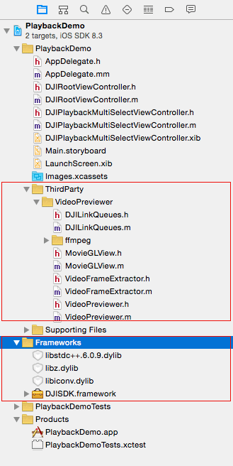
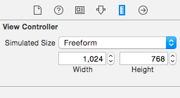
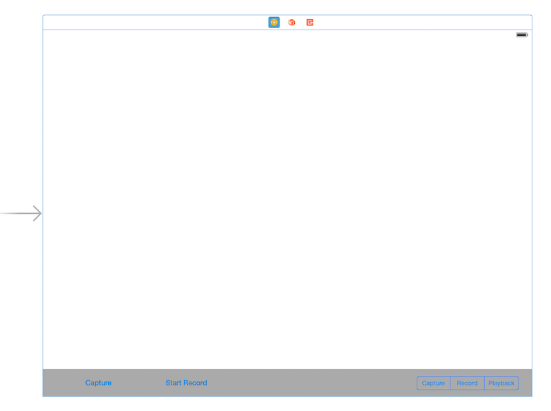
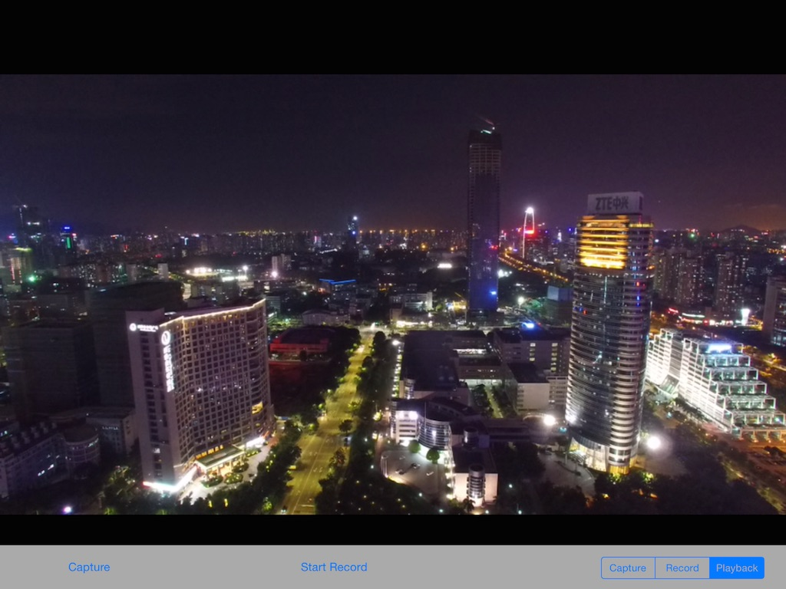
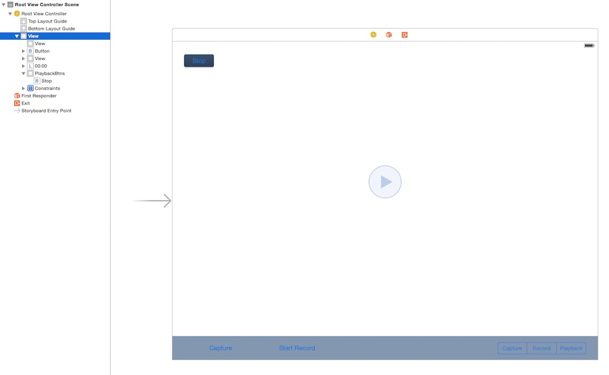
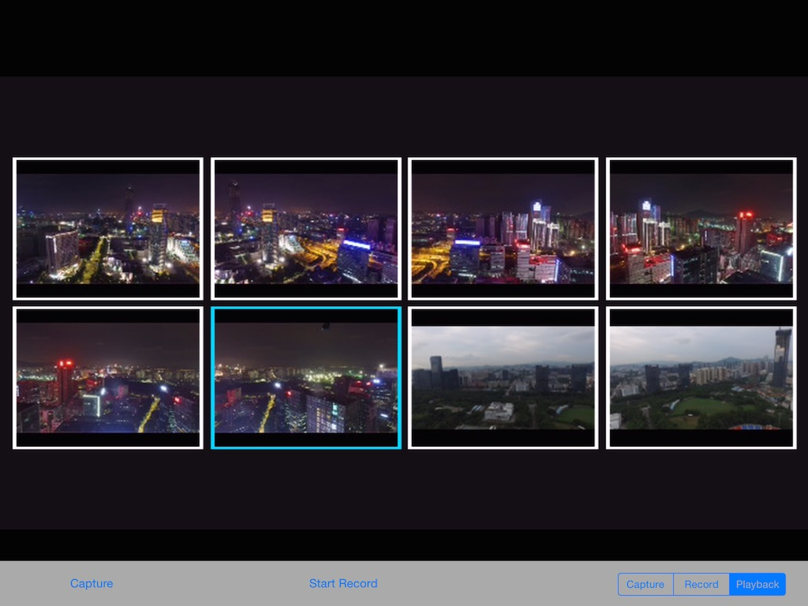
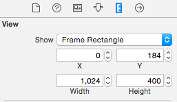
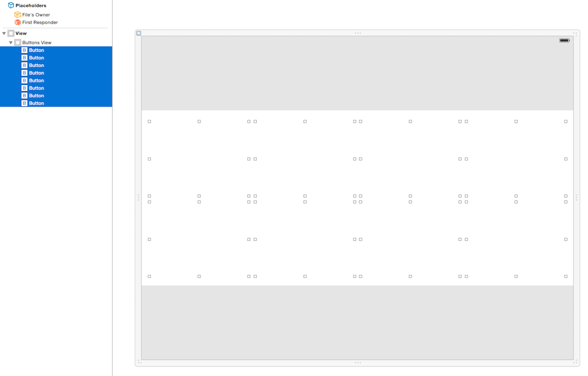
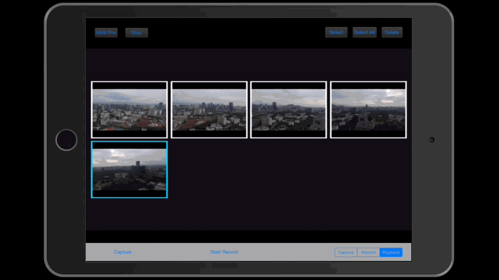
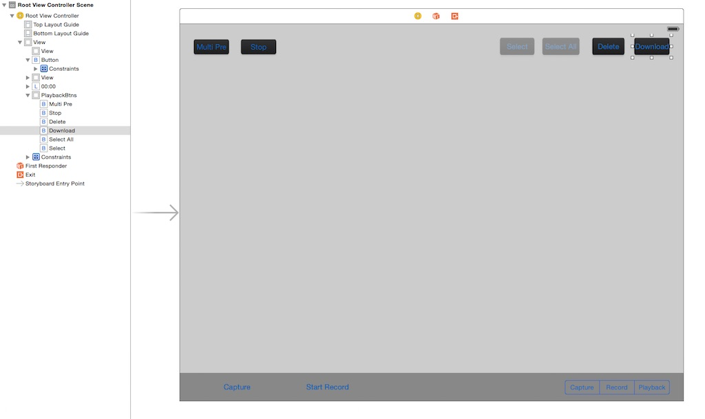

 
# 创建照片和视频回放App

*提醒: 此教程中的代码是为iPad而写的. 请确保你在iPad或者iPad模拟器上运行此代码. 本教程目前只支持Phantom 3 Professional 和 Inspire 1 机型*

*如果您在本教程中遇到任何错误或者bug，请使用Github issue，在DJI论坛发帖或者在Gitbook中评论告知我们。您可以随时给我们发送Github pull request来帮助我们修复错误。*

---

在此教程中，你将会学到如何使用DJI Mobile SDK去访问飞机相机上的SD卡媒体资源。当你完成本教程后，你将开发出一款app，具备预览照片，播放视频，下载或者删除文件等功能.

但是，为了能够在App里面对照片和视频进行管理，你首先必须能够用app进行拍照和录像. 幸好，在我们之前的教程[创建航拍相机App](../../../iOS/FPVDemo/FPVDemo_ch.md)中，我们演示了如何实现 **拍照** 和 **录像** 功能. 因此，请确保你在开始本教程之前, 先阅读该教程。

你可以从[这里](https://github.com/DJI-Mobile-SDK/iOS-PlaybackDemo.git)下载到本教程的demo工程。

让我们开始吧!

## 预览照片和视频

### 1.1 导入Framework和库

  在Xcode中创建一个新工程并将其命名为 "PlaybackDemo", 复制 **DJISDK.framework** 到你的Xcode工程文件夹中. 接下来，在下载好的SDK中找到 "VideoPreviewer" 文件夹。 将整个"VideoPreviewer"文件夹拷贝到Xcode工程的 "ThirdParty" 文件夹中. 在**Build Settings**里设置好**FFMPEG**的 **Header Search Paths** 和 **Library Search Paths**。 如果这有一点难懂，请看我们之前的教程 [创建航拍相机App](../../../iOS/FPVDemo/FPVDemo_ch.md) 来获得更多的解释。 接着，选择工程的target并来到 Build Phases -> Link Binary With Libraries. 按下下方的 "+" 按钮，然后添加这两个library到你的工程中: **libstdc++.6.0.9.dylib** 和 **libz.dylib**。 请看以下截图:

  

### 1.2 切换到回放模式

  现在，我们删除 **ViewController.h** 和 **ViewController.m** 文件, 它们在你一开始创建工程时就Xcode就自动帮你生成了. 接着，创建一个 viewController 并命名为 "DJIRootViewController", 在**Main.storyboard**中把它设置为 **Root View Controller**. 因为本教程和Demo代码是针对iPad编写的，所以我们需要相应地调整**Main.storyboard**的用户界面. 这里我们改变下 **Root View Controller**的frame. 我们在**Simulated Metrics**部分的**Size**中将它的尺寸设置为 **Freeform**. 在view部分中，将它的宽修改为**1024**，并将它的高修改为**768**. 如下图所示:

  
  
  
然后，在 **Root View Controller**中加入一个UIView, 并设置它的IBOutlet为 **fpvPreviewView**. 在viewControl下面加入两个 UIButton 和一个 UISegmentedControl，并设置好它们的 IBOutlet 和 IBAction. 这里我们设置UISegmentedControl里三个部分的名称为: **Capture**, **Record** 和 **Playback**. 最后，添加一个 UILabel 到顶部, 将其水平居中并且先隐藏起来：

  
  
 当你完成后, 来到 **DJIRootViewController.m** 文件中，导入 **DJISDK** 和 **VideoPreviewer** 头文件。 然后创建一个**DJIDrone**类的属性和一个 **DJICamera** 类的属性，然后在类扩展(Class Extension)中实现它们的协议. 接下来，加入两个 **UIButton**,  一个**UISegmentedControl** 和一个 **UILabel**的 IBOutlet 属性. 加入一个布尔属性，命名为 "isRecording" 来检查录像状态. 最后，为所有UI控件加入IBAction方法，如下所示:

~~~objc
#import "DJIRootViewController.h"
#import <DJISDK/DJISDK.h>
#import "VideoPreviewer.h"

@interface DJIRootViewController ()<DJICameraDelegate, DJIDroneDelegate, DJIAppManagerDelegate>
@property (strong, nonatomic) DJIDrone *drone;
@property (strong, nonatomic) DJIInspireCamera* camera;
@property (weak, nonatomic) IBOutlet UIButton *recordBtn;
@property (weak, nonatomic) IBOutlet UISegmentedControl *changeWorkModeSegmentControl;
@property (weak, nonatomic) IBOutlet UIView *fpvPreviewView;
@property (weak, nonatomic) IBOutlet UILabel *currentRecordTimeLabel;
@property (assign, nonatomic) BOOL isRecording;

- (IBAction)captureAction:(id)sender;
- (IBAction)recordAction:(id)sender;
- (IBAction)changeWorkModeAction:(id)sender;

~~~

建造一个新方法，命名为 **initData**，用于数据的初始化设置，并在ViewDidLoad方法里面调用它. 接下来，初始化 **DJIDrone** 实例并将它的类型设置为 **DJIDrone_Inspire** (你可以根据你的飞机型号来更改此类型). 设置 **drone** 和 **camera** 实例的 delegate 为 **self**. 接着，创建一个新方法，命名为"registerApp", 然后在viewDidLoad方法中调用它. 同时，实现DJIAppManagerDelegate方法，在app注册成功后，进行初始化设置:

~~~objc
- (void)viewDidLoad {
    [super viewDidLoad];
    [self initData];    
    [self registerApp];
    
}

- (void)initData
{
    self.drone = [[DJIDrone alloc] initWithType:DJIDrone_Inspire];
    self.drone.delegate = self;
    self.camera = (DJIInspireCamera *)self.drone.camera;
    self.camera.delegate = self;
}

- (void)registerApp
{
    NSString *appKey = @"Enter Your App Key Here";
    [DJIAppManager registerApp:appKey withDelegate:self];
}

#pragma mark DJIAppManagerDelegate Method
-(void)appManagerDidRegisterWithError:(int)error
{
    NSString* message = @"Register App Successed!";
    if (error != RegisterSuccess) {
        message = @"Register App Failed! Please enter your App Key and check the network.";
    }else
    {
        NSLog(@"registerAppSuccess");
        [_drone connectToDrone];
        [_camera startCameraSystemStateUpdates];
        [[VideoPreviewer instance] start];
        
    }
    UIAlertView* alertView = [[UIAlertView alloc] initWithTitle:@"Register App" message:message delegate:nil cancelButtonTitle:@"OK" otherButtonTitles:nil];
    [alertView show];
}

~~~

 更进一步的，在 viewWillAppear 方法里, 设置 **fpvPreviewView** 实例为**VideoPreviewer**的view，来显示Video Stream, 并且在viewWillDisappear方法里将其重置为nil , 然后在同一个方法里调用DJIDrone类的 **destroy** 方法来销毁drone实例对象:
 
~~~objc

- (void)viewWillAppear:(BOOL)animated
{
    [super viewWillAppear:animated];
    [[VideoPreviewer instance] setView:self.fpvPreviewView];
    
}

- (void)viewWillDisappear:(BOOL)animated
{
    
    [super viewWillDisappear:animated];
    [self.camera stopCameraSystemStateUpdates];
    [self.drone.mainController stopUpdateMCSystemState];
    [self.drone disconnectToDrone];
    [self.drone destroy];
    [[VideoPreviewer instance] setView:nil];
    
}
~~~

  更进一步地，实现 **DJICameraDelegate** 方法, 如下所示:
  
~~~objc
#pragma mark - DJICameraDelegate

-(void) camera:(DJICamera*)camera didReceivedVideoData:(uint8_t*)videoBuffer length:(int)length
{
    uint8_t* pBuffer = (uint8_t*)malloc(length);
    memcpy(pBuffer, videoBuffer, length);
    [[VideoPreviewer instance].dataQueue push:pBuffer length:length];
}

-(void) camera:(DJICamera*)camera didUpdateSystemState:(DJICameraSystemState*)systemState
{
     if (self.drone.droneType == DJIDrone_Inspire) {
        
        //Update currentRecordTimeLabel State
        self.isRecording = systemState.isRecording;
        [self.currentRecordTimeLabel setHidden:!self.isRecording];
        [self.currentRecordTimeLabel setText:[self formattingSeconds:systemState.currentRecordingTime]];
        
        //Update recordBtn State
        if (self.isRecording) {
            [self.recordBtn setTitle:@"Stop Record" forState:UIControlStateNormal];
        }else
        {
            [self.recordBtn setTitle:@"Start Record" forState:UIControlStateNormal];
        }
        
        //Update UISegmented Control's state
        if (systemState.workMode == CameraWorkModeCapture) {
            [self.changeWorkModeSegmentControl setSelectedSegmentIndex:0];
        }else if (systemState.workMode == CameraWorkModeRecord){
            [self.changeWorkModeSegmentControl setSelectedSegmentIndex:1];
        }else if (systemState.workMode == CameraWorkModePlayback){
            [self.changeWorkModeSegmentControl setSelectedSegmentIndex:2];
        }
    }
}

-(void) droneOnConnectionStatusChanged:(DJIConnectionStatus)status
{
    if (status == ConnectionSuccessed) {
        NSLog(@"Connection Successed");
    }
    else if(status == ConnectionStartConnect)
    {
        NSLog(@"Start Reconnect");
    }
    else if(status == ConnectionBroken)
    {
        NSLog(@"Connection Broken");
    }
    else if (status == ConnectionFailed)
    {
        NSLog(@"Connection Failed");
    }
}

- (NSString *)formattingSeconds:(int)seconds
{
    NSDate *date = [NSDate dateWithTimeIntervalSince1970:seconds];
    NSDateFormatter *formatter = [[NSDateFormatter alloc] init];
    [formatter setDateFormat:@"mm:ss"];
    [formatter setTimeZone:[NSTimeZone timeZoneForSecondsFromGMT:0]];
    
    NSString *formattedTimeString = [formatter stringFromDate:date];
    return formattedTimeString;
}

~~~
      
  最后，实现IBAction方法，如下所示:
  
~~~objc
- (IBAction)captureAction:(id)sender {
    __weak DJIRootViewController *weakSelf = self;
    [self.camera startTakePhoto:CameraSingleCapture withResult:^(DJIError *error) {
        if (error.errorCode != ERR_Successed) {
            UIAlertView *errorAlert = [[UIAlertView alloc] initWithTitle:@"Take Photo Error" message:error.errorDescription delegate:weakSelf cancelButtonTitle:@"OK" otherButtonTitles:nil];
            [errorAlert show];
        }
    }];
}

- (IBAction)recordAction:(id)sender {
    __weak DJIRootViewController *weakSelf = self;
    if (self.isRecording) {
        [self.camera stopRecord:^(DJIError *error) {
            if (error.errorCode != ERR_Successed) {
                UIAlertView *errorAlert = [[UIAlertView alloc] initWithTitle:@"Stop Record Error" message:error.errorDescription delegate:weakSelf cancelButtonTitle:@"OK" otherButtonTitles:nil];
                [errorAlert show];
            }
        }];
    }else
    {
        [self.camera startRecord:^(DJIError *error) { 
            if (error.errorCode != ERR_Successed) {
                UIAlertView *errorAlert = [[UIAlertView alloc] initWithTitle:@"Start Record Error" message:error.errorDescription delegate:weakSelf cancelButtonTitle:@"OK" otherButtonTitles:nil];
                [errorAlert show];
            }
        }];
    }
}

- (IBAction)changeWorkModeAction:(id)sender {
    DJIInspireCamera* inspireCamera = (DJIInspireCamera*)self.camera;
    __weak DJIRootViewController *weakSelf = self;
    UISegmentedControl *segmentControl = (UISegmentedControl *)sender;
    if (segmentControl.selectedSegmentIndex == 0) { //CaptureMode
        [inspireCamera setCameraWorkMode:CameraWorkModeCapture withResult:^(DJIError *error) {
            if (error.errorCode != ERR_Successed) {
                UIAlertView *errorAlert = [[UIAlertView alloc] initWithTitle:@"Set CameraWorkModeCapture Failed" message:error.errorDescription delegate:weakSelf cancelButtonTitle:@"OK" otherButtonTitles:nil];
                [errorAlert show];
            }
        }];
    }else if (segmentControl.selectedSegmentIndex == 1){ //RecordMode
        [inspireCamera setCameraWorkMode:CameraWorkModeRecord withResult:^(DJIError *error) {
            if (error.errorCode != ERR_Successed) {
                UIAlertView *errorAlert = [[UIAlertView alloc] initWithTitle:@"Set CameraWorkModeRecord Failed" message:error.errorDescription delegate:weakSelf cancelButtonTitle:@"OK" otherButtonTitles:nil];
                [errorAlert show];
            }
        }];
        
    }else if (segmentControl.selectedSegmentIndex == 2){  //PlaybackMode 
        [inspireCamera setCameraWorkMode:CameraWorkModePlayback withResult:^(DJIError *error) {
            if (error.errorCode != ERR_Successed) {
                UIAlertView *errorAlert = [[UIAlertView alloc] initWithTitle:@"Set CameraWorkModeRecord Failed" message:error.errorDescription delegate:weakSelf cancelButtonTitle:@"OK" otherButtonTitles:nil];
                [errorAlert show];
            }
        }];
    }
}

~~~

  如你所见，在**changeWorkModeAction**方法中，我们已经实现了切换到 **Playback** 相机模式的方法, 只需要调用**DJIInspireCamera**类的 **setCameraWorkMode** 方法，并且将 **CameraWorkModePlayback** 的值传给它即可. 如果有任何错误，显示一个alertView提醒用户。
   
  现在，编译运行Xcode工程. 尝试使用 **Capture** 和 **Record** 功能去进行拍照和录像操作. 然后点击UISegmentControl进行**Camera Mode**的切换, 我们切换到 **Playback** 模式，检查下能否看到你最后拍下的照片或者拍摄到的录像. 以下是回放模式的截图:
  
 
  
### 1.3 预览单个文件

现在我们切换到 **Playback** 模式. 添加两个 **UISwipeGestureRecognizer**来预览SD卡里上一个和下一个多媒体文件.

打开 **DJIRootViewController.m** 文件, 在类扩展(Class Extension)里面创建两个**UISwipeGestureRecognizer**属性，命名为 **swipeLeftGesture** 和 **swipeRightGesture** . 然后在**initData**方法里面进行初始化操作，如下所示:

~~~objc

- (void)initData
{
    self.drone = [[DJIDrone alloc] initWithType:DJIDrone_Inspire];
    self.drone.delegate = self;
    self.camera = (DJIInspireCamera *)self.drone.camera;
    self.camera.delegate = self;
    
    self.swipeLeftGesture = [[UISwipeGestureRecognizer alloc] initWithTarget:self action:@selector(swipeLeftGestureAction:)];
    self.swipeLeftGesture.direction = UISwipeGestureRecognizerDirectionLeft;
    self.swipeRightGesture = [[UISwipeGestureRecognizer alloc] initWithTarget:self action:@selector(swipeRightGestureAction:)];
    self.swipeRightGesture.direction = UISwipeGestureRecognizerDirectionRight;

    [self.view addGestureRecognizer:self.swipeLeftGesture];
    [self.view addGestureRecognizer:self.swipeRightGesture];
}

~~~

实现gesture action selector 方法:

~~~objc 
- (void)swipeLeftGestureAction:(UISwipeGestureRecognizer *)gesture
{
     [self.camera singlePreviewNextPage];
}

- (void)swipeRightGestureAction:(UISwipeGestureRecognizer *)gesture
{
     [self.camera singlePreviewPreviousPage];
}
~~~

以上代码使用DJIInspireCamera类的 **singlePreviewNextPage** 和 **singlePreviewPreviousPage** 方法来预览上一个和下一个文件。 因为在SD卡里有两种媒体文件， **Photo** and **Video**, 我们还需要实现视频回放功能.

打开 **Main.storyboard**, 拖拽一个 UIView 对象并将其放在viewController的上方, 然后拖拽一个 UIButton 到你刚刚添加的view上面，作为它的subview，命名为 **Stop**. 接下来拖拽一个UIButton对象到viewController的中间, 设置它的图片为"playVideo"(你可以在此工程源代码的Images.xcassets文件夹中获得改图片文件).

 
 
 这里我们隐藏掉 **Stop** 和 **playVideo** 按钮. 现在，我们来到 **DJIRootViewController.m**文件并为新加入的控件创建 IBOutlet 和 IBAction:
 
~~~objc
@property (nonatomic, strong) IBOutlet UIView* playbackBtnsView;
@property (weak, nonatomic) IBOutlet UIButton *playVideoBtn;

- (IBAction)playVideoBtnAction:(id)sender;
- (IBAction)stopVideoBtnAction:(id)sender; 
~~~

更多的，在实现IBAction方法之前, 我们先在类扩展(Class Extension)中加入DJICameraSystemState类和DJICameraPlaybackState类的两个新属性并命名为**cameraSystemState** 和 **cameraPlaybackState**，如下所示:

~~~objc
@property (strong, nonatomic) DJICameraSystemState* cameraSystemState;
@property (strong, nonatomic) DJICameraPlaybackState* cameraPlaybackState;
~~~

这些属性被用来储存当前相机的系统状态和回放状态。接着，我们在"-(void) camera:(DJICamera*)camera didUpdateSystemState:(DJICameraSystemState*)systemState" delegate 方法中更新下**cameraSystemState**属性的值，并根据**DJICameraSystemState**的workMode来隐藏**playbackBtnsView**:

~~~objc
-(void) camera:(DJICamera*)camera didUpdateSystemState:(DJICameraSystemState*)systemState
{
    if (self.drone.droneType == DJIDrone_Inspire) {
        
        self.cameraSystemState = systemState; //Update camera system state

        //Update currentRecordTimeLabel State
        self.isRecording = systemState.isRecording;
        [self.currentRecordTimeLabel setHidden:!self.isRecording];
        [self.currentRecordTimeLabel setText:[self formattingSeconds:systemState.currentRecordingTime]];
        
        //Update playbackBtnsView state
        BOOL isPlayback = (systemState.workMode == CameraWorkModePlayback) || (systemState.workMode == CameraWorkModeDownload);
        self.playbackBtnsView.hidden = !isPlayback;
        
        //Update recordBtn State
        if (self.isRecording) {
            [self.recordBtn setTitle:@"Stop Record" forState:UIControlStateNormal];
        }else
        {
            [self.recordBtn setTitle:@"Start Record" forState:UIControlStateNormal];
        }
        //Update UISegmented Control's state
        if (systemState.workMode == CameraWorkModeCapture) {
            [self.changeWorkModeSegmentControl setSelectedSegmentIndex:0];
        }else if (systemState.workMode == CameraWorkModeRecord){
            [self.changeWorkModeSegmentControl setSelectedSegmentIndex:1];
        }else if (systemState.workMode == CameraWorkModePlayback){
            [self.changeWorkModeSegmentControl setSelectedSegmentIndex:2];
        }
    }
}
~~~

接下来，实现 **-(void) camera:(DJICamera *)camera didUpdatePlaybackState:(DJICameraPlaybackState *)playbackState** delegate 方法如下所示:

~~~objc
-(void) camera:(DJICamera *)camera didUpdatePlaybackState:(DJICameraPlaybackState *)playbackState
{
    if (self.cameraSystemState.workMode == CameraWorkModePlayback) {
        self.cameraPlaybackState = playbackState;
        [self updateUIWithPlaybackState:playbackState];
    }else
    {
        [self.playVideoBtn setHidden:YES];
    }
}

- (void)updateUIWithPlaybackState:(DJICameraPlaybackState *)playbackState
{
    if (playbackState.playbackMode == SingleFilePreview) {
        if (playbackState.mediaFileType == MediaFileJPEG || playbackState.mediaFileType == MediaFileDNG) { //Photo Type            
            [self.playVideoBtn setHidden:YES];
        }else if (playbackState.mediaFileType == MediaFileVIDEO) //Video Type
        {
            [self.playVideoBtn setHidden:NO];
        }
    }else if (playbackState.playbackMode == SingleVideoPlaybackStart){ //Playing Video
        [self.playVideoBtn setHidden:YES];
    }else if (playbackState.playbackMode == MultipleFilesPreview){
        [self.playVideoBtn setHidden:YES];
    }
}
~~~

如你所见，我们已经在 **-(void) camera:(DJICamera *)camera didUpdatePlaybackState:(DJICameraPlaybackState *)playbackState** delegate 方法里更新了 **cameraPlaybackState** 属性的值, 并且根据 DJICameraSystemState的 **workMode** 和 DJICameraPlaybackState的 **playbackMode**, 更新了 **playVideoBtn**的隐藏状态.

最后, 我们实现**IBAction**方法:

~~~objc
- (IBAction)playVideoBtnAction:(id)sender {
    if (self.cameraPlaybackState.mediaFileType == MediaFileVIDEO) {
        [self.camera startVideoPlayback];
    }
}

- (IBAction)stopVideoBtnAction:(id)sender {
    if (self.cameraPlaybackState.mediaFileType == MediaFileVIDEO) {
        if (self.cameraPlaybackState.videoPlayProgress > 0) {
            [self.camera stopVideoPlayback];
        }
    }
}
~~~

在 **playVideoBtnAction** 和 **stopVideoBtnAction** 方法中, 我们检查文件是否为视频, 然后在**DJIInspireCamera**类中调用**startVideoPlayback** 和 **stopVideoPlayback** 方法来开始和停止视频播放. 

现在我们编译运行下此工程. 在回放模式下尝试左右滑动来浏览你的照片和视频. 如果你在屏幕中间看到播放按钮，可以按下进行视频播放.

在回放App中播放你的视频:

 

### 1.4 预览多个文件

在进行下一步前, 我们先解释下**Playback mode**。 相机里有多种回放模式，可以在**DJICameraPlaybackState.h**文件中查看 **CameraPlaybackMode** 枚举 类型的定义，如下所示:

~~~objc
/**
 *  Playback mode
 */
typedef NS_ENUM(uint8_t, CameraPlaybackMode){
    /**
     *  Single file preview
     */
    SingleFilePreview,
    /**
     *  Single photo zoomed
     */
    SinglePhotoZoomMode,
    /**
     *  Single video play start
     */
    SingleVideoPlaybackStart,
    /**
     *  Single video play stop
     */
    SingleVideoPlaybackStop,
    /**
     *  Multiple file edit
     */
    MultipleFilesEdit,
    /**
     *  Multiple file preview
     */
    MultipleFilesPreview,
    /**
     *  Download file
     */
    MediaFilesDownload,
    /**
     *  Mode error
     */
    PlaybackModeError = 0xFF,
};
~~~

如上所示, 我们有两种方法来预览文件: **Single Preview** 和 **Multiple Preview**. 我们也可以放大和缩小照片, 播放视频, 删除照片和视频，甚至下载它们. 

我们将会学到如何预览多个文件。以下是**Multiple Preview**的画面:

 
 
你可以同时预览最多8个文件。因为预览的照片是在**fpvPreviewView**里面显示的。你不能和它们进行交互。所以，让我们加入按钮和滑动手势来操作它们.

首先，我们将创造一个新的文件命名为 **DJIPlaybackMultiSelectViewController**, 它会作为 **UIViewController** 的子类. 确保你在创建该文件时，选择了 **Also create XIB file** 选项。然后打开 **DJIPlaybackMultiSelectViewController.xib** 文件, 在**Simulated Metrics**部分的 **Size** 菜单下, 将它的大小设置为 **Freeform** . 在view部分, 将宽度修改为**1024**，高度为**768**. 以下是示意图:

  
  
  
然后拖拽一个 **UIView** 对象到 viewController 中作为它的subview，命名为 **Buttons View**. 接下来设置它的frame:

  
  
接着，拖拽8个 **UIButton** 对象到 **Buttons View** 中作为它的subview，并将它们放置到如下位置(你可以检查demo工程的 **DJIPlaybackMultiSelectViewController.xib** 文件来获取关于如何设置这些按钮frame的细节):

  

当你在 **Multiple Preview Mode**下，这些按钮代表八个媒体文件. 按下任一按钮，都会进入 **Single Preview Mode**.

现在我们打开 **DJIPlaybackMultiSelectViewController.h** 文件并且创建两个block属性，如下所示:

~~~objc
#import <UIKit/UIKit.h>

@interface DJIPlaybackMultiSelectViewController : UIViewController

@property (copy, nonatomic) void (^selectItemBtnAction)(int index);
@property (copy, nonatomic) void (^swipeGestureAction)(UISwipeGestureRecognizerDirection direction);

@end
~~~

第一个block被用来检查按下按钮的动作，附上按钮的索引, 第二个block被用来检查滑动手势.

然后打开 **DJIPlaybackMultiSelectViewController.m** 文件，创建4个 **UISwipeGestureRecognizer** 属性来代表 **向左**, **向右**, **向上** 和 **向下** 这些滑动手势. 接着，创建8个IBAction方法，将它们和**DJIPlaybackMultiSelectViewController.xib**文件中的UIButton对象关联起来:

~~~objc
#import "DJIPlaybackMultiSelectViewController.h"

@interface DJIPlaybackMultiSelectViewController()

@property(nonatomic, strong) UISwipeGestureRecognizer *swipeLeftGesture;
@property(nonatomic, strong) UISwipeGestureRecognizer *swipeRightGesture;
@property(nonatomic, strong) UISwipeGestureRecognizer *swipeUpGesture;
@property(nonatomic, strong) UISwipeGestureRecognizer *swipeDownGesture;

- (IBAction)selectFirstItemBtnAction:(id)sender;
- (IBAction)selectSecondItemBtnAction:(id)sender;
- (IBAction)selectThirdItemBtnAction:(id)sender;
- (IBAction)selectFourthItemBtnAction:(id)sender;
- (IBAction)selectFifthItemBtnAction:(id)sender;
- (IBAction)selectSixthItemBtnAction:(id)sender;
- (IBAction)selectSeventhItemBtnAction:(id)sender;
- (IBAction)selectEighthItemBtnAction:(id)sender;

@end
~~~

在viewDidLoad方法中初始化滑动手势实例对象，并且实现它们的action方法，如下所示:

~~~objc
- (void)viewDidLoad {
    [super viewDidLoad];

    self.swipeLeftGesture = [[UISwipeGestureRecognizer alloc] initWithTarget:self action:@selector(swipeLeftGestureAction:)];
    self.swipeLeftGesture.direction = UISwipeGestureRecognizerDirectionLeft;
    self.swipeRightGesture = [[UISwipeGestureRecognizer alloc] initWithTarget:self action:@selector(swipeRightGestureAction:)];
    self.swipeRightGesture.direction = UISwipeGestureRecognizerDirectionRight;
    self.swipeUpGesture = [[UISwipeGestureRecognizer alloc] initWithTarget:self action:@selector(swipeUpGestureAction:)];
    self.swipeUpGesture.direction = UISwipeGestureRecognizerDirectionUp;
    self.swipeDownGesture = [[UISwipeGestureRecognizer alloc] initWithTarget:self action:@selector(swipeDownGestureAction:)];
    self.swipeDownGesture.direction = UISwipeGestureRecognizerDirectionDown;
    
    [self.view addGestureRecognizer:self.swipeLeftGesture];
    [self.view addGestureRecognizer:self.swipeRightGesture];
    [self.view addGestureRecognizer:self.swipeUpGesture];
    [self.view addGestureRecognizer:self.swipeDownGesture];

}

#pragma mark UIGestureAction Methods
- (void)swipeLeftGestureAction:(UISwipeGestureRecognizer *)gesture
{
    if (self.swipeGestureAction) {
        self.swipeGestureAction(UISwipeGestureRecognizerDirectionLeft);
    }
}

- (void)swipeRightGestureAction:(UISwipeGestureRecognizer *)gesture
{
    if (self.swipeGestureAction) {
        self.swipeGestureAction(UISwipeGestureRecognizerDirectionRight);
    }
}

- (void)swipeUpGestureAction:(UISwipeGestureRecognizer *)gesture
{
    if (self.swipeGestureAction) {
        self.swipeGestureAction(UISwipeGestureRecognizerDirectionUp);
    }
}

- (void)swipeDownGestureAction:(UISwipeGestureRecognizer *)gesture
{
    if (self.swipeGestureAction) {
        self.swipeGestureAction(UISwipeGestureRecognizerDirectionDown);
    }
}

~~~ 

这4个滑动手势是用来做单个或多个文件预览的. 向左或者向右滑动，进行单个文件的预览. 向上或者向下滑动，进行多个文件的预览。这里，我们在每个手势Action方法中调用 **swipeGestureAction** block，附上对应的 **UISwipeGestureRecognizerDirection** 值.

接着, 实现八个按钮的IBAction方法，如下所示:

~~~objc
#pragma mark UIButton Action Methods
- (IBAction)selectFirstItemBtnAction:(id)sender {
    if (self.selectItemBtnAction) {
        self.selectItemBtnAction(0);
    }
}

- (IBAction)selectSecondItemBtnAction:(id)sender {
    if (self.selectItemBtnAction) {
        self.selectItemBtnAction(1);
    }
}

- (IBAction)selectThirdItemBtnAction:(id)sender {
    if (self.selectItemBtnAction) {
        self.selectItemBtnAction(2);
    }
}

- (IBAction)selectFourthItemBtnAction:(id)sender {
    if (self.selectItemBtnAction) {
        self.selectItemBtnAction(3);
    }
}

- (IBAction)selectFifthItemBtnAction:(id)sender {
    if (self.selectItemBtnAction) {
        self.selectItemBtnAction(4);
    }
}

- (IBAction)selectSixthItemBtnAction:(id)sender {
    if (self.selectItemBtnAction) {
        self.selectItemBtnAction(5);
    }
}

- (IBAction)selectSeventhItemBtnAction:(id)sender {
    if (self.selectItemBtnAction) {
        self.selectItemBtnAction(6);
    }
}

- (IBAction)selectEighthItemBtnAction:(id)sender {
    if (self.selectItemBtnAction) {
        self.selectItemBtnAction(7);
    }
}
~~~

我们在IBAction方法中调用 **selectItemBtnAction** block，并附上相关的按钮索引. 留意到索引值从0开始，是因为在多张回放预览模式中，文件索引是从0开始的.

现在，回到 **DJIRootViewController.m** 文件. 因为我们已经在DJIPlaybackMultiSelectViewController.m 文件中加入了左滑和右滑手势，现在我们重构下DJIRootViewController.m文件的代码，将 **swipeLeftGesture** 和 **swipeRightGesture** 属性以及相关代码删除. 

接着导入 DJIPlaybackMultiSelectViewController.h 头文件，创建一个DJIPlaybackMultiSelectViewController的属性，命名为**playbackMultiSelectVC**. 然后，创建一个新方法，命名为**initPlaybackMultiSelectVC** 并在**viewDidLoad**方法中实现它:

~~~objc
- (void)viewDidLoad {
    [super viewDidLoad];
    [[NSNotificationCenter defaultCenter] addObserver:self selector:@selector(registerAppSuccess:) name:@"RegisterAppSuccess" object:nil];
    [self initData];
    [self registerApp];
    [self initPlaybackMultiSelectVC];
}

- (void)initPlaybackMultiSelectVC
{
    self.playbackMultiSelectVC = [[DJIPlaybackMultiSelectViewController alloc] initWithNibName:@"DJIPlaybackMultiSelectViewController" bundle:[NSBundle mainBundle]];
    [self.playbackMultiSelectVC.view setFrame:self.view.frame];
    [self.fpvPreviewView addSubview:self.playbackMultiSelectVC.view];
    __weak DJIRootViewController *weakSelf = self;
    [self.playbackMultiSelectVC setSelectItemBtnAction:^(int index) {
        if (weakSelf.cameraPlaybackState.playbackMode == MultipleFilesPreview) {
            [weakSelf.camera enterSinglePreviewModeWithIndex:index];
        }
    }];
    
    [self.playbackMultiSelectVC setSwipeGestureAction:^(UISwipeGestureRecognizerDirection direction) {
        
        if (weakSelf.cameraPlaybackState.playbackMode == SingleFilePreview) {
            if (direction == UISwipeGestureRecognizerDirectionLeft) {
                [weakSelf.camera singlePreviewNextPage];
            }else if (direction == UISwipeGestureRecognizerDirectionRight){
                [weakSelf.camera singlePreviewPreviousPage];
            }
        }else if(weakSelf.cameraPlaybackState.playbackMode == MultipleFilesPreview){
            if (direction == UISwipeGestureRecognizerDirectionUp) {
                [weakSelf.camera multiplePreviewNextPage];
            }else if (direction == UISwipeGestureRecognizerDirectionDown){
                [weakSelf.camera multiplePreviewPreviousPage];
            }
        }
    }];
}
~~~

在 **initPlaybackMultiSelectVC** 方法中, 我们先初始化 **playbackMultiSelectVC** 属性，然后调用 **selectItemBtnAction** block的 setter 方法，并且根据选择的索引，实现**DJIInspireCamera**的**enterSinglePreviewModeWithIndex**方法. 通过这样，我们可以从单张预览模式切换到多张预览模式. 

下一步，我们调用 **swipeGestureAction** block的 setter 方法，并且根据 **UISwipeGestureRecognizerDirection** 的值去实现预览文件的功能.

当你完成这些后，来到 **Main.storyboard** ,拖拽一个 **UIButton** 对象到**playbackBtnsView**中作为subView, 将其命名为 **Multi Pre** ，然后放置到如下位置:

最后，创建一个IBAction方法，命名为 **multiPreviewButtonClicked**，然后在**Main.storyboard**中，将它与上面刚创建的UIButton关联起来. 实现以下方法来进入多张预览模式:

~~~objc
- (IBAction)multiPreviewButtonClicked:(id)sender {
    [self.camera enterMultiplePreviewMode];
}
~~~

现在我们编译运行工程，尝试进入多张预览模式. 使用上下滑动手势来预览文件. 按下8张预览图片中的任意一张，可以切换到单张预览模式. 以下是截图:

## 删除照片和录像

你现在可以在单张预览和多张预览模式下预览照片和视频了. 但是如果你想要删除一个不喜欢的文件呢? 让我们来实现删除文件的功能吧!

来到Main.storyboard, 拖拽3个UIButtons到**playbackBtnsView**作为subview，并将它们命名为 **Select**, **Select All** 和 **Delete**. 这里我们先隐藏掉"Select" 和 "Select All" 按钮. 然后到**DJIRootViewController.m** 文件中，为"Select" 和 "Select All" 两个按钮创建两个 IBOutlets, 以及创建三个按钮的IBAction方法，如下所示:

~~~objc
@property (weak, nonatomic) IBOutlet UIButton *selectBtn;
@property (weak, nonatomic) IBOutlet UIButton *selectAllBtn;

- (IBAction)selectButtonAction:(id)sender;
- (IBAction)deleteButtonAction:(id)sender;
- (IBAction)selectAllBtnAction:(id)sender;
~~~

接下来，实现 IBAction 方法，如下所示:

~~~objc
- (IBAction)selectButtonAction:(id)sender {
    if (self.cameraPlaybackState.playbackMode == MultipleFilesEdit) {
        [self.camera exitMultipleEditMode];
    }else
    {
        [self.camera enterMultipleEditMode];
    }
}

- (IBAction)selectAllBtnAction:(id)sender {
    
    if (self.cameraPlaybackState.isAllFilesInPageSelected) {
        [self.camera unselectAllFilesInPage];
    }
    else
    {
        [self.camera selectAllFilesInPage];
    }
}
~~~

以上代码实现了 selectButtonAction 方法，用来进入和退出多个文件的编辑模式。该IBAction方法调用了DJIInspireCamera 类的 **exitMultipleEditMode** 和 **enterMultipleEditMode** 方法去实现该功能. 然后在selectAllBtnAction IBAction 方法中, 我们使用一个if语句来检查是否全选了当前页面的所有文件，再调用DJIInspireCamera的 **selectAllFilesInPage** 和 **unselectAllFilesInPage** 方法进行全选和取消全选的操作.

接下来，在以下方法中更新 **selectBtn** 和 **selectAllBtn** 按钮的隐藏参数值:

~~~objc
- (void)updateUIWithPlaybackState:(DJICameraPlaybackState *)playbackState
{
    if (playbackState.playbackMode == SingleFilePreview) {
        
        [self.selectBtn setHidden:YES];
        [self.selectAllBtn setHidden:YES];
        
        if (playbackState.mediaFileType == MediaFileJPEG || playbackState.mediaFileType == MediaFileDNG) { //Photo Type
            
            [self.playVideoBtn setHidden:YES];
            
        }else if (playbackState.mediaFileType == MediaFileVIDEO) //Video Type
        {
            [self.playVideoBtn setHidden:NO];
        }
        
    }else if (playbackState.playbackMode == SingleVideoPlaybackStart){ //Playing Video
        
        [self.selectBtn setHidden:YES];
        [self.selectAllBtn setHidden:YES];
        [self.playVideoBtn setHidden:YES];
        
    }else if (playbackState.playbackMode == MultipleFilesPreview){
        
        [self.selectBtn setHidden:NO];
        [self.selectBtn setTitle:@"Select" forState:UIControlStateNormal];
        [self.selectAllBtn setHidden:NO];
        [self.playVideoBtn setHidden:YES];
        
    }else if (playbackState.playbackMode == MultipleFilesEdit){
    
        [self.selectBtn setHidden:NO];
        [self.selectBtn setTitle:@"Cancel" forState:UIControlStateNormal];
        [self.selectAllBtn setHidden:NO];
        [self.playVideoBtn setHidden:YES];

    }   
}
~~~ 

在实现 **deleteButtonAction** 方法之前, 让我们在类扩展(Class Extension)中创建两个新的属性，如下所示:

~~~objc
@property (strong, nonatomic) UIAlertView* statusAlertView;
@property (assign, nonatomic) int selectedFileCount;
~~~

这里，我们创建了一个 **int** 属性，命名为 **selectedFileCount**，用于记录在多张预览模式下，当前选中的文件数目. 我们还创建了一个 **UIAlertView** 属性，命名为 **statusAlertView**, 用于在删除文件时显示警告.

创建以下三个方法去 **弹出**, **隐藏** 和 **更新** alertView:

~~~objc
-(void) showStatusAlertView
{
    if (self.statusAlertView == nil) {
        self.statusAlertView = [[UIAlertView alloc] initWithTitle:@"" message:@"" delegate:nil cancelButtonTitle:nil otherButtonTitles:nil];
        [self.statusAlertView show];
    }
}

-(void) dismissStatusAlertView
{
    if (self.statusAlertView) {
        [self.statusAlertView dismissWithClickedButtonIndex:0 animated:YES];
        self.statusAlertView = nil;
    }       
}

- (void)updateStatusAlertContentWithTitle:(NSString *)title message:(NSString *)message shouldDismissAfterDelay:(BOOL)dismiss
{
    if (self.statusAlertView) {
        [self.statusAlertView setTitle:title];
        [self.statusAlertView setMessage:message];
        
        if (dismiss) {
            [self performSelector:@selector(dismissStatusAlertView) withObject:nil afterDelay:2.0];
        }
    }   
}
~~~

进一步地，实现 **deleteButtonAction** action方法，如下所示:

~~~objc
- (IBAction)deleteButtonAction:(id)sender {
    
    self.selectedFileCount = self.cameraPlaybackState.numbersOfSelected;
    
    if (self.cameraPlaybackState.playbackMode == MultipleFilesEdit) {

        if (self.selectedFileCount == 0) {
            [self showStatusAlertView];
            [self updateStatusAlertContentWithTitle:@"Please select files to delete!" message:@"" shouldDismissAfterDelay:YES];
            return;
        }else
        {
            NSString *title;
            if (self.selectedFileCount == 1) {
                title = @"Delete Selected File?";
            }else
            {
                title = @"Delete Selected Files?";
            }
            UIAlertView *deleteAllSelFilesAlert = [[UIAlertView alloc] initWithTitle:title message:@"" delegate:self cancelButtonTitle:@"NO" otherButtonTitles:@"YES", nil];
            deleteAllSelFilesAlert.tag = kDeleteAllSelFileAlertTag;
            [deleteAllSelFilesAlert show];
        }

    }else if (self.cameraPlaybackState.playbackMode == SingleFilePreview){
        
        UIAlertView *deleteCurrentFileAlert = [[UIAlertView alloc] initWithTitle:@"Delete The Current File?" message:@"" delegate:self cancelButtonTitle:@"NO" otherButtonTitles:@"YES", nil];
        deleteCurrentFileAlert.tag = kDeleteCurrentFileAlertTag;
        [deleteCurrentFileAlert show];
    }
    
}
~~~

以上代码使用了 **cameraPlaybackState** 的 "numbersOfSelected" 值来更新 **selectedFileCount** 属性值. 然后根据cameraPlaybackState的 **playbackMode** 的值，在"MultipleFilesEdit" 和 "SingleFilePreview" 模式下显示警告信息. 这里我们对UIAlertView的 tag 属性进行了宏定义:

~~~objc
#define kDeleteAllSelFileAlertTag 100
#define kDeleteCurrentFileAlertTag 101
~~~

最后，我们参考以下代码，实现UIAlertView 的delegate方法，调用DJIInspireCamera的 **deleteAllSelectedFiles** 和 **deleteCurrentPreviewFile**  方法来删除和更新selectBtn的标题:

~~~objc 
#pragma mark UIAlertView Delegate Method
- (void)alertView:(UIAlertView *)alertView clickedButtonAtIndex:(NSInteger)buttonIndex
{
    if (alertView.tag == kDeleteAllSelFileAlertTag) {
        if (buttonIndex == 1) {
            [self.camera deleteAllSelectedFiles];
            [self.selectBtn setTitle:@"Select" forState:UIControlStateNormal];
        }
    }else if (alertView.tag == kDeleteCurrentFileAlertTag){
        if (buttonIndex == 1) {
            [self.camera deleteCurrentPreviewFile];
            [self.selectBtn setTitle:@"Select" forState:UIControlStateNormal];
        }   
    }
}
~~~

编译运行改工程, 然后尝试选择多个文件, 删除单个或多个文件的功能. 以下是效果动画:

* 删除单个文件:

* 删除多个文件:

## 下载和保存照片

### 3.1 下载照片

我们现在来实现图片下载的功能. 首先，来到 **Main.storyboard** 文件中，拖拽一个 **UIButton** 对象到 **playbackBtnsView**中，将其命名为 "Download". 然后按下图所示设置好位置:

然后来到 **DJIRootViewController.m** 文件中，在类扩展（Class Extension）中创建以下属性对象和IBAction方法:

~~~objc
@property (strong, nonatomic) NSMutableData *downloadedImageData;
@property (strong, nonatomic) NSTimer *updateImageDownloadTimer;
@property (strong, nonatomic) NSError *downloadImageError;
@property (strong, nonatomic) NSString* targetFileName;
@property (assign, nonatomic) long totalFileSize;
@property (assign, nonatomic) long currentDownloadSize;
@property (assign, nonatomic) int downloadedFileCount;

- (IBAction)downloadButtonAction:(id)sender;
~~~

这里先简单介绍下每个属性的功能.

- **downloadedImageData** 用来储存下载图片的 **NSData**
- **updateImageDownloadTimer** 用来更新下载进度状态
- **downloadImageError** 用来存储NSError
- **targetFileName** 用来保存当前正在下载的图片文件名
- **totalFileSize** 用来保存每张下载图片的总文件大小
- **currentDownloadSize** 用来储存当前下载好的图片大小
- **downloadedFileCount** 用来存储下载好的图片数目

接着，我们在**initData**方法中初始化 **downloadedImageData** 属性，如下所示:

~~~objc
- (void)initData
{
    self.drone = [[DJIDrone alloc] initWithType:DJIDrone_Inspire];
    self.drone.delegate = self;
    self.camera = (DJIInspireCamera *)self.drone.camera;
    self.camera.delegate = self;

    self.downloadedImageData = [NSMutableData data];
}
~~~

在进行下一步之前，我们首先需要解释下**DJIInspireCamera**类的以下方法:

~~~objc
/**
 *  Download the selected files. The camera's work mode will be auto changed to CameraWorkModeDownload
 *
 *  @param prepareBlock File prepare for download callback
 *  @param dataBlock    File data downloaded callback
 *  @param completion   File download completed callback
 */
 
-(void) downloadAllSelectedFilesWithPreparingBlock:(DJIFileDownloadPreparingBlock)prepareBlock dataBlock:(DJIFileDownloadingBlock)dataBlock completionBlock:(DJIFileDownloadCompletionBlock)completion;
~~~

这个方法有三个参数，第一个参数 **prepareBlock** 是一个准备下载文件的block. 你可以在这里做一些下载初始化的操作，比如显示一个警告，提醒用户正在下载文件的名称，大小等. 第二个参数 **dataBlock** 是一个更新下载数据的block, 你可以在里面累加下载好的数据以及下载文件尺寸数据. 第3个参数 **completion** 是一个下载完成的block, 你可以在里面把下载好的图片存储到相册里.

**重要事项**: 我们不可以在**dataBlock** block里更新下载文件状态的UI, 因为它会减慢下载速度. 这里我们用 **downloadedImageData** 属性来累加下载数据，并用 **updateImageDownloadTimer** 去更新UI.

接着，我们创建3个新方法来设置 **updateImageDownloadTimer**:

~~~objc
- (void)updateDownloadProgress:(NSTimer *)updatedTimer
{
    if (self.downloadImageError) {
        
        [self stopTimer];
        [self.selectBtn setTitle:@"Select" forState:UIControlStateNormal];
        [self updateStatusAlertContentWithTitle:@"Download Error" message:[NSString stringWithFormat:@"%@", self.downloadImageError] shouldDismissAfterDelay:YES];
        
    }
    else
    {
        NSString *title = [NSString stringWithFormat:@"Download (%d/%d)", self.downloadedFileCount + 1, self.selectedFileCount];
        NSString *message = [NSString stringWithFormat:@"FileName:%@, FileSize:%0.1fKB, Downloaded:%0.1fKB", self.targetFileName, self.totalFileSize / 1024.0, self.currentDownloadSize / 1024.0];
        [self updateStatusAlertContentWithTitle:title message:message shouldDismissAfterDelay:NO];
    }
    
}

- (void)startUpdateTimer
{
    if (self.updateImageDownloadTimer == nil) {
        self.updateImageDownloadTimer = [NSTimer scheduledTimerWithTimeInterval:0.5 target:self selector:@selector(updateDownloadProgress:) userInfo:nil repeats:YES];
    }
}

- (void)stopTimer
{
    if (self.updateImageDownloadTimer != nil) {
        [self.updateImageDownloadTimer invalidate];
        self.updateImageDownloadTimer = nil;
    }
}
~~~

如你所见，我们用了 startUpdateTimer 和 stopTimer 方法来启动和停止 **updateImageDownloadTimer**. 然后我们实现 **updateDownloadProgress**的 selector 方法来更新 **statusAlertView** 的标题和信息.

接着，创建一个名为 **resetDownloadData** 的新方法，用于重设所有和图片下载有关的属性值:

~~~objc
- (void)resetDownloadData
{
    self.downloadImageError = nil;
    self.totalFileSize = 0;
    self.currentDownloadSize = 0;
    self.downloadedFileCount = 0;
    
    [self.downloadedImageData setData:nil];
}
~~~

更进一步地，定义两个 UIAlertView tag的宏定义，实现 **downloadButtonAction** 方法并且根据以下代码更新 UIAlertView 的Delegate方法:

~~~objc

#define kDownloadAllSelFileAlertTag 102
#define kDownloadCurrentFileAlertTag 103

- (IBAction)downloadButtonAction:(id)sender {
    
    self.selectedFileCount = self.cameraPlaybackState.numbersOfSelected;
    
    if (self.cameraPlaybackState.playbackMode == MultipleFilesEdit) {
        
        if (self.selectedFileCount == 0) {
            [self showStatusAlertView];
            [self updateStatusAlertContentWithTitle:@"Please select files to Download!" message:@"" shouldDismissAfterDelay:YES];
            return;
        }else
        {
            NSString *title;
            if (self.selectedFileCount == 1) {
                title = @"Download Selected File?";
            }else
            {
                title = @"Download Selected Files?";
            }
            UIAlertView *downloadSelFileAlert = [[UIAlertView alloc] initWithTitle:title message:@"" delegate:self cancelButtonTitle:@"NO" otherButtonTitles:@"YES", nil];
            downloadSelFileAlert.tag = kDownloadAllSelFileAlertTag;
            [downloadSelFileAlert show];
        }
        
    }else if (self.cameraPlaybackState.playbackMode == SingleFilePreview){
        
        UIAlertView *downloadCurrentFileAlert = [[UIAlertView alloc] initWithTitle:@"Download The Current File?" message:@"" delegate:self cancelButtonTitle:@"NO" otherButtonTitles:@"YES", nil];
        downloadCurrentFileAlert.tag = kDownloadCurrentFileAlertTag;
        [downloadCurrentFileAlert show];
    }
}

#pragma mark UIAlertView Delegate Method
- (void)alertView:(UIAlertView *)alertView clickedButtonAtIndex:(NSInteger)buttonIndex
{
    if (alertView.tag == kDeleteAllSelFileAlertTag) {
    
        if (buttonIndex == 1) {
            [self.camera deleteAllSelectedFiles];
            [self.selectBtn setTitle:@"Select" forState:UIControlStateNormal];
        }
        
    }else if (alertView.tag == kDeleteCurrentFileAlertTag){
    
        if (buttonIndex == 1) {
            [self.camera deleteCurrentPreviewFile];
            [self.selectBtn setTitle:@"Select" forState:UIControlStateNormal];
        }
        
    }else if (alertView.tag == kDownloadAllSelFileAlertTag){
    
        if (buttonIndex == 1) {
            [self downloadFiles];
        }
    }else if (alertView.tag == kDownloadCurrentFileAlertTag){
        if (buttonIndex == 1) {
            [self downloadFiles];
        }
    }
    
}
~~~

在 **downloadButtonAction** 方法中，我们更新 **statusAlertView**的标题和信息. 然后创建两个新的 **UIAlertView**，根据**cameraPlaybackState**的 **playbackMode** 值，向用户请求权限下载文件. 最后，在UIAlertView delegate 方法中, 当 **OK** 按钮被按下时，实现 **downloadFiles** 方法. 

最后，如下所示实现 **downloadFiles** 方法:

~~~objc
-(void) downloadFiles
{
    [self resetDownloadData];
    
    if (self.cameraPlaybackState.playbackMode == SingleFilePreview) {
        self.selectedFileCount = 1;
    }

    __weak DJIRootViewController *weakSelf = self;
    [self.camera downloadAllSelectedFilesWithPreparingBlock:^(NSString *fileName, NSUInteger fileSize, BOOL *skip) {

        [weakSelf startUpdateTimer];
        weakSelf.totalFileSize = (long)fileSize;
        weakSelf.targetFileName = fileName;

        [weakSelf showStatusAlertView];
        NSString *title = [NSString stringWithFormat:@"Download (%d/%d)", weakSelf.downloadedFileCount + 1, self.selectedFileCount];
        NSString *message = [NSString stringWithFormat:@"FileName:%@, FileSize:%0.1fKB, Downloaded:0.0KB", fileName, weakSelf.totalFileSize / 1024.0];
        [weakSelf updateStatusAlertContentWithTitle:title message:message shouldDismissAfterDelay:NO];
        
    } dataBlock:^(NSData *data, NSError *error) {
        /**
         *  Important: Don't update Download Progress UI here, it will slow down the download file speed.
         */
        
        [weakSelf.downloadedImageData appendData:data];
        weakSelf.currentDownloadSize += data.length;
        weakSelf.downloadImageError = error;
        
    } completionBlock:^{
        
         NSLog(@"Completed Download");
        weakSelf.downloadedFileCount++;
        
        UIImage *downloadImage = [[UIImage alloc] initWithData:self.downloadedImageData];
        
        [weakSelf.downloadedImageData setData:nil]; //Reset DownloadedImageData when download one file finished
        weakSelf.currentDownloadSize = 0.0f; //Reset currentDownloadSize when download one file finished

        NSString *title = [NSString stringWithFormat:@"Download (%d/%d)", weakSelf.downloadedFileCount, weakSelf.selectedFileCount];
        [weakSelf updateStatusAlertContentWithTitle:title message:@"Completed" shouldDismissAfterDelay:NO];
        
    }];   
}
~~~ 

在本方法中, 我们首先调用 **resetDownloadData** 方法来重置数据. 接着检查下 playbackMode 是否为 **SingleFilePreview**，然后更新 **selectedFileCount** 变量的值. 最后，我们调用**DJIInspireCamera**类的以下方法：

~~~objc
-(void) downloadAllSelectedFilesWithPreparingBlock:(DJIFileDownloadPreparingBlock)prepareBlock dataBlock:(DJIFileDownloadingBlock)dataBlock completionBlock:(DJIFileDownloadCompletionBlock)completion;
~~~

在第一个block prepareBlock中, 我们调用了 **startUpdateTimer** 方法来启动 updateImageDownloadTimer. 然后更新 **totalFileSize** 和 **targetFileName** 变量值. 接下来，我们现实statusAlertView 并且用下载图片信息来更新它的标题和信息.

在第二个block dataBlock中, 我们把下载好的图片数据追加到 **downloadedImageData** 中, 并更新 **currentDownloadSize** 和 **downloadImageError** 变量的值.

在第三个block completion中，我们增加 **downloadedFileCount** 变量的值. 然后使用**downloadedImageData** 创建一个UIImage实例对象. 接着，重设 downloadedImageData的数据和 currentDownloadSize的值。进一步地，根据图片的下载信息更新 **statusAlertView** . 

### 3.2 将下载好的照片保存到相册中

现在，我们已经实现了下载照片的功能，但如果我们想将下载好的照片保存到iOS的相册，要怎么操作?

要实现该功能, 先创建一个新的NSMutableArray类的属性，命名为 **downloadedImageArray** 并且在**initData**方法中进行初始化操作, 同时在**resetDownloadData**方法中重置它的值:

~~~objc
- (void)initData
{
    self.drone = [[DJIDrone alloc] initWithType:DJIDrone_Inspire];
    self.drone.delegate = self;
    self.camera = (DJIInspireCamera *)self.drone.camera;
    self.camera.delegate = self;

    self.downloadedImageData = [NSMutableData data];
    self.downloadedImageArray = [NSMutableArray array];
}

- (void)resetDownloadData
{
    self.downloadImageError = nil;
    self.totalFileSize = 0;
    self.currentDownloadSize = 0;
    self.downloadedFileCount = 0;
    
    [self.downloadedImageData setData:nil];
    [self.downloadedImageArray removeAllObjects];
}
~~~

完成后，添加以下两个新方法:

~~~objc
- (void)saveDownloadImage
{
    if (self.downloadedImageArray && self.downloadedImageArray.count > 0)
    {
        UIImage *image = [self.downloadedImageArray lastObject];
        UIImageWriteToSavedPhotosAlbum(image, self, @selector(image:didFinishSavingWithError:contextInfo:), nil);
        [self.downloadedImageArray removeLastObject];
    }
}

- (void)image:(UIImage *)image didFinishSavingWithError:(NSError *)error contextInfo:(void *)contextInfo
{

    if (error != NULL)
    {
        // Show message when image saved failed
        [self updateStatusAlertContentWithTitle:@"Save Image Failed!" message:[NSString stringWithFormat:@"%@", error] shouldDismissAfterDelay:NO];
    }
    else
    {
        // Show message when image successfully saved
        if (self.downloadedImageArray)
        {
            [self saveDownloadImage];
            
            if (self.downloadedImageArray.count == 0)
            {
                [self updateStatusAlertContentWithTitle:@"Stored to Photos Album" message:@"" shouldDismissAfterDelay:YES];
            }
            
        }s       
    }
    
}
~~~

在saveDownloadImage方法中, 我们检查下 **downloadedImageArray**是否为空，然后获取它里面的最后一张UIImage, 将它赋值给 **image** 变量. 然后我们使用 **UIImageWriteToSavedPhotosAlbum()** 方法来保存照片到相册中，并且删除downloadedImageArray中的最后一个对象.

接下来，在 selector 方法里, 检查是否有错误出现，调用 **saveDownloadImage** 方法直到 **downloadedImageArray** 为空. 同时，我们用相关的标题和信息来更新 **statusAlertView** .

最后，在**downloadFiles**方法中的**completion** block中，添加下载好的图片对象到downloadedImageArray中, 然后调用 stopTimer 方法和 saveDownloadImage 方法:

~~~objc

completionBlock:^{
        
        NSLog(@"Completed Download");
        weakSelf.downloadedFileCount++;
        
        UIImage *downloadImage = [[UIImage alloc] initWithData:self.downloadedImageData];
        [weakSelf.downloadedImageArray addObject:downloadImage];
        
        [weakSelf.downloadedImageData setData:nil]; //Reset DownloadedImageData when download one file finished
        weakSelf.currentDownloadSize = 0.0f; //Reset currentDownloadSize when download one file finished

        NSString *title = [NSString stringWithFormat:@"Download (%d/%d)", weakSelf.downloadedFileCount, weakSelf.selectedFileCount];
        [weakSelf updateStatusAlertContentWithTitle:title message:@"Completed" shouldDismissAfterDelay:NO];
        
        if (weakSelf.downloadedFileCount == weakSelf.selectedFileCount) { //Downloaded all the selected files
            [weakSelf stopTimer];
            [weakSelf.selectBtn setTitle:@"Select" forState:UIControlStateNormal];
            [weakSelf saveDownloadImage];
        }
        
    }];

~~~

编译运行该工程. 尝试在单张预览模式和多张预览模式中下载照片. 下载完成后，到iOS的相册中检查下载好的照片是否存在:

* 选择照片，下载照片:

* 下载照片，并保存到相册中:

## 总结
   
   在本教程中, 你学会了如何在单张预览模式和多张预览模式中预览照片和视频，如何进入多张编辑模式，选择文件并进行删除操作. 你还学会了如何下载和保存照片到iOS相册中.
   
   在下一篇教程中, 我们将会学习如何对Phantom 3 Advanced中的照片和视频进行预览，编辑，和下载的操作. 请关注我们下一篇教程. 希望你喜欢!
   
   
   